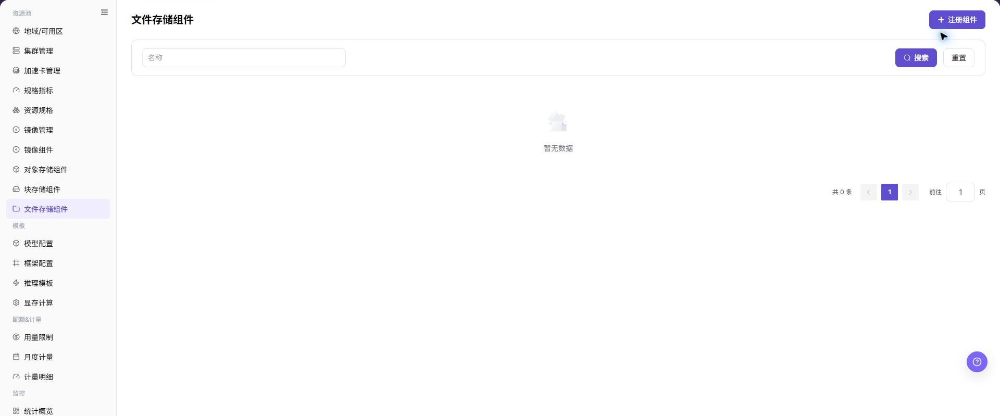
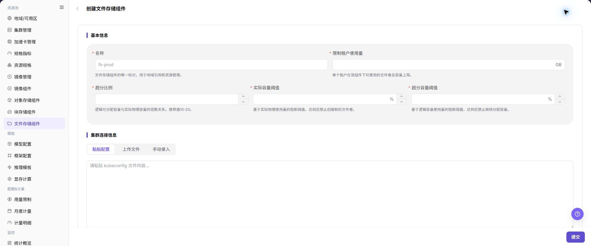

# 文件存储组件

## 功能概述

| 项目 | 内容 |
| --- | --- |
| 适用角色 | 运营管理员 |
| 导航路径 | AI基础设施 > On-Prem > 资源池 > 文件存储组件 |
| 页面路由 | `/powerone/resourcepool/file` |
| 管理对象 | 名称、限制租户使用量、超分比例、实际容量阈值、超分容量阈值、集群连接信息、粘贴配置、上传文件、手动录入和描述 |

#### 新手理解

文件存储组件像平台里的共享文件柜，决定哪些集群能挂载共享目录。运营管理员先把 NFS 或兼容共享存储接入平台，用户侧实例和作业才能用同一目录读取数据、模型和输出文件。

#### 术语表

| 术语 | 英文 | 说明 |
| --- | --- | --- |
| NFS | NFS | NFS |
| 共享路径 | Shared Path | Shared Path |
| 挂载路径 | Mount Path | Mount Path |

#### 推荐操作顺序

先确认名称、限制租户使用量、超分比例、实际容量阈值、超分容量阈值、集群连接信息、粘贴配置、上传文件、手动录入和描述的前置依赖，再按主要操作顺序处理，最后执行结果校验并进入后续页面。

#### 小白先看

先确认当前任务是否涉及名称、限制租户使用量、超分比例、实际容量阈值、超分容量阈值、集群连接信息、粘贴配置、上传文件、手动录入和描述，再按照推荐顺序操作。页面字段或状态与预期不符时，先回到前置对象页核对依赖，不要跳过结果校验直接进入下游流程。

## 前提条件

1. NFS 或等效文件存储服务已部署完成。
2. 共享路径已创建，访问权限、目录属主和网络策略已确认。
3. 目标集群节点可以访问文件存储服务地址和导出目录。
4. 已规划租户目录、读写策略、容量、超分比例和备份策略。

## 页面说明

页面用于查看和处理名称、限制租户使用量、超分比例、实际容量阈值、超分容量阈值、集群连接信息、粘贴配置、上传文件、手动录入和描述。

上图保留左侧菜单和完整功能区；请先确认页面标题、筛选范围和主要操作入口。

页面展示已接入的文件存储组件、状态、服务地址、共享路径、容量和关联地域或集群。

## 主要操作

### 查看文件存储组件

1. 进入对应资源池组件页面，按名称、集群、状态或更新时间筛选。
2. 打开详情，核对 Endpoint 的脱敏信息、能力、关联集群、容量和健康状态。
3. 无结果时重置筛选并检查集群状态；不得复制凭据、内部地址或完整配置。
4. 健康状态异常时先查看连接和事件，不重复注册组件。

### 创建文件存储组件

#### 操作前确认

1. 文件存储服务地址可从目标集群节点访问。
2. 共享路径已导出，权限符合读写策略。
3. 挂载路径不会与容器系统目录或应用目录冲突。
4. 已确认租户隔离方式、目录命名规则、容量上限和超分策略。

#### 操作步骤

1. 进入 `AI基础设施 > On-Prem > 资源池 > 文件存储组件`。
2. 点击 **"注册组件"**，进入 **"创建文件存储组件 - 文件存储组件"** 页面。
3. 按页面字段填写 `名称`、`限制租户使用量`、`超分比例`、`实际容量阈值` 和 `超分容量阈值`。
4. 在 `集群连接信息` 区域通过 `粘贴配置`、`上传文件` 或 `手动录入` 提供连接配置，并确认配置内容已脱敏。
5. 如页面提供 `测试连接`，先验证目标集群节点到文件存储服务的连通性。
6. 在 `集群配置` 区域填写 `描述`，并根据实际页面继续核对集群连接信息、容量阈值和描述。
7. 点击最终 **"保存"**、**"提交"** 或 **"确定"** 前，再次核对集群连接信息、容量阈值和容量影响。

下图展示创建文件存储组件页面，用于填写基础策略、集群连接信息和集群配置。

#### 操作截图

上图展示操作入口打开后的字段和确认区域；提交前应核对必填项、所属范围和影响。

## 参数速查表

| 字段名称 | 是否必填 | 字段类型 | 示例 | 说明 |
| --- | --- | --- | --- | --- |
| 名称 | 必填 | 文件 / 配置文本 | `示例名称` | 文件存储组件名称。 建议体现环境、用途或容量边界。 |
| 限制租户使用量 | 必填 | 数值 / 容量 | `示例值` | 是否限制租户可用容量。 与租户容量策略一致。 |
| 超分比例 | 必填 | 文件 / 配置文本 | `1.5` | 文件存储逻辑容量和实际容量的超分比例。 按容量规划谨慎填写。 |
| 实际容量阈值 | 必填 | 数值 / 容量 | `80%` | 实际容量告警或限制阈值。 不要超过真实容量安全边界。 |
| 超分容量阈值 | 必填 | 数值 / 容量 | `90%` | 超分后逻辑容量告警或限制阈值。 与超分比例联动核对。 |
| 粘贴配置 | 条件必填 | 文件 / 配置文本 | `受控配置文件` | 通过粘贴 kubeconfig 内容录入集群连接信息。 不在文档中写真实 kubeconfig。 |
| 上传文件 | 条件必填 | 文件 / 配置文本 | `受控配置文件` | 通过上传文件录入集群连接信息。 仅上传受控环境中的授权配置文件。 |
| 手动录入 | 条件必填 | 文本 | `手动录入` | 通过手动字段录入集群连接信息。 不写真实内网地址、账号或密钥。 |
| 描述 | 否 | 多行文本 | `示例说明` | 组件用途、边界或维护说明。 只记录非敏感说明。 |

## 踩坑提示

- 创建文件存储组件可能影响作业、IDE、模型仓库或数据集目录的挂载和读写。
- 错误的服务地址、共享路径、导出权限、UID/GID 或读写策略可能导致挂载失败、无法写入或跨租户误访问。
- 容量阈值和超分比例配置不当，可能导致文件卷提前阻断创建，或容量展示与实际资源不一致。
- NFS 服务地址和挂载路径要从目标节点验证，不要只在平台管理侧验证。
- `保存 / Save`、`提交 / Submit`、`确定 / OK` 属于高风险最终动作。
- 不写真实 NFS 地址、内网路径、账号、密钥、Token、kubeconfig、集群 ID、资源池 ID、租户目录或内部测试参数。

## 结果校验

| 检查项 | 成功表现 | 异常时处理 |
| --- | --- | --- |
| 页面入口 | 可进入文件存储组件并看到目标操作入口 | 检查运营管理员权限和对应菜单是否已开放 |
| 对象记录 | 名称、限制租户使用量、超分比例、实际容量阈值、超分容量阈值、集群连接信息、粘贴配置、上传文件、手动录入和描述在列表或详情中可见 | 重置筛选并核对名称、所属范围和创建结果 |
| 状态结果 | 新增或变更后的状态符合页面提示 | 查看操作提示、依赖对象状态和最近更新时间 |
| 下游使用 | 后续页面能够选择或关联目标对象 | 回到前置配置核对启用状态、归属关系和可见范围 |

## 常见问题

#### 文件存储组件中找不到目标对象

**问题现象：**

页面可进入，但没有看到预期的名称、限制租户使用量、超分比例、实际容量阈值、超分容量阈值、集群连接信息、粘贴配置、上传文件、手动录入和描述。

**可能原因：**

- 筛选条件仍生效。
- 对象属于其他范围。
- 前置配置未完成。

**处理方式：**

1. 重置筛选
2. 核对所属地域或租户
3. 返回前置页面确认对象状态。

#### 文件存储组件的操作入口不可用

**问题现象：**

新增、注册或维护入口不可见或不可点击。

**可能原因：**

- 当前角色权限不足。
- 页面处于只读状态。
- 依赖对象不满足条件。

**处理方式：**

1. 检查运营管理员权限
2. 核对页面提示
3. 先完成依赖对象配置。

#### 文件存储组件的必填项没有可选值

**问题现象：**

表单能打开，但下拉框为空。

**可能原因：**

- 候选对象未启用。
- 所属范围不一致。
- 当前账号不可见。

**处理方式：**

1. 到候选对象页面核对状态
2. 确认归属关系
3. 检查可见范围后刷新表单。

#### 文件存储组件操作后状态异常

**问题现象：**

提交后记录存在，但状态不是预期值。

**可能原因：**

- 连通性或校验失败。
- 关联对象异常。
- 后台处理尚未完成。

**处理方式：**

1. 查看页面提示和更新时间
2. 检查关联对象
3. 按状态阶段排查处理任务。

#### 下游页面无法使用文件存储组件

**问题现象：**

当前页状态正常，但下游页面无法选择或关联名称、限制租户使用量、超分比例、实际容量阈值、超分容量阈值、集群连接信息、粘贴配置、上传文件、手动录入和描述。

**可能原因：**

- 可见范围不匹配。
- 对象未启用。
- 下游缓存未刷新。

**处理方式：**

1. 核对启用状态和归属
2. 检查角色可见范围
3. 刷新下游页面并重新选择。

## 注意事项

- 不要把共享目录配置成过大的公共读写范围。
- 删除或调整共享路径前，先确认没有运行中作业、IDE、模型仓库或数据集目录依赖。
- 文档、截图和示例中不要记录真实 NFS 地址、内网路径、kubeconfig、账号、密钥、Token、集群 ID、资源池 ID、租户目录或内部测试参数。

## 后续操作

1. 在地域或集群存储配置中引用文件存储组件。
2. 使用测试作业验证读写、并发和容量限制。
3. 将共享目录纳入备份、清理和权限审计。
