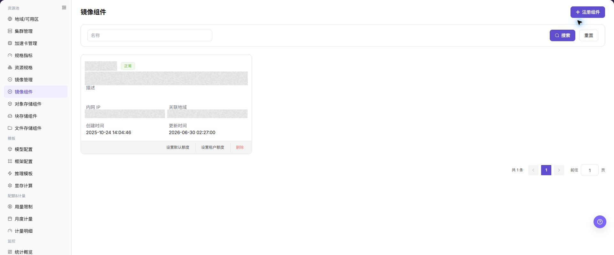
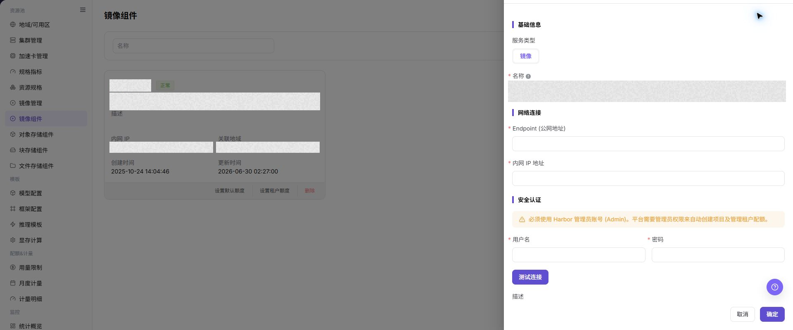

# 镜像组件

## 功能概述

| 项目 | 内容 |
| --- | --- |
| 适用角色 | 运营管理员 |
| 导航路径 | AI基础设施 > On-Prem > 资源池 > 镜像组件 |
| 页面路由 | `/powerone/resourcepool/images` |
| 管理对象 | 服务类型、镜像、名称、Endpoint（公网地址）、内网 IP 地址、用户名、密码、描述和操作 |

#### 新手理解

镜像组件像平台里的镜像仓库接入卡，负责告诉平台去哪里拉取运行镜像、用什么凭据认证、哪些地域或集群可以使用。镜像组件配置不正确时，用户侧模型实例、在线 IDE、运行实例和作业通常会卡在镜像拉取阶段。

#### 术语表

| 术语 | 英文 | 说明 |
| --- | --- | --- |
| Harbor | Harbor | Harbor |
| Registry | Registry | Registry |
| Endpoint | Endpoint | Endpoint |

#### 推荐操作顺序

先确认服务类型、镜像、名称、Endpoint（公网地址）、内网 IP 地址、用户名、密码、描述和操作的前置依赖，再按主要操作顺序处理，最后执行结果校验并进入后续页面。

#### 小白先看

先确认当前任务是否涉及服务类型、镜像、名称、Endpoint（公网地址）、内网 IP 地址、用户名、密码、描述和操作，再按照推荐顺序操作。页面字段或状态与预期不符时，先回到前置对象页核对依赖，不要跳过结果校验直接进入下游流程。

## 前提条件

1. 镜像仓库已部署完成，并能从平台侧和目标集群访问。
2. 已准备仓库地址、Endpoint、认证方式、访问凭据和证书策略。
3. 目标集群能解析并访问镜像仓库地址。
4. 已确认关联地域、绑定集群、公共镜像、自定义镜像和租户项目权限边界。

## 页面说明

页面用于查看和处理服务类型、镜像、名称、Endpoint（公网地址）、内网 IP 地址、用户名、密码、描述和操作。

上图保留左侧菜单和完整功能区；请先确认页面标题、筛选范围和主要操作入口。

页面展示已接入的镜像组件、状态、访问地址、项目数量、同步状态和关联地域。

下图展示镜像组件列表，可查看组件状态、Endpoint、同步状态和操作入口。

## 主要操作

### 查看镜像组件

1. 进入对应资源池组件页面，按名称、集群、状态或更新时间筛选。
2. 打开详情，核对 Endpoint 的脱敏信息、能力、关联集群、容量和健康状态。
3. 无结果时重置筛选并检查集群状态；不得复制凭据、内部地址或完整配置。
4. 健康状态异常时先查看连接和事件，不重复注册组件。

### 注册镜像组件

#### 适用场景

当需要接入新的 Harbor、Docker Registry 或兼容镜像仓库，并让指定地域、集群或用户侧镜像服务使用该仓库时，注册镜像组件。

#### 操作步骤

1. 进入 `AI基础设施 > On-Prem > 资源池 > 镜像组件`。
2. 点击 **"注册组件"**。
3. 按页面字段填写 `服务类型`、`镜像`、`名称`、`Endpoint (公网地址)`、`内网 IP 地址`、`用户名`、`密码` 和 `描述`。
4. 如页面提供 `测试连接`，先执行只读连通性检查并确认返回结果。
5. 提交前确认仓库地址可从平台侧和目标集群访问，Robot 凭据或访问账号具备最小必要权限。
6. 点击最终 **"保存"**、**"提交"** 或 **"确定"** 前，再次核对仓库地址、凭据来源、证书策略和地域绑定范围。

下图展示注册镜像组件表单，用于填写镜像服务连接信息和同步配置。

### 设置镜像组件默认额度

#### 适用场景

当需要为镜像组件设置未单独配置租户额度时的默认资源额度，使用 **"设置默认额度"**。

#### 操作步骤

1. 进入 `AI基础设施 > On-Prem > 资源池 > 镜像组件`，定位目标镜像组件。
2. 按页面入口点击 **"设置默认额度"**。
3. 核对页面展示的组件、额度字段和适用范围，填写或调整允许的额度。
4. 点击最终确认按钮前，确认默认额度不会超出组件容量或影响现有租户使用。

#### 结果校验

- 镜像组件详情或额度信息显示新的默认额度。
- 未单独设置租户额度的对象按新的默认额度计算或限制。
- 已单独设置租户额度的对象仍保持其专用配置。

#### 注意事项

- 默认额度会影响多个租户或未单独配置额度的对象，修改前先确认容量和业务范围。
- 不要把真实仓库地址、账号、密码或访问密钥写入额度说明或截图。

#### 默认额度保存后未生效

**问题现象：**

保存成功，但相关租户的镜像额度仍显示旧值。

**可能原因：**

- 该租户已有单独额度配置。
- 页面数据或额度计算尚未刷新。
- 修改的不是实际被使用的镜像组件。

**处理方式：**

1. 在租户额度入口核对是否存在专用配置。
2. 刷新组件详情并检查更新时间。
3. 核对组件名称、所属范围和下游镜像使用关系。

### 设置镜像组件租户额度

#### 适用场景

当需要为指定租户设置区别于默认值的镜像组件额度时，使用 **"设置租户额度"**。

#### 操作步骤

1. 进入 `AI基础设施 > On-Prem > 资源池 > 镜像组件`，定位目标镜像组件。
2. 点击 **"设置租户额度"**，选择目标租户。
3. 核对租户、镜像组件和额度字段，填写该租户的额度值。
4. 点击最终确认按钮前，确认租户范围和额度不会影响其他租户。

#### 结果校验

- 租户额度详情显示目标租户和新的额度值。
- 目标租户的镜像使用受新额度限制，其他租户仍按各自配置或默认额度处理。
- 镜像组件整体容量没有被错误超配。

#### 注意事项

- 选择租户前核对租户名称和范围，避免为错误租户配置额度。
- 调低额度可能影响正在进行的镜像同步、上传或使用，变更前确认业务窗口。

#### 租户额度入口中找不到目标租户

**问题现象：**

打开 **"设置租户额度"** 后，目标租户不在可选列表中。

**可能原因：**

- 租户不在当前镜像组件的可见范围。
- 租户状态或镜像组件状态不可用。
- 当前账号没有租户额度配置权限。

**处理方式：**

1. 核对镜像组件状态和所属范围。
2. 到租户或权限页面确认目标租户可见且状态正常。
3. 检查运营管理员权限后重新打开额度入口。

### 移除镜像组件

#### 适用场景

当平台不再需要某个镜像组件，且已确认没有地域、作业、模板或镜像管理记录依赖它时，移除镜像组件。

#### 操作步骤

1. 进入 `AI基础设施 > On-Prem > 资源池 > 镜像组件`，定位目标组件。
2. 点击目标组件的 **"删除"**。
3. 阅读确认提示，核对组件名称、Endpoint、地域绑定、额度配置和下游依赖。
4. 确认替代组件、迁移安排和影响范围后，点击确认按钮完成移除。
5. 刷新列表，并到地域/可用区和镜像管理页面确认下游选择范围。

#### 结果校验

- 目标镜像组件从组件列表中移除。
- 地域绑定和新镜像同步、上传入口不再引用该组件。
- 其他组件、租户额度和已有镜像记录未被误删。

#### 注意事项

- 移除组件可能导致镜像同步、上传、作业拉取和地域资源创建失败，执行前必须完成依赖迁移。
- 移除平台组件记录不代表删除底层镜像仓库数据，按实际数据保留策略处理仓库侧内容。

#### 镜像组件无法移除

**问题现象：**

点击 **"删除"** 后操作失败，或页面提示仍存在关联对象。

**可能原因：**

- 地域、镜像或其他资源对象仍绑定该组件。
- 当前账号缺少移除权限。
- 组件正在执行同步或其他后台任务。

**处理方式：**

1. 到地域/可用区、镜像管理和额度配置页面逐项核对关联。
2. 检查组件任务状态和最近更新时间。
3. 解除依赖或完成迁移后，再按审批结果重新执行移除。

#### 操作截图

上图展示操作入口打开后的字段和确认区域；提交前应核对必填项、所属范围和影响。

## 参数速查表

| 字段名称 | 是否必填 | 字段类型 | 示例 | 说明 |
| --- | --- | --- | --- | --- |
| 服务类型 | 必填 | 下拉 / 枚举 | `镜像` | 当前组件所属服务类型。 镜像组件页面通常显示为 `镜像`。 |
| 镜像 | 必填 | 下拉 / 枚举 | `<BASE_URL>/<PROJECT>/<IMAGE>:<TAG>` | 注册镜像组件时的服务类型取值。 与页面实际选项保持一致。 |
| 名称 | 必填 | 文本 | `示例名称` | 镜像组件展示名称。 使用能体现仓库用途、地域或环境的名称。 |
| Endpoint (公网地址) | 必填 | 地址 / 路径 | `<BASE_URL>` | 平台或用户侧访问镜像仓库的公网入口。 文档只使用占位说明，不写真实地址。 |
| 内网 IP 地址 | 条件必填 | 地址 / 路径 | `<PRIVATE_IP>` | 集群或平台内网访问镜像仓库的地址。 与实际网络、DNS 和容器运行时配置一致。 |
| 用户名 | 条件必填 | 地址 / 路径 | `<USERNAME>` | 镜像仓库访问账号。 只在系统表单中填写，不写入文档、截图或工单。 |
| 密码 | 条件必填 | 凭据 / 敏感文本 | `<PERSONAL_KEY>` | 镜像仓库访问密码。 属于敏感凭据，不写入文档、截图或工单。 |
| 描述 | 否 | 多行文本 | `示例说明` | 组件用途、边界或维护说明。 只记录非敏感说明。 |
| 操作 | 系统生成 | 操作入口 | `编辑` | 注册组件、测试连接、取消、确定、编辑、删除等入口。 `确定`、`删除` 属于高风险动作。 |

## 踩坑提示

- 注册镜像组件会影响地域、集群、作业、在线 IDE、模型实例的镜像拉取能力。
- 仓库地址、证书链、Robot 凭据或 Image Pull Secret 配置错误，可能导致 `ImagePullBackOff`。
- 镜像组件绑定错误地域，可能导致用户侧看不到镜像项目或作业无法拉取镜像。
- `保存 / Save`、`提交 / Submit`、`确定 / OK` 属于高风险最终动作。
- 不写真实仓库地址、Robot 密码、Image Pull Secret、Token、AK/SK、内网地址、集群 ID、资源池 ID 或内部测试参数。

## 结果校验

| 检查项 | 成功表现 | 异常时处理 |
| --- | --- | --- |
| 页面入口 | 可进入镜像组件并看到目标操作入口 | 检查运营管理员权限和对应菜单是否已开放 |
| 对象记录 | 服务类型、镜像、名称、Endpoint（公网地址）、内网 IP 地址、用户名、密码、描述和操作在列表或详情中可见 | 重置筛选并核对名称、所属范围和创建结果 |
| 状态结果 | 新增或变更后的状态符合页面提示 | 查看操作提示、依赖对象状态和最近更新时间 |
| 下游使用 | 后续页面能够选择或关联目标对象 | 回到前置配置核对启用状态、归属关系和可见范围 |

## 常见问题

#### 镜像组件中找不到目标对象

**问题现象：**

页面可进入，但没有看到预期的服务类型、镜像、名称、Endpoint（公网地址）、内网 IP 地址、用户名、密码、描述和操作。

**可能原因：**

- 筛选条件仍生效。
- 对象属于其他范围。
- 前置配置未完成。

**处理方式：**

1. 重置筛选
2. 核对所属地域或租户
3. 返回前置页面确认对象状态。

#### 镜像组件的操作入口不可用

**问题现象：**

新增、注册或维护入口不可见或不可点击。

**可能原因：**

- 当前角色权限不足。
- 页面处于只读状态。
- 依赖对象不满足条件。

**处理方式：**

1. 检查运营管理员权限
2. 核对页面提示
3. 先完成依赖对象配置。

#### 镜像组件的必填项没有可选值

**问题现象：**

表单能打开，但下拉框为空。

**可能原因：**

- 候选对象未启用。
- 所属范围不一致。
- 当前账号不可见。

**处理方式：**

1. 到候选对象页面核对状态
2. 确认归属关系
3. 检查可见范围后刷新表单。

#### 镜像组件操作后状态异常

**问题现象：**

提交后记录存在，但状态不是预期值。

**可能原因：**

- 连通性或校验失败。
- 关联对象异常。
- 后台处理尚未完成。

**处理方式：**

1. 查看页面提示和更新时间
2. 检查关联对象
3. 按状态阶段排查处理任务。

#### 下游页面无法使用镜像组件

**问题现象：**

当前页状态正常，但下游页面无法选择或关联服务类型、镜像、名称、Endpoint（公网地址）、内网 IP 地址、用户名、密码、描述和操作。

**可能原因：**

- 可见范围不匹配。
- 对象未启用。
- 下游缓存未刷新。

**处理方式：**

1. 核对启用状态和归属
2. 检查角色可见范围
3. 刷新下游页面并重新选择。

## 注意事项

- 注册镜像组件会影响地域、集群、作业、在线 IDE、模型实例的镜像拉取能力。
- Robot 凭据、仓库密码、Image Pull Secret、Token 和证书材料都属于敏感信息。
- 仓库地址、证书链、Robot 凭据或 Image Pull Secret 配置错误，可能导致 `ImagePullBackOff`。
- 镜像组件绑定错误地域，可能导致用户侧看不到镜像项目或作业无法拉取镜像。
- 不建议在生产模板中长期使用 `latest` 标签，应使用明确版本标签。

- 不写真实仓库地址、Robot 密码、Image Pull Secret、Token、AK/SK、内网地址、集群 ID、资源池 ID 或内部测试参数。

## 后续操作

1. 进入 [地域/可用区](../regions-zones/) 绑定或核对镜像组件。
2. 指导用户在 [镜像服务](../../../user/extensions/images/) 中创建项目并推送镜像。
3. 进入镜像管理或用户侧镜像服务页面确认项目、镜像和标签可见。
4. 使用测试作业、在线 IDE 或模型实例验证镜像拉取和启动。
