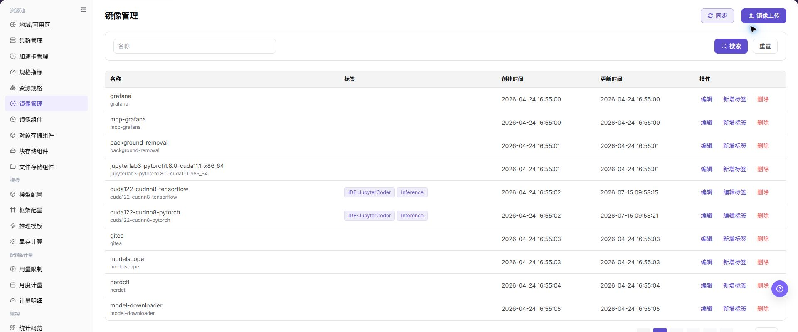

# 镜像管理

## 功能概述

| 项目 | 内容 |
| --- | --- |
| 适用角色 | 运营管理员 |
| 导航路径 | AI基础设施 > On-Prem > 资源池 > 镜像管理 |
| 页面路由 | `/powerone/resourcepool/image` |
| 管理对象 | 客户端工具、镜像仓库、项目/命名空间、镜像名称、镜像标签、镜像地址、镜像类型、架构和同步状态 |

#### 新手理解

镜像管理像平台里的运行环境货架。运营管理员先确保镜像仓库和镜像组件可用，再通过客户端构建、登录和推送镜像，最后回到平台页面同步或登记镜像信息，让作业、IDE、推理服务或模板可以选择正确版本。

#### 术语表

| 术语 | 英文 | 说明 |
| --- | --- | --- |
| 客户端工具 | Client Tool | Client Tool |
| 镜像仓库 | Image Registry | Image Registry |
| 项目/命名空间 | Project/Namespace | Project/Namespace |

#### 推荐操作顺序

先确认客户端工具、镜像仓库、项目/命名空间、镜像名称、镜像标签、镜像地址、镜像类型、架构和同步状态的前置依赖，再按主要操作顺序处理，最后执行结果校验并进入后续页面。

#### 小白先看

先确认当前任务是否涉及客户端工具、镜像仓库、项目/命名空间、镜像名称、镜像标签、镜像地址、镜像类型、架构和同步状态，再按照推荐顺序操作。页面字段或状态与预期不符时，先回到前置对象页核对依赖，不要跳过结果校验直接进入下游流程。

## 前提条件

1. 已接入镜像组件，镜像管理列表可正常加载。
2. 当前账号具备 `AI Infra > On-Prem > 资源池管理 > 镜像管理` 的查看和管理权限。
3. 本地客户端已准备 Docker、Podman 或页面支持的实际工具。
4. 镜像命名、标签语义、用途、架构和影响范围已规划。

## 页面说明

页面用于查看和处理客户端工具、镜像仓库、项目/命名空间、镜像名称、镜像标签、镜像地址、镜像类型、架构和同步状态。



上图保留左侧菜单和完整功能区；请先确认页面标题、筛选范围和主要操作入口。

页面以表格展示镜像名称、标签、创建时间、更新时间和操作入口。

下图展示镜像管理列表，可维护镜像标签并执行上传或同步。

## 主要操作

### 查看镜像

1. 进入 `资源池 > 镜像管理`。
2. 按名称、版本、架构、状态或更新时间筛选。
3. 打开详情，核对格式、架构、大小、校验状态和适用场景。
4. 无结果时重置筛选；内部仓库地址和凭据不得外发。

### 管理镜像标签与状态

1. 在镜像列表中定位目标镜像，核对当前标签、创建时间、更新时间和同步状态。
2. 点击目标镜像行的 **"新增标签"** 或 **"编辑标签"**，按页面提示维护标签内容。
3. 核对标签含义、镜像架构和下游作业或模板的引用范围。
4. 标签变更后刷新列表，确认新标签和同步状态符合预期；需要移除镜像记录时使用单独的 **"删除"** 操作。

### 上传镜像

#### 适用场景

当需要将本地构建或已有的运行镜像推送到镜像仓库，并在平台侧纳入镜像管理范围时，参考客户端上传指南。

#### 操作步骤

1. 进入 `AI基础设施 > On-Prem > 资源池 > 镜像管理`，确认镜像组件已接入且镜像列表可正常加载。
2. 在本地客户端准备镜像构建、登录和推送环境，例如 Docker、Podman 或页面支持的实际客户端工具。
3. 构建或加载本地镜像，并使用占位格式标记镜像地址，例如 `<BASE_URL>/<project>/<image>:<tag>`。
4. 登录镜像仓库并推送镜像。学习或文档示例中只使用占位符，不写真实仓库地址、账号或密码。
5. 返回 `镜像管理` 页面，点击 **"镜像上传"**、**"同步"** 或页面真实入口，将镜像地址、标签、用途、架构等信息纳入平台管理。
6. 点击最终 **"保存"**、**"提交"** 或 **"确定"** 前，再次核对镜像来源、标签语义、用途和是否会影响已有作业。

客户端命令仅使用占位格式示例：

```bash
docker tag <local-image>:<local-tag> <BASE_URL>/<project>/<image>:<tag>
docker login <BASE_URL>
docker push <BASE_URL>/<project>/<image>:<tag>
```

下图展示镜像上传入口，上传前应确认镜像来源、用途和标签。


### 同步镜像

#### 适用场景

当镜像仓库中的镜像或标签发生变化，需要将最新清单同步到平台时，使用页面右上角的 **"同步"**。

#### 操作步骤

1. 进入 `AI基础设施 > On-Prem > 资源池 > 镜像管理`，确认镜像组件状态正常。
2. 点击页面右上角的 **"同步"**，阅读页面提示并确认同步范围。
3. 等待同步完成后刷新列表，按镜像名称或标签定位目标记录。

#### 结果校验

- 列表显示同步后的镜像或标签，更新时间发生变化。
- 镜像地址、架构和同步状态与镜像仓库中的目标记录一致。
- 后续作业、IDE 或推理模板页面可以选择已同步镜像。

#### 注意事项

- 同步可能带来新标签或状态更新，不等同于删除平台中已有镜像；执行前确认仓库内容和影响范围。
- 同步期间不要反复提交，若状态长时间不变，应检查镜像组件连通性和后台提示。

#### 同步后找不到镜像标签

**问题现象：**

同步完成，但目标镜像或标签仍未出现在列表中。

**可能原因：**

- 镜像仓库项目、标签或架构不在当前同步范围。
- 镜像组件连接异常或同步任务尚未完成。
- 当前列表筛选条件隐藏了目标记录。

**处理方式：**

1. 重置筛选并按镜像名称重新搜索。
2. 到镜像组件页面确认 Endpoint、状态和连通性。
3. 查看镜像更新时间和同步状态，确认任务完成后再复查。

### 编辑镜像

#### 适用场景

当镜像的页面可编辑信息需要调整，且镜像地址和实际仓库内容不需要重新推送时，编辑镜像。

#### 操作步骤

1. 进入 `AI基础设施 > On-Prem > 资源池 > 镜像管理`，定位目标镜像。
2. 在目标镜像行点击 **"编辑"**，核对弹窗中的镜像标识和可编辑字段。
3. 按页面提供的字段修改信息，确认不会改变错误镜像或影响已有作业。
4. 点击最终 **"保存"** 或 **"确定"** 前，复核镜像地址、架构、标签和用途。
5. 返回列表，核对更新后的信息和更新时间。

#### 结果校验

- 镜像列表显示更新后的字段，镜像地址和标签关系正确。
- 镜像状态未因页面信息编辑而异常变化。
- 下游选择页面能够识别更新后的镜像信息。

#### 注意事项

- 编辑页面信息不会替代镜像仓库中的构建、推送或同步；仓库内容变化应使用客户端推送并执行同步。
- 修改标签、架构或用途前先确认已有实例、作业和模板依赖，避免下游选择错误镜像。

#### 编辑镜像后显示信息仍是旧值

**问题现象：**

编辑保存成功，但列表或详情仍显示旧的信息。

**可能原因：**

- 页面缓存未刷新。
- 修改未通过最终确认或后台校验未完成。
- 目标镜像行与重新搜索到的记录不是同一对象。

**处理方式：**

1. 刷新列表并按镜像地址或唯一标识重新定位。
2. 查看页面提示和更新时间，确认保存处理完成。
3. 核对目标镜像的地址、标签和架构，避免误编辑其他记录。

### 移除镜像

#### 适用场景

当平台不再需要维护某个镜像记录，且已确认没有作业、IDE、模板或实例依赖时，移除镜像。

#### 操作步骤

1. 进入 `AI基础设施 > On-Prem > 资源池 > 镜像管理`，定位目标镜像。
2. 在目标镜像行点击 **"删除"**。
3. 阅读确认提示，核对镜像名称、地址、标签和关联业务。
4. 确认影响范围、数据保留和回滚安排后，点击确认按钮完成移除。
5. 刷新列表并检查下游页面的镜像选择范围。

#### 结果校验

- 目标镜像记录从镜像管理列表中移除。
- 下游新建作业、IDE 或推理模板页面不再提供该镜像记录。
- 其他镜像、标签和已存在的底层仓库数据未被误删。

#### 注意事项

- 移除平台记录不等于删除镜像仓库中的镜像数据；执行前确认两者的边界和数据保留要求。
- 有运行中作业或模板依赖时不要直接移除，先完成替代镜像配置和迁移安排。

#### 删除后镜像仍出现在下游页面

**问题现象：**

镜像管理列表已不再显示记录，但下游页面仍能选择该镜像。

**可能原因：**

- 下游页面缓存尚未刷新。
- 下游页面保存了历史配置或使用的是仓库侧记录。
- 删除请求仍在后台处理中。

**处理方式：**

1. 刷新下游页面并重置筛选。
2. 核对下游对象引用的是平台镜像记录还是仓库地址。
3. 查看镜像更新时间和页面提示，确认移除任务已完成。

## 参数速查表

| 字段名称 | 是否必填 | 字段类型 | 示例 | 说明 |
| --- | --- | --- | --- | --- |
| 客户端工具 | 条件必填 | 文本 | `Docker` | 用于构建、登录和推送镜像的本地工具。 使用 Docker、Podman 或页面支持的实际客户端工具。 |
| 镜像仓库 | 必填 | 地址 / 路径 | `<BASE_URL>` | 镜像所在 registry。 文档示例只使用 `<BASE_URL>` 占位符，不写真实仓库地址。 |
| 项目/命名空间 | 必填 | 地址 / 路径 | `example-project` | 镜像仓库中的项目、租户或 namespace。 使用 `<project>` 占位符示例，实际配置按仓库权限填写。 |
| 镜像名称 | 必填 | 地址 / 路径 | `示例名称` | 镜像展示名称或仓库中的 image 名称。 名称应体现框架、用途或运行环境。 |
| 镜像标签 | 必填 | 文本 | `v1.0.0` | 镜像版本标签。 避免在生产场景只使用 `latest`。 |
| 镜像地址 | 必填 | 地址 / 路径 | `<BASE_URL>/<PROJECT>/<IMAGE>:<TAG>` | 完整镜像地址，例如 `<BASE_URL>/<project>/<image>:<tag>`。 提交前核对 registry、project、image 和 tag。 |
| 镜像类型 | 否 | 下拉 / 枚举 | `推理` | 镜像用途类型，如开发、训练或推理。 与后续作业、IDE 或推理模板使用场景一致。 |
| 架构 | 否 | 数值 / 容量 | `Ampere` | 镜像 CPU 架构或硬件架构。 与目标集群节点架构匹配。 |
| 同步状态 | 系统生成 | 状态 | `已同步` | 平台同步镜像后的状态。 推送后回到平台刷新或同步检查。 |
| 操作 | 否 | 操作入口 | `编辑` | 支持镜像上传、同步、编辑标签、查看或删除等操作。 高风险操作前确认影响范围。 |

## 踩坑提示

- 客户端上传可能向真实镜像仓库写入镜像，影响后续作业、IDE、推理服务或模板选择。
- 镜像标签复用或覆盖可能导致已有任务拉取到非预期版本。
- 镜像中不能包含密钥、Token、AK/SK、账号密码、内部配置文件或测试数据。
- `docker login`、`podman login` 等命令不要在文档中写真实账号、密码或仓库地址。
- `保存 / Save`、`提交 / Submit`、`确定 / OK` 属于高风险最终动作。

### 配置规则与影响

- **镜像先于作业**：作业可运行前必须能从仓库拉取目标镜像。
- **标签要稳定**：标签用于筛选、推荐和部署复现，不建议随意改变语义。
- **地址要可拉取**：镜像地址、项目/命名空间和标签必须与仓库实际内容一致。
- **权限要最小化**：客户端登录凭据只用于推送或拉取所需范围，不写入文档。
- **删除需谨慎**：删除或下线镜像前确认没有作业、模板、模型版本、在线 IDE 或推理服务依赖。

## 结果校验

| 检查项 | 成功表现 | 异常时处理 |
| --- | --- | --- |
| 页面入口 | 可进入镜像管理并看到目标操作入口 | 检查运营管理员权限和对应菜单是否已开放 |
| 对象记录 | 客户端工具、镜像仓库、项目/命名空间、镜像名称、镜像标签、镜像地址、镜像类型、架构和同步状态在列表或详情中可见 | 重置筛选并核对名称、所属范围和创建结果 |
| 状态结果 | 新增或变更后的状态符合页面提示 | 查看操作提示、依赖对象状态和最近更新时间 |
| 下游使用 | 后续页面能够选择或关联目标对象 | 回到前置配置核对启用状态、归属关系和可见范围 |

## 常见问题

#### 镜像管理中找不到目标对象

**问题现象：**

页面可进入，但没有看到预期的客户端工具、镜像仓库、项目/命名空间、镜像名称、镜像标签、镜像地址、镜像类型、架构和同步状态。

**可能原因：**

- 筛选条件仍生效。
- 对象属于其他范围。
- 前置配置未完成。

**处理方式：**

1. 重置筛选
2. 核对所属地域或租户
3. 返回前置页面确认对象状态。

#### 镜像管理的操作入口不可用

**问题现象：**

新增、注册或维护入口不可见或不可点击。

**可能原因：**

- 当前角色权限不足。
- 页面处于只读状态。
- 依赖对象不满足条件。

**处理方式：**

1. 检查运营管理员权限
2. 核对页面提示
3. 先完成依赖对象配置。

#### 镜像管理的必填项没有可选值

**问题现象：**

表单能打开，但下拉框为空。

**可能原因：**

- 候选对象未启用。
- 所属范围不一致。
- 当前账号不可见。

**处理方式：**

1. 到候选对象页面核对状态
2. 确认归属关系
3. 检查可见范围后刷新表单。

#### 镜像管理操作后状态异常

**问题现象：**

提交后记录存在，但状态不是预期值。

**可能原因：**

- 连通性或校验失败。
- 关联对象异常。
- 后台处理尚未完成。

**处理方式：**

1. 查看页面提示和更新时间
2. 检查关联对象
3. 按状态阶段排查处理任务。

#### 下游页面无法使用镜像管理

**问题现象：**

当前页状态正常，但下游页面无法选择或关联客户端工具、镜像仓库、项目/命名空间、镜像名称、镜像标签、镜像地址、镜像类型、架构和同步状态。

**可能原因：**

- 可见范围不匹配。
- 对象未启用。
- 下游缓存未刷新。

**处理方式：**

1. 核对启用状态和归属
2. 检查角色可见范围
3. 刷新下游页面并重新选择。

## 注意事项

- 客户端上传可能向真实镜像仓库写入镜像，影响后续作业、IDE、推理服务或模板选择。
- 镜像标签复用或覆盖可能导致已有任务拉取到非预期版本。
- 镜像中不能包含密钥、Token、AK/SK、账号密码、内部配置文件或测试数据。
- `docker login`、`podman login` 等命令不要在文档中写真实账号、密码或仓库地址。

## 后续操作

1. 进入模型配置、框架配置、作业创建、在线 IDE 或推理服务流程验证镜像可选。
2. 按镜像用途维护标签、架构和描述，便于后续筛选。
3. 定期清理不再使用的镜像记录，清理前确认没有下游依赖。
