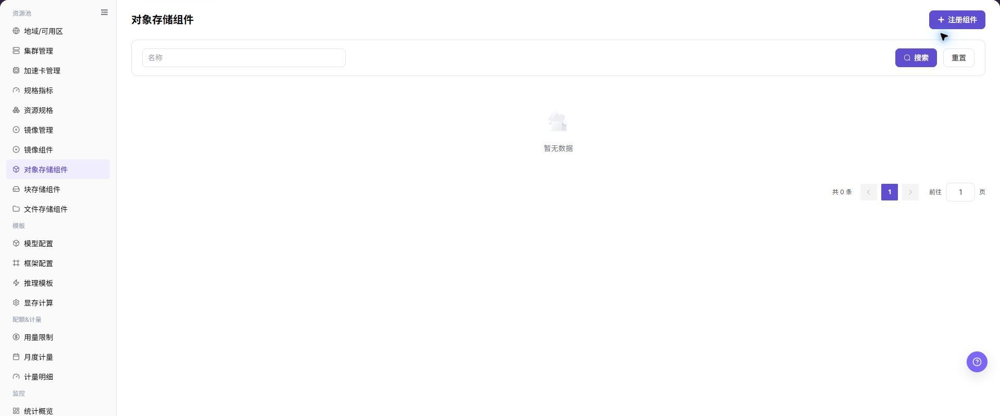
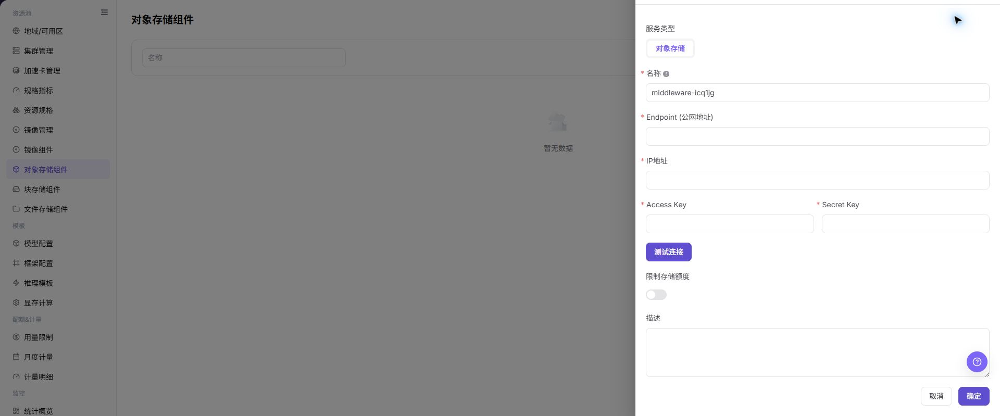

# 对象存储组件

## 功能概述

| 项目 | 内容 |
| --- | --- |
| 适用角色 | 运营管理员 |
| 导航路径 | AI基础设施 > On-Prem > 资源池 > 对象存储组件 |
| 页面路由 | `/powerone/resourcepool/storage` |
| 管理对象 | 服务类型、对象存储、名称、Endpoint（公网地址）、IP地址、Access Key、Secret Key、限制存储额度、描述和操作 |

#### 新手理解

- **对象存储** 像一个按桶组织的文件仓库，适合保存模型权重、数据集、压缩包和运行产物。
- **Bucket** 像对象存储的顶层容器，用户侧创建桶后才能组织对象。
- **Endpoint** 是访问入口，平台、集群或作业需要通过它访问对象存储。
- **AK/SK** 是访问凭据，属于敏感信息，不应出现在截图、文档或工单中。

#### 术语表

| 术语 | 英文 | 说明 |
| --- | --- | --- |
| MinIO | MinIO | MinIO |
| S3 | S3 | S3 |
| Bucket | Bucket | Bucket |

#### 推荐操作顺序

先确认服务类型、对象存储、名称、Endpoint（公网地址）、IP地址、Access Key、Secret Key、限制存储额度、描述和操作的前置依赖，再按主要操作顺序处理，最后执行结果校验并进入后续页面。

#### 小白先看

先确认当前任务是否涉及服务类型、对象存储、名称、Endpoint（公网地址）、IP地址、Access Key、Secret Key、限制存储额度、描述和操作，再按照推荐顺序操作。页面字段或状态与预期不符时，先回到前置对象页核对依赖，不要跳过结果校验直接进入下游流程。

## 前提条件

1. 对象存储服务已部署完成，并能从平台管理侧和目标集群访问。
2. 已准备 Endpoint、内网地址、访问协议、认证方式、访问凭据、容量规划和关联地域。
3. 已确认 Bucket 命名、租户隔离、权限边界和数据保留策略。
4. 当前账号具备运营管理员资源池管理权限。

## 页面说明

页面用于查看和处理服务类型、对象存储、名称、Endpoint（公网地址）、IP地址、Access Key、Secret Key、限制存储额度、描述和操作。

上图保留左侧菜单和完整功能区；请先确认页面标题、筛选范围和主要操作入口。

页面展示已接入的对象存储组件、状态、访问端点、内网地址、容量信息和关联地域。

下图展示对象存储组件列表，可查看组件状态、Endpoint、内网地址、容量和操作入口。

## 主要操作

### 查看对象存储组件

1. 进入对应资源池组件页面，按名称、集群、状态或更新时间筛选。
2. 打开详情，核对 Endpoint 的脱敏信息、能力、关联集群、容量和健康状态。
3. 无结果时重置筛选并检查集群状态；不得复制凭据、内部地址或完整配置。
4. 健康状态异常时先查看连接和事件，不重复注册组件。

### 注册对象存储组件

#### 适用场景

当需要接入新的 MinIO、S3 兼容存储或其他对象存储服务，并让地域、用户侧 Bucket 或作业读写对象路径使用该存储能力时，注册存储组件。正文中的对象存储组件仍指本页面管理的对象存储接入对象。

#### 操作步骤

1. 进入 `AI基础设施 > On-Prem > 资源池 > 对象存储组件`。
2. 点击 **"注册组件"**。
3. 按页面字段填写 `服务类型`、`对象存储`、`名称`、`Endpoint (公网地址)`、`IP地址`、`Access Key`、`Secret Key`、`限制存储额度` 和 `描述`。
4. 如页面提供 `测试连接`，先执行只读连通性检查并确认返回结果。
5. 点击最终 **"保存"**、**"提交"** 或 **"确定"** 前，再次核对 Endpoint (公网地址)、IP地址、Access Key、Secret Key 和容量限制。

下图展示注册对象存储组件表单，用于配置对象存储访问方式和连接参数。

#### 操作截图

上图展示操作入口打开后的字段和确认区域；提交前应核对必填项、所属范围和影响。

## 参数速查表

| 字段名称 | 是否必填 | 字段类型 | 示例 | 说明 |
| --- | --- | --- | --- | --- |
| 服务类型 | 必填 | 下拉 / 枚举 | `镜像` | 当前组件所属服务类型。 对象存储页面通常显示为 `对象存储`。 |
| 对象存储 | 必填 | 下拉 / 枚举 | `对象存储` | 注册存储组件时的服务类型取值。 与页面实际选项保持一致。 |
| 名称 | 必填 | 文本 | `示例名称` | 对象存储组件展示名称。 建议体现存储类型、环境或地域。 |
| Endpoint (公网地址) | 必填 | 地址 / 路径 | `<BASE_URL>` | 对象存储对平台或业务侧暴露的公网入口。 文档中不写真实 Endpoint。 |
| IP地址 | 条件必填 | 地址 / 路径 | `<PRIVATE_IP>` | 集群或平台访问对象存储的地址。 与实际网络、DNS 和路由配置一致。 |
| Access Key | 必填 | 凭据 / 敏感文本 | `<ACCESS_KEY_ID>` | 对象存储访问 AK。 只在系统表单中填写，不写入文档、截图或工单。 |
| Secret Key | 必填 | 凭据 / 敏感文本 | `<ACCESS_KEY_SECRET>` | 对象存储访问 SK。 属于敏感凭据，不写入文档、截图或工单。 |
| 限制存储额度 | 否 | 数值 / 容量 | `开启` | 是否限制对象存储容量额度。 根据租户、地域和作业规模规划。 |
| 描述 | 否 | 多行文本 | `示例说明` | 组件用途、边界或维护说明。 只记录非敏感说明。 |
| 操作 | 系统生成 | 操作入口 | `编辑` | 注册组件、测试连接、取消、确定、编辑额度、删除等入口。 `确定`、`删除` 属于高风险动作。 |

## 踩坑提示

- 注册存储组件会影响地域对象存储能力、用户侧 Bucket 创建、作业读写对象路径和数据访问范围。
- Endpoint、内网地址、证书、AK/SK、Bucket 策略或地域绑定错误，可能导致作业无法读写对象存储。
- AK/SK、Token、内部连接串、生产 Bucket 路径属于敏感信息，不能写入文档、截图或工单。
- `保存 / Save`、`提交 / Submit`、`确定 / OK` 属于高风险最终动作。
- 不写真实 Endpoint、内网地址、AK/SK、Token、Bucket 名称、生产对象路径、集群 ID、资源池 ID 或内部测试参数。

## 结果校验

| 检查项 | 成功表现 | 异常时处理 |
| --- | --- | --- |
| 页面入口 | 可进入对象存储组件并看到目标操作入口 | 检查运营管理员权限和对应菜单是否已开放 |
| 对象记录 | 服务类型、对象存储、名称、Endpoint（公网地址）、IP地址、Access Key、Secret Key、限制存储额度、描述和操作在列表或详情中可见 | 重置筛选并核对名称、所属范围和创建结果 |
| 状态结果 | 新增或变更后的状态符合页面提示 | 查看操作提示、依赖对象状态和最近更新时间 |
| 下游使用 | 后续页面能够选择或关联目标对象 | 回到前置配置核对启用状态、归属关系和可见范围 |

## 常见问题

#### 对象存储组件中找不到目标对象

**问题现象：**

页面可进入，但没有看到预期的服务类型、对象存储、名称、Endpoint（公网地址）、IP地址、Access Key、Secret Key、限制存储额度、描述和操作。

**可能原因：**

- 筛选条件仍生效。
- 对象属于其他范围。
- 前置配置未完成。

**处理方式：**

1. 重置筛选
2. 核对所属地域或租户
3. 返回前置页面确认对象状态。

#### 对象存储组件的操作入口不可用

**问题现象：**

新增、注册或维护入口不可见或不可点击。

**可能原因：**

- 当前角色权限不足。
- 页面处于只读状态。
- 依赖对象不满足条件。

**处理方式：**

1. 检查运营管理员权限
2. 核对页面提示
3. 先完成依赖对象配置。

#### 对象存储组件的必填项没有可选值

**问题现象：**

表单能打开，但下拉框为空。

**可能原因：**

- 候选对象未启用。
- 所属范围不一致。
- 当前账号不可见。

**处理方式：**

1. 到候选对象页面核对状态
2. 确认归属关系
3. 检查可见范围后刷新表单。

#### 对象存储组件操作后状态异常

**问题现象：**

提交后记录存在，但状态不是预期值。

**可能原因：**

- 连通性或校验失败。
- 关联对象异常。
- 后台处理尚未完成。

**处理方式：**

1. 查看页面提示和更新时间
2. 检查关联对象
3. 按状态阶段排查处理任务。

#### 下游页面无法使用对象存储组件

**问题现象：**

当前页状态正常，但下游页面无法选择或关联服务类型、对象存储、名称、Endpoint（公网地址）、IP地址、Access Key、Secret Key、限制存储额度、描述和操作。

**可能原因：**

- 可见范围不匹配。
- 对象未启用。
- 下游缓存未刷新。

**处理方式：**

1. 核对启用状态和归属
2. 检查角色可见范围
3. 刷新下游页面并重新选择。

## 注意事项

- 注册存储组件会影响地域对象存储能力、用户侧 Bucket 创建、作业读写对象路径和数据访问范围。
- 不要截图或记录真实 Endpoint、内网地址、AK/SK、Token、内部连接串、生产 Bucket 名称和生产对象路径。
- 删除、禁用或替换对象存储组件前，应确认数据迁移、备份、地域绑定和依赖作业。

- 不写真实 Endpoint、内网地址、AK/SK、Token、Bucket 名称、生产对象路径、集群 ID、资源池 ID 或内部测试参数。

## 后续操作

1. 进入 [地域/可用区](../regions-zones/) 绑定对象存储组件。
2. 指导用户在 [对象存储](../../../user/storage/object-storage/) 中创建 Bucket 并上传数据。
3. 通过测试作业验证对象读写、权限和路径配置。
4. 定期核对容量使用、Bucket 策略和数据保留策略。
