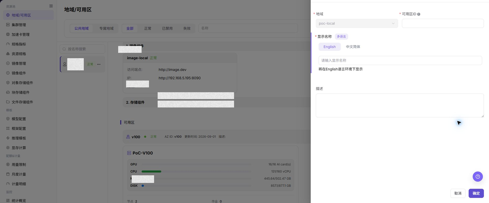

# 地域/可用区

## 功能概述

| 项目 | 内容 |
| --- | --- |
| 适用角色 | 运营管理员 |
| 导航路径 | AI基础设施 > On-Prem > 资源池 > 地域/可用区 |
| 页面路由 | `/powerone/resourcepool/region` |
| 管理对象 | 地域（Region）、可用区（Availability Zone）、地域关联组件、可用区下的集群资源 |

#### 新手理解

异构卡纳管资源池像一栋办公体系：

- **地域** 像城市，例如武汉、北京，用来区分大的资源所在范围。
- **可用区** 像城市里的办公区或楼层，用来继续划分具体承载资源的位置。
- **集群** 像办公区里的工位区，提供 CPU、GPU、内存、磁盘等实际算力。
- **作业** 像具体工作，必须被安排到某个集群上运行。
- **公共地域** 像开放式办公区，所有授权用户都可以共用。
- **专属地域** 像带门禁的独立办公室，只允许指定团队或租户使用。

所以第一次配置时，顺序不能反过来：先有地域，再有可用区，再把集群注册到可用区中，最后才能提交作业验证资源是否可用。

#### 术语表

| 术语 | 英文 | 说明 |
| --- | --- | --- |
| Harbor | Harbor | Harbor |
| Endpoint | Endpoint | Endpoint |
| IP | IP | IP |

#### 推荐操作顺序

先确认地域（Region）、可用区（Availability Zone）、地域关联组件、可用区下的集群资源的前置依赖，再按主要操作顺序处理，最后执行结果校验并进入后续页面。

#### 小白先看

先确认当前任务是否涉及地域（Region）、可用区（Availability Zone）、地域关联组件、可用区下的集群资源，再按照推荐顺序操作。页面字段或状态与预期不符时，先回到前置对象页核对依赖，不要跳过结果校验直接进入下游流程。

## 前提条件

开始配置前，请确认以下条件已满足：

1. 当前账号具备运营管理员权限，并能进入 `资源池 > 地域/可用区` 页面。
2. 至少已接入一个可用的镜像服务。镜像服务下拉为空时，优先到 `资源池 > 镜像组件` 检查组件是否已接入、已启用，以及当前账号是否有查看或绑定权限。
3. 如需在地域中使用对象存储、文件存储或块存储，需提前完成对应存储组件接入；下拉为空通常表示对应组件未接入、未启用或当前账号无权限。
4. 如后续要注册集群，需提前规划地域 ID、可用区 ID、显示名称和集群归属关系。

## 页面说明

页面用于查看和处理地域（Region）、可用区（Availability Zone）、地域关联组件、可用区下的集群资源。

上图保留左侧菜单和完整功能区；请先确认页面标题、筛选范围和主要操作入口。

页面由筛选区、地域列表和地域详情区组成。进入页面后，系统默认展示符合当前筛选条件的地域列表；选中某个地域后，右侧展示该地域的组件绑定、可用区和集群资源。

截图中右上角为 `新增地域` 入口，左侧为地域列表，右侧为当前地域的组件绑定和可用区资源区域。

#### 筛选区

筛选区位于页面顶部，用于缩小地域列表范围。

| 筛选项 | 说明 |
| --- | --- |
| 地域类型 | 按 `公共地域` 或 `专属地域` 筛选。公共地域可供全平台租户共享；专属地域用于限定使用范围。 |
| 状态 | 按 `全部`、`正常`、`已禁用`、`失效` 筛选地域。 |
| 名称 | 输入地域名称关键字后点击 **"搜索"**，可快速定位地域；点击 **"重置"** 清空筛选条件。 |

#### 地域列表

左侧地域列表展示地域名称、状态和更多操作入口。点击地域名称后，右侧详情区会刷新为当前地域的信息。

地域列表中的 `...` 菜单用于执行地域级操作，例如编辑、禁用或启用。

#### 地域详情

地域详情展示当前地域关联的资源能力，包括：

- 镜像组件：展示已绑定的镜像服务地址、状态、Endpoint、IP 和描述等信息。
- 存储组件：展示对象存储、文件存储、块存储等已启用组件的配额、桶、IP 或其他配置摘要。
- 可用区：展示该地域下的可用区状态、可用区 ID、更新时间、描述和集群数量。

Endpoint 是服务访问入口，通常用于平台或作业访问对应组件；IP 是服务所在地址或访问地址，用于判断组件网络是否可达。

#### 可用区与集群资源

展开可用区后，可查看该可用区下的集群资源使用情况。集群卡片通常展示以下信息：

- 集群名称。
- GPU、CPU、MEM、DISK 资源用量。
- 节点数量、作业数量和创建时间。

资源用量以“已用/总量”格式展示，用于快速判断某个可用区或集群是否存在资源瓶颈。

#### 管理说明

- 左侧地域列表中的 `...` 菜单用于编辑、禁用或启用地域。
- 右侧 `可用区` 区块可编辑、禁用或启用可用区，并可展开查看可用区下的集群资源。
- 管理类动作可能影响新资源创建、新集群注册或新作业调度，执行前应确认地域、可用区、集群和作业依赖。

## 主要操作

### 查看地域与可用区

1. 进入 `资源池 > 地域/可用区`。
2. 按地域名称、可用区、状态或更新时间筛选。
3. 打开详情，核对层级、资源绑定、状态和关联集群。
4. 无结果时重置筛选；停用前确认没有资源和部署依赖。

### 新增地域

#### 适用场景

当平台需要接入新的算力资源区域，或需要按机房、城市、业务范围划分资源池时，新增地域。以下场景通常需要新增地域：

- 首次部署异构卡纳管资源池时，至少需要创建一个地域。
- 新增机房、新购算力或接入新的资源供应区域时，可按资源位置创建地域。
- 需要按租户、部门或业务线隔离资源时，可创建专属地域。

#### 配置前必读

新增地域前，先确认资源边界和组件选择逻辑：

- **地域** 用于划分大的资源边界，通常对应城市、机房、资源池或租户边界。
- **可用区** 必须归属于某个地域，用于在地域下继续区分机房区域、网络域、资源组或集群组。
- **镜像服务** 属于地域的关键依赖。没有可用镜像服务时，后续作业可能无法拉取运行镜像。
- **存储组件** 按业务需要开启。对象存储适合模型文件和数据集，文件存储适合共享目录，块存储适合独立磁盘卷。
- **公共地域** 适合共享资源池，例如共享测试资源池或公共训练资源池；**专属地域** 适合部门或租户独占生产算力资源池。
- 存储组件导航路径为 `资源池 > 对象存储组件`、`资源池 > 文件存储组件` 和 `资源池 > 块存储组件`。

#### 操作前确认

新增地域前必须已有可用镜像服务。没有镜像服务时，即使地域能创建，后续作业也可能无法拉取运行镜像。

建议先确认：

1. `资源池 > 镜像组件` 中已有可用镜像服务。
2. 当前账号具备绑定该镜像服务的权限。
3. 需要启用对象存储、文件存储或块存储时，对应组件已在 `资源池 > 对象存储组件`、`资源池 > 文件存储组件` 或 `资源池 > 块存储组件` 中完成接入并处于可用状态。
4. 地域 ID 已按长期规划确定。地域 ID 是资源边界标识，创建后不可修改。

#### 操作步骤

1. 进入 `AI基础设施 > On-Prem > 资源池 > 地域/可用区`。
2. 点击页面右上角的 **"新增地域"**，打开新增地域弹窗。
3. 在 `地域基础信息` 区块填写 `地域ID`，选择 `可见性策略`，并维护多语言 `显示名称`。
4. 在 `资源能力绑定` 区块选择必填的 `镜像服务（Harbor）`，并按需开启 `对象存储`、`文件存储` 或 `块存储`。

截图中右侧抽屉为新增地域表单，上半部分填写地域基础信息，下半部分绑定镜像服务和存储组件。

5. 点击最终 **"确定"** 前，再次核对地域 ID、可见性策略、显示名称和资源能力绑定。
6. 如需放弃本次配置，点击 **"取消"** 关闭弹窗。

#### 新增地域字段说明

| 字段名称 | 是否必填 | 字段类型 | 示例 | 说明 |
| --- | --- | --- | --- | --- |
| 地域ID | 必填 | 文本 | `wuhan` | 地域唯一标识，建议使用小写字母、数字和连字符组合，创建后不可修改。 |
| 可见性策略 | 必填 | 单选 | `公共地域` | 控制地域是全平台共享还是专属范围可见。 |
| 显示名称 | 必填 | 多语言 | 中文简体 `武汉` / English `WuHan` | 不同语言环境下展示的地域名称。 |
| 镜像服务（Harbor） | 必填 | 下拉选择 | `image-xxx` | 地域绑定的镜像服务，后续作业依赖该服务拉取镜像。 |
| 对象存储 | 否 | 开关 / 下拉选择 | `关闭` | 按业务需要开启，用于非结构化数据、模型文件或数据集。 |
| 文件存储 | 否 | 开关 / 下拉选择 | `关闭` | 按业务需要开启，用于多节点共享文件系统。 |
| 块存储 | 否 | 开关 / 下拉选择 | `关闭` | 按业务需要开启，用于独立磁盘卷或高性能块设备。 |

#### 新增地域风险提示

- 地域 ID 创建后不可修改，提交前必须确认命名、区域含义和租户边界。
- 镜像服务不可用会影响作业拉取镜像，新增地域前应先确认镜像组件状态正常。
- 存储组件不是必选项，只在业务确实需要对应存储能力时开启。
- 公共地域会扩大资源可见范围，专属地域会限制资源范围；配置前应先确认租户或部门边界。

#### 新增地域提交校验

提交成功后，按以下方式检查配置是否生效：

1. 在左侧地域列表中确认新增地域已出现。
2. 确认地域状态为 `正常` 或符合预期状态。
3. 选中该地域，在右侧详情区确认镜像组件已显示。
4. 如开启了存储组件，确认对应存储组件出现在关联组件列表中。
5. 如后续要注册集群，进入集群注册页面确认该地域可被选择。

### 编辑地域

#### 适用场景

当地域的多语言显示名称或资源能力绑定需要调整，且地域 ID 与资源边界不变时，编辑地域。地域 ID 在编辑表单中保持只读。

#### 操作步骤

1. 进入 `AI基础设施 > On-Prem > 资源池 > 地域/可用区`。
2. 在左侧地域列表中选中目标地域，打开该行的 **"..."** 菜单并点击 **"编辑"**。
3. 核对只读的 `地域 ID`，按页面提供的字段修改多语言显示名称或资源能力绑定。
4. 点击 **"确定"** 前，确认变更不会误解绑正在使用的镜像或存储组件。
5. 返回列表和地域详情，核对更新后的名称、组件绑定和更新时间。

#### 结果校验

- 地域列表显示新的多语言名称，地域 ID 和所属层级保持不变。
- 地域详情中的镜像或存储组件绑定与提交内容一致。
- 后续集群注册页面仍能按预期选择该地域。

#### 注意事项

- 地域 ID 是资源边界标识，不能通过编辑操作修改；需要更换 ID 时应按变更流程评估新建地域及下游迁移。
- 解除组件绑定可能影响作业拉取镜像、挂载存储或后续资源创建，提交前先核对关联集群和作业。

#### 编辑地域后名称或绑定未更新

**问题现象：**

保存后列表仍显示旧名称，或地域详情没有出现新的组件绑定。

**可能原因：**

- 修改未通过最终确认。
- 页面状态或数据更新时间尚未刷新。
- 组件本身不可用或当前账号无权查看。

**处理方式：**

1. 重新打开地域编辑入口，核对字段和页面提示。
2. 刷新列表并重新选中地域，检查更新时间。
3. 到对应组件页面确认组件状态和当前账号可见范围。

### 禁用或启用地域

#### 适用场景

当地域需要暂时停止新资源使用，或维护完成后恢复可用时，按地域当前状态执行禁用或启用。当前状态为 `正常` 时菜单显示 **"禁用"**，当前状态为 `已禁用` 时菜单显示 **"启用"**。

#### 操作步骤

1. 进入 `AI基础设施 > On-Prem > 资源池 > 地域/可用区`，按状态筛选定位目标地域。
2. 打开目标地域行的 **"..."** 菜单，按当前状态选择 **"禁用"** 或 **"启用"**。
3. 阅读确认提示，核对地域、关联可用区、集群和作业调度影响。
4. 确认影响范围后点击确认按钮完成状态变更。
5. 刷新列表，检查地域状态和下游页面的可选范围。

#### 结果校验

- 禁用后地域状态显示为 `已禁用`，启用后恢复为页面定义的正常可用状态。
- 状态筛选可以定位到变更后的地域。
- 集群注册、作业调度或资源创建入口按地域状态执行相应限制。

#### 注意事项

- 禁用地域通常影响新集群注册、新资源创建和新作业调度，不等同于删除已有资源；执行前必须确认业务窗口。
- 启用前确认镜像组件、存储组件和下游集群状态正常，避免恢复可见后立即出现调度或挂载异常。

#### 为什么看不到启用入口

**问题现象：**

目标地域的菜单中只有 **"禁用"**，没有 **"启用"**。

**可能原因：**

- 当前地域仍处于正常状态。
- `已禁用` 状态筛选尚未应用到其他记录。
- 当前账号没有查看已禁用记录的权限。

**处理方式：**

1. 先确认目标地域当前状态。
2. 在状态筛选中选择 `已禁用`，再查找需要恢复的地域。
3. 若仍不可见，检查运营管理员权限和地域可见范围。

### 新增可用区

#### 适用场景

当一个地域下需要承载新的集群，或需要按机房机架、网络域、资源组继续拆分资源时，新增可用区。以下场景通常需要新增可用区：

- 同一地域下有多套集群，需要按集群组划分资源。
- 同一城市或机房中存在不同机房区域、楼层、网络域或机架区域。
- 需要做网络隔离、故障隔离或资源分组，避免所有集群混在同一可用区下。

#### 操作前确认

新增可用区前必须先创建并选中目标地域。可用区不能脱离地域存在，归属选错会影响后续集群注册和作业调度。

建议先确认：

1. 目标地域已创建，且状态为 `正常` 或符合当前操作预期。
2. 已在左侧地域列表中选中目标地域。
3. 可用区 ID 已按地域规划确定，建议包含地域前缀和序号，例如 `wuhan-1`、`wuhan-gpu-1`。
4. 可用区 ID 创建后不可修改。

#### 操作步骤

1. 在左侧地域列表中选择目标地域。
2. 在右侧 `可用区` 区块点击 **"新增可用区"** 或页面真实新增入口，打开新增可用区弹窗。
3. 确认 `地域` 字段为目标地域。
4. 填写 `可用区ID`。
5. 在多语言 Tab 中分别填写 `显示名称`。
6. 按需填写描述，例如地理位置、机房编号或业务用途。

截图中右侧抽屉为新增可用区表单，顶部展示当前归属地域，中部填写可用区 ID 和多语言显示名称。

7. 点击最终 **"确定"** 前，再次核对地域、可用区 ID、显示名称和描述。

#### 新增可用区字段说明

| 字段名称 | 是否必填 | 字段类型 | 示例 | 说明 |
| --- | --- | --- | --- | --- |
| 地域 | 必填 | 下拉选择 | `武汉` | 可用区所属的上级地域。新增时通常由当前选中地域自动带入；提交前应确认归属正确。 |
| 可用区ID | 必填 | 文本 | `wuhan-1` | 可用区唯一标识。推荐使用小写字母、数字和连字符组合，如 `wuhan-1`、`wuhan-gpu-1`。创建后不可修改。 |
| 显示名称（多语言） | 必填 | 多语言 Tab | 中文简体 `武汉-1` / English `Wuhan-1` | 不同语言环境下展示的可用区名称。建议与可用区 ID 的区域含义保持一致。 |
| 描述 | 否 | 多行文本 | `武汉一区` | 可填写机房位置、用途、网络边界或维护说明，便于后续运维识别。 |

#### 新增可用区风险提示

- 新增可用区前必须先选择目标地域，不要在错误地域下创建可用区。
- 可用区 ID 创建后不可修改，建议带地域前缀和序号，避免多个地域下出现难以区分的名称。
- 可用区创建后还不能直接运行作业，需要继续在该可用区下注册集群。

#### 新增可用区提交校验

提交成功后，按以下方式检查配置是否生效：

1. 在目标地域详情中确认新增可用区已出现。
2. 确认可用区 ID、显示名称和描述符合预期。
3. 确认可用区状态为 `正常` 或符合预期状态。
4. 进入集群注册页面，确认该地域下可以选择新增的可用区。

### 编辑可用区

#### 适用场景

当可用区的多语言显示名称或描述需要调整，且可用区 ID 与所属地域不变时，编辑可用区。地域和可用区 ID 在编辑表单中保持只读。

#### 操作步骤

1. 进入 `AI基础设施 > On-Prem > 资源池 > 地域/可用区`，选中目标地域。
2. 在右侧 `可用区` 区块找到目标可用区，打开该行的 **"..."** 菜单并点击 **"编辑"**。
3. 核对只读的 `地域` 和 `可用区 ID`，按页面提供的字段修改多语言显示名称或描述。
4. 点击 **"确定"** 前，确认可用区仍归属于正确地域，且名称变更不会影响识别或运维交接。
5. 返回可用区列表，核对名称、描述、状态和更新时间。

#### 结果校验

- 可用区列表显示新的多语言名称或描述，地域和可用区 ID 保持不变。
- 可用区详情中的集群数量和资源关系没有被误改变。
- 集群注册页面仍能在正确地域下选择该可用区。

#### 注意事项

- 可用区 ID 和所属地域不能通过编辑操作修改；需要迁移归属时应单独评估资源迁移和调度影响。
- 修改显示名称不会自动改变集群、节点或作业的实际归属，文档和运维记录应同步采用新名称。

#### 编辑可用区后归属显示不正确

**问题现象：**

编辑完成后，可用区仍显示在错误地域，或集群注册页面找不到该可用区。

**可能原因：**

- 编辑时选中了错误地域。
- 当前筛选条件隐藏了目标记录。
- 可用区状态或所属地域不可用于后续注册。

**处理方式：**

1. 返回地域详情，确认可用区的父地域和状态。
2. 重置筛选并重新加载可用区列表。
3. 到集群注册页面核对地域、可用区和可用状态。

### 禁用或启用可用区

#### 适用场景

当某个可用区需要暂时停止新集群注册或新作业使用，或维护完成后恢复可用时，按可用区当前状态执行禁用或启用。当前状态为 `正常` 时菜单显示 **"禁用"**，当前状态为 `已禁用` 时菜单显示 **"启用"**。

#### 操作步骤

1. 进入 `AI基础设施 > On-Prem > 资源池 > 地域/可用区`，选中目标地域。
2. 在右侧 `可用区` 区块找到目标可用区，打开行操作菜单，按当前状态选择 **"禁用"** 或 **"启用"**。
3. 阅读确认提示，核对可用区下的集群、节点、作业和存储影响。
4. 确认影响范围后点击确认按钮完成状态变更。
5. 刷新可用区列表，检查状态以及集群注册和作业调度页面的可选范围。

#### 结果校验

- 禁用后可用区状态显示为 `已禁用`，启用后恢复为页面定义的正常可用状态。
- 目标可用区可以通过状态筛选定位。
- 集群注册或作业调度页面按可用区状态限制新业务使用。

#### 注意事项

- 禁用可用区会影响其下集群的新注册或新作业调度；先确认已有作业、节点和存储的处理安排。
- 启用前应确认可用区下集群健康、资源上报和存储配置正常，避免恢复后产生调度失败。

#### 为什么看不到可用区的启用入口

**问题现象：**

目标可用区的菜单中只有 **"禁用"**，没有 **"启用"**。

**可能原因：**

- 当前可用区仍处于正常状态。
- 已禁用记录被当前状态筛选隐藏。
- 当前账号没有查看该可用区的权限。

**处理方式：**

1. 查看可用区当前状态。
2. 选择 `已禁用` 状态筛选并重新定位记录。
3. 检查运营管理员权限、父地域和可用区可见范围。

#### 操作截图

上图展示操作入口打开后的字段和确认区域；提交前应核对必填项、所属范围和影响。

上图展示操作入口打开后的字段和确认区域；提交前应核对必填项、所属范围和影响。

## 参数速查表

| 字段名称 | 是否必填 | 字段类型 | 示例 | 说明 |
| --- | --- | --- | --- | --- |
| 地域ID | 必填 | 文本 | `wuhan` | 地域唯一标识，影响后续可用区、集群和资源池归属。 |
| 可见性策略 | 必填 | 单选 | `公共地域` | 控制地域对全平台共享或专属范围可见。 |
| 显示名称 | 必填 | 多语言 | 中文简体 `武汉` / English `WuHan` | 地域或可用区在不同语言环境下展示的名称。 |
| 可用区ID | 必填 | 文本 | `wuhan-1` | 可用区唯一标识，影响后续集群注册和调度范围。 |
| 地域 | 必填 | 下拉选择 | `武汉` | 可用区所属的上级地域，提交前必须核对。 |
| 镜像服务（Harbor） | 地域必填 | 下拉选择 | `image-xxx` | 地域绑定的镜像服务，影响作业镜像拉取。 |
| 对象存储 / 文件存储 / 块存储 | 否 | 开关 / 下拉选择 | `关闭` | 按业务需要绑定的存储能力。 |
| 描述 | 否 | 多行文本 | `武汉一区` | 记录机房位置、用途、网络边界或维护说明。 |

## 踩坑提示

- **配置顺序**：必须先创建地域，再创建可用区，最后才能在对应可用区下注册集群。
- **镜像服务**：新增地域时应绑定可用镜像服务，否则后续作业可能无法正常拉取镜像。
- **存储组件**：对象存储、文件存储和块存储按需开启。未接入对应组件时，不应在地域中强行启用。
- **公共地域**：适合全平台共享资源池，例如共享测试资源池或公共训练资源池。
- **专属地域**：适合限定租户、限定业务或隔离资源池，例如部门独占 GPU 资源池。
- **新增影响**：新增地域或可用区可能影响资源池归属、集群纳管、调度范围和容量展示。
- **禁用影响**：禁用地域或可用区可能影响新作业调度、新集群注册或新资源创建。生产环境操作前应确认业务窗口和影响范围。
- **最终动作**：`确定`、`保存`、`提交` 属于高风险最终动作，执行前应确认命名、归属和影响范围。
- **资源观察**：可用区下的集群资源用量用于快速判断容量，不替代集群节点监控；排查资源瓶颈时应进入集群或节点详情页。
- **多语言显示名称**：显示名称需要分别维护中文和英文，避免不同语言环境下名称为空或语义不一致。

## 结果校验

| 检查项 | 成功表现 | 异常时处理 |
| --- | --- | --- |
| 页面入口 | 可进入地域/可用区并看到目标操作入口 | 检查运营管理员权限和对应菜单是否已开放 |
| 对象记录 | 地域（Region）、可用区（Availability Zone）、地域关联组件、可用区下的集群资源在列表或详情中可见 | 重置筛选并核对名称、所属范围和创建结果 |
| 状态结果 | 新增或变更后的状态符合页面提示 | 查看操作提示、依赖对象状态和最近更新时间 |
| 下游使用 | 后续页面能够选择或关联目标对象 | 回到前置配置核对启用状态、归属关系和可见范围 |

## 常见问题

#### 地域/可用区中找不到目标对象

**问题现象：**

页面可进入，但没有看到预期的地域（Region）、可用区（Availability Zone）、地域关联组件、可用区下的集群资源。

**可能原因：**

- 筛选条件仍生效。
- 对象属于其他范围。
- 前置配置未完成。

**处理方式：**

1. 重置筛选
2. 核对所属地域或租户
3. 返回前置页面确认对象状态。

#### 地域/可用区的操作入口不可用

**问题现象：**

新增、注册或维护入口不可见或不可点击。

**可能原因：**

- 当前角色权限不足。
- 页面处于只读状态。
- 依赖对象不满足条件。

**处理方式：**

1. 检查运营管理员权限
2. 核对页面提示
3. 先完成依赖对象配置。

#### 地域/可用区的必填项没有可选值

**问题现象：**

表单能打开，但下拉框为空。

**可能原因：**

- 候选对象未启用。
- 所属范围不一致。
- 当前账号不可见。

**处理方式：**

1. 到候选对象页面核对状态
2. 确认归属关系
3. 检查可见范围后刷新表单。

#### 地域/可用区操作后状态异常

**问题现象：**

提交后记录存在，但状态不是预期值。

**可能原因：**

- 连通性或校验失败。
- 关联对象异常。
- 后台处理尚未完成。

**处理方式：**

1. 查看页面提示和更新时间
2. 检查关联对象
3. 按状态阶段排查处理任务。

#### 下游页面无法使用地域/可用区

**问题现象：**

当前页状态正常，但下游页面无法选择或关联地域（Region）、可用区（Availability Zone）、地域关联组件、可用区下的集群资源。

**可能原因：**

- 可见范围不匹配。
- 对象未启用。
- 下游缓存未刷新。

**处理方式：**

1. 核对启用状态和归属
2. 检查角色可见范围
3. 刷新下游页面并重新选择。

## 注意事项

- 地域 ID 和可用区 ID 都是资源边界标识，建议按长期规划命名，避免临时命名。
- 地域 ID 仅允许小写字母、数字和连字符；可用区 ID 推荐同样使用小写字母、数字和连字符组合。
- 地域 ID 和可用区 ID 创建后不可修改，提交前应确认命名、归属和显示名称。
- 新增地域或可用区可能影响资源池归属、集群纳管、调度范围和容量展示，生产配置前应先确认影响范围。
- 错误地域 ID 或可用区 ID 可能导致后续资源绑定、授权或调度异常。

- 截图前应检查页面中是否暴露真实机房编码、内网地址、集群 ID、资源池 ID、账号、密钥、Token、证书、私钥、访问密钥或内部测试参数。
- 当前账号需要具备查看和绑定镜像、存储、地域、可用区的权限；下拉为空时应先排查组件状态和账号权限。

## 后续操作

完成本章节后，请继续检查或执行以下事项：

1. 进入 `资源池 > 集群管理` 注册集群，并确认新增地域和可用区可被选择。
2. 在地域详情中确认镜像服务状态正常，Endpoint 和 IP 信息符合预期。
3. 如启用了存储组件，确认对象存储、文件存储或块存储组件状态正常。
4. 为目标集群关联规格和必要存储。
5. 提交测试作业，确认镜像可拉取、资源可调度、存储可挂载、作业可正常运行。
