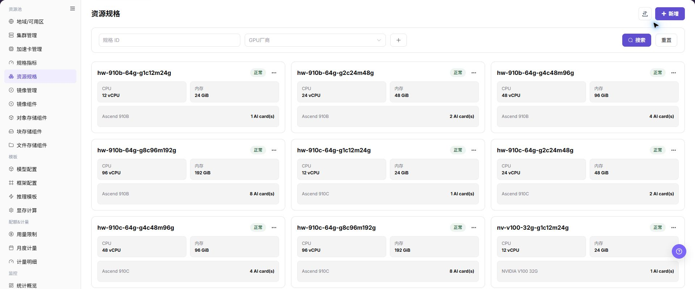
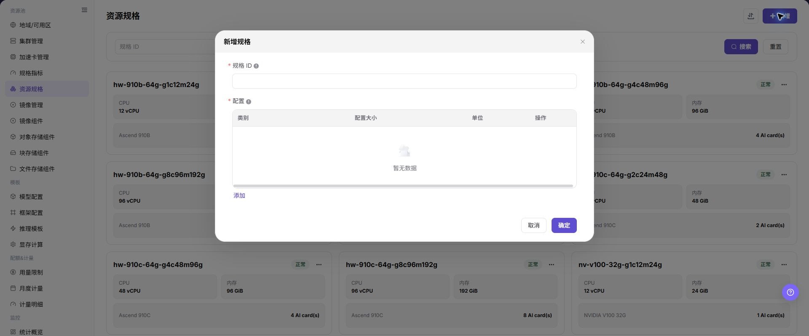

# 资源规格

## 功能概述

| 项目 | 内容 |
| --- | --- |
| 适用角色 | 运营管理员 |
| 导航路径 | AI基础设施 > On-Prem > 资源池 > 资源规格 |
| 页面路由 | `/powerone/resourcepool/flavor/list` |
| 管理对象 | 规格 ID、CPU、内存、加速卡、加速卡数量、规格指标、关联集群和启用状态 |

#### 新手理解

- **资源规格** 像资源套餐，用户创建作业或服务时选择它来申请资源。
- **规格指标** 像套餐里的资源项，先有 CPU、内存或加速卡指标，才能组合成规格。
- **关联集群** 决定规格在哪些集群可用；规格创建完成后还需要和集群资源能力匹配。

#### 术语表

| 术语 | 英文 | 说明 |
| --- | --- | --- |
| 规格 ID | Specification ID | Specification ID |
| CPU | CPU | CPU |
| 内存 | Memory | Memory |

#### 推荐操作顺序

先确认规格 ID、CPU、内存、加速卡、加速卡数量、规格指标、关联集群和启用状态的前置依赖，再按主要操作顺序处理，最后执行结果校验并进入后续页面。

#### 小白先看

先确认当前任务是否涉及规格 ID、CPU、内存、加速卡、加速卡数量、规格指标、关联集群和启用状态，再按照推荐顺序操作。页面字段或状态与预期不符时，先回到前置对象页核对依赖，不要跳过结果校验直接进入下游流程。

## 前提条件

1. 当前账号具备运营管理员权限，并能进入 `AI Infra > On-Prem > 资源池管理 > 资源规格`。
2. 已完成规格指标配置，CPU、内存和加速卡指标处于可用状态。
3. 如规格包含加速卡，已确认加速卡型号、k8s-key、selector-key 与集群节点实际上报资源一致。
4. 已规划规格命名、资源档位、适用作业类型和后续关联集群范围。

## 页面说明

页面用于查看和处理规格 ID、CPU、内存、加速卡、加速卡数量、规格指标、关联集群和启用状态。

上图保留左侧菜单和完整功能区；请先确认页面标题、筛选范围和主要操作入口。

页面展示规格 ID、状态、CPU、内存、加速卡类型和数量，可按 GPU 厂商筛选。

下图展示资源规格列表，卡片中可查看 CPU、内存和加速卡数量。

## 主要操作

### 查看资源规格

1. 进入 `资源池 > 资源规格`。
2. 按名称、资源类型、加速卡、状态或更新时间筛选。
3. 打开详情，核对 CPU、内存、加速卡、存储和适用场景。
4. 无结果时重置筛选；规格不匹配时检查指标和加速卡关联。

### 新增资源规格

#### 适用场景

当需要新增训练、推理、开发或模型服务资源档位，或需要按 CPU、内存、加速卡型号和卡数提供不同资源组合时，新增规格。

#### 操作步骤

1. 进入 `AI基础设施 > On-Prem > 资源池 > 资源规格`。
2. 点击 **"新增"** 或页面真实新增入口。
3. 填写规格 ID，建议体现 CPU、内存、加速卡型号、卡数和适用场景。
4. 选择 CPU、内存、加速卡等规格指标，并填写对应数量。
5. 如规格包含加速卡，核对加速卡指标、k8s-key、selector-key 与集群实际上报资源是否一致。
6. 点击最终 **"保存"**、**"提交"** 或 **"确定"** 前，再次核对规格资源组合、命名口径和后续集群关联影响。

下图展示新增规格弹窗，创建时应明确 CPU、内存和加速卡组合。

### 导入或导出资源规格

#### 适用场景

当需要批量维护资源规格，或导出规格组合供审计、核对和受控迁移时，使用 **"导入/导出"** 菜单。

#### 操作步骤

1. 进入 `AI基础设施 > On-Prem > 资源池 > 资源规格`。
2. 点击 **"导入/导出"**，按业务目的选择 **"导入"** 或 **"导出"**。
3. 导入时按页面要求上传文件，核对规格 ID、资源指标、数量、加速卡型号和适用场景。
4. 导出时确认筛选范围，再按页面提示生成并下载资源规格清单。
5. 导入前确认规格不会覆盖正在被集群关联或作业使用的错误定义；导出文件保存到受控目录。

#### 结果校验

- 导入成功后，资源规格列表显示新增或更新的规格组合。
- 导出文件的记录范围与当前筛选条件一致。
- 集群关联规格或作业创建页面可以正确识别导入后的规格。

#### 注意事项

- 规格 ID、指标数量和加速卡型号必须与实际集群资源能力一致，否则会造成规格匹配或调度异常。
- 导入可能更新同标识规格的字段，操作前核对集群关联、作业依赖和文件范围。

#### 导入的资源规格无法关联集群

**问题现象：**

资源规格导入完成，但集群详情中的规格关联列表找不到该规格。

**可能原因：**

- 规格处于不可用状态或仍在后台校验。
- 规格指标与集群上报资源不匹配。
- 规格所属范围或当前筛选条件不一致。

**处理方式：**

1. 在资源规格列表核对状态、规格 ID 和更新时间。
2. 到规格指标和加速卡页面核对指标、key 和型号。
3. 重置筛选后重新打开集群详情，确认规格可见范围。

#### 操作截图

上图展示操作入口打开后的字段和确认区域；提交前应核对必填项、所属范围和影响。

## 参数速查表

| 字段名称 | 是否必填 | 字段类型 | 示例 | 说明 |
| --- | --- | --- | --- | --- |
| 规格 ID | 必填 | 标识 / 文本 | `gpu-a100-1card` | 用户创建在线 IDE、运行实例、训练任务或模型服务时选择的规格 ID。 规格 ID 应体现 CPU、内存、加速卡型号、卡数和适用场景。 |
| CPU | 条件必填 | 数值 / 容量 | `16 vCPU` | 规格包含的 CPU 指标和数量。 与作业运行所需 CPU 资源匹配，避免过大或过小。 |
| 内存 | 条件必填 | 数值 / 容量 | `128 GiB` | 规格包含的内存指标和容量。 统一容量单位，避免展示口径与调度口径不一致。 |
| 加速卡 | 否 | 下拉 / 枚举 | `1 x A100` | 规格包含的 AI 加速卡类型或指标。 需与已维护的加速卡和规格指标保持一致。 |
| 加速卡数量 | 否 | 数值 / 容量 | `1 x A100` | 规格包含的加速卡卡数。 与集群节点实际上报资源和可调度容量匹配。 |
| 规格指标 | 必填 | 数值 / 容量 | `gpu-a100` | 资源规格引用的 CPU、内存、加速卡等指标。 指标的 k8s-key、selector-key 和单位应已校准。 |
| 关联集群 | 条件必填 | 下拉 / 枚举 | `cluster-a` | 规格可用的集群范围。 关联前核对集群地域、可用区和实际资源能力。 |
| 启用状态 | 否 | 状态 | `启用` | 控制规格是否可被后续流程选择。 对用户开放前先完成关联和测试验证。 |
| 操作 | 否 | 操作入口 | `编辑` | 支持新增、编辑、以此新增、启用、禁用或删除等操作。 高风险动作前确认影响范围和替代方案。 |

## 踩坑提示

- 新增规格会影响用户创建在线 IDE、运行实例、训练任务或模型服务时可选择的资源套餐。
- 规格过大可能导致排队时间增加；规格过小可能导致任务启动后资源不足。
- 规格指标、k8s-key、selector-key 错误可能导致规格不可选、调度失败或资源统计异常。
- `保存 / Save`、`提交 / Submit`、`确定 / OK` 属于高风险最终动作。
- 不写真实集群 ID、资源池 ID、节点标签、内部资源 key 映射、租户信息、账号、密钥、Token 或内部测试参数。

### 配置规则与影响

- **先指标后规格**：规格依赖规格指标，缺少指标时无法准确配置 CPU、内存或加速卡。
- **再关联集群**：规格创建后还需关联到集群，用户才可能选到。
- **资源组合一致**：规格中的 CPU、内存、加速卡数量应与集群可调度资源匹配。
- **命名可读**：规格 ID 应便于容量排查、用户选择和后续模板引用。
- **启停谨慎**：禁用或修改已开放规格前，先确认模板、租户配额和运行中实例影响。

## 结果校验

| 检查项 | 成功表现 | 异常时处理 |
| --- | --- | --- |
| 页面入口 | 可进入资源规格并看到目标操作入口 | 检查运营管理员权限和对应菜单是否已开放 |
| 对象记录 | 规格 ID、CPU、内存、加速卡、加速卡数量、规格指标、关联集群和启用状态在列表或详情中可见 | 重置筛选并核对名称、所属范围和创建结果 |
| 状态结果 | 新增或变更后的状态符合页面提示 | 查看操作提示、依赖对象状态和最近更新时间 |
| 下游使用 | 后续页面能够选择或关联目标对象 | 回到前置配置核对启用状态、归属关系和可见范围 |

## 常见问题

#### 资源规格中找不到目标对象

**问题现象：**

页面可进入，但没有看到预期的规格 ID、CPU、内存、加速卡、加速卡数量、规格指标、关联集群和启用状态。

**可能原因：**

- 筛选条件仍生效。
- 对象属于其他范围。
- 前置配置未完成。

**处理方式：**

1. 重置筛选
2. 核对所属地域或租户
3. 返回前置页面确认对象状态。

#### 资源规格的操作入口不可用

**问题现象：**

新增、注册或维护入口不可见或不可点击。

**可能原因：**

- 当前角色权限不足。
- 页面处于只读状态。
- 依赖对象不满足条件。

**处理方式：**

1. 检查运营管理员权限
2. 核对页面提示
3. 先完成依赖对象配置。

#### 资源规格的必填项没有可选值

**问题现象：**

表单能打开，但下拉框为空。

**可能原因：**

- 候选对象未启用。
- 所属范围不一致。
- 当前账号不可见。

**处理方式：**

1. 到候选对象页面核对状态
2. 确认归属关系
3. 检查可见范围后刷新表单。

#### 资源规格操作后状态异常

**问题现象：**

提交后记录存在，但状态不是预期值。

**可能原因：**

- 连通性或校验失败。
- 关联对象异常。
- 后台处理尚未完成。

**处理方式：**

1. 查看页面提示和更新时间
2. 检查关联对象
3. 按状态阶段排查处理任务。

#### 下游页面无法使用资源规格

**问题现象：**

当前页状态正常，但下游页面无法选择或关联规格 ID、CPU、内存、加速卡、加速卡数量、规格指标、关联集群和启用状态。

**可能原因：**

- 可见范围不匹配。
- 对象未启用。
- 下游缓存未刷新。

**处理方式：**

1. 核对启用状态和归属
2. 检查角色可见范围
3. 刷新下游页面并重新选择。

## 注意事项

- 资源规格一旦开放给用户，会直接影响模型实例、在线 IDE、运行实例和训练任务的创建选择。
- 修改规格 ID、资源数量或启停状态前，先确认关联集群、模板、租户配额和运行中实例。
- 大规格可能导致排队时间增加，小规格可能导致任务启动后资源不足，应结合监控和失败案例校准。

- 不写真实集群 ID、资源池 ID、节点标签、内部资源 key 映射、租户信息、账号、密钥、Token 或内部测试参数。

## 后续操作

1. 进入 `AI Infra > On-Prem > 资源池管理 > 集群管理`，为目标集群关联规格。
2. 提交测试作业、在线 IDE 或模型服务验证规格调度结果。
3. 回到资源规格列表确认启用状态、筛选结果和关联关系符合预期。
