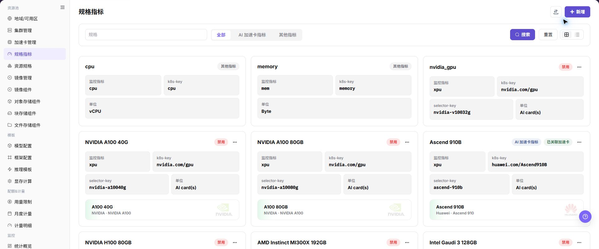
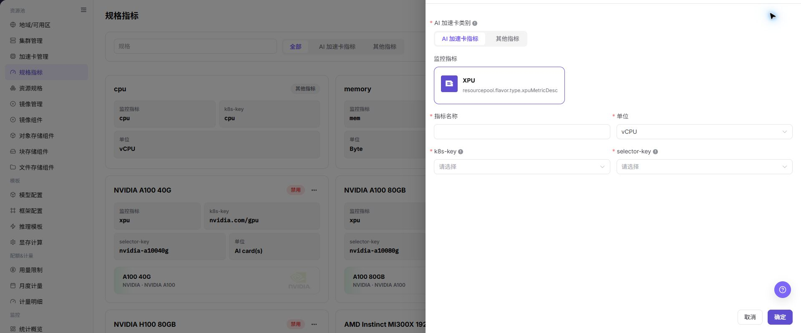

# 规格指标

## 功能概述

| 项目 | 内容 |
| --- | --- |
| 适用角色 | 运营管理员 |
| 导航路径 | AI基础设施 > On-Prem > 资源池 > 规格指标 |
| 页面路由 | `/powerone/resourcepool/flavor/type` |
| 管理对象 | 指标名称、指标类型、资源 key、单位、k8s-key、selector-key、监控指标和启用状态 |

#### 新手理解

规格指标像资源规格表里的计量单位。CPU、内存、GPU、显存等字段能否被正确识别、展示和统计，都依赖规格指标的定义。指标口径不统一时，用户看到的规格名称和实际调度资源就容易对不上。

#### 术语表

| 术语 | 英文 | 说明 |
| --- | --- | --- |
| 指标名称 | Metric Name | Metric Name |
| 指标类型 | Metric Type | Metric Type |
| 资源 key | Resource Key | Resource Key |

#### 推荐操作顺序

先确认指标名称、指标类型、资源 key、单位、k8s-key、selector-key、监控指标和启用状态的前置依赖，再按主要操作顺序处理，最后执行结果校验并进入后续页面。

#### 小白先看

先确认当前任务是否涉及指标名称、指标类型、资源 key、单位、k8s-key、selector-key、监控指标和启用状态，再按照推荐顺序操作。页面字段或状态与预期不符时，先回到前置对象页核对依赖，不要跳过结果校验直接进入下游流程。

## 前提条件

1. 当前账号具备运营管理员权限，并能进入 `AI Infra > On-Prem > 资源池管理 > 规格指标`。
2. 已确认目标集群资源上报口径，包括 k8s-key、selector-key、单位和监控指标映射。
3. 如需创建 AI 加速卡指标，已确认加速卡型号、节点标签和设备插件上报信息。
4. 已评估该指标是否会被资源规格、模板、作业调度或计量规则引用。

## 页面说明

页面用于查看和处理指标名称、指标类型、资源 key、单位、k8s-key、selector-key、监控指标和启用状态。

上图保留左侧菜单和完整功能区；请先确认页面标题、筛选范围和主要操作入口。

页面以卡片形式展示已配置指标，可按指标名称、AI 加速卡指标和其他指标筛选。

下图展示规格指标列表，可查看监控指标、k8s-key、selector-key 和单位。

## 主要操作

### 查看规格指标

1. 进入 `资源池 > 规格指标`。
2. 按名称、类型、单位、状态或更新时间筛选。
3. 打开详情，核对数据类型、单位、范围、默认值和引用规格。
4. 无结果时重置筛选；单位或范围不一致时先检查引用关系。

### 新增规格指标

#### 适用场景

当需要新增硬件资源类型、维护 CPU/内存指标，或把 AI 加速卡接入资源规格和作业调度时，新增规格指标。

#### 操作步骤

1. 进入 `AI基础设施 > On-Prem > 资源池 > 规格指标`。
2. 点击 **"新增"** 或页面真实新增入口。
3. 选择指标类型，例如 CPU、内存、AI 加速卡指标或页面提供的其他指标类型。
4. 按页面字段选择 AI 加速卡类别、AI 加速卡指标或其他指标，并填写指标名称、单位、k8s-key 和 selector-key。
5. 如为 AI 加速卡指标，核对 selector-key 与集群节点实际上报标签是否一致。
6. 点击最终 **"保存"**、**"提交"** 或 **"确定"** 前，再次核对指标口径、单位、k8s-key 和 selector-key。

下图展示新增规格指标抽屉，AI 加速卡指标需要维护 k8s-key 和 selector-key。

### 导入或导出规格指标

#### 适用场景

当需要批量维护规格指标，或导出当前指标定义供审计、核对和受控迁移时，使用 **"导入/导出"** 菜单。

#### 操作步骤

1. 进入 `AI基础设施 > On-Prem > 资源池 > 规格指标`。
2. 点击 **"导入/导出"**，按业务目的选择 **"导入"** 或 **"导出"**。
3. 导入时按页面要求上传文件，核对指标类型、名称、单位、k8s-key 和 selector-key。
4. 导出时先确认筛选范围，再按页面提示生成并下载指标清单。
5. 提交导入前确认不会覆盖正在被资源规格引用的错误指标；导出文件保存到受控目录。

#### 结果校验

- 导入成功后，规格指标列表显示新增或更新的指标定义。
- 导出文件中的指标范围与当前筛选条件一致。
- 资源规格页面可以正确引用导入后的指标。

#### 注意事项

- 单位、k8s-key 和 selector-key 会影响资源上报、规格匹配和调度，不能只按显示名称判断是否相同。
- 导入前核对唯一标识和引用关系，避免覆盖正在使用的指标定义。

#### 导入的规格指标无法被资源规格引用

**问题现象：**

指标导入完成，但创建或编辑资源规格时找不到该指标。

**可能原因：**

- 指标状态未启用或仍在校验。
- 指标类型、单位或唯一标识不匹配。
- 当前账号或资源规格所属范围不可见。

**处理方式：**

1. 在规格指标列表核对状态、类型、单位和更新时间。
2. 对照资源规格的指标类型和资源 key 重新检查导入文件。
3. 确认指标可见范围后刷新资源规格表单。

#### 操作截图

上图展示操作入口打开后的字段和确认区域；提交前应核对必填项、所属范围和影响。

## 参数速查表

| 字段名称 | 是否必填 | 字段类型 | 示例 | 说明 |
| --- | --- | --- | --- | --- |
| AI 加速卡类别 | 条件必填 | 下拉 / 枚举 | `1 x A100` | 新增 AI 加速卡指标时选择的类别。 与加速卡管理中的硬件分类保持一致。 |
| AI 加速卡指标 | 条件必填 | 下拉 / 枚举 | `1 x A100` | 新增 AI 加速卡规格指标时选择的指标类型。 用于区分加速卡类指标。 |
| 其他指标 | 条件必填 | 数值 / 容量 | `CPU` | CPU、内存或页面支持的非加速卡指标。 与资源规格展示和调度口径一致。 |
| 指标名称 | 必填 | 文本 | `示例名称` | 规格指标在页面中的展示名称。 命名应能表达资源类型和单位。 |
| 单位 | 必填 | 文本 | `GiB` | 指标展示或计量单位。 与容量统计和资源规格页面保持一致。 |
| k8s-key | 条件必填 | 数值 / 容量 | `nvidia.com/gpu` | Kubernetes 调度资源 key。 必须与 Kubernetes 节点实际上报资源 key 一致。 |
| selector-key | 条件必填 | 下拉 / 枚举 | `accelerator` | 加速卡型号、节点标签或设备筛选 key。 必须与加速卡型号或节点标签一致。 |

## 踩坑提示

- 新增规格指标会影响资源规格、作业调度、监控展示和计量口径。
- k8s-key 必须与 Kubernetes 节点实际上报资源 key 一致，否则作业可能申请不到资源。
- selector-key 必须与加速卡型号或节点标签一致，否则 AI 加速卡指标可能无法正确匹配设备。
- 指标单位错误可能导致规格展示、容量统计或模板推荐偏差。
- 已被资源规格引用的指标禁用或删除前，应确认规格、模板和运行作业影响范围。

### 配置规则与影响

- **指标先于规格**：资源规格必须引用已存在且可用的规格指标。
- **k8s-key 一致性**：以 Kubernetes 节点实际上报 key 为准，不以页面显示名称为准。
- **selector-key 一致性**：AI 加速卡指标的 selector-key 应与加速卡型号或节点标签一致。
- **单位一致性**：内存、显存、磁盘等容量类指标应统一 GiB、GB 或平台约定口径。
- **禁用影响**：禁用指标可能影响资源规格、模板推荐、作业创建和计量统计。
- **监控影响**：监控指标映射错误会导致资源监控展示异常或容量统计偏差。

## 结果校验

| 检查项 | 成功表现 | 异常时处理 |
| --- | --- | --- |
| 页面入口 | 可进入规格指标并看到目标操作入口 | 检查运营管理员权限和对应菜单是否已开放 |
| 对象记录 | 指标名称、指标类型、资源 key、单位、k8s-key、selector-key、监控指标和启用状态在列表或详情中可见 | 重置筛选并核对名称、所属范围和创建结果 |
| 状态结果 | 新增或变更后的状态符合页面提示 | 查看操作提示、依赖对象状态和最近更新时间 |
| 下游使用 | 后续页面能够选择或关联目标对象 | 回到前置配置核对启用状态、归属关系和可见范围 |

## 常见问题

#### 规格指标中找不到目标对象

**问题现象：**

页面可进入，但没有看到预期的指标名称、指标类型、资源 key、单位、k8s-key、selector-key、监控指标和启用状态。

**可能原因：**

- 筛选条件仍生效。
- 对象属于其他范围。
- 前置配置未完成。

**处理方式：**

1. 重置筛选
2. 核对所属地域或租户
3. 返回前置页面确认对象状态。

#### 规格指标的操作入口不可用

**问题现象：**

新增、注册或维护入口不可见或不可点击。

**可能原因：**

- 当前角色权限不足。
- 页面处于只读状态。
- 依赖对象不满足条件。

**处理方式：**

1. 检查运营管理员权限
2. 核对页面提示
3. 先完成依赖对象配置。

#### 规格指标的必填项没有可选值

**问题现象：**

表单能打开，但下拉框为空。

**可能原因：**

- 候选对象未启用。
- 所属范围不一致。
- 当前账号不可见。

**处理方式：**

1. 到候选对象页面核对状态
2. 确认归属关系
3. 检查可见范围后刷新表单。

#### 规格指标操作后状态异常

**问题现象：**

提交后记录存在，但状态不是预期值。

**可能原因：**

- 连通性或校验失败。
- 关联对象异常。
- 后台处理尚未完成。

**处理方式：**

1. 查看页面提示和更新时间
2. 检查关联对象
3. 按状态阶段排查处理任务。

#### 下游页面无法使用规格指标

**问题现象：**

当前页状态正常，但下游页面无法选择或关联指标名称、指标类型、资源 key、单位、k8s-key、selector-key、监控指标和启用状态。

**可能原因：**

- 可见范围不匹配。
- 对象未启用。
- 下游缓存未刷新。

**处理方式：**

1. 核对启用状态和归属
2. 检查角色可见范围
3. 刷新下游页面并重新选择。

## 注意事项

- 新增规格指标会影响资源规格、作业调度、监控展示和计量口径。
- k8s-key、selector-key、单位和监控指标映射必须按真实集群和平台口径维护。
- 已被规格引用的指标不要直接删除，先迁移规格并验证作业调度。
- `保存`、`提交`、`确定` 属于高风险最终动作。
- 不写真实内部资源 key 映射、节点标签、集群 ID、资源池 ID、内网地址、账号、密钥、Token 或内部测试参数。

## 后续操作

1. 进入 `资源池管理 > 资源规格` 创建或调整规格。
2. 进入 `资源池管理 > 加速卡管理` 确认加速卡型号关联关系。
3. 在测试作业中验证指标对应资源能被正常申请。
4. 回到规格指标列表确认启用状态、单位和筛选结果符合预期。
