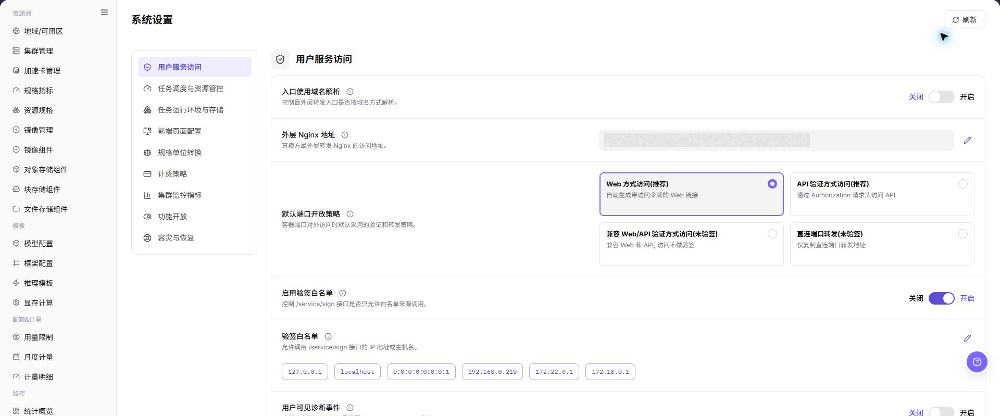
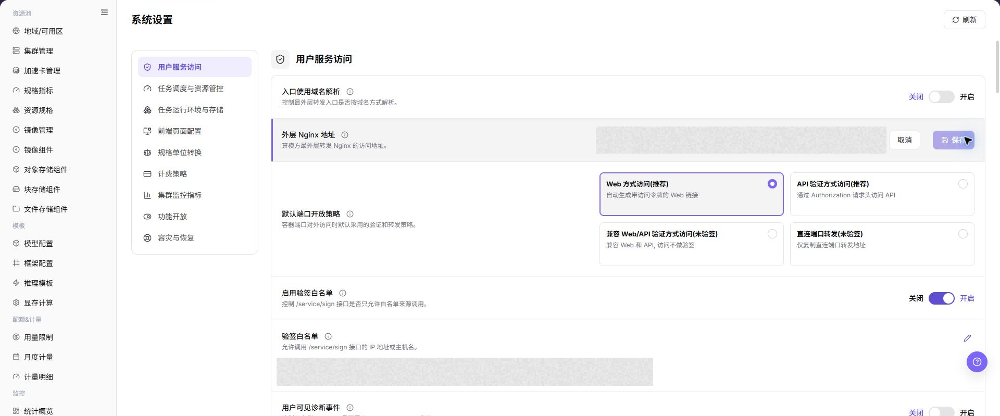

# 系统设置

## 功能概述

| 项目 | 内容 |
| --- | --- |
| 适用角色 | 运营管理员 |
| 导航路径 | AI基础设施 > On-Prem > 系统 > 系统设置 |
| 页面路由 | `/powerone/system/config-properties` |
| 管理对象 | 系统配置项、配置值、说明、状态和操作入口 |

#### 新手理解

系统设置像平台的全局配置清单。这里的配置可能影响多个模块的默认行为、可用能力或展示逻辑，因此学习和截图时应以查看为主，不直接提交修改。

#### 术语表

| 术语 | 英文 | 说明 |
| --- | --- | --- |
| 配置项 | Configuration Item | Configuration Item |
| 配置值 | Configuration Value | Configuration Value |
| 状态 | Status | Status |

#### 推荐操作顺序

先确认系统配置项、配置值、说明、状态和操作入口的前置依赖，再按主要操作顺序处理，最后执行结果校验并进入后续页面。

#### 小白先看

先确认当前任务是否涉及系统配置项、配置值、说明、状态和操作入口，再按照推荐顺序操作。页面字段或状态与预期不符时，先回到前置对象页核对依赖，不要跳过结果校验直接进入下游流程。

## 前提条件

1. 当前账号具备运营管理员权限。
2. 已进入正确的 On-Prem 环境和目标地域。
3. 已确认本次仅查看系统设置，或已具备对应变更审批。

## 页面说明

页面用于查看和处理系统配置项、配置值、说明、状态和操作入口。

上图保留左侧菜单和完整功能区；请先确认页面标题、筛选范围和主要操作入口。

进入 `AI Infra > On-Prem > 系统 > 系统设置` 后，页面用于展示系统级配置项。列表通常用于查看配置项名称、配置值、说明、状态以及可能存在的操作入口。

如果页面提供 `编辑`、`保存`、`提交`、`确定` 等按钮，仅打开到字段查看层面，不执行最终动作。

## 主要操作

### 查看当前系统配置

1. 进入 `系统 > 系统设置`。
2. 按配置分组查看调度、存储、镜像、告警或其他系统参数。
3. 核对当前值、来源、生效范围和更新时间。
4. 不记录或外发密码、Token、内部 Endpoint 和密钥类配置。

### 查看系统设置

#### 操作前确认

1. 确认当前环境、账号和地域符合查看目标。
2. 确认本次只查看配置，不修改真实配置值。
3. 如需要进入编辑弹窗或抽屉，只记录字段名称、按钮和提示信息，不记录真实配置值。

#### 操作步骤

1. 进入 `AI基础设施 > On-Prem > 系统 > 系统设置`。
2. 查看系统配置列表，确认页面路由为 `/powerone/system/config-properties`。
3. 查看配置项名称、配置值、说明、状态或操作入口。
4. 如页面提供搜索、筛选、刷新、展开、详情等查看类按钮，可用于缩小查看范围。
5. 如页面提供 `编辑` 或类似维护入口，只打开查看字段，不填写真实配置值。
6. 点击最终 **"保存"**、**"提交"** 或 **"确定"** 前必须停止，并再次确认变更审批、影响范围和回滚方案。

##### 用户服务访问

1. 进入 `AI基础设施 > On-Prem > 系统 > 系统设置`。
2. 定位 `用户服务访问` 配置分组。
3. 查看配置项名称、配置值、说明、状态和操作入口。

##### 任务调度与资源管控

1. 进入 `AI基础设施 > On-Prem > 系统 > 系统设置`。
2. 定位 `任务调度与资源管控` 配置分组。
3. 查看配置项名称、配置值、说明、状态和操作入口。

##### 任务运行环境与存储

1. 进入 `AI基础设施 > On-Prem > 系统 > 系统设置`。
2. 定位 `任务运行环境与存储` 配置分组。
3. 查看配置项名称、配置值、说明、状态和操作入口。

##### 前端页面配置

::: details 补充截图文件

:::

1. 进入 `AI基础设施 > On-Prem > 系统 > 系统设置`。
2. 定位 `前端页面配置` 配置分组。
3. 查看配置项名称、配置值、说明、状态和操作入口。

##### 规格单位转换

::: details 补充截图文件

:::

1. 进入 `AI基础设施 > On-Prem > 系统 > 系统设置`。
2. 定位 `规格单位转换` 配置分组。
3. 查看配置项名称、配置值、说明、状态和操作入口。

##### 计费策略

1. 进入 `AI基础设施 > On-Prem > 系统 > 系统设置`。
2. 定位 `计费策略` 配置分组。
3. 查看配置项名称、配置值、说明、状态和操作入口。

##### 集群监控指标

1. 进入 `AI基础设施 > On-Prem > 系统 > 系统设置`。
2. 定位 `集群监控指标` 配置分组。
3. 查看配置项名称、配置值、说明、状态和操作入口。

##### 功能开放

1. 进入 `AI基础设施 > On-Prem > 系统 > 系统设置`。
2. 定位 `功能开放` 配置分组。
3. 查看配置项名称、配置值、说明、状态和操作入口。

##### 容灾与恢复

1. 进入 `AI基础设施 > On-Prem > 系统 > 系统设置`。
2. 定位 `容灾与恢复` 配置分组。
3. 查看配置项名称、配置值、说明、状态和操作入口。

### 编辑系统设置

#### 适用场景

当系统设置中的可编辑配置需要调整，且已完成变更审批、影响评估和回滚准备时，编辑系统设置。

#### 操作步骤

1. 进入 `AI基础设施 > On-Prem > 系统 > 系统设置`。
2. 定位目标配置分组，在页面提供的配置项操作区点击 **"编辑"**。
3. 核对配置项名称、当前值、说明、生效范围和依赖关系，仅修改已批准的字段。
4. 点击 **"保存"** 或 **"确定"** 前，复核调度、存储、镜像、计费、监控或功能开放影响。
5. 提交后刷新页面，核对配置值、状态、更新时间和下游服务表现。

#### 结果校验

- 配置列表或详情显示新的配置值、状态和更新时间。
- 受影响的用户服务、任务调度、资源管控或页面功能按变更预期生效。
- 未涉及的配置分组和敏感配置没有被误修改。

#### 注意事项

- 系统设置属于全局配置，修改可能影响多个租户、任务或服务；没有审批、回滚方案或影响窗口时不要提交。
- 配置值、访问令牌、密码、内部地址和密钥类内容不得写入文档、截图、工单或聊天记录。

#### 系统设置保存后服务行为异常

**问题现象：**

系统设置显示保存成功，但用户服务访问、任务调度、存储或监控行为与预期不一致。

**可能原因：**

- 配置值格式或单位不符合页面要求。
- 修改的配置分组或生效范围不是目标对象。
- 下游服务缓存未刷新，或依赖服务未完成重载。

**处理方式：**

1. 返回配置分组核对新值、说明、生效范围和更新时间。
2. 检查受影响服务的状态、日志或页面提示。
3. 按回滚方案恢复上一版已验证配置，并重新确认服务状态。

#### 操作截图

上图展示操作入口打开后的字段和确认区域；提交前应核对必填项、所属范围和影响。

## 参数速查表

| 字段名称 | 是否必填 | 字段类型 | 示例 | 说明 |
| --- | --- | --- | --- | --- |
| 配置项名称 | 视配置项而定 | 系统字段 | `示例名称` | 标识系统级配置项。 |
| 配置值 | 视配置项而定 | 文本 / 开关 / 枚举 / 数值 | `true` | 当前配置项使用的值，不应在文档或截图中写入真实敏感值。 |
| 说明 | 视配置项而定 | 文本 | `功能开关说明` | 描述配置项用途和影响范围。 |
| 状态 | 视配置项而定 | 状态 | `启用` | 展示配置项是否启用、可用或生效。 |
| 操作 | 视配置项而定 | 操作入口 | `编辑` | 查看、编辑或维护配置项的入口。 |

## 踩坑提示

- 系统设置可能影响全局平台行为，修改前必须确认影响范围。

- 功能开放、计费策略、容灾恢复、调度与资源管控配置错误，可能影响用户访问、任务调度、计费结果和恢复能力。
- 不写真实配置值、Token、AK/SK、内部 Endpoint、租户信息、账号、密钥或测试参数。
- 如果配置项涉及认证、网络、计费、调度或资源治理，修改前需要通过内部变更流程确认。
- 只读学习时可以查看字段和弹窗，但不要输入真实值或触发最终提交。

## 结果校验

| 检查项 | 成功表现 | 异常时处理 |
| --- | --- | --- |
| 页面入口 | 可进入系统设置并看到目标操作入口 | 检查运营管理员权限和对应菜单是否已开放 |
| 对象记录 | 系统配置项、配置值、说明、状态和操作入口在列表或详情中可见 | 重置筛选并核对名称、所属范围和创建结果 |
| 状态结果 | 新增或变更后的状态符合页面提示 | 查看操作提示、依赖对象状态和最近更新时间 |
| 下游使用 | 后续页面能够选择或关联目标对象 | 回到前置配置核对启用状态、归属关系和可见范围 |

## 常见问题

#### 系统设置中找不到目标对象

**问题现象：**

页面可进入，但没有看到预期的系统配置项、配置值、说明、状态和操作入口。

**可能原因：**

- 筛选条件仍生效。
- 对象属于其他范围。
- 前置配置未完成。

**处理方式：**

1. 重置筛选
2. 核对所属地域或租户
3. 返回前置页面确认对象状态。

#### 系统设置的操作入口不可用

**问题现象：**

新增、注册或维护入口不可见或不可点击。

**可能原因：**

- 当前角色权限不足。
- 页面处于只读状态。
- 依赖对象不满足条件。

**处理方式：**

1. 检查运营管理员权限
2. 核对页面提示
3. 先完成依赖对象配置。

#### 系统设置的必填项没有可选值

**问题现象：**

表单能打开，但下拉框为空。

**可能原因：**

- 候选对象未启用。
- 所属范围不一致。
- 当前账号不可见。

**处理方式：**

1. 到候选对象页面核对状态
2. 确认归属关系
3. 检查可见范围后刷新表单。

#### 系统设置操作后状态异常

**问题现象：**

提交后记录存在，但状态不是预期值。

**可能原因：**

- 连通性或校验失败。
- 关联对象异常。
- 后台处理尚未完成。

**处理方式：**

1. 查看页面提示和更新时间
2. 检查关联对象
3. 按状态阶段排查处理任务。

#### 下游页面无法使用系统设置

**问题现象：**

当前页状态正常，但下游页面无法选择或关联系统配置项、配置值、说明、状态和操作入口。

**可能原因：**

- 可见范围不匹配。
- 对象未启用。
- 下游缓存未刷新。

**处理方式：**

1. 核对启用状态和归属
2. 检查角色可见范围
3. 刷新下游页面并重新选择。

## 注意事项

- 系统设置属于平台级配置入口，不应作为普通页面随意修改。
- 系统设置会影响平台全局行为，正式变更前应确认影响范围、审批记录和回滚方案。
- 文档、截图或工单中不要写入真实配置值、密钥、Token、内部 Endpoint、账号或租户信息。
- 对外传递页面信息前，应先对配置值和内部标识做脱敏处理。

## 后续操作

1. 如发现配置缺失，先记录配置项名称和页面位置，再走内部确认流程。
2. 如需要修改配置，先确认影响范围、审批记录和回滚方案。
3. 修改后应回到受影响模块验证页面、任务或服务行为是否符合预期。
