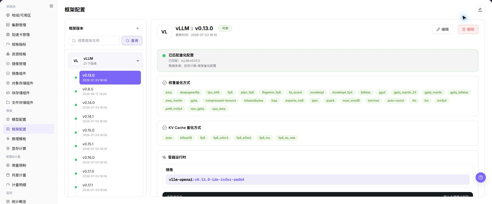
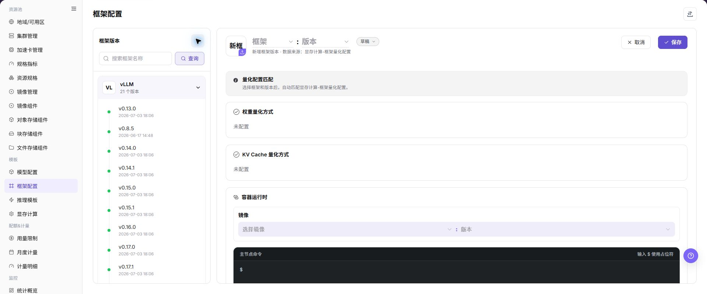

# 框架配置

## 功能概述

| 项目 | 内容 |
| --- | --- |
| 适用角色 | 运营管理员 |
| 导航路径 | AI基础设施 > On-Prem > 模板 > 框架配置 |
| 页面路由 | `/powerone/fast-build-v2/frameworks` |
| 管理对象 | 框架名称、版本名称、镜像、主节点启动命令、子节点启动命令、扩展参数、环境变量、端口开放策略、端口标签和成功创建提示 |

#### 新手理解

框架配置像模型服务的标准启动手册：先写清使用哪个容器镜像、主节点和子节点分别执行什么启动命令、开放哪些端口、注入哪些环境变量，以及创建成功后给用户展示什么提示。后续用户通过推理模板部署模型时，平台会按这份配置自动组装运行环境。

#### 术语表

| 术语 | 英文 | 说明 |
| --- | --- | --- |
| 框架配置 | Framework Configuration | Framework Configuration |
| 框架名称 | Framework Name | Framework Name |
| 版本名称 | Version Name | Version Name |

#### 推荐操作顺序

先确认框架名称、版本名称、镜像、主节点启动命令、子节点启动命令、扩展参数、环境变量、端口开放策略、端口标签和成功创建提示的前置依赖，再按主要操作顺序处理，最后执行结果校验并进入后续页面。

#### 小白先看

先确认当前任务是否涉及框架名称、版本名称、镜像、主节点启动命令、子节点启动命令、扩展参数、环境变量、端口开放策略、端口标签和成功创建提示，再按照推荐顺序操作。页面字段或状态与预期不符时，先回到前置对象页核对依赖，不要跳过结果校验直接进入下游流程。

## 前提条件

1. 框架镜像已准备，并能被目标地域和目标集群拉取。
2. 已明确框架支持的模型类型、量化方式、端口、主节点启动命令和子节点启动命令。
3. 已规划扩展参数、环境变量、端口开放策略、端口标签和成功创建提示。
4. 已确认启动命令、环境变量、扩展参数和提示文本不会泄露真实密钥、token、AK/SK、私钥或内部下载地址。
5. 当前账号具备模板管理权限。

## 页面说明

页面用于查看和处理框架名称、版本名称、镜像、主节点启动命令、子节点启动命令、扩展参数、环境变量、端口开放策略、端口标签和成功创建提示。

上图保留左侧菜单和完整功能区；请先确认页面标题、筛选范围和主要操作入口。

页面展示框架配置列表，可维护框架基础信息、镜像版本、启动命令和配置参数。

## 主要操作

### 查看框架配置

1. 进入对应模板配置页面，按名称、版本、状态或更新时间筛选。
2. 打开详情，核对关联模型、框架、镜像、资源要求和当前版本。
3. 无结果时重置筛选；版本不兼容时先确认依赖关系。
4. 内部镜像、存储位置和启动配置外发前必须脱敏。

### 添加框架或版本

#### 操作前确认

1. 已确认框架所需容器镜像、基础依赖和镜像所在地域。
2. 已确认主节点启动命令、子节点启动命令和单节点场景下的启动方式。
3. 已确认服务端口、端口开放策略、端口标签和访问认证方式。
4. 已确认扩展参数、环境变量和占位符均使用脱敏值。
5. 已确认框架适配的模型类型、推理协议和资源规格。

#### 操作步骤

1. 进入 `AI基础设施 > On-Prem > 模板 > 框架配置`。
2. 点击 **"新增"**、**"添加框架"** 或页面真实新增入口。
3. 在基础信息区域填写框架名称、版本名称、描述和支持场景。
4. 选择或填写框架镜像，确认镜像所在地域、目标集群和镜像仓库拉取权限。
5. 配置主节点启动命令和子节点启动命令，确认命令以前台进程运行。
6. 按页面要求维护扩展参数、环境变量和占位符引用。
7. 配置服务端口、端口开放策略、端口标签和健康检查。
8. 配置成功创建提示，说明访问方式和后续操作，但不写真实凭据或内部地址。
9. 点击最终 **"保存"**、**"提交"** 或 **"确定"** 前，再次核对镜像、启动命令、端口、认证策略和地域可用性。

下图展示添加框架/版本页面，用于填写基础信息、运行配置、端口策略和提示信息。

### 导入或导出框架

#### 适用场景

当需要批量维护框架配置，或导出框架定义供审计、核对和受控迁移时，使用 **"导入/导出"** 菜单。

#### 操作步骤

1. 进入 `AI基础设施 > On-Prem > 模板 > 框架配置`。
2. 点击 **"导入/导出"**，按业务目的选择 **"导入"** 或 **"导出"**。
3. 导入时按页面要求上传文件，核对框架、版本、镜像、启动命令、端口策略和参数配置。
4. 导出时确认框架或版本筛选范围，再按页面提示生成并下载框架配置。
5. 导入前确认目标环境的镜像、地域、端口和模型依赖可用；导出文件保存到受控目录。

#### 结果校验

- 导入成功后，框架配置列表显示新增或更新的框架版本。
- 导出文件中的框架范围与当前筛选条件一致。
- 推理模板或部署页面可以正确解析导入后的框架版本和端口配置。

#### 注意事项

- 启动命令、镜像和端口配置必须与实际运行环境一致，导入前核对前台启动、健康检查和访问策略。
- 导入可能更新同标识框架版本的字段，执行前确认已关联模板和实例的影响。

#### 导入的框架无法被推理模板使用

**问题现象：**

框架导入完成，但推理模板或部署页面找不到该框架版本。

**可能原因：**

- 框架镜像、地域或端口配置在目标环境不可用。
- 框架版本状态或可见范围不允许下游选择。
- 导入文件中的框架或版本标识与依赖引用不一致。

**处理方式：**

1. 打开框架详情核对版本、镜像、地域、端口和状态。
2. 到镜像管理、地域/可用区和推理模板页面确认依赖关系。
3. 对照页面要求修正标识或可见范围后再导入。

### 编辑框架版本

#### 适用场景

当已有框架版本的镜像、启动参数、端口或描述需要调整时，编辑框架版本。

#### 操作步骤

1. 进入 `AI基础设施 > On-Prem > 模板 > 框架配置`，定位目标框架版本。
2. 点击目标行的 **"编辑"**，核对框架和版本标识。
3. 按页面提供的字段修改可编辑配置，重点复核镜像、启动命令、端口和访问策略。
4. 点击最终 **"保存"** 或 **"确定"** 前，确认变更不会影响已引用模板和运行实例。
5. 返回列表，核对更新后的版本信息和状态。

#### 结果校验

- 框架列表显示更新后的版本配置和更新时间。
- 推理模板可以读取更新后的框架配置。
- 端口、健康检查和启动参数仍与运行环境匹配。

#### 注意事项

- 修改启动命令、镜像或端口可能导致新实例启动失败，先安排兼容性验证和回滚方案。
- 不要在环境变量、扩展参数或创建提示中写入真实凭据或内部地址。

#### 编辑框架版本后实例启动失败

**问题现象：**

框架配置保存成功，但新实例无法启动或健康检查失败。

**可能原因：**

- 镜像缺少依赖或无法拉取。
- 启动命令没有以前台进程运行。
- 服务端口、端口策略或健康检查与程序实际配置不一致。

**处理方式：**

1. 对照框架详情核对镜像、启动命令、端口和健康检查。
2. 到镜像管理和地域页面确认镜像可用、网络可达。
3. 根据变更审批恢复已验证版本，并重新进行启动验证。

### 删除框架版本

#### 适用场景

当某个框架版本不再使用，且已确认没有推理模板、实例或作业依赖时，删除框架版本。

#### 操作步骤

1. 进入 `AI基础设施 > On-Prem > 模板 > 框架配置`，定位目标框架版本。
2. 点击目标行的 **"删除"**。
3. 阅读确认提示，核对框架、版本、镜像、端口和下游引用。
4. 确认替代版本和影响范围后，点击确认按钮完成删除。
5. 刷新列表并检查推理模板和部署页面的框架选择范围。

#### 结果校验

- 目标框架版本从框架配置列表中移除。
- 下游模板和新实例配置不再提供该版本。
- 其他框架版本、镜像和已运行实例未被误删。

#### 注意事项

- 删除框架版本配置不等于删除镜像仓库中的镜像；按依赖和数据保留策略分别处理。
- 被模板或运行实例引用的版本不能直接删除，先完成迁移或解除引用。

#### 框架版本删除失败

**问题现象：**

点击 **"删除"** 后操作失败，或页面提示存在关联对象。

**可能原因：**

- 推理模板、实例或作业仍引用该版本。
- 当前账号缺少删除权限。
- 页面仍在处理其他框架任务。

**处理方式：**

1. 到推理模板和部署页面检查版本引用。
2. 核对当前账号权限和框架任务状态。
3. 完成迁移或解除引用后，再按审批结果执行删除。

### 维护框架端口

#### 适用场景

当框架版本的服务端口、开放策略或端口标签需要调整，或不再需要某个端口时，维护框架端口。

#### 操作步骤

1. 进入 `AI基础设施 > On-Prem > 模板 > 框架配置`，定位目标框架版本并点击 **"编辑"**。
2. 在端口配置区域核对服务端口、开放策略、端口标签和健康检查。
3. 不再使用端口时，点击页面对应端口的 **"删除端口"**，核对端口号和影响范围。
4. 点击最终 **"保存"** 或 **"确定"** 前，确认模板、实例和访问入口不会失效。
5. 返回框架详情，核对端口列表和访问策略。

#### 结果校验

- 框架详情显示更新后的端口、开放策略和标签。
- 健康检查和后续访问入口使用正确端口。
- 依赖该端口的模板或实例没有出现新的配置缺失。

#### 注意事项

- 删除或修改端口会影响服务探活、路由和访问方式，先确认已有实例和调用方的迁移安排。
- 未验签或直连端口策略会扩大暴露范围，仅在明确的网络边界内使用。

#### 删除端口后访问入口不可用

**问题现象：**

端口维护完成后，服务访问入口失效或健康检查持续失败。

**可能原因：**

- 应用实际监听端口与配置不一致。
- 端口开放策略或标签被改动。
- 依赖模板或实例没有刷新到新端口配置。

**处理方式：**

1. 核对框架启动命令、服务端口和健康检查路径。
2. 检查端口开放策略、标签和网络访问规则。
3. 到模板或实例详情确认引用已更新，必要时按审批恢复原端口。

#### 操作截图

上图展示操作入口打开后的字段和确认区域；提交前应核对必填项、所属范围和影响。

## 参数速查表

| 字段名称 | 是否必填 | 字段类型 | 示例 | 说明 |
| --- | --- | --- | --- | --- |
| 框架名称 | 必填 | 文本 | `示例名称` | 底层使用的推理框架或引擎名称。 建议采用官方框架命名，便于识别和技术对接。 |
| 版本名称 | 必填 | 文本 | `示例名称` | 框架配置的版本标识，用于跟踪迭代或兼容性管理。 可与底层框架版本号对齐，也可使用内部场景命名。 |
| 镜像 | 必填 | 文本 | `<BASE_URL>/<PROJECT>/<IMAGE>:<TAG>` | 运行推理任务所需的容器镜像。 使用占位说明即可，不写真实镜像仓库地址。 |
| 镜像地域 | 条件必填 | 下拉 / 枚举 | `wuhan` | 镜像所在地域或可拉取范围。 与目标地域、集群网络和镜像仓库权限保持一致。 |
| 主节点启动命令 | 必填 | 配置文本 | `python -m vllm.entrypoints.openai.api_server` | 任务集群中主节点的启动命令；单节点任务时直接作为该节点启动命令。 命令必须以前台进程运行，避免容器启动后立即退出。 |
| 子节点启动命令 | 分布式场景必填 | 配置文本 | `python worker.py` | Worker 节点的启动命令，适用于分布式推理。 与主节点通信方式、调度拓扑和框架版本匹配。 |
| 扩展参数 | 否 | 配置文本 | `--max-model-len 8192` | 动态补充或调整启动命令的参数，可通过占位符注入命令。 不写真实 Token、AK/SK、私钥、密码或内部地址。 |
| 环境变量 | 否 | 配置文本 | `ENV=prod` | 容器启动时注入的预设环境变量。 只填写非敏感变量，敏感值使用平台凭据或 Secret 机制。 |
| 服务端口 | 必填 | 端口 / 数值 | `8000` | 平台探测、路由或暴露服务时使用的监听端口。 必须与框架实际监听端口一致。 |
| 端口开放策略 | 条件必填 | 端口 / 数值 | `api验证方式访问` | 端口的默认公开暴露方式及访问认证机制。 面向外部或跨租户访问时不要选择无认证策略。 |
| 端口标签 | 否 | 端口 / 数值 | `OpenAI API Port` | 用于标识端口协议类型或用途。 系统预定义标签可生成对应访问帮助文档。 |
| 健康检查 | 条件必填 | 地址 / 路径 | `/health` | 用于判断框架服务是否启动成功的路径或命令。 与实际服务路径、端口和启动时延匹配。 |
| 成功创建提示 | 否 | 开关 | `服务已创建` | 任务集群创建完成后展示给用户的提示信息，支持 Markdown 和占位符。 可写访问方式和后续操作，不写真实凭据或内部 Endpoint。 |
| 参数占位符 | 否 | 配置文本 | `${modelName}` | 启动命令、扩展参数和成功创建提示中可引用的变量。 使用平台支持的占位符名称，避免手写不存在的变量。 |
| 操作 | 系统生成 | 操作入口 | `编辑` | 新增、编辑、保存、提交、确定等页面操作。 `保存`、`提交`、`确定` 属于高风险最终动作。 |

#### 端口开放策略和端口标签

| 配置项 | 取值 | 说明 |
| --- | --- | --- |
| 端口开放策略 | `web方式访问` | 提供基于 Web 的访问入口，访问时携带时效性安全令牌 `wmtoken`。 |
| 端口开放策略 | `api验证方式访问` | 提供原生 API 访问端点，请求头 `Authorization` 需要携带有效签名信息。 |
| 端口开放策略 | `兼容web/api验证方式访问` | 端口不启用身份验证，应仅在可信网络或测试场景使用。 |
| 端口开放策略 | `直连端口转发` | 端口不启用身份验证，通过集群节点 IP 与映射端口访问，适合内部调试或特定网络架构。 |
| 端口标签 | `OpenAI API Port` | 标识兼容 OpenAI API 格式的推理服务，系统会生成对应 API 调用帮助文档。 |
| 端口标签 | `Ollama API Port` | 标识兼容 Ollama API 格式的推理服务，系统会生成对应 Ollama API 使用指南。 |
| 端口标签 | `自定义` | 用于内部备注或特殊协议标识，不触发系统自动文档生成。 |

#### 参数占位符说明

启动命令、扩展参数和成功创建提示可使用占位符。作业创建时，平台会把占位符替换为实际任务集群参数。

| 占位符 | 说明 |
| --- | --- |
| `${regionId}` | 任务集群被分配的地域 ID。 |
| `${zoneId}` | 任务集群被分配的可用区 ID。 |
| `${name}` | 任务集群名称。 |
| `${flavorId}` | 任务集群使用的规格 ID。 |
| `${image}` | 任务集群使用的镜像。 |
| `${envs}` | 环境变量。 |
| `${useRdma}` | 是否使用 RDMA 网络。 |
| `${openSsh}` | 是否开启 SSH。 |
| `${startCommand}` | 启动命令对象，包含主节点和子节点命令。 |
| `${clusterId}` | 任务被分配的集群 ID。 |
| `${portOpenPolicy}` | 端口开放策略。 |
| `${portTag}` | 开放端口的端口标签。 |
| `${jobType}` | 任务部署类型。 |
| `${modelName}` | 快速部署模型名称。 |
| `${frame}` | 快速部署框架名称。 |
| `${frameVersion}` | 快速部署框架版本。 |
| `${extraParamString}` | 扩展参数拼接字符串，参数名不添加 `--` 前缀。 |
| `${prefixExtraParamString}` | 扩展参数拼接字符串，参数名添加 `--` 前缀。 |
| `${vendor}` | 模型厂商。 |
| `${supportModelClusterIds}` | 支持当前模型的集群 ID 列表。 |

## 踩坑提示

- 启动命令必须能以前台进程运行，避免容器启动后立即退出。
- 服务端口要与框架实际监听端口一致，否则健康检查或访问入口会失败。
- 镜像必须包含框架依赖、模型加载依赖和必要系统库。
- 镜像地域、镜像仓库权限、目标集群网络不一致会导致镜像拉取失败。
- 无认证端口开放策略可能扩大真实服务暴露范围，面向外部或跨租户访问时不要选择无认证策略。
- 环境变量、扩展参数、成功创建提示不能包含真实 Token、AK/SK、私钥、密码或内部 Endpoint。

## 结果校验

| 检查项 | 成功表现 | 异常时处理 |
| --- | --- | --- |
| 页面入口 | 可进入框架配置并看到目标操作入口 | 检查运营管理员权限和对应菜单是否已开放 |
| 对象记录 | 框架名称、版本名称、镜像、主节点启动命令、子节点启动命令、扩展参数、环境变量、端口开放策略、端口标签和成功创建提示在列表或详情中可见 | 重置筛选并核对名称、所属范围和创建结果 |
| 状态结果 | 新增或变更后的状态符合页面提示 | 查看操作提示、依赖对象状态和最近更新时间 |
| 下游使用 | 后续页面能够选择或关联目标对象 | 回到前置配置核对启用状态、归属关系和可见范围 |

## 常见问题

#### 框架配置中找不到目标对象

**问题现象：**

页面可进入，但没有看到预期的框架名称、版本名称、镜像、主节点启动命令、子节点启动命令、扩展参数、环境变量、端口开放策略、端口标签和成功创建提示。

**可能原因：**

- 筛选条件仍生效。
- 对象属于其他范围。
- 前置配置未完成。

**处理方式：**

1. 重置筛选
2. 核对所属地域或租户
3. 返回前置页面确认对象状态。

#### 框架配置的操作入口不可用

**问题现象：**

新增、注册或维护入口不可见或不可点击。

**可能原因：**

- 当前角色权限不足。
- 页面处于只读状态。
- 依赖对象不满足条件。

**处理方式：**

1. 检查运营管理员权限
2. 核对页面提示
3. 先完成依赖对象配置。

#### 框架配置的必填项没有可选值

**问题现象：**

表单能打开，但下拉框为空。

**可能原因：**

- 候选对象未启用。
- 所属范围不一致。
- 当前账号不可见。

**处理方式：**

1. 到候选对象页面核对状态
2. 确认归属关系
3. 检查可见范围后刷新表单。

#### 框架配置操作后状态异常

**问题现象：**

提交后记录存在，但状态不是预期值。

**可能原因：**

- 连通性或校验失败。
- 关联对象异常。
- 后台处理尚未完成。

**处理方式：**

1. 查看页面提示和更新时间
2. 检查关联对象
3. 按状态阶段排查处理任务。

#### 下游页面无法使用框架配置

**问题现象：**

当前页状态正常，但下游页面无法选择或关联框架名称、版本名称、镜像、主节点启动命令、子节点启动命令、扩展参数、环境变量、端口开放策略、端口标签和成功创建提示。

**可能原因：**

- 可见范围不匹配。
- 对象未启用。
- 下游缓存未刷新。

**处理方式：**

1. 核对启用状态和归属
2. 检查角色可见范围
3. 刷新下游页面并重新选择。

## 注意事项

- 不要把密钥写入环境变量示例、扩展参数、成功创建提示或截图。
- 修改框架镜像、端口开放策略或启动命令前，先确认使用该框架的模板和实例影响范围。
- 镜像与地域存在关联，新增地域或迁移镜像后应重新验证框架可用性。

## 后续操作

1. 在 [推理模板](../inference-templates/) 中引用框架。
2. 使用测试模型验证镜像、命令、端口、扩展参数和占位符。
3. 将框架变更纳入版本记录，避免影响已有模板。
