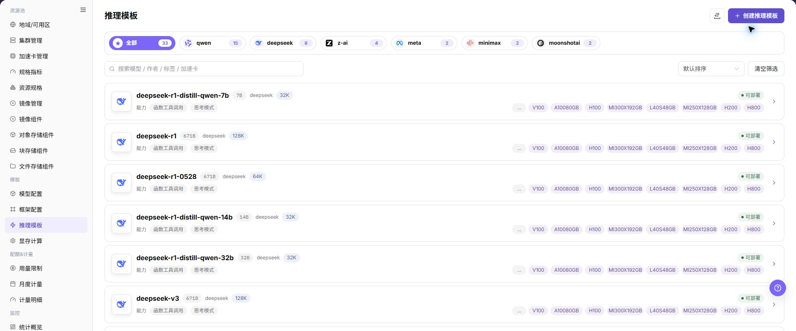
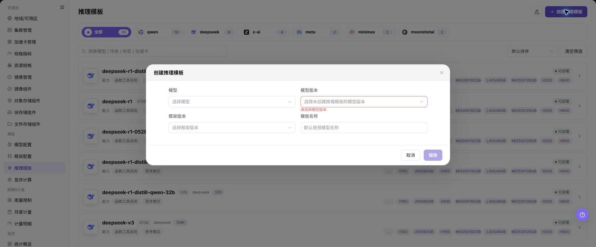

# 推理模板

## 功能概述

| 项目 | 内容 |
| --- | --- |
| 适用角色 | 运营管理员 |
| 导航路径 | AI基础设施 > On-Prem > 模板 > 推理模板 |
| 页面路由 | `/powerone/fast-build-v2/inference-templates` |
| 管理对象 | 推理模板、模型范围、框架范围、规格推荐、表单参数和发布状态 |

#### 新手理解

推理模板像模型服务的装配清单，把框架、规格、默认参数和可见范围组合好，用户部署时就能按模板快速创建服务。

#### 术语表

| 术语 | 英文 | 说明 |
| --- | --- | --- |
| 模板 | Template | Template |
| 因子表单 | Factor Form | Factor Form |
| 动态表达式 | Dynamic Expression | Dynamic Expression |

#### 推荐操作顺序

先确认推理模板、模型范围、框架范围、规格推荐、表单参数和发布状态的前置依赖，再按主要操作顺序处理，最后执行结果校验并进入后续页面。

#### 小白先看

先确认当前任务是否涉及推理模板、模型范围、框架范围、规格推荐、表单参数和发布状态，再按照推荐顺序操作。页面字段或状态与预期不符时，先回到前置对象页核对依赖，不要跳过结果校验直接进入下游流程。

## 前提条件

1. 模型配置、框架配置和显存测算已完成。
2. 可用资源规格已创建并关联到目标集群。
3. 镜像服务和必要存储能力已接入。
4. 已明确用户创建实例时需要填写哪些参数。

## 页面说明

页面用于查看和处理推理模板、模型范围、框架范围、规格推荐、表单参数和发布状态。

上图保留左侧菜单和完整功能区；请先确认页面标题、筛选范围和主要操作入口。

页面展示推理模板列表，可查看模板名称、状态、模型范围、框架范围、更新时间和操作入口。

## 主要操作

### 查看推理模板

1. 进入对应模板配置页面，按名称、版本、状态或更新时间筛选。
2. 打开详情，核对关联模型、框架、镜像、资源要求和当前版本。
3. 无结果时重置筛选；版本不兼容时先确认依赖关系。
4. 内部镜像、存储位置和启动配置外发前必须脱敏。

### 创建推理模板

#### 操作前确认

1. 已准备可用框架、运行镜像和模型配置。
2. 已确认模板适配的资源规格、部署模式和可见范围。
3. 已确认默认参数不会暴露内部路径、凭据或测试 Endpoint。
4. 已明确模板变更会影响哪些用户部署入口。

#### 操作步骤

1. 进入 `AI基础设施 > On-Prem > 模板 > 推理模板`。
2. 点击 **"新增"**、**"创建推理模板"** 或页面真实创建入口。
3. 在基础信息区域填写模板名称、描述、适用场景、发布范围和可见范围。
4. 在模型配置区域选择模型、模型版本、模型来源或适用模型范围。
5. 在框架配置区域选择框架、框架版本、运行镜像和启动配置。
6. 在资源配置区域选择资源规格、部署模式、显存测算规则、地域或集群适用范围。
7. 在端口和网络区域配置服务端口、端口开放策略、端口标签和健康检查。
8. 在因子表单区域配置用户创建实例时需要填写的参数、默认值、校验规则、动态表达式和触发条件。
9. 点击最终 **"保存"**、**"提交"**、**"发布"** 或 **"确定"** 前，再次核对模型、框架、规格、参数、端口、可见范围和用户侧影响。

下图展示创建推理模板页面，用于配置基础信息、资源规格和因子表单。

### 导入或导出推理模板

#### 适用场景

当需要批量维护推理模板，或导出模板配置供审计、核对和受控迁移时，使用 **"导入/导出"** 菜单。

#### 操作步骤

1. 进入 `AI基础设施 > On-Prem > 模板 > 推理模板`。
2. 点击 **"导入/导出"**，按业务目的选择 **"导入"** 或 **"导出"**。
3. 导入时按页面要求上传文件，核对模板、模型、框架、资源规格、因子表单和可见范围。
4. 导出时确认模板筛选范围，再按页面提示生成并下载模板配置。
5. 导入前确认依赖对象在目标环境可用，导出文件保存到受控目录。

#### 结果校验

- 导入成功后，推理模板列表显示新增或更新的模板及状态。
- 导出文件中的模板范围与当前筛选条件一致。
- 模板详情中的模型、框架、规格和参数引用可以被正确解析。

#### 注意事项

- 模板导入依赖模型、框架、镜像和规格等对象，目标环境缺少依赖时不要直接提交。
- 导入可能更新同标识模板的配置，执行前核对发布范围、参数默认值和下游部署影响。

#### 导入的推理模板无法发布或部署

**问题现象：**

模板导入完成，但状态异常，或后续发布、部署页面无法使用该模板。

**可能原因：**

- 关联模型、框架、镜像或规格在目标环境不存在或不可用。
- 因子字段、默认值或校验规则不兼容。
- 模板可见范围或状态不允许下游使用。

**处理方式：**

1. 打开模板详情逐项核对模型、框架、镜像和资源规格。
2. 到对应配置页面确认依赖对象状态和版本兼容性。
3. 检查模板可见范围、发布状态和因子表单校验规则。

#### 操作截图

上图展示操作入口打开后的字段和确认区域；提交前应核对必填项、所属范围和影响。

## 参数速查表

| 字段名称 | 是否必填 | 字段类型 | 示例 | 说明 |
| --- | --- | --- | --- | --- |
| 模板名称 | 必填 | 文本 | `示例名称` | 用户创建推理服务时看到的模板名称。 使用可长期维护的名称，避免临时测试命名。 |
| 描述 | 否 | 多行文本 | `示例说明` | 模板用途、适配模型和使用边界说明。 只写非敏感说明，不写内部地址或测试参数。 |
| 适用场景 | 条件必填 | 下拉 / 枚举 | `模型推理` | 模板面向的业务场景或模型服务类型。 与模型类型、框架能力和用户入口保持一致。 |
| 发布范围 | 条件必填 | 下拉 / 枚举 | `示例租户 A` | 模板发布到用户侧的范围。 发布前确认影响的租户、区域和入口。 |
| 可见范围 | 必填 | 下拉 / 枚举 | `示例租户 A` | 控制哪些用户或租户可以使用模板。 错误范围可能导致模板不可见或被非目标租户看到。 |
| 模型 | 条件必填 | 文本 | `Qwen3-8B` | 模板适用的模型或模型集合。 依赖对象必须可用且与框架匹配。 |
| 模型版本 | 条件必填 | 文本 | `v0.8.0` | 模板引用的模型版本。 与模型路径、量化方式和显存测算规则一致。 |
| 模型来源 | 条件必填 | 地址 / 路径 | `对象存储` | 模型文件来源、仓库来源或对象存储来源。 不写真实模型仓库地址、Endpoint 或内部路径。 |
| 框架 | 必填 | 文本 | `vLLM` | 模板调用的框架配置。 框架应支持所选模型类型和运行方式。 |
| 框架版本 | 条件必填 | 文本 | `v0.8.0` | 模板引用的框架版本。 修改前确认已有模板和实例影响。 |
| 运行镜像 | 条件必填 | 文本 | `<BASE_URL>/<PROJECT>/<IMAGE>:<TAG>` | 框架运行时使用的容器镜像。 确认镜像地域、仓库权限和目标集群可拉取。 |
| 资源规格 | 必填 | 数值 / 容量 | `gpu-a100-1card` | 模板默认推荐或可选的算力规格。 与模型显存、并发、上下文长度和部署模式匹配。 |
| 部署模式 | 必填 | 下拉 / 枚举 | `单实例` | 决定服务副本、伸缩和调度方式。 与框架启动命令和资源规格匹配。 |
| 显存测算规则 | 条件必填 | 数值 / 容量 | `按模型参数量估算` | 用于推荐或校验规格的显存规则。 与模型参数量、量化方式和上下文长度一致。 |
| 服务端口 | 条件必填 | 端口 / 数值 | `8000` | 模型服务实际监听或暴露的端口。 与框架实际监听端口一致。 |
| 端口开放策略 | 条件必填 | 端口 / 数值 | `api验证方式访问` | 端口暴露方式和认证机制。 错误配置可能扩大服务暴露范围。 |
| 端口标签 | 否 | 端口 / 数值 | `OpenAI API Port` | 标识端口协议类型或用途。 与 OpenAI API、Ollama API 或自定义协议保持一致。 |
| 健康检查 | 条件必填 | 地址 / 路径 | `/health` | 用于判断服务是否启动成功的路径或命令。 与服务实际路径、端口和启动时延匹配。 |
| 因子表单 | 条件必填 | 配置文本 | `上下文长度` | 用户创建实例时需要填写的参数表单。 字段、默认值和校验规则要逐项验证。 |
| 默认参数 | 否 | 配置文本 | `--max-model-len 8192` | 创建服务时预填的模型或运行参数。 不写真实 Token、AK/SK、私钥、Endpoint 或测试值。 |
| 动态表达式 | 条件必填 | 配置文本 | `${gpuCount} >= 1` | 根据模型、框架、规格或用户输入动态计算字段或显隐。 表达式错误会导致表单缺字段或启动命令异常。 |
| 触发条件 | 条件必填 | 配置文本 | `模型类型=LLM` | 控制字段在特定模型、框架或选项下展示。 与实际模型、框架和规格组合逐项验证。 |
| 操作 | 系统生成 | 操作入口 | `编辑` | 新增、保存、提交、发布、确定等页面操作。 `保存`、`提交`、`发布`、`确定` 属于高风险最终动作。 |

## 踩坑提示

- 推理模板发布会影响用户侧可选模板和真实服务创建范围。
- 可见范围配置错误可能导致模板不可见或被非目标租户看到。
- 模型、框架、镜像、规格或显存规则不匹配，会导致实例创建失败或启动失败。
- 默认参数、动态表达式和触发条件错误，会导致用户表单缺字段、参数错误或启动命令异常。
- 端口开放策略配置错误可能扩大服务暴露范围。
- 不写真实 Token、AK/SK、私钥、Endpoint、内部地址、模型仓库地址、租户 ID、集群 ID 或测试参数。

## 结果校验

| 检查项 | 成功表现 | 异常时处理 |
| --- | --- | --- |
| 页面入口 | 可进入推理模板并看到目标操作入口 | 检查运营管理员权限和对应菜单是否已开放 |
| 对象记录 | 推理模板、模型范围、框架范围、规格推荐、表单参数和发布状态在列表或详情中可见 | 重置筛选并核对名称、所属范围和创建结果 |
| 状态结果 | 新增或变更后的状态符合页面提示 | 查看操作提示、依赖对象状态和最近更新时间 |
| 下游使用 | 后续页面能够选择或关联目标对象 | 回到前置配置核对启用状态、归属关系和可见范围 |

## 常见问题

#### 推理模板中找不到目标对象

**问题现象：**

页面可进入，但没有看到预期的推理模板、模型范围、框架范围、规格推荐、表单参数和发布状态。

**可能原因：**

- 筛选条件仍生效。
- 对象属于其他范围。
- 前置配置未完成。

**处理方式：**

1. 重置筛选
2. 核对所属地域或租户
3. 返回前置页面确认对象状态。

#### 推理模板的操作入口不可用

**问题现象：**

新增、注册或维护入口不可见或不可点击。

**可能原因：**

- 当前角色权限不足。
- 页面处于只读状态。
- 依赖对象不满足条件。

**处理方式：**

1. 检查运营管理员权限
2. 核对页面提示
3. 先完成依赖对象配置。

#### 推理模板的必填项没有可选值

**问题现象：**

表单能打开，但下拉框为空。

**可能原因：**

- 候选对象未启用。
- 所属范围不一致。
- 当前账号不可见。

**处理方式：**

1. 到候选对象页面核对状态
2. 确认归属关系
3. 检查可见范围后刷新表单。

#### 推理模板操作后状态异常

**问题现象：**

提交后记录存在，但状态不是预期值。

**可能原因：**

- 连通性或校验失败。
- 关联对象异常。
- 后台处理尚未完成。

**处理方式：**

1. 查看页面提示和更新时间
2. 检查关联对象
3. 按状态阶段排查处理任务。

#### 下游页面无法使用推理模板

**问题现象：**

当前页状态正常，但下游页面无法选择或关联推理模板、模型范围、框架范围、规格推荐、表单参数和发布状态。

**可能原因：**

- 可见范围不匹配。
- 对象未启用。
- 下游缓存未刷新。

**处理方式：**

1. 核对启用状态和归属
2. 检查角色可见范围
3. 刷新下游页面并重新选择。

## 注意事项

- 模板参数不要包含真实 token、密钥或内部地址。
- 发布模板前必须确认依赖模型、框架、镜像、规格和存储均可用。
- 修改已发布模板前，先确认影响用户侧实例创建、模板可见范围和正在使用的部署入口。

## 后续操作

1. 用测试租户创建模型实例验证模板。
2. 根据失败日志调整镜像、启动命令、端口和参数。
3. 模板发布后按模型版本、框架版本、资源规格和可见范围分别复核，避免用户创建实例时选到过期镜像或不匹配规格。
4. 按模型、框架、规格和因子表单组合回查失败日志，持续校准模板。
