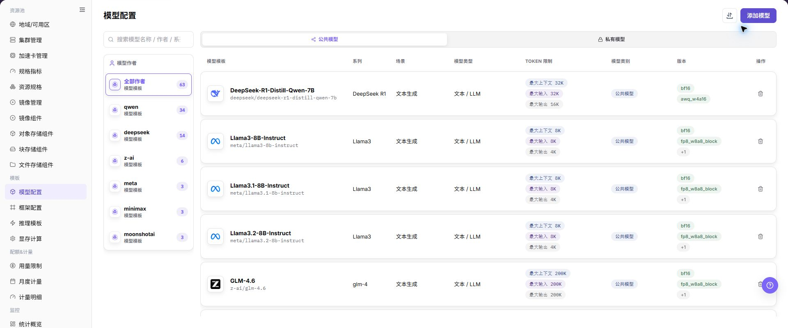
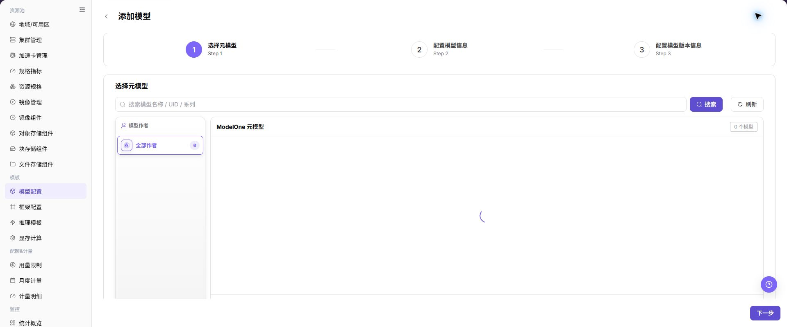

# 模型配置

## 功能概述

| 项目 | 内容 |
| --- | --- |
| 适用角色 | 运营管理员 |
| 导航路径 | AI基础设施 > On-Prem > 模板 > 模型配置 |
| 页面路由 | `/powerone/fast-build-v2/models` |
| 管理对象 | 元模型、模型版本、模型来源、量化方式、标签和关联集群 |

#### 新手理解

模型配置像模型上架前的资料卡，把模型路径、参数来源、环境变量和启动参数整理清楚，框架才能正确加载模型。

#### 术语表

| 术语 | 英文 | 说明 |
| --- | --- | --- |
| 元模型 | Base Model | Base Model |
| 模型版本 | Model Version | Model Version |
| KV Token | KV Token | KV Token |

#### 推荐操作顺序

先确认元模型、模型版本、模型来源、量化方式、标签和关联集群的前置依赖，再按主要操作顺序处理，最后执行结果校验并进入后续页面。

#### 小白先看

先确认当前任务是否涉及元模型、模型版本、模型来源、量化方式、标签和关联集群，再按照推荐顺序操作。页面字段或状态与预期不符时，先回到前置对象页核对依赖，不要跳过结果校验直接进入下游流程。

## 前提条件

1. 已确认模型来源、授权、版本和参数量。
2. 模型文件可被目标集群下载或已在共享存储中准备。
3. 显存测算中已维护相关量化方式、KV Token 或计算因子。
4. 当前账号具备模板管理权限。

## 页面说明

页面用于查看和处理元模型、模型版本、模型来源、量化方式、标签和关联集群。

上图保留左侧菜单和完整功能区；请先确认页面标题、筛选范围和主要操作入口。

页面按模型作者、模型类别和模型系列展示配置，可维护公共模型或私有模型。

## 主要操作

### 查看模型配置

1. 进入对应模板配置页面，按名称、版本、状态或更新时间筛选。
2. 打开详情，核对关联模型、框架、镜像、资源要求和当前版本。
3. 无结果时重置筛选；版本不兼容时先确认依赖关系。
4. 内部镜像、存储位置和启动配置外发前必须脱敏。

### 添加模型

#### 操作前确认

1. 已确认模型文件路径、格式、权限和来源凭据。
2. 已确认模型与运行框架、精度、上下文长度和资源规格匹配。
3. 已确认环境变量、启动参数和挂载路径不包含真实密钥。
4. 如模型来自外部仓库，已确认授权范围和网络连通性。

#### 操作步骤

1. 进入 `AI基础设施 > On-Prem > 模板 > 模型配置`。
2. 点击 **"添加模型"** 或页面真实新增入口。

下图展示选择元模型页面，用于选择模型作者、模型系列和模型基础条目。

3. 在元模型或基础信息区域选择模型作者、模型系列、模型类型、场景和 Token 限制等信息。

下图展示模型信息配置页面，用于维护模型类型、场景、Token 限制和基础描述。

4. 在版本信息区域填写模型来源、版本号、量化方式、模型路径或仓库标识。

下图展示模型版本信息配置页面，用于维护模型来源、版本、量化方式和路径信息。

5. 按页面要求配置参数来源、环境变量、启动参数、挂载路径或模型来源凭据。
6. 在关联配置区域选择标签、可见范围、关联集群或可用模板范围。

第 6 步可在以下页面创建或选择用于模型分类和筛选的标签。

继续在关联集群页面确认模型文件可访问且允许部署的集群范围。

7. 点击最终 **"保存"**、**"提交"** 或 **"确定"** 前，再次核对模型路径、凭据引用、集群可访问性和可见范围。

### 导入或导出模型

#### 适用场景

当需要批量维护模型配置，或导出模型定义供审计、核对和受控迁移时，使用 **"导入/导出"** 菜单。

#### 操作步骤

1. 进入 `AI基础设施 > On-Prem > 模板 > 模型配置`。
2. 点击 **"导入/导出"**，按业务目的选择 **"导入"** 或 **"导出"**。
3. 导入时按页面要求上传文件，核对元模型、模型版本、模型来源、量化方式、标签、集群关联和可见范围。
4. 导出时确认模型类型或作者筛选范围，再按页面提示生成并下载模型配置。
5. 导入前确认目标环境的元模型、模型来源和集群依赖可用；导出文件保存到受控目录。

#### 结果校验

- 导入成功后，模型配置列表显示新增或更新的模型及其状态。
- 导出文件中的模型范围与当前筛选条件一致。
- 模型详情中的来源、标签和集群关联可以被正确解析。

#### 注意事项

- 模型导入可能更新同标识对象的字段，执行前核对版本、来源、集群范围和下游模板依赖。
- 模型路径、仓库地址和来源凭据属于敏感配置，导入文件和导出文件都应脱敏并受控保存。

#### 导入的模型无法被推理模板使用

**问题现象：**

模型导入完成，但推理模板或发布流程中找不到该模型。

**可能原因：**

- 元模型、模型来源或模型版本在目标环境不存在或不可用。
- 集群关联、可见范围或模型状态不满足下游选择条件。
- 导入文件中的模型标识或版本信息不一致。

**处理方式：**

1. 打开模型详情，核对元模型、来源、版本、状态和可见范围。
2. 到模型来源和集群页面确认依赖对象可用且关联正确。
3. 对照页面要求检查导入文件中的标识和版本字段。

### 删除模型

#### 适用场景

当平台不再需要某个模型配置，且已确认没有推理模板、发布流程或运行实例依赖时，删除模型。

#### 操作步骤

1. 进入 `AI基础设施 > On-Prem > 模板 > 模型配置`，定位目标模型。
2. 点击目标模型行的 **"删除"**。
3. 阅读确认提示，核对模型名称、版本、来源、集群关联和下游模板。
4. 确认替代配置和影响范围后，点击确认按钮完成删除。
5. 刷新列表并检查推理模板、发布流程和模型选择页面。

#### 结果校验

- 目标模型从模型配置列表中移除。
- 下游新建模板或发布流程不再提供该模型。
- 元模型、模型来源、其他版本和无关模型未被误删。

#### 注意事项

- 删除模型配置不等于删除底层模型文件或仓库数据；按实际存储策略单独处理数据保留。
- 有运行实例、已发布模板或作业依赖时，不要直接删除，先完成替代模型配置和迁移。

#### 模型删除后仍能被选择

**问题现象：**

模型配置列表已不再显示目标模型，但下游页面仍能选择它。

**可能原因：**

- 下游页面缓存尚未刷新。
- 下游模板或实例保存了历史引用。
- 删除请求仍在后台处理中。

**处理方式：**

1. 刷新下游页面并重新打开模型选择器。
2. 检查推理模板、发布记录和运行实例中的历史引用。
3. 查看模型更新时间和页面提示，确认删除处理已完成。

#### 操作截图

上图展示操作入口打开后的字段和确认区域；提交前应核对必填项、所属范围和影响。

## 参数速查表

| 字段名称 | 是否必填 | 字段类型 | 示例 | 说明 |
| --- | --- | --- | --- | --- |
| 模型名称 | 必填 | 文本 | `示例名称` | 平台展示和模板引用的模型名称。 使用可长期维护的模型名称，不使用临时测试命名。 |
| 模型作者 | 条件必填 | 下拉 / 枚举 | `示例租户` | 模型所属作者、租户或来源方。 与页面筛选、模型系列和授权来源保持一致。 |
| 模型系列 | 条件必填 | 下拉 / 枚举 | `A100` | 同一模型家族或基础模型系列。 便于推理模板按系列筛选模型。 |
| 模型类型 | 条件必填 | 下拉 / 枚举 | `大语言模型` | 模型能力类型或业务分类。 与推理框架、模板类型和用户侧选择范围保持一致。 |
| 场景 | 条件必填 | 下拉 / 枚举 | `示例值` | 模型适用的业务场景。 避免把测试、训练或推理场景混用。 |
| Token 限制 | 条件必填 | 文本 | `8192` | 上下文长度、输入输出 Token 或 KV Cache 相关限制。 与模型能力、显存测算和模板参数保持一致。 |
| 模型来源 | 必填 | 地址 / 路径 | `对象存储` | 模型文件来源、仓库来源或对象存储来源。 外部来源需确认授权和网络可达性。 |
| 版本 | 必填 | 文本 | `v0.8.0` | 模型版本号或权重版本记录。 版本应可追溯，不用含糊的 `latest` 作为长期配置。 |
| 量化方式 | 条件必填 | 下拉 / 枚举 | `FP16` | 模型权重量化或精度方式。 与运行框架和显存测算配置保持一致。 |
| 模型路径 | 必填 | 地址 / 路径 | `s3://example-bucket/model` | 框架加载模型文件的路径、仓库标识或对象存储位置。 不写真实密钥、Token、账号密码或内网地址。 |
| 参数来源 | 条件必填 | 下拉 / 枚举 | `模板默认值` | 参数来自模型配置、模板默认值或用户输入。 避免模板默认值覆盖模型专属参数。 |
| 环境变量 | 否 | 配置文本 | `ENV=prod` | 传入容器运行环境的变量。 只填写非敏感变量，敏感值使用凭据引用。 |
| 启动参数 | 否 | 配置文本 | `--max-model-len 8192` | 附加到框架启动命令的模型参数。 与框架版本、Token 限制和资源规格匹配。 |
| 模型来源凭据 | 条件必填 | 凭据 / 敏感文本 | `对象存储` | 访问私有模型仓库或对象存储时使用的凭据引用。 只引用凭据对象，不在文档中写真实凭据。 |
| 关联集群 | 条件必填 | 文件 / 配置文本 | `cluster-a` | 模型文件可访问或可部署的集群范围。 提交前确认目标集群网络和存储可访问。 |
| 标签 | 否 | 文本 | `llm` | 用于筛选、分类或模板匹配的标签。 标签含义应稳定，避免使用临时标签。 |
| 可见范围 | 条件必填 | 下拉 / 枚举 | `示例租户 A` | 模型对模板、租户或用户侧的可见边界。 错误可见范围会影响用户侧可选模型。 |
| 操作 | 系统生成 | 操作入口 | `编辑` | 添加、编辑、保存、提交、确定等页面操作。 `保存`、`提交`、`确定` 属于高风险最终动作。 |

## 踩坑提示

- 模型路径、仓库地址、对象存储路径和凭据引用错误，会导致模板部署后模型加载失败。
- 环境变量、启动参数、模型路径中不能写真实密钥、Token、AK/SK、账号密码或内网地址。
- 错误的关联集群或可见范围会影响推理模板可选模型和用户侧可见范围。
- 参数来源要写清楚，避免模板默认值覆盖模型专属参数。

## 结果校验

| 检查项 | 成功表现 | 异常时处理 |
| --- | --- | --- |
| 页面入口 | 可进入模型配置并看到目标操作入口 | 检查运营管理员权限和对应菜单是否已开放 |
| 对象记录 | 元模型、模型版本、模型来源、量化方式、标签和关联集群在列表或详情中可见 | 重置筛选并核对名称、所属范围和创建结果 |
| 状态结果 | 新增或变更后的状态符合页面提示 | 查看操作提示、依赖对象状态和最近更新时间 |
| 下游使用 | 后续页面能够选择或关联目标对象 | 回到前置配置核对启用状态、归属关系和可见范围 |

## 常见问题

#### 模型配置中找不到目标对象

**问题现象：**

页面可进入，但没有看到预期的元模型、模型版本、模型来源、量化方式、标签和关联集群。

**可能原因：**

- 筛选条件仍生效。
- 对象属于其他范围。
- 前置配置未完成。

**处理方式：**

1. 重置筛选
2. 核对所属地域或租户
3. 返回前置页面确认对象状态。

#### 模型配置的操作入口不可用

**问题现象：**

新增、注册或维护入口不可见或不可点击。

**可能原因：**

- 当前角色权限不足。
- 页面处于只读状态。
- 依赖对象不满足条件。

**处理方式：**

1. 检查运营管理员权限
2. 核对页面提示
3. 先完成依赖对象配置。

#### 模型配置的必填项没有可选值

**问题现象：**

表单能打开，但下拉框为空。

**可能原因：**

- 候选对象未启用。
- 所属范围不一致。
- 当前账号不可见。

**处理方式：**

1. 到候选对象页面核对状态
2. 确认归属关系
3. 检查可见范围后刷新表单。

#### 模型配置操作后状态异常

**问题现象：**

提交后记录存在，但状态不是预期值。

**可能原因：**

- 连通性或校验失败。
- 关联对象异常。
- 后台处理尚未完成。

**处理方式：**

1. 查看页面提示和更新时间
2. 检查关联对象
3. 按状态阶段排查处理任务。

#### 下游页面无法使用模型配置

**问题现象：**

当前页状态正常，但下游页面无法选择或关联元模型、模型版本、模型来源、量化方式、标签和关联集群。

**可能原因：**

- 可见范围不匹配。
- 对象未启用。
- 下游缓存未刷新。

**处理方式：**

1. 核对启用状态和归属
2. 检查角色可见范围
3. 刷新下游页面并重新选择。

## 注意事项

- 模型来源和授权必须可追溯。
- 不要在模型路径、描述或截图中暴露访问密钥。
- 不要在示例、截图或工单中写真实模型仓库地址、对象存储路径、AK/SK、Token、账号密码或内网地址。
- 修改关联集群、标签或可见范围前，先确认推理模板和用户侧部署入口影响。

## 后续操作

1. 进入 [框架配置](../frames/) 维护模型可用框架。
2. 进入 [推理模板](../inference-templates/) 建立模型、框架、规格和参数关系。
3. 进入 [显存测算配置](../vram-config/) 校准 KV Token、量化和动态表达式。
