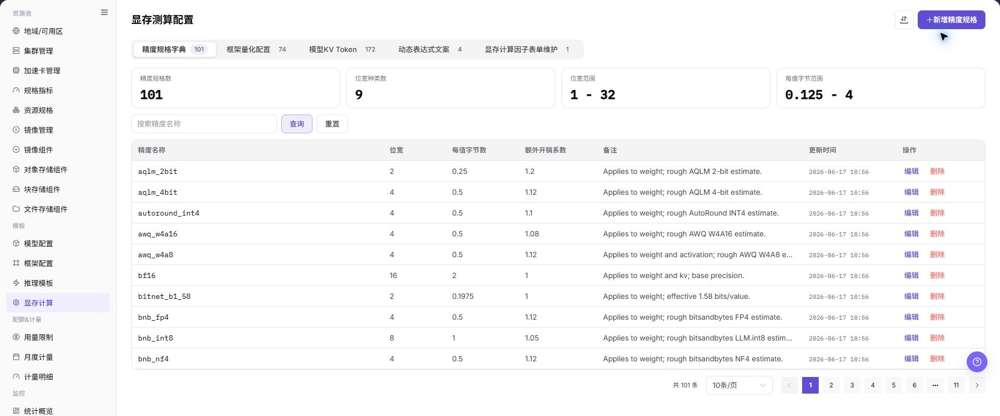
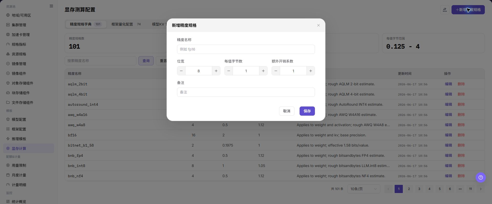

# 显存计算

## 功能概述

| 项目 | 内容 |
| --- | --- |
| 适用角色 | 运营管理员 |
| 导航路径 | AI基础设施 > On-Prem > 模板 > 显存计算 |
| 页面路由 | `/powerone/fast-build-v2/vram-factor-forms` |
| 管理对象 | 显存公式、精度、KV Token、因子表单、动态表达式和推荐规格 |

#### 新手理解

显存计算像部署前的容量估算器，用模型规模、精度、上下文长度和 KV Token 估算需要多少显存，避免服务启动后才发现放不下。

#### 术语表

| 术语 | 英文 | 说明 |
| --- | --- | --- |
| VRAM | VRAM | VRAM |
| KV Token | KV Token | KV Token |
| 因子 | Factor | Factor |

#### 推荐操作顺序

先确认显存公式、精度、KV Token、因子表单、动态表达式和推荐规格的前置依赖，再按主要操作顺序处理，最后执行结果校验并进入后续页面。

#### 小白先看

先确认当前任务是否涉及显存公式、精度、KV Token、因子表单、动态表达式和推荐规格，再按照推荐顺序操作。页面字段或状态与预期不符时，先回到前置对象页核对依赖，不要跳过结果校验直接进入下游流程。

## 前提条件

1. 已明确模型参数量、精度、上下文长度、并发和框架显存开销。
2. 已准备可被推理模板引用的资源规格。
3. 已确认不同加速卡型号的显存容量和可用余量。
4. 当前账号具备模板管理权限。

## 页面说明

页面用于查看和处理显存公式、精度、KV Token、因子表单、动态表达式和推荐规格。

上图保留左侧菜单和完整功能区；请先确认页面标题、筛选范围和主要操作入口。

页面展示显存测算规则和精度配置，可维护不同模型、框架或精度组合的显存估算逻辑。

## 主要操作

### 查看显存规则

1. 进入对应模板配置页面，按名称、版本、状态或更新时间筛选。
2. 打开详情，核对关联模型、框架、镜像、资源要求和当前版本。
3. 无结果时重置筛选；版本不兼容时先确认依赖关系。
4. 内部镜像、存储位置和启动配置外发前必须脱敏。

### 配置显存规则

#### 操作前确认

1. 已确认模型参数规模、精度、量化方式和最大上下文长度。
2. 已确认目标 GPU/NPU 型号、单卡显存和并行策略。
3. 已确认 KV Token、批大小和并发设置的估算口径。
4. 显存估算结果应与实际压测或试运行结果交叉验证。

#### 操作步骤

1. 进入 `AI基础设施 > On-Prem > 模板 > 显存计算`。
2. 点击新增或编辑入口。
3. 在基础信息 Tab 中填写规则名称、适用模型、框架和精度。
4. 在因子表单 Tab 中配置参数量、KV Token、并发、上下文长度等因子。
5. 在动态表达式 Tab 中配置显存计算公式、推荐规格和触发条件。
6. 保存后在推理模板中引用并验证。

下图展示显存测算配置页面，用于维护精度、因子和动态表达式。

#### 操作截图

上图展示操作入口打开后的字段和确认区域；提交前应核对必填项、所属范围和影响。

### 导入或导出显存规则

#### 适用场景

当需要批量维护显存计算规则，或导出规则供审计、核对和受控迁移时，使用 **"导入/导出"** 菜单。

#### 操作步骤

1. 进入 `AI基础设施 > On-Prem > 模板 > 显存计算`。
2. 点击 **"导入/导出"**，按业务目的选择 **"导入"** 或 **"导出"**。
3. 导入时按页面要求上传文件，核对精度规格、框架版本、模型参数、KV Token、动态表达式和推荐规格。
4. 导出时确认当前规则或 Tab 筛选范围，再按页面提示生成并下载规则配置。
5. 导入前确认目标环境的模型、框架和精度依赖可用；导出文件保存到受控目录。

#### 结果校验

- 导入成功后，显存计算页面显示新增或更新的规则。
- 导出文件中的规则范围与当前筛选条件一致。
- 推理模板引用该规则后可以得到可解释的显存计算结果。

#### 注意事项

- 显存规则会影响推荐规格和部署前资源判断，导入前核对模型规模、精度、上下文长度和并发口径。
- 导入可能更新同标识规则，执行前确认已引用模板和实例的影响；规则文件不得包含真实凭据或内部地址。

#### 导入的显存规则计算结果异常

**问题现象：**

规则导入完成，但推理模板中的显存结果明显偏大、偏小或无法计算。

**可能原因：**

- 模型规模、精度、KV Token 或上下文长度口径不一致。
- 框架版本或动态表达式在目标环境不可用。
- 规则引用的推荐规格不存在或资源指标不匹配。

**处理方式：**

1. 打开规则详情逐项核对因子和动态表达式。
2. 到模型、框架和资源规格页面核对版本与指标。
3. 用代表性参数重新计算，并与已验证结果交叉核对。

### 编辑显存规则

#### 适用场景

当显存规则的精度、因子或动态表达式需要调整时，编辑显存规则。

#### 操作步骤

1. 进入 `AI基础设施 > On-Prem > 模板 > 显存计算`，定位目标规则。
2. 点击目标规则的 **"编辑"**，核对规则名称和关联模型、框架。
3. 按页面提供的 Tab 修改精度规格、因子表单、动态表达式或推荐规格。
4. 点击最终 **"保存"** 或 **"确定"** 前，核对计算公式、触发条件和已引用模板的影响。
5. 返回列表并在推理模板中重新验证计算结果。

#### 结果校验

- 规则列表显示更新后的精度、因子或表达式配置。
- 相同输入参数的计算结果符合新的规则预期。
- 已引用模板能正常加载规则，且推荐规格没有超出资源能力。

#### 注意事项

- 修改因子或表达式可能改变已有模板的推荐规格，先保存旧规则并安排代表性模型验证。
- 不要用一次计算结果替代实际部署压测，规则变更后仍需检查运行时显存压力。

#### 编辑规则后计算结果没有变化

**问题现象：**

规则保存后，推理模板仍使用旧的显存结果。

**可能原因：**

- 模板引用了另一条规则或缓存未刷新。
- 修改未通过最终确认。
- 输入参数没有触发变更后的表达式分支。

**处理方式：**

1. 在模板详情核对实际引用的规则和更新时间。
2. 刷新规则及模板页面，确认保存提示。
3. 用能触发目标分支的参数重新计算并比较结果。

### 移除显存规则

#### 适用场景

当某条显存规则不再使用，且已确认没有推理模板或部署配置依赖时，移除显存规则。

#### 操作步骤

1. 进入 `AI基础设施 > On-Prem > 模板 > 显存计算`，定位目标规则。
2. 点击目标规则的 **"删除"**。
3. 阅读确认提示，核对规则名称、关联模型、框架、精度和下游模板。
4. 确认替代规则和影响范围后，点击确认按钮完成移除。
5. 刷新列表并检查推理模板和部署页面的规则选择范围。

#### 结果校验

- 目标规则从显存计算列表中移除。
- 新建或编辑推理模板时不再提供该规则。
- 其他规则、模型、框架和模板引用未被误删。

#### 注意事项

- 被模板或部署配置引用的规则不要直接移除，先切换到已验证的替代规则。
- 移除规则配置不等于删除模型或框架数据，底层对象按各自生命周期处理。

#### 显存规则删除失败

**问题现象：**

点击 **"删除"** 后操作失败，或页面提示存在关联对象。

**可能原因：**

- 推理模板或部署配置仍引用该规则。
- 当前账号缺少移除权限。
- 规则仍在计算或后台处理。

**处理方式：**

1. 到推理模板和部署页面检查规则引用。
2. 核对当前账号权限、规则状态和更新时间。
3. 完成替换或解除引用后，再按审批结果移除规则。

## 参数速查表

| 字段名称 | 是否必填 | 字段类型 | 示例 | 说明 |
| --- | --- | --- | --- | --- |
| 模型规模 | 必填 | 文本 / 数字 | `72B` | 模型参数规模，用于估算权重显存。 |
| 精度 | 必填 | 枚举 | `BF16` | 影响权重、激活和 KV Cache 的显存占用。 |
| KV Token | 必填 | 数字 | `32768` | 用于估算上下文和并发下的 KV Cache 占用。 |
| 上下文长度 | 必填 | 数字 | `8192` | 模型服务允许的最大输入输出上下文。 |
| 并发 / 批大小 | 否 | 数字 | `4` | 用于估算峰值请求下的显存压力。 |
| 显存估算结果 | 系统生成 | 容量 | `152 GB` | 平台根据配置计算出的建议显存需求。 |

## 踩坑提示

- KV Token、上下文长度和并发会显著影响显存估算，不能只看模型参数规模。
- 量化精度填写错误会导致推荐规格偏小或偏大。
- 显存估算结果应通过测试部署校验，不能替代实际压测。

## 结果校验

| 检查项 | 成功表现 | 异常时处理 |
| --- | --- | --- |
| 页面入口 | 可进入显存计算并看到目标操作入口 | 检查运营管理员权限和对应菜单是否已开放 |
| 对象记录 | 显存公式、精度、KV Token、因子表单、动态表达式和推荐规格在列表或详情中可见 | 重置筛选并核对名称、所属范围和创建结果 |
| 状态结果 | 新增或变更后的状态符合页面提示 | 查看操作提示、依赖对象状态和最近更新时间 |
| 下游使用 | 后续页面能够选择或关联目标对象 | 回到前置配置核对启用状态、归属关系和可见范围 |

## 常见问题

#### 显存计算中找不到目标对象

**问题现象：**

页面可进入，但没有看到预期的显存公式、精度、KV Token、因子表单、动态表达式和推荐规格。

**可能原因：**

- 筛选条件仍生效。
- 对象属于其他范围。
- 前置配置未完成。

**处理方式：**

1. 重置筛选
2. 核对所属地域或租户
3. 返回前置页面确认对象状态。

#### 显存计算的操作入口不可用

**问题现象：**

新增、注册或维护入口不可见或不可点击。

**可能原因：**

- 当前角色权限不足。
- 页面处于只读状态。
- 依赖对象不满足条件。

**处理方式：**

1. 检查运营管理员权限
2. 核对页面提示
3. 先完成依赖对象配置。

#### 显存计算的必填项没有可选值

**问题现象：**

表单能打开，但下拉框为空。

**可能原因：**

- 候选对象未启用。
- 所属范围不一致。
- 当前账号不可见。

**处理方式：**

1. 到候选对象页面核对状态
2. 确认归属关系
3. 检查可见范围后刷新表单。

#### 显存计算操作后状态异常

**问题现象：**

提交后记录存在，但状态不是预期值。

**可能原因：**

- 连通性或校验失败。
- 关联对象异常。
- 后台处理尚未完成。

**处理方式：**

1. 查看页面提示和更新时间
2. 检查关联对象
3. 按状态阶段排查处理任务。

#### 下游页面无法使用显存计算

**问题现象：**

当前页状态正常，但下游页面无法选择或关联显存公式、精度、KV Token、因子表单、动态表达式和推荐规格。

**可能原因：**

- 可见范围不匹配。
- 对象未启用。
- 下游缓存未刷新。

**处理方式：**

1. 核对启用状态和归属
2. 检查角色可见范围
3. 刷新下游页面并重新选择。

## 注意事项

- 显存测算是推荐和校验依据，不替代真实压测。
- 修改规则前应确认使用该规则的模板和用户创建流程影响范围。

## 后续操作

1. 在推理模板中引用显存测算规则。
2. 用小、中、大模型分别验证推荐规格。
3. 根据线上失败案例持续校准显存公式和安全余量。
