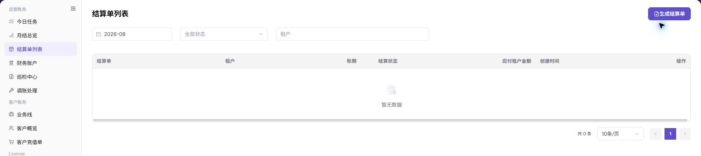

# 完成一次账期对账与结算

::: info 文档信息
版本：v1.0
更新日期：2026-07-23
:::

## 功能概述

| 项目 | 内容 |
| --- | --- |
| 适用角色 | 运营管理员 / 财务对账人员 |
| 导航路径 | 用户手册 > 账务 > 完成一次账期对账与结算 |
| 页面路由 | `/zh-CN/usermanual/billing/end-to-end/reconcile-billing-cycle/` |
| 流程对象 | 月结总览、今日任务、财务账户、巡检异常、结算单和调账 |

本文覆盖账务运营人员完成一次账期对账与结算的主流程：先看账期汇总和今日任务，再核对财务账户与巡检异常，确认无阻塞问题后生成或查看结算单；如果仍存在差异，再进入调账处理。

#### 新手理解

账期对账像月底关账：先看本月总数是否合理，再看有没有待办和异常，接着核对账户流水，最后生成或确认结算单。调账不是常规步骤，只在账务差异已经定位、审批依据充分时使用。

#### 术语速查

| 术语 | 含义 | 关联页面 |
| --- | --- | --- |
| 账期 | 本次对账和结算的月份或账务周期。 | [月结总览](../../operator/finance-operations/monthly-overview/) |
| 今日任务 | 当前需要处理的账务待办或异常提醒。 | [今日任务](../../operator/finance-operations/today-tasks/) |
| 财务账户 | 用于核对账户余额、收入、支出和交易流水。 | [财务账户](../../operator/finance-operations/financial-accounts/) |
| 巡检异常 | 未配对划转、缺失收益明细、补偿队列等异常线索。 | [巡检中心](../../operator/finance-operations/reconciliation-center/) |
| 结算单 | 某租户在某账期下的结算记录。 | [结算单列表](../../operator/finance-operations/settlement-list/) |
| 调账 | 经审批后的账务修正动作。 | [调账处理](../../operator/finance-operations/account-adjustment/) |

## 前提条件

1. 当前账号具备运营财务查看权限。
2. 已明确本次要处理的目标账期。
3. 已确认目标租户、客户或业务线范围。
4. 已准备好用于核对的结算单、账户流水、充值订单或业务记录。
5. 执行结算生成、补建、补偿或调账前，已确认影响范围和审批要求。

## 页面说明

#### 失败分支与排查路径

| 失败现象 | 优先排查页面 | 下一跳 |
| --- | --- | --- |
| 月结总览数据未更新 | [月结总览](../../operator/finance-operations/monthly-overview/) | 检查账期、更新时间和统计状态。 |
| 今日任务长期未处理 | [今日任务](../../operator/finance-operations/today-tasks/) | 按优先级、任务类型和超时状态处理。 |
| 账户金额对不上 | [财务账户](../../operator/finance-operations/financial-accounts/) | 核对交易流水和账户类型。 |
| 未配对划转有数据 | [巡检中心](../../operator/finance-operations/reconciliation-center/) | 跳转财务账户核对流水。 |
| 缺失收益明细仍存在 | [巡检中心](../../operator/finance-operations/reconciliation-center/) | 执行补建后再次刷新。 |
| 结算单生成失败 | [结算单列表](../../operator/finance-operations/settlement-list/) | 查看生成检查和详情状态。 |
| 确认需要资金修正 | [调账处理](../../operator/finance-operations/account-adjustment/) | 按审批流程处理调账。 |

## 主要操作

### 查看月结总览

1. 进入 [月结总览](../../operator/finance-operations/monthly-overview/)。
2. 选择目标账期。
3. 查看账期状态、收入、支出、净变动、异常数量和更新时间。
4. 如果账期统计尚未完成，不要提前下结算结论。

上图展示该流程步骤对应的页面入口或当前状态，重点核对页面标题、目标记录和可见操作。

### 检查今日任务

1. 进入 [今日任务](../../operator/finance-operations/today-tasks/)。
2. 查看是否存在超时任务、金额相关任务或高优先级任务。
3. 优先处理会影响月结、结算单生成、入账确认或巡检结果的任务。
4. 处理后回到月结总览确认账期状态是否变化。

上图展示该流程步骤对应的页面入口或当前状态，重点核对页面标题、目标记录和可见操作。

### 核对财务账户

1. 进入 [财务账户](../../operator/finance-operations/financial-accounts/)。
2. 查看平台清算账户、平台收益账户等账户的余额、收入、支出和更新时间。
3. 打开交易流水，按账期、交易类型、租户或流水号核对。
4. 如果账户金额和月结总览不一致，先确认账期、租户和交易类型是否一致。

上图展示该流程步骤对应的页面入口或当前状态，重点核对页面标题、目标记录和可见操作。

### 进入巡检中心排查异常

1. 进入 [巡检中心](../../operator/finance-operations/reconciliation-center/)。
2. 选择目标账期并点击 **"刷新"**。
3. 检查未配对划转、缺失收益明细和补偿队列。
4. 必要时执行双边流水检查或收益明细补建。
5. 记录脱敏后的异常类型、数量、账期和关联线索。

上图展示该流程步骤对应的页面入口或当前状态，重点核对页面标题、目标记录和可见操作。

### 生成或查看结算单

1. 进入 [结算单列表](../../operator/finance-operations/settlement-list/)。
2. 按账期、状态和租户搜索目标结算单。
3. 如果结算单已存在，打开详情核对金额、状态和入账确认信息。
4. 如果需要生成结算单，先确认月结总览、财务账户和巡检中心没有阻塞异常。
5. 生成后回到列表按账期和租户搜索，并进入详情确认状态。

上图展示该流程步骤对应的页面入口或当前状态，重点核对页面标题、目标记录和可见操作。

### 必要时进入调账处理

1. 仅在差异来源已定位、审批依据充分时，进入 [调账处理](../../operator/finance-operations/account-adjustment/)。
2. 核对调账类型、影响账期、关联单据、金额方向和审批状态。
3. 不要把巡检结果直接当作调账依据，应结合财务账户、结算单和业务记录。
4. 调账完成后回到月结总览、财务账户和结算单列表复核结果。

上图展示该流程步骤对应的页面入口或当前状态，重点核对页面标题、目标记录和可见操作。

## 参数速查表

| 字段名称 | 是否必填 | 字段类型 | 示例 | 说明 |
| --- | --- | --- | --- | --- |
| 账期 | 必填 | 月份 / 账务周期 | `2026-07` | 本次对账和结算的统一时间范围。 |
| 租户 | 条件必填 | 文本 | `脱敏租户` | 生成或核对结算单时用于限定对象。 |
| 账户类型 | 条件必填 | 枚举 | `平台清算账户` | 核对流水时用于区分清算、收益或其他账户。 |
| 异常类型 | 条件必填 | 枚举 | `未配对划转` | 巡检中心排查时用于选择下一步。 |
| 结算单号 | 条件必填 | 文本 | `脱敏结算单号` | 跟踪结算单详情、状态和入账确认。 |

## 踩坑提示

- 不要跳过巡检中心直接生成结算单，未配对划转和缺失收益明细会影响后续核对。
- 财务账户、月结总览和结算单必须使用同一账期和租户范围。
- 调账只适合已定位且经过审批的差异，不适合作为常规修复入口。
- 生成结算单失败时不要重复点击，先查看生成检查和失败原因。
- `生成结算单`、补偿、补建和调账属于高风险动作，执行前必须确认账期、租户、金额和审批依据。
- 不记录真实租户、客户、金额、流水号、账户编号、结算单号、Token 或 Key。

## 结果校验

| 检查项 | 成功表现 | 异常时处理 |
| --- | --- | --- |
| 账期状态明确 | 月结总览展示目标账期，并能看到汇总状态和更新时间。 | 继续核对任务和账户。 |
| 待办已处理 | 今日任务中没有阻塞结算的高优先级任务。 | 进入财务账户。 |
| 账户可核对 | 财务账户流水能解释收入、支出和余额变化。 | 进入巡检中心。 |
| 巡检无阻塞异常 | 未配对划转、缺失收益明细和补偿队列已处理或有明确结论。 | 进入结算单列表。 |
| 结算单可追踪 | 能按账期和租户找到结算单，并打开详情。 | 归档或继续入账确认。 |
| 差异有闭环 | 需要调账的问题已有审批、单据和复核记录。 | 回到相关页面复测。 |

## 常见问题

#### 可以跳过巡检中心直接生成结算单吗？

**问题现象：**

月结总览看起来正常，但不确定是否还要查看巡检中心。

**可能原因：**

月结总览展示汇总口径，巡检中心展示异常线索，两者用途不同。

**处理方式：**

生成结算单前建议至少刷新一次巡检中心，确认没有未配对划转、缺失收益明细或补偿队列积压。

#### 结算单金额和财务账户流水不一致怎么办？

**问题现象：**

结算单详情中的金额与财务账户的收入、支出或余额对不上。

**可能原因：**

账期、租户、交易类型或账户类型选择不一致，也可能存在入账确认中、退款、调账或清算延迟。

**处理方式：**

先统一账期和租户；再打开财务账户交易流水核对；如果仍无法解释，进入巡检中心查看异常，并保留脱敏线索。

#### 什么时候才需要调账？

**问题现象：**

发现账务差异后，不确定是否应直接进入调账处理。

**可能原因：**

调账是资金修正动作，需要明确原因、影响范围和审批依据，不能只凭单个页面结果执行。

**处理方式：**

先完成月结总览、财务账户、巡检中心和结算单核对；确认差异真实存在且需要修正后，再按审批流程进入调账处理。

#### 账期数据未更新时可以继续生成结算单吗？

**问题现象：**

月结总览或财务账户仍显示旧的更新时间，但准备继续结算。

**可能原因：**

- 账期统计或入账任务尚未完成。
- 巡检中心仍存在阻塞异常。

**处理方式：**

1. 停止生成结算单。
2. 核对月结总览更新时间和今日任务。
3. 刷新巡检中心并处理阻塞异常。
4. 确认账期数据完成更新后再继续。

#### 账期闭环需要保留哪些处理记录？

**问题现象：**

流程完成后，需要记录结果但不确定保留哪些信息。

**可能原因：**

- 缺少统一的账期和对象范围。
- 原始截图或流水信息包含敏感内容。

**处理方式：**

1. 记录脱敏后的账期、租户或业务范围。
2. 记录结算单状态、异常类型、处理结论和复核结果。
3. 不要记录真实金额、账号、流水号、凭证或内部处理意见。
## 注意事项

- 不要在账期统计未完成前生成结算单。
- 不要只凭单个页面判断金额是否正确，至少结合月结总览、财务账户、巡检中心和结算单。
- 生成结算单、补建、补偿和调账前必须确认账期、租户和影响范围。
- 截图、工单、评论和交付记录中不要暴露真实租户、客户、金额、流水号、账户编号、结算单号或内部处理意见。
- 调账属于资金修正动作，应遵循审批和复核流程。

## 后续操作

1. 账期闭环完成后，归档脱敏后的账期、租户、结算单状态、异常处理结论和复核人信息。
2. 如结算单进入入账确认中，继续在 [结算单列表](../../operator/finance-operations/settlement-list/) 跟踪状态。
3. 如发现新的流水差异，回到 [财务账户](../../operator/finance-operations/financial-accounts/) 和 [巡检中心](../../operator/finance-operations/reconciliation-center/) 重新核对。
4. 如涉及调账，完成后回到月结总览和财务账户复测。
