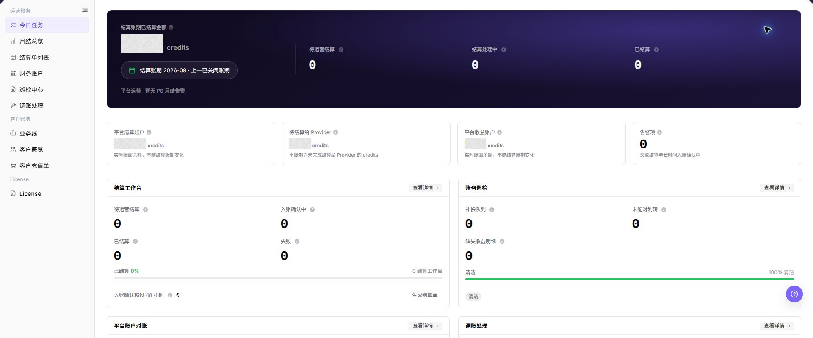

# 快速入门

::: info 文档信息
版本：v1.0
更新日期：2026-07-23
:::

## 功能概述

| 项目 | 内容 |
| --- | --- |
| 适用角色 | 模型调用方 / 模型提供方 / 运营管理员 |
| 导航路径 | 用户手册 > 账务 > 快速入门 |
| 页面路由 | `/zh-CN/usermanual/billing/getting-started/` |
| 指引对象 | 用户账务、模型提供方收益、客户账务、运营账务和 License 的阅读入口 |

#### 新手理解

账务像平台的财务服务台：模型调用方先看自己的余额、充值和账单，模型提供方看收益和结算，运营管理员看客户档案、结算单、财务账户和巡检结果，License 管理员负责确认资源授权是否有效。新手不要一上来就查单据，先判断问题属于“用户余额”“模型提供方收益”“客户充值”“账期结算”还是“资源授权”。

#### 术语速查

| 术语 | 含义 | 常见入口 |
| --- | --- | --- |
| Credits | 用于展示余额、充值和消费的计费单位。 | 我的账务、客户概览 |
| 账期 | 统计消费、充值、收益、结算和对账的时间范围。 | 月度账单、月结总览、结算单列表 |
| 充值订单 | 用户或客户发起充值后形成的处理记录。 | 充值订单、客户充值单 |
| 交易流水 | 余额、收入、支出或调整的逐笔变化记录。 | 流水明细、财务账户 |
| 结算单 | 某个租户在指定账期下的结算记录。 | 结算单列表、月度结算单 |
| License | 控制平台模块、资源额度和有效期的授权。 | License |

## 前提条件

1. 当前账号已具备对应账务菜单权限。
2. 已明确要处理的是用户账务、Provider 收益、客户账务、运营财务还是 License。
3. 涉及金额核对时，先统一账期、租户、客户、业务线和交易类型。
4. 涉及结算、调账、补偿、补建或 License 激活时，先确认审批依据和影响范围。
5. 对外沟通或截图前，确认账号、租户、流水号、订单号、金额和授权信息已脱敏。

## 页面说明

#### 30 秒速查

| 我是谁 | 先看什么 | 下一步 |
| --- | --- | --- |
| 模型调用方 | 先确认自己的余额、流水、充值订单和月度账单。 | 进入 [我的账务](../user/billing/overview/)。 |
| 模型提供方 | 先确认收益账户余额、收益出账、月度结算单和客户收益。 | 进入 [模型提供方收益](../user/earnings/revenue/)。 |
| 运营管理员 | 先确认客户档案、客户充值和业务线归属。 | 进入 [客户账务](../operator/customer-billing/customer-overview/)。 |
| 账务运营 | 先确认账期、月结进度、结算单和巡检状态。 | 进入 [运营财务](../operator/finance-operations/today-tasks/)。 |
| 财务对账人员 | 先确认账户流水、结算单和巡检异常。 | 进入 [财务账户](../operator/finance-operations/financial-accounts/)。 |
| License 管理员 | 先确认授权类型、额度、有效期和激活状态。 | 进入 [License](../operator/license/license/)。 |

#### 适用角色

| 角色 | 先关注什么 | 推荐入口 |
| --- | --- | --- |
| 模型调用方 | 自己的余额、流水、充值订单和月度账单。 | [我的账务](../user/billing/overview/) |
| 模型提供方 | 收益总览、收益账户出账、月度结算单和客户收益。 | [模型提供方收益](../user/earnings/revenue/) |
| 运营管理员 | 客户档案、客户充值单、业务线和支付渠道。 | [客户账务](../operator/customer-billing/customer-overview/) |
| 账务运营 | 今日任务、月结总览、结算单、财务账户和巡检。 | [运营财务](../operator/finance-operations/today-tasks/) |
| 财务对账人员 | 账户流水、结算单、巡检异常和调账记录。 | [财务账户](../operator/finance-operations/financial-accounts/) |
| License 管理员 | 授权类型、额度、有效期和激活状态。 | [License](../operator/license/license/) |

#### 账务是什么

账务是平台内围绕余额、充值、消费、收益、结算、对账、调账和 License 授权形成的统一入口。它不直接替代业务订单或外部支付系统，而是把用户侧账单、模型提供方收益、运营侧财务处理和授权状态串联起来。

#### 用户侧与运营侧边界

| 能力 | 用户侧 | 运营侧 |
| --- | --- | --- |
| 余额与流水 | 查看当前账号或租户可见的数据。 | 按客户、租户、业务线和账期核对。 |
| 充值订单 | 查看自己的充值记录和处理状态。 | 查看客户充值单、支付渠道和处理状态。 |
| 月度账单 | 查看用户侧账期汇总。 | 推进月结总览、结算单和财务账户核对。 |
| 模型提供方收益 | 查看收益总览、月度结算单和客户收益。 | 核对平台财务账户、结算单和巡检结果。 |
| 异常处理 | 提交余额、订单或账单异常线索。 | 通过巡检中心、补偿队列和调账处理闭环。 |
| License | 判断资源授权是否可用。 | 查看授权额度、有效期和激活状态。 |

#### 推荐阅读路径

| 目标 | 先看哪里 | 下一步 |
| --- | --- | --- |
| 了解账务边界 | [概览](../) | 继续阅读本快速入门页。 |
| 核对个人余额和充值 | [我的账务](../user/billing/overview/) | 进入账户概览、流水明细或充值订单。 |
| 核对模型提供方收益 | [模型提供方收益](../user/earnings/revenue/) | 进入收益总览、月度结算单或客户总览。 |
| 处理客户充值问题 | [客户账务](../operator/customer-billing/customer-overview/) | 进入客户概览、客户充值单或业务线。 |
| 推进账期结算 | [运营账务](../operator/finance-operations/today-tasks/) | 进入月结总览、财务账户、巡检中心和结算单列表。 |
| 完成对账闭环 | [完成一次账期对账与结算](../end-to-end/reconcile-billing-cycle/) | 按任务、账户、巡检和结算单顺序执行。 |
| 处理资源授权 | [License](../operator/license/license/) | 核对授权额度、有效期和激活状态。 |

## 主要操作

### 选择账务入口

1. 按角色和目标选择对应功能页。
2. 进入页面后核对标题、账期和对象范围。
3. 按具体功能页的主要操作继续处理。

上图展示该流程步骤对应的页面入口或当前状态，重点核对页面标题、目标记录和可见操作。

## 参数速查表

| 字段名称 | 是否必填 | 字段类型 | 示例 | 说明 |
| --- | --- | --- | --- | --- |
| 角色 | 必填 | 枚举 | `普通用户` | 用于判断先读用户侧、Provider 收益、运营侧还是 License。 |
| 问题关键词 | 必填 | 文本 | `余额不一致` | 用于快速定位推荐入口。 |
| 账期 | 条件必填 | 月份 | `2026-07` | 金额核对前必须确认。 |
| 业务范围 | 条件必填 | 文本 | `脱敏业务线` | 用于避免跨租户、跨客户或跨业务线比较。 |
| 推荐入口 | 系统生成 | 链接 | `我的账务` | 根据角色和问题类型继续阅读。 |

## 踩坑提示

- 快速入门只负责选路，不替代具体功能页的金额核对和字段解释。
- 看到金额不一致时先统一账期、租户、客户、业务线和交易类型，再比较页面数据。
- License 正常只说明授权链路可用，不能证明充值、消费、收益、结算或账户流水正确。
- 不记录真实租户、客户名、账号、邮箱、金额、订单号、流水号、License 注册码、激活码、Token 或 Key。

## 结果校验

| 检查项 | 成功表现 | 异常时处理 |
| --- | --- | --- |
| 入口选对 | 能判断问题属于用户账务、Provider 收益、客户账务、运营财务或 License。 | 回到角色入口表重新定位。 |
| 账期明确 | 金额核对前已确认目标账期。 | 先统一账期再比较数据。 |
| 页面可访问 | 推荐入口均能正常打开。 | 检查账号权限和菜单范围。 |
| 下一步清楚 | 能根据问题类型进入具体功能页。 | 按推荐阅读路径继续处理。 |

## 常见问题

#### 不知道先看用户侧还是运营侧怎么办？

**问题现象：**

只知道账务数据有疑问，但不确定应该进入用户侧账务还是运营侧账务。

**可能原因：**

用户侧页面关注当前账号能看到的余额、充值和账单；运营侧页面关注客户、租户、结算、账户流水和异常处理。

**处理方式：**

如果问题来自某个用户自己看余额或充值，先看 [我的账务](../user/billing/overview/)；如果要核对客户、租户、结算单、财务账户或巡检异常，进入 [运营财务](../operator/finance-operations/today-tasks/) 或 [客户账务](../operator/customer-billing/customer-overview/)。

#### 余额、流水和月度账单为什么对不上？

**问题现象：**

账户概览、流水明细和月度账单看到的金额不一致。

**可能原因：**

页面统计口径不同，或账期、交易时间、账号、项目、业务线筛选条件不一致，也可能存在同步延迟。

**处理方式：**

先统一账期和筛选条件；再用流水明细定位单笔变化；最后用月度账单核对账期汇总。仍不一致时，由运营人员进入财务账户和巡检中心继续排查。

#### License 正常但账务仍异常怎么办？

**问题现象：**

License 显示有效，但充值、余额、结算或流水仍存在异常。

**可能原因：**

License 只说明资源授权状态，不代表账务链路已经完成结算、入账或对账。

**处理方式：**

资源授权问题看 License；金额、充值、流水、结算问题进入用户账务、客户账务或运营财务。不要用 License 状态替代账务核对结果。

#### 推荐入口没有权限怎么办？

**问题现象：**

按快速入门选择页面后，左侧菜单中没有对应入口。

**可能原因：**

- 当前角色不具备该模块权限。
- 所选入口属于另一业务身份。

**处理方式：**

1. 重新确认当前角色和要处理的问题对象。
2. 选择当前角色可见的同类入口。
3. 确需跨角色处理时，由授权人员核对角色和菜单权限。

#### 可以直接在快速入门中执行高风险操作吗？

**问题现象：**

已经找到推荐入口，但不确定是否能直接执行充值、结算、调账或激活。

**可能原因：**

- 快速入门只负责选择路径，不提供业务审批依据。
- 高风险操作仍需在具体功能页核对对象、状态和影响范围。

**处理方式：**

1. 打开对应具体功能页。
2. 阅读该页前提条件、操作步骤和注意事项。
3. 确认权限、审批依据和影响范围后，再按业务流程执行。
## 注意事项

- 快速入门只帮助选择路径，不替代具体功能页的字段说明、操作步骤和审批要求。
- 用户账务、Provider 收益、客户账务、运营财务和 License 是不同视角，看到的数据范围和权限边界可能不同。
- 涉及充值、结算、调账、补偿、补建或授权变更时，应进入对应功能页确认状态和处理记录。

## 后续操作

- 需要用户自查余额、充值和账单，进入 [我的账务](../user/billing/overview/)。
- 需要 Provider 核对收益和结算，进入 [Provider 收益](../user/earnings/revenue/)。
- 需要运营核对客户和充值，进入 [客户账务](../operator/customer-billing/customer-overview/)。
- 需要推进结算、巡检和调账，进入 [运营财务](../operator/finance-operations/today-tasks/)。
- 需要完成账期闭环，进入 [完成一次账期对账与结算](../end-to-end/reconcile-billing-cycle/)。
- 需要确认资源授权，进入 [License](../operator/license/license/)。
