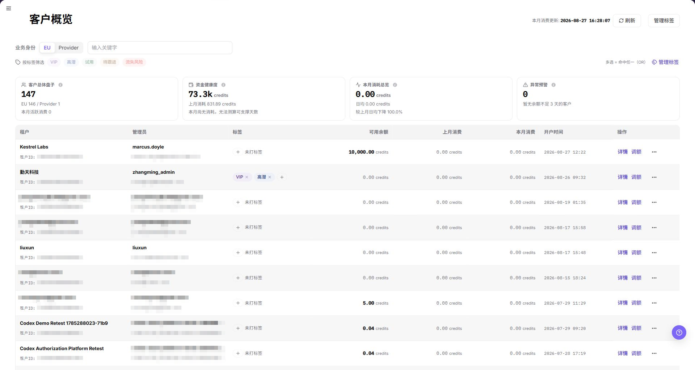
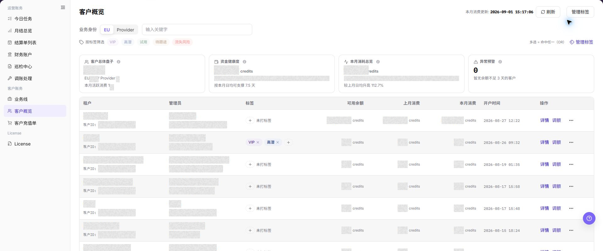

# 客户概览

::: info 文档信息
版本：v1.0
更新日期：2026-07-29
:::

## 功能概述

| 项目 | 内容 |
| --- | --- |
| 适用角色 | 运营管理员 |
| 导航路径 | 账务 > 客户账务 > 客户概览 |
| 页面路由 | `/billing/customers/overview` |
| 管理对象 | 客户档案、客户标签、客户余额 |

`客户概览` 用于在客户账务下查看所有客户档案、标签和消费信息。运营方可以通过该页面快速定位客户、给客户打标签、查看客户余额和消费情况，并为充值订单核对或投诉处理提供客户身份信息。

#### 新手理解

`客户概览` 像平台运营侧的 CRM 列表：它把客户租户、管理员、标签和消费情况汇总在一张表里，运营方可以按客户类型或标签筛选客户，并跳转到充值单等下游模块继续处理。

#### 术语速查

| 术语 | 含义 | 处理建议 |
| --- | --- | --- |
| 客户账户 | 平台中记录客户租户、管理员和余额的账户对象 | 排查前先确认客户身份 |
| 业务线 | 客户所属的计费或充值业务范围 | 余额异常时确认业务线是否一致 |
| Credits | 平台内用于余额和消费展示的单位 | 与充值单和月账单一起核对 |
| 透支额度 | 允许客户余额不足时继续消费的额度 | 额度异常时联系运营确认规则 |
| 账户状态 | 客户账户是否可正常使用 | 状态异常时先排查权限和业务线 |

## 前提条件

1. 当前账号具备客户账务查看权限。
2. 至少存在一个客户租户（已开户的客户）后列表才有数据。
3. 浏览器已登录平台运营方账号且会话未过期。

## 页面说明

页面顶部展示本月消费的更新时间，并提供刷新按钮。顶部右侧有 `管理标签` 按钮，点击后弹出 `标签管理` 弹窗。

摘要区新增四张 KPI 卡片：`客户总体数`、`资金健康度`、`本月消耗总额` 和 `异常预警`。这些卡片用于快速判断跨客户概况，不能替代逐行核对。

页面中部为筛选区，包含：

- 业务身份：下拉选择，通常包含 `EU`、`Provider` 等客户类型。
- 关键字：搜索租户 `Name`、租户 ID、管理员账号或其他可见客户身份字段。
- 标签筛选：多选标签按钮组，包含平台内置标签 `VIP`、`高潜`、`试用`、`待跟进`、`流失风险`，多选命中任一即匹配（OR 关系）。

多选标签按 OR 关系匹配：客户命中任一已选标签即可进入结果。列表中的租户、管理员和 Tenant ID 支持复制，复制到工单或文档前仍需使用脱敏值。

页面主体为客户列表，列包括：

| 字段 | 说明 |
| --- | --- |
| 租户信息 | 客户租户名称及 `Tenant ID`，可对可见身份值执行复制。 |
| 管理员信息 | 客户管理员账号、邮箱，可对可见身份值执行复制。 |
| 标签 | 已应用的客户标签。 |
| 客户可用余额 | 当前客户账户剩余 Credits。 |
| 上月花费 | 上一个自然月累计消费 Credits。 |
| 本月已花费 | 当前自然月累计消费 Credits。 |
| 开户时间 | 客户租户创建时间。 |
| 操作 | 行内操作通常包含 `详情`、`调额` 和按权限显示的更多菜单。 |

客户列表以租户 `Name` 作为客户展示口径。打开行内操作前，应先确认目标租户 `Name`。下图中的客户数据已脱敏。

## 主要操作

### 查看客户概览-EU

1. 进入 `账务 > 客户账务 > 客户概览`。
2. 在 `业务身份` 中选择 `EU`。
3. 按需输入租户 `Name`、客户 ID、管理员邮箱或标签等筛选条件。
4. 点击 **"搜索"**，查看 EU 客户列表。
5. 核对租户 `Name`、管理员、业务身份、标签、账户余额、消费情况和最近更新时间。

上图展示该操作对应的页面入口或当前状态，重点核对页面标题、目标记录和可见操作。

### 查看客户概览-Provider

1. 进入 `账务 > 客户账务 > 客户概览`。
2. 在 `业务身份` 中选择 `Provider`。
3. 按需输入租户 `Name`、客户 ID、管理员邮箱或标签等筛选条件。
4. 点击 **"搜索"**，查看 Provider 客户列表。
5. 核对租户 `Name`、管理员、业务身份、标签、账户余额、收益或消费相关信息和最近更新时间。

上图展示该操作对应的页面入口或当前状态，重点核对页面标题、目标记录和可见操作。

### 管理标签

1. 点击页面顶部 `管理标签` 按钮，打开 `标签管理` 弹窗。
2. 查看 `平台内置` 标签（`VIP`、`高潜`、`试用`、`待跟进`、`流失风险`），这类标签由平台锁定，不允许编辑。
3. 在 `自定义标签` 区域输入新标签名并点击 **"新建标签"**。
4. 点击 **"关闭"** 退出弹窗。

管理标签前，确认目标客户范围和账号权限；不要在手册、工单或评论中记录真实客户标签策略或内部运营备注。

上图展示该操作对应的页面入口或当前状态，重点核对页面标题、目标记录和可见操作。

### 查看账户调额弹窗

1. 使用租户 `Name` 定位目标客户。
2. 打开行内操作，并选择 `调额`。
3. 核对目标租户 `Name`、客户账号和账户类型。
4. 选择调额方式，并填写非空的 `调整额度`。
5. 核对弹窗预填的 `备注`，必要时替换为真实业务原因。
6. `备注` 必须保持非空；原因为空时系统会阻止提交。
7. 如仅验证页面，点击 **"取消"**。打开弹窗不代表已经完成调额。

## 参数速查表

| 字段名称 | 是否必填 | 字段类型 | 示例 | 说明 |
| --- | --- | --- | --- | --- |
| 业务身份 | 否 | 枚举 | `EU` | 选择客户业务身份过滤条件。 |
| EU | 系统枚举 | 枚举值 | `EU` | 表示 End User 客户视图，用于查看消费相关客户信息。 |
| Provider | 系统枚举 | 枚举值 | `Provider` | 表示服务提供方客户视图，用于查看收益或消费相关客户信息。 |
| 租户名称 | 否 | 文本 | `示例租户` | 按列表展示的租户 `Name` 定位客户。 |
| 客户 ID | 否 | 文本 | `customer-xxxx` | 用于按客户唯一标识定位目标客户，文档中只使用占位符。 |
| 管理员邮箱 | 否 | 文本 | `user@example.com` | 用于按客户管理员邮箱定位目标客户，截图或工单中必须脱敏。 |
| 标签 | 否 | 多选 | `VIP` | 多选标签按钮，命中任一即匹配。 |
| 账户余额 | 系统生成 | Credits | `10,000 Credits` | 当前客户账户剩余 Credits。 |
| 消费情况 | 系统生成 | Credits | `2,500 Credits` | 展示上月或本月消费相关金额。 |
| 收益信息 | 系统生成 | Credits | `1,000 Credits` | Provider 视图下的收益或结算相关信息。 |
| 最近更新时间 | 系统生成 | 时间 | `2026-07-10 12:00:00` | 客户概览数据最近更新的时间。 |
| 搜索 | 否 | 按钮 | `搜索` | 按当前筛选条件刷新客户列表。 |
| 重置 | 否 | 按钮 | `重置` | 清空筛选条件并恢复默认列表。 |
| 操作 | 系统生成 | 按钮 / 链接 | `详情` | 提供行内查看或后续处理入口。 |
| 调整额度 | 调额时必填 | 数字 | 脱敏金额 | 在调额弹窗中填写调整额度。 |
| 备注 | 调额时必填 | 多行文本 | `调额` | 记录业务原因；弹窗会预填，但内容必须保持非空。 |

## 踩坑提示

- 平台内置标签由平台锁定，不允许编辑或删除。
- 自定义标签名称建议稳定命名，避免频繁修改。
- 业务身份下拉为空通常表示当前账号没有该客户类型的权限。
- 关键字搜索默认匹配租户信息和管理员信息，不匹配备注字段。
- 客户名称、管理员邮箱、客户 ID、账户余额、消费金额、收益金额属于敏感信息，截图、导出文件、工单和评论必须脱敏。
- 导出客户数据前，确认筛选范围和接收方权限，并对客户身份、账号和金额脱敏。
- 打开调额弹窗不会改变账户；只有最终确认后才会提交变更。
- 调额原因为空时系统会阻止提交。最终确认前应核对预填备注。

## 结果校验

| 检查项 | 成功表现 | 异常时处理 |
| --- | --- | --- |
| 筛选生效 | 列表按筛选条件刷新 | 清空筛选条件后重新查询 |
| 详情可达 | 点击 **"详情"** 可以进入客户下钻信息 | 检查客户权限和详情入口 |
| 标签可见 | 打开 `管理标签` 弹窗后可以看到平台内置标签和已有自定义标签 | 检查标签管理权限 |

## 常见问题

#### 列表为空

**问题现象：**

进入页面后客户列表为空。

**可能原因：**

- 客户尚未开户。
- 当前账号没有该业务身份的查看权限。
- 筛选条件过窄。

**处理方式：**

1. 清空筛选条件后刷新。
2. 切换 `业务身份` 或切换账号确认权限。
3. 如确认无客户，前往其他模块核对开户流程。

#### 标签管理打不开

**问题现象：**

点击 **"管理标签"** 没有弹出弹窗。

**可能原因：**

- 当前账号缺少标签管理权限。
- 浏览器拦截了弹窗。

**处理方式：**

1. 刷新页面后再次点击。
2. 检查浏览器是否禁用弹窗或脚本。
3. 联系平台管理员确认账号权限。

#### 自定义标签保存失败

**问题现象：**

新建标签时输入名称后保存不生效。

**可能原因：**

- 标签名称超过 16 字限制。
- 该客户已存在 5 个标签，达到上限。
- 标签名称与内置标签重名。

**处理方式：**

1. 缩短标签名称，建议使用稳定可识别的命名。
2. 检查该客户当前标签数量，删除冗余标签后再试。
3. 改名后再次新建。

#### 客户概览状态刷新后仍未更新怎么办？

**问题现象：**

完成相关处理后，客户概览中的金额、数量或状态仍保持不变。

**可能原因：**

- 当前账期、租户、客户或业务范围与处理对象不一致。
- 上游统计、入账或结算任务仍在处理中。
- 当前账号只能看到部分数据范围。

**处理方式：**

1. 重新核对客户概览中的账期和对象范围。
2. 刷新页面并重新进入目标记录，确认更新时间。
3. 在客户充值单和业务线中交叉核对上游状态。
4. 仍未更新时，提交脱敏后的账期、对象标识、状态和更新时间给授权人员排查。

#### 共享客户概览信息前需要注意什么？

**问题现象：**

需要通过截图、工单或报告共享客户概览中的核对结果。

**可能原因：**

- 客户名称、管理员、标签、金额和账号可能属于敏感账务信息。
- 共享范围可能超过接收方的业务权限。
- 完整截图可能同时包含账号、环境或其他无关信息。

**处理方式：**

1. 只保留排查必需的字段、状态和时间范围。
2. 使用规定的浅灰不透明小颗粒马赛克精准覆盖敏感文字和数值。
3. 确认截图未包含顶部账号、环境信息、真实凭证或内部地址。
4. 按最小接收范围发送，并在记录中说明脱敏范围。
## 注意事项

- 客户列表包含客户邮箱、租户 ID 等敏感信息，禁止截图外传。
- 标签会影响客户后续充值核对与统计口径，调整前应确认影响范围。
- 修改或删除标签前，请先确认是否需要保留历史统计。
- 不记录真实客户名、租户名、客户 ID、邮箱、手机号、账户余额、消费金额、收益金额、订单号、Token 或 Key。
- 导出客户数据前，确认筛选范围和接收方权限，并对客户身份、账号和金额脱敏。

## 后续操作

- 处理充值相关任务，跳转到 [客户充值单](../top-up-orders/)。
- 维护客户业务线配置，跳转到 [业务线](../business-units/)。
