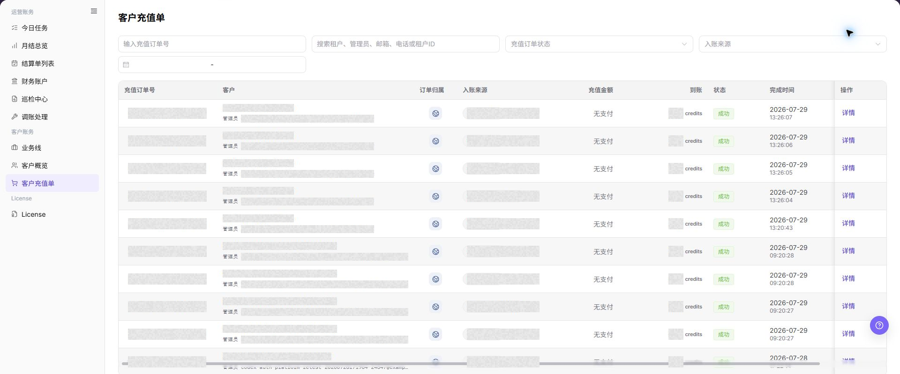
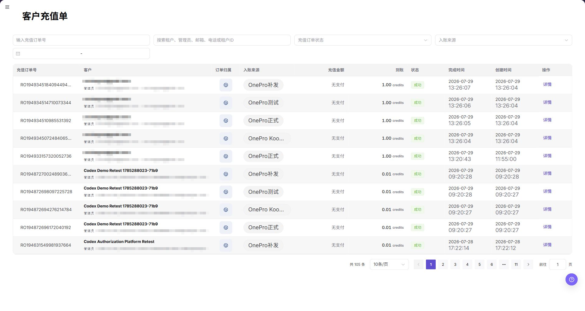

# 客户充值单

::: info 文档信息
版本：v1.0
更新日期：2026-08-27
:::

## 功能概述

| 项目 | 内容 |
| --- | --- |
| 适用角色 | 运营管理员 |
| 导航路径 | 账务 > 客户账务 > 客户充值单 |
| 页面路由 | `/billing/customers/top-ups/orders` |
| 管理对象 | 充值订单、支付渠道、客户余额变动 |

`客户充值单` 汇总客户充值订单列表。运营方可以在该页面按订单号、客户和状态筛选充值记录，核对入账来源、充值金额、到账 credits、订单状态和创建时间，并通过 `详情` 入口查看单笔充值单。

#### 新手理解

`客户充值单` 像平台的充值流水台账：客户完成充值后，订单会出现在该页面。运营方通过筛选和详情入口核对充值来源、金额、到账 credits 和状态，用于客户余额问题排查和资金流水核对。

#### 术语速查

| 术语 | 含义 | 处理建议 |
| --- | --- | --- |
| 充值单 | 客户充值产生的订单记录 | 用订单号定位问题 |
| 支付渠道 | 充值使用的第三方或平台渠道 | 渠道异常时核对上游状态 |
| 入账来源 | 订单资金进入平台的来源 | 与财务账户流水一起核对 |
| 审批状态 | 充值单是否已完成审核或处理 | 状态异常时不要直接修改余额 |
| 币种 | 充值金额使用的货币类型 | 与到账 Credits 分开核对 |

## 前提条件

1. 当前账号具备客户充值单查看权限。
2. 至少存在一个客户或充值订单后，列表才会有数据。
3. 浏览器已登录平台运营方账号且会话未过期。

## 页面说明

筛选区位于表格上方。除充值订单号外，当前页面还支持按租户、管理员、邮箱、电话或 Tenant ID 搜索，再按订单状态、充值来源和日期范围缩小结果。识别外部创建的充值订单时，应结合订单范围、充值来源、外部引用信息和渠道文本。

| 字段 | 说明 |
| --- | --- |
| 充值订单号 | 支持按订单号搜索。 |
| 客户身份 | 支持按租户、管理员、邮箱、电话或 Tenant ID 搜索。 |
| 充值订单状态 | 下拉选择订单状态。 |
| 充值来源 | 下拉选择充值订单来源。 |
| 日期范围 | 限制订单创建或完成时间范围。 |

订单表格列：

| 字段 | 说明 |
| --- | --- |
| 充值订单号 | 系统生成的订单号。 |
| 客户 | 客户租户和管理员账号。 |
| 订单范围 | 订单所属的业务范围。 |
| 充值来源 | 充值渠道或受控来源，例如 `新用户注册`、`Stripe`、`KooGallery`。 |
| 支付金额 | 按订单原币种显示。 |
| 到账 Credits | 实际到账 Credits。 |
| 状态 | 订单状态，常见值包括 `成功`、`已取消`。 |
| 完成时间 | 订单完成时间，对应页面 `Completed At`。 |
| 创建时间 | 订单创建时间，对应页面 `Created At`。 |
| 操作 | 行内操作，通常包含 `详情`。 |

::: tip 表格列与横向可视区
充值单表格始终包含上述字段。受界面语言和可用宽度影响，较长的英文列名可能使 `Completed At`、`Created At` 落在初始横向可视区之外，而固定的 `Actions` 列仍显示在右侧。需要核对时间字段时，请横向滚动表格。下方中文截图展示全部时间列，英文截图未出现时间列不代表字段已删除。
:::

列表截图放在主要操作步骤下。截图数据已遮挡，避免暴露客户和订单信息。

页面截图：

上图展示该操作对应的页面入口或当前状态，重点核对页面标题、目标记录和可见操作。

## 主要操作

### 查看客户充值单

1. 进入 `账务 > 客户账务 > 客户充值单`。
2. 选择时间范围，并按客户、订单号、状态、支付渠道或入账结果筛选。
3. 核对订单创建时间、客户、金额方向、状态和完成时间。
4. 无结果时检查时区并重置筛选；订单和客户信息在截图或导出前必须脱敏。

上图展示该操作对应的页面入口或当前状态，重点核对页面标题、目标记录和可见操作。

### 核对充值单与账户入账

1. 打开目标充值单详情，记录脱敏订单号、状态和到账时间。
2. 对照客户账户或流水明细确认对应入账记录和金额方向。
3. 一致时订单状态和账户流水应能相互追溯；不一致时检查支付状态和数据刷新时间。
4. 不通过重复充值、补单或调账来验证异常，交由有权限人员处理。

上图展示该操作对应的页面入口或当前状态，重点核对页面标题、目标记录和可见操作。

### 查看充值单详情

1. 进入 `账务 > 客户账务 > 客户充值单`。
2. 按需输入 `充值订单号`、租户、管理员、邮箱、电话、Tenant ID、订单状态、充值来源或日期范围等筛选条件。
3. 点击 **"搜索"**，查看客户充值单列表。
4. 在列表中核对订单号、客户、订单范围、充值来源、支付金额、到账 Credits、状态、完成时间和创建时间；时间列不在初始可视区时，请横向滚动表格。
5. 外部创建的订单应结合来源、外部引用信息和渠道文本核对。
6. 如需核对单笔充值，点击目标订单对应的 `详情`。
7. 对照客户概览、财务账户或支付流水，确认客户余额和充值订单状态是否一致。

## 参数速查表

| 字段名称 | 是否必填 | 字段类型 | 示例 | 说明 |
| --- | --- | --- | --- | --- |
| 充值订单号 | 否 | 文本 | `TOPUP-202607080001` | 精确匹配客户充值订单号，文档中只使用占位符。 |
| 租户 / 管理员 / 邮箱 / 电话 / Tenant ID | 否 | 文本 | `示例租户` | 按页面可见的客户身份字段定位充值订单。 |
| 充值订单状态 | 否 | 枚举 | `成功` | 下拉选择订单状态。 |
| 支付金额 | 系统生成 | 金额 | `USD 100.00` | 按订单原币种显示支付金额。 |
| 到账 Credits | 系统生成 | Credits | `1,000 Credits` | 实际到账 Credits。 |
| 支付渠道 | 系统生成 | 枚举 | `Stripe` | 展示充值资金来源或支付渠道。 |
| 订单范围 | 系统生成 | 标签 | 按页面展示 | 标识订单所属的业务范围。 |
| 充值来源 | 系统生成 | 文本 | 按页面展示 | 标识订单来源或受控渠道。 |
| 外部引用信息 | 系统生成 | 文本 | 脱敏值 | 用于匹配外部系统创建的订单。 |
| 创建时间 | 系统生成 | 时间 | `2026-07-10 12:00:00` | 充值订单创建时间，对应页面 `Created At`。 |
| 完成时间 | 系统生成 | 时间 | `2026-07-10 12:10:00` | 充值订单完成时间，对应页面 `Completed At`。 |
| 详情 | 否 | 链接 / 按钮 | `详情` | 查看单笔客户充值单明细。 |
| 搜索 | 否 | 按钮 | `搜索` | 按当前筛选条件刷新客户充值单列表。 |
| 重置 | 否 | 按钮 | `重置` | 清空筛选条件并恢复默认列表。 |

## 踩坑提示

- `已取消` 订单不会到账，需要联系客户或上游渠道核对。
- 入账来源为 Stripe 等第三方渠道时，金额按订单原币种展示，平台换算为 credits；币种与到账 credits 不一致属于正常情况。
- 充值订单号不要与支付流水号混淆，二者属于不同对象。
- 较长渠道值可能换行显示，不能仅因换行判断为不同订单。
- 充值订单包含客户身份、订单号、金额、支付渠道和到账信息，截图和工单必须脱敏。
- 导出充值单数据前，确认数据范围和接收方权限，并对客户身份、订单号和金额脱敏。

## 结果校验

| 检查项 | 成功表现 | 异常时处理 |
| --- | --- | --- |
| 筛选生效 | 列表按筛选条件刷新 | 清空筛选条件后重新查询 |
| 详情完整 | 订单详情展示订单金额、状态、支付渠道和关联客户 | 检查订单权限和详情入口 |
| 入账一致 | 订单状态、完成时间和到账 Credits 与上游支付或客户余额变化一致 | 核对支付渠道和客户余额记录 |

## 常见问题

#### 订单列表为空

**问题现象：**

进入充值订单列表后没有任何记录。

**可能原因：**

- 当前账期或时间范围内没有充值订单。
- 筛选条件过窄。

**处理方式：**

1. 清空筛选条件后刷新。
2. 确认客户是否完成过充值。
3. 前往 `客户概览` 核对客户档案。

#### 审核或资金状态与预期不一致

**问题现象：**

充值订单状态、到账 credits 或完成时间与客户反馈不一致。

**可能原因：**

- 上游支付渠道同步延迟。
- 订单被取消或未完成支付。
- 客户可能在查看其他业务线或其他账号下的充值记录。

**处理方式：**

1. 使用充值订单号重新搜索。
2. 进入 `运营财务 > 财务账户` 核对入账流水。
3. 与客户确认充值账号、业务线和支付渠道。

#### 客户余额未更新

**问题现象：**

订单显示成功后客户账户余额没有变化。

**可能原因：**

- 订单仍在处理中，平台尚未完成入账。
- 订单所属业务线被禁用或额度受限。

**处理方式：**

1. 等待片刻后刷新页面。
2. 进入 `运营财务 > 财务账户` 核对入账流水。
3. 检查业务线状态，必要时联系平台管理员。

#### 客户充值单状态刷新后仍未更新怎么办？

**问题现象：**

完成相关处理后，客户充值单中的金额、数量或状态仍保持不变。

**可能原因：**

- 当前账期、租户、客户或业务范围与处理对象不一致。
- 上游统计、入账或结算任务仍在处理中。
- 当前账号只能看到部分数据范围。

**处理方式：**

1. 重新核对客户充值单中的账期和对象范围。
2. 刷新页面并重新进入目标记录，确认更新时间。
3. 在客户概览和财务账户中交叉核对上游状态。
4. 仍未更新时，提交脱敏后的账期、对象标识、状态和更新时间给授权人员排查。

#### 共享客户充值单信息前需要注意什么？

**问题现象：**

需要通过截图、工单或报告共享客户充值单中的核对结果。

**可能原因：**

- 客户名称、订单号、金额、支付渠道和流水号可能属于敏感账务信息。
- 共享范围可能超过接收方的业务权限。
- 完整截图可能同时包含账号、环境或其他无关信息。

**处理方式：**

1. 只保留排查必需的字段、状态和时间范围。
2. 使用规定的浅灰不透明小颗粒马赛克精准覆盖敏感文字和数值。
3. 确认截图未包含顶部账号、环境信息、真实凭证或内部地址。
4. 按最小接收范围发送，并在记录中说明脱敏范围。
## 注意事项

- 充值订单包含买家姓名、订单号、金额等敏感信息，截图和工单应按最小必要原则脱敏。
- 处理退款、冲正或人工调整时，应通过平台官方流程，不要直接修改后台数据。
- 不记录真实客户名、客户 ID、手机号、邮箱、充值订单号、支付流水号、金额、支付凭证、账号、Token 或 Key。
- 不要把充值订单号和支付流水号混用。
- 导出充值单数据前，确认数据范围和接收方权限，并对客户身份、订单号和金额脱敏。

## 后续操作

- 核对充值到账情况，可前往 [客户概览](../customer-overview/) 查看客户余额。
- 处理与充值相关的资金流水，可前往 `运营财务 > 财务账户`。
