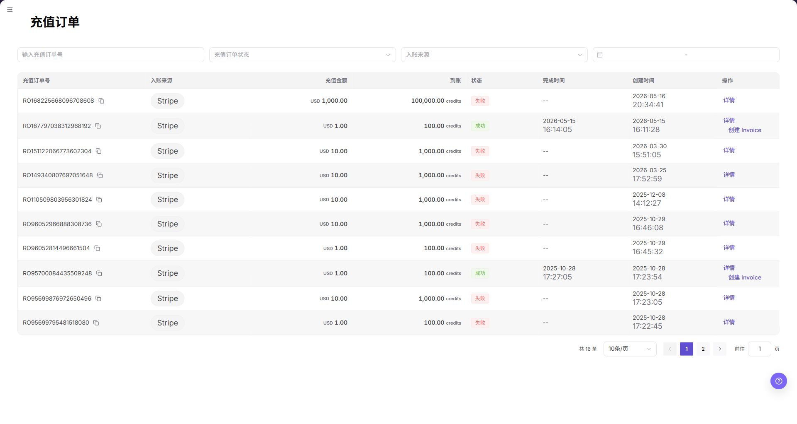

# 充值订单

::: info 文档信息
版本：v1.0
更新日期：2026-08-27
:::

## 功能概述

| 项目 | 内容 |
| --- | --- |
| 适用角色 | 模型调用方 |
| 导航路径 | 账务 > 用户账务 > 充值订单 |
| 页面路由 | `/billing/my/top-ups/orders` |
| 管理对象 | 充值订单、入账来源、充值金额、到账金额、订单状态 |

`充值订单` 用于查看当前账号发起或关联的充值记录，包括充值订单号、入账来源、充值金额、到账金额、订单状态、完成时间、创建时间和详情入口。用户可通过订单号、状态和入账来源定位充值是否处理完成。

#### 新手理解

充值订单像充值小票，用来确认哪笔充值已提交、是否到账、失败时去哪排查。余额未变化时，应先看订单是否成功，再看到账金额是否生成对应收入流水。

#### 术语速查

| 术语 | 含义 | 处理建议 |
| --- | --- | --- |
| 充值订单号 | 用户发起充值后形成的订单编号。 | 用脱敏订单号精确定位。 |
| 入账来源 | 充值资金来源或支付渠道。 | 与流水明细一起核对。 |
| 充值金额 | 用户发起充值的金额。 | 与支付结果和到账金额区分。 |
| 到账 | 充值完成后进入账户的额度或金额。 | 成功后仍可能有同步延迟。 |
| 订单状态 | 订单成功、失败、取消或处理中状态。 | 异常状态先看详情。 |

## 前提条件

1. 当前账号具备用户侧账务查看权限。
2. 已进入 `我的账务 > 充值订单`。
3. 查询订单前准备充值订单号、订单状态或入账来源。
4. 涉及重新充值、退款或异常处理时，应先确认订单状态和支付结果。

::: warning 高风险操作边界
充值、退款、重新支付、导出订单等动作可能影响真实资金或暴露敏感信息。本文只说明查询和查看边界，不指导真实提交。
:::

## 页面说明

页面包含筛选区和订单列表。筛选区支持 `充值订单号`、`充值订单状态`、`入账来源` 等条件，并提供 `搜索`、`重置` 和 `展开`。表格展示 `充值订单号`、`入账来源`、`充值金额`、`到账`、`状态`、`完成时间`、`创建时间` 和 `操作`，行内操作包含 `详情`。

下图展示充值订单列表，截图中的订单号和金额必须脱敏处理。

| 区域 | 说明 |
| --- | --- |
| 充值订单号 | 按订单号精确筛选充值订单。 |
| 订单状态 | 按充值订单处理状态筛选。 |
| 入账来源 | 按支付渠道或入账来源筛选。 |
| 搜索 | 按当前筛选条件查询订单列表。 |
| 重置 | 清空筛选条件并恢复默认列表。 |
| 展开 | 展开更多筛选条件。 |
| 订单列表 | 展示充值订单号、入账来源、充值金额、到账、状态、完成时间、创建时间和操作。 |
| 详情 | 查看充值订单详情。 |

## 主要操作

### 核对充值订单与账户流水

1. 打开目标充值订单详情，记录脱敏订单号、状态和完成时间。
2. 进入流水明细，使用相同时间范围定位对应入账记录。
3. 一致时订单状态、到账金额方向和流水时间应能相互追溯。
4. 不一致时检查支付状态和数据刷新时间，不重复发起充值或补单。

上图展示该操作对应的页面入口或当前状态，重点核对页面标题、目标记录和可见操作。

### 查询充值订单

1. 进入 `账务 > 用户账务 > 充值订单`。
2. 输入 `充值订单号`，或选择订单状态、入账来源。
3. 点击 **"搜索"**。
4. 查看订单列表中的充值金额、到账金额和状态。
5. 如需清空条件，点击 **"重置"**。

上图展示该操作对应的页面入口或当前状态，重点核对页面标题、目标记录和可见操作。

### 查看订单详情

1. 进入 `账务 > 用户账务 > 充值订单`。
2. 在目标订单行点击 **"详情"**。
3. 查看订单状态、入账来源、金额、到账信息、创建时间和完成时间。
4. 如订单失败或取消，保留脱敏订单号并联系运营方核对。
5. 对外沟通时隐藏真实订单号、支付流水号、账号、邮箱、金额和支付凭证。

上图展示该操作对应的页面入口或当前状态，重点核对页面标题、目标记录和可见操作。

## 参数速查表

| 字段名称 | 是否必填 | 字段类型 | 示例 | 说明 |
| --- | --- | --- | --- | --- |
| 充值订单号 | 否 | 文本 | 脱敏订单号 | 用于精确定位单笔充值订单。 |
| 充值订单状态 | 否 | 枚举 | 已取消、失败 | 用于按处理状态筛选订单。 |
| 入账来源 | 否 | 枚举 | 脱敏来源 | 展示或筛选充值来源。 |
| 搜索 | 否 | 按钮 | 搜索 | 按筛选条件刷新订单列表。 |
| 重置 | 否 | 按钮 | 重置 | 清空筛选条件。 |
| 展开 | 否 | 按钮 | 展开 | 展开更多筛选条件。 |
| 充值金额 | 系统生成 | 金额 | 脱敏金额 | 用户发起充值的支付金额。 |
| 到账 | 系统生成 | Credits / 金额 | 脱敏金额 | 充值完成后到账额度。 |
| 状态 | 系统生成 | 枚举 | 已完成 | 展示充值订单处理状态。 |
| 完成时间 | 系统生成 | 时间 | 脱敏时间 | 订单完成或结束时间。 |
| 创建时间 | 系统生成 | 时间 | 脱敏时间 | 订单创建时间。 |
| 详情 | 否 | 入口 | 详情 | 查看充值订单详情。 |

## 踩坑提示

- 充值成功不等于额度立即到账，余额和流水可能存在短暂同步延迟。
- 订单号、支付流水号和账务流水号是不同对象，排查时不要混用。
- 订单失败或取消后不要立刻重复充值，应先确认是否实际扣款。
- 入账来源不同，到账时间和对账口径可能不同。
- 不记录真实账号、邮箱、订单号、流水号、金额、客户名、租户名、Token 或 Key。
- 截图、导出、工单和评论必须脱敏。

## 结果校验

| 检查项 | 成功表现 | 异常时处理 |
| --- | --- | --- |
| 页面加载 | 筛选区和充值订单列表正常显示。 | 刷新页面，或检查用户侧账务权限。 |
| 筛选可用 | 订单号、订单状态和入账来源可用于定位订单。 | 点击 **"重置"** 后重新筛选。 |
| 列表字段可见 | 充值订单号、入账来源、金额、状态和时间字段可见。 | 调整筛选条件后重试。 |
| 详情可查看 | 行内 `详情` 可打开订单信息。 | 检查权限或页面加载状态。 |
| 资金动作受控 | 重新充值、退款和订单导出均由具备权限的人员按确认范围执行。 | 如发生非预期操作，立即记录时间和范围并通知负责人复核。 |

## 常见问题

#### 找不到充值订单

**问题现象：**

输入充值订单号后列表为空。

**可能原因：**

订单号输入错误、筛选条件过多，或当前账号不是该订单归属账号。

**处理方式：**

清空筛选条件后重新查询；核对订单号；仍无法找到时使用脱敏订单号联系运营方。

#### 订单失败或已取消

**问题现象：**

订单状态显示失败或已取消。

**可能原因：**

支付未完成、支付渠道返回失败、订单超时或被取消。

**处理方式：**

先确认是否实际扣款；不要重复提交相同订单；如已扣款但订单异常，联系运营方处理。

#### 充值成功但余额没有变化

**问题现象：**

订单看起来已完成，但账户概览余额没有变化。

**可能原因：**

到账处理存在延迟，或当前查看的账户、账期、流水口径不一致。

**处理方式：**

刷新账户概览；进入 `流水明细` 查看是否有收入记录；仍不一致时联系运营方核对。

#### 充值订单状态刷新后仍未更新怎么办？

**问题现象：**

完成相关处理后，充值订单中的金额、数量或状态仍保持不变。

**可能原因：**

- 当前账期、租户、客户或业务范围与处理对象不一致。
- 上游统计、入账或结算任务仍在处理中。
- 当前账号只能看到部分数据范围。

**处理方式：**

1. 重新核对充值订单中的账期和对象范围。
2. 刷新页面并重新进入目标记录，确认更新时间。
3. 在账户概览和流水明细中交叉核对上游状态。
4. 仍未更新时，提交脱敏后的账期、对象标识、状态和更新时间给授权人员排查。

#### 共享充值订单信息前需要注意什么？

**问题现象：**

需要通过截图、工单或报告共享充值订单中的核对结果。

**可能原因：**

- 订单号、金额、支付渠道、状态和账号可能属于敏感账务信息。
- 共享范围可能超过接收方的业务权限。
- 完整截图可能同时包含账号、环境或其他无关信息。

**处理方式：**

1. 只保留排查必需的字段、状态和时间范围。
2. 使用规定的浅灰不透明小颗粒马赛克精准覆盖敏感文字和数值。
3. 确认截图未包含顶部账号、环境信息、真实凭证或内部地址。
4. 按最小接收范围发送，并在记录中说明脱敏范围。
## 注意事项

- 充值订单号、支付来源、金额和到账信息属于敏感账务数据，截图和沟通时应脱敏。
- 不要在不确认支付结果的情况下重复发起充值。
- 涉及退款、重新支付、导出订单或异常入账时，应按平台流程由有权限人员处理。
- 重新充值、退款或导出前，确认目标订单、账号权限、金额和影响范围。

## 后续操作

1. 核对到账流水，进入 [流水明细](../transactions/)。
2. 查看余额变化，进入 [账户概览](../overview/)。
3. 做月度对账，进入 [月度账单](../monthly-bill/)。
