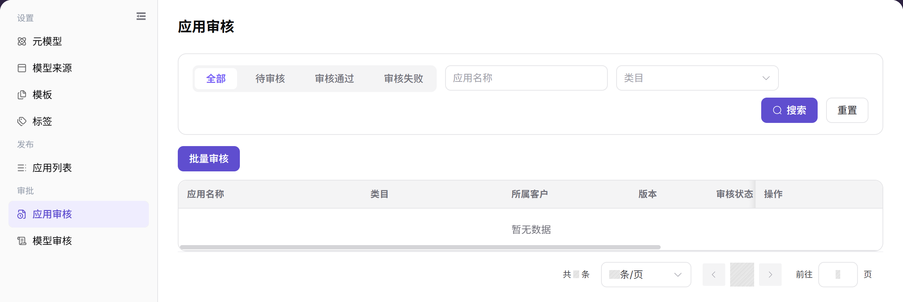

# 应用审核

::: info 文档信息
版本：v1.0
更新日期：2026-08-31
:::

## 功能概述

| 项目 | 内容 |
| --- | --- |
| 适用角色 | 运营管理员 |
| 导航路径 | 模型及AI服务 > 审批 > 应用审核 |
| 页面路由 | `/modelone/audit/app` |
| 管理对象 | 应用审核记录、应用配置、可见范围和审核意见 |

#### 新手理解

应用审核是应用向目标调用方展示前的检查关卡。运营管理员需要确认应用做什么、调用哪些模型、哪些客户或租户可以看到，以及提交信息是否完整，再给出审核结论。

#### 术语表

| 术语 | 英文 | 说明 |
| --- | --- | --- |
| 应用审核记录 | App review record | 应用提交或变更进入审核流程后生成的记录。 |
| 绑定模型 | Bound model | 应用配置中实际调用的模型或聚合模型。 |
| 可见范围 | Visibility scope | 应用发布后可以看到该应用的客户或租户集合。 |
| 审核意见 | Review comment | 通过、驳回或要求补充信息时记录的处理说明。 |

#### 推荐操作顺序

1. 使用状态页签和页面提供的筛选条件定位目标记录。
2. 点击 **"详情"**，将提交信息与审核标准逐项比对。
3. 点击 **"审核"**，记录明确结论并校验处理后的状态。

#### 小白先看

- 只想定位记录：使用 **"搜索"** 和 **"重置"**。
- 只想查看、不改变记录：使用 **"详情"**。
- 处理单条记录：使用 **"审核"**。
- 同时处理多条记录：确认选中数量后使用 **"批量审核"**。

## 前提条件

1. 当前账号具备应用审核权限。
2. 应用提交信息包含应用名称、版本、类目、绑定模型、发布渠道、可见范围和使用说明。
3. 作出结论前，已确认绑定模型状态、客户授权和应用发布的预期影响。

## 页面说明

页面按审核状态展示应用审核记录，并提供应用名称和类目筛选。列表展示应用名称、类目、所属客户、版本、审核状态、提交时间、审核时间和当前账号显示的操作。

页面截图：

截图重点展示状态页签、搜索条件、批量入口、结果表格和分页区域。截图使用中性空结果状态，不包含客户或环境数据。

## 主要操作

### 查询应用审核

1. 进入 `模型及AI服务 > 审批 > 应用审核`。
2. 选择审核状态：`全部`、`待审核`、`审核通过` 或 `审核失败`。
3. 输入应用名称或选择类目，点击 **"搜索"**，核对结果中的应用名称、类目、所属客户、版本、审核状态和提交时间。
4. 无结果时点击 **"重置"**，再逐项添加条件；存在重名时，比较版本和提交时间后再打开记录。

截图重点标注状态页签、应用名称和类目筛选、**"搜索"**、**"重置"** 以及结果表格。

### 查询应用审核详情

1. 定位目标记录，点击 **"详情"** 打开详情面板。
2. 按顺序查看 `审核信息`、`应用测试` 和 `应用详情` 页签。
3. 核对应用名称、版本、类目、发布渠道、发布方式、所属客户、应用配置、发布渠道详情和可见范围相关信息。
4. 将详情字段与列表记录对照。只读查看时点击 **"取消"** 或关闭面板，不提交审核结论。

截图重点标注详情页签、审核信息、应用配置、发布渠道和页面显示的审核操作。

### 审核应用

1. 定位审核状态合适的记录，点击 **"审核"**。
2. 查看 `审核信息`、`应用测试` 和 `应用详情`，确认应用用途、绑定模型、发布渠道、类目、可见范围和使用边界。
3. 提交信息完整且绑定模型可用时选择 **"通过"**；必需条件不满足时选择 **"拒绝"**。
4. 最终确认前核对目标应用、版本、审核意见和影响范围。拒绝时，在审核意见中写明缺失或错误项。
5. 提交后返回列表，在对应状态页签中确认记录已移动到预期状态。

截图重点标注审核面板底部的 **"拒绝"** 和 **"通过"** 操作。最终确认按钮的具体文案以当前页面为准。

### 批量审核应用

1. 将列表筛选到可以使用同一结论处理的记录。
2. 勾选目标行，核对选中数量以及每条记录的版本。
3. 点击 **"批量审核"**，在批量面板中核对记录、审核状态和审核意见。
4. 选择页面提供的审核结论，确认影响范围无误后再提交。
5. 刷新列表，在对应状态页签中逐条核对选中记录；仍为待审核的记录需要单独处理。

截图重点标注批量入口和用于选择记录的结果表格。分享批量审核截图前，不要保留客户敏感信息。

## 参数速查表

| 字段名称 | 是否必填 | 字段类型 | 示例 | 说明 |
| --- | --- | --- | --- | --- |
| 应用名称 | 系统展示 | 文本 | `示例应用` | 待审核应用的名称。 |
| 类目 | 系统展示 | 标签 | `文本生成` | 应用所属类目。 |
| 所属客户 | 系统展示 | 文本 | `租户A` | 应用关联的客户或租户。 |
| 版本 | 系统展示 | 文本 | `1.0.0` | 当前提交审核的应用版本。 |
| 审核状态 | 系统展示 | 枚举 | `待审核` / `审核通过` / `审核失败` | 当前审核记录的生命周期状态。 |
| 提交时间 | 系统展示 | 日期时间 | `2026-08-01 09:00:00` | 应用进入审核流程的时间。 |
| 审核时间 | 系统展示 | 日期时间 | `2026-08-01 09:10:00` | 记录审核结论的时间，未审核时为空或显示 `--`。 |
| 审核意见 | 条件必填 | 多行文本 | `请补充使用边界。` | 驳回或要求补充信息时填写的说明。 |
| 操作 | 按权限展示 | 按钮 | `详情` / `审核` | 只读查看或进入审核处理的入口。 |

## 踩坑提示

- 只按应用名称搜索可能返回多个版本，审核前要比较版本和提交时间。
- 应用审核通过但发布渠道或可见范围未完成时，调用方仍可能看不到应用；结论前要同时核对这两项。
- 绑定模型不可用、受限或被限流会改变应用审核风险，应在审核意见中明确说明。
- 应用说明和审核意见中不要写客户隐私、真实业务数据、完整请求头或真实凭证。
- 批量审核可能对多条记录应用同一结论，提交前必须核对选中数量和版本。

## 结果校验

| 检查项 | 成功表现 | 异常时处理 |
| --- | --- | --- |
| 应用审核页面可进入 | 页面路由正常加载，并显示应用审核标题、筛选区和表格。 | 检查当前账号的应用审核权限、侧栏入口和页面语言是否正确。 |
| 目标状态记录正常显示 | 选中的状态页签只展示与该状态匹配的记录。 | 点击 **"重置"** 后重新选择状态，并确认申请没有已被其他审核人处理。 |
| 应用名称和类目筛选可用 | 点击 **"搜索"** 后只返回符合应用名称和类目的记录。 | 清空名称、重新选择类目，逐项提交筛选条件，定位排除目标记录的条件。 |
| 应用审核详情可打开 | 点击 **"详情"** 后可查看审核信息、应用测试和应用详情，列表状态不变。 | 确认记录是否已处理或被移除，刷新列表后检查当前账号的查看权限。 |
| 审核结论已记录 | 记录进入 `审核通过` 或 `审核失败`，并显示审核时间；需要时同时显示审核意见。 | 重新打开记录检查结论表单、必填审核意见和权限，确认原状态后再提交。 |
| 批量审核已完成 | 选中的每条记录都进入预期状态，刷新后选中数量被清空。 | 对照状态结果核对选中记录，仍为待审核的记录改为单条审核。 |

## 常见问题

#### 查询不到应用审核记录

**问题现象：**

选择状态或输入应用名称后，列表为空。

**可能原因：**

- 当前状态或类目排除了目标记录。
- 应用名称与提交名称不一致。
- 记录已处理，或当前账号没有查看权限。

**处理方式：**

1. 点击 **"重置"**，选择 `全部`。
2. 只按应用名称搜索，再尝试类目筛选。
3. 仍无记录时，确认申请状态和应用审核权限。

#### 应用审核详情不完整

**问题现象：**

详情面板缺少预期页签或字段。

**可能原因：**

- 记录仍在加载。
- 提交信息本身不完整。
- 详情打开期间记录被其他审核人修改。

**处理方式：**

1. 关闭面板，刷新列表后重新打开。
2. 逐一查看详情页签，并与提交记录对照。
3. 确认字段确实缺失时，要求提交方补充信息。

#### 应用审核被拒绝

**问题现象：**

审核后，应用出现在 `审核失败` 状态中。

**可能原因：**

- 使用边界或应用配置不完整。
- 绑定模型不可用或超出允许范围。
- 可见范围或发布配置不符合审核标准。

**处理方式：**

1. 阅读记录中的审核意见。
2. 检查绑定模型、发布渠道和可见范围。
3. 要求提交方修正列出的项目后重新提交应用。

#### 审核通过后客户看不到应用

**问题现象：**

应用审核通过，但目标客户找不到应用。

**可能原因：**

- 发布尚未完成。
- 客户不在可见范围内。
- 发布同步存在延迟。

**处理方式：**

1. 检查应用发布状态。
2. 将客户租户与可见范围进行比对。
3. 刷新发布状态，同步完成后重新验证。

#### 应用审核通过后调用方无法使用

**问题现象：**

应用可见，但从应用发起模型调用失败。

**可能原因：**

- 绑定模型不可用或受限。
- 调用范围或模型权限不完整。
- 应用配置与选定的发布渠道不匹配。

**处理方式：**

1. 检查绑定模型状态和允许的调用范围。
2. 检查应用配置和发布渠道。
3. 查看调用日志，区分权限错误和模型服务错误。

#### 批量审核没有处理全部选中应用

**问题现象：**

批量审核后，部分选中记录仍为待审核。

**可能原因：**

- 选中记录的可处理状态不一致。
- 记录被其他审核人同时修改。
- 某条记录缺少必需信息，被批量操作校验拦截。

**处理方式：**

1. 刷新列表，对照选中记录的当前状态。
2. 对剩余记录点击 **"审核"**，阅读页面校验提示。
3. 补齐或记录缺失项后，单独处理该记录。

## 注意事项

- 应用用途、绑定模型、发布渠道和可见范围应作为一个整体审核。
- 审核意见应写明可执行的缺失项，不要包含隐私数据或真实凭证。
- 审核通过不等于发布完成，发布后仍需做调用验证。

## 后续操作

1. 进入应用发布页，确认通过的版本和可见范围。
2. 让模型调用方验证应用入口和绑定模型是否按预期显示。
3. 发布后查看调用日志和客户反馈。
