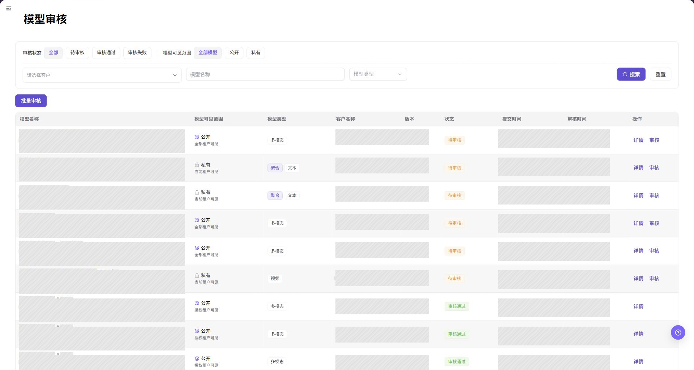
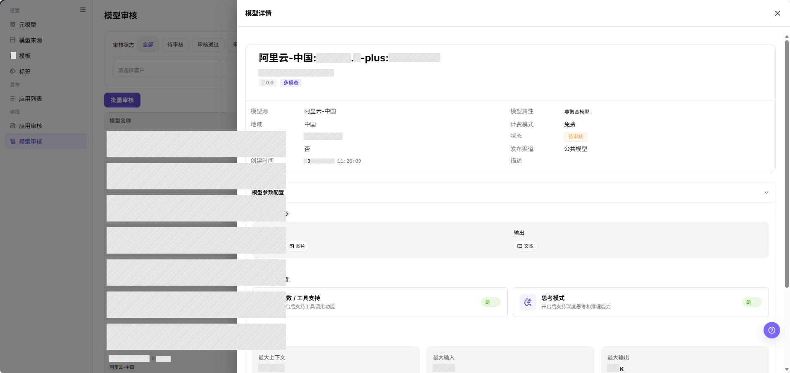
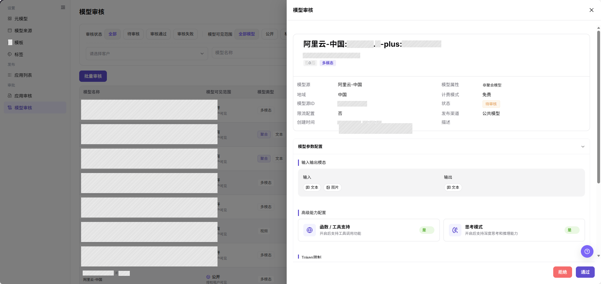
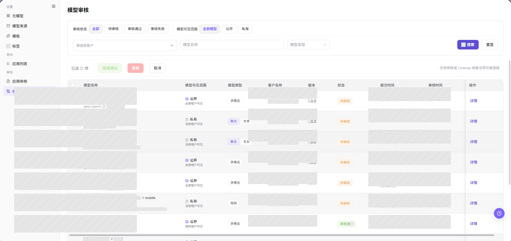

# 模型审核

::: info 文档信息
版本：v1.0
更新日期：2026-08-31
:::

## 功能概述

| 项目 | 内容 |
| --- | --- |
| 适用角色 | 运营管理员 |
| 导航路径 | 模型及AI服务 > 审批 > 模型审核 |
| 页面路由 | `/modelone/audit/model` |
| 管理对象 | 模型审核记录、模型来源配置、模型参数、可见范围和审核意见 |

#### 新手理解

模型审核是模型进入上架或调用流程前的检查关卡。运营管理员需要确认模型来源、能力配置、使用边界、计费和限流设置以及可见范围，再给出审核结论。

#### 术语表

| 术语 | 英文 | 说明 |
| --- | --- | --- |
| 模型审核记录 | Model review record | 模型发布或变更进入审核流程后生成的记录。 |
| 模型来源 | Model source | 发布模型使用的上游来源和地域配置。 |
| 模型参数配置 | Model parameter configuration | 模型输入输出模态、Token 限制、协议和能力设置。 |
| 可见范围 | Visibility scope | 模型发布后可以看到该模型的客户或租户集合。 |
| 审核意见 | Review comment | 通过、驳回或要求补充信息时记录的处理说明。 |

#### 推荐操作顺序

1. 使用审核状态、可见范围、客户、模型名称和模型类型控件定位目标记录。
2. 点击 **"详情"**，将模型基本信息和参数配置与审核标准逐项比对。
3. 点击 **"审核"**，记录明确结论并校验处理后的状态。

#### 小白先看

- 只想定位记录：使用 **"搜索"** 和 **"重置"**。
- 只想查看、不改变记录：使用 **"详情"**。
- 处理单条记录：使用 **"审核"**。
- 同时处理多条记录：确认选中数量后使用 **"批量审核"**。

## 前提条件

1. 当前账号具备模型审核权限。
2. 模型提交信息包含模型名称、来源、模型源 ID、地域、模型类型、可见范围、协议、输入输出模态、Token 限制、计费和限流设置。
3. 作出结论前，已确认模型授权范围、使用边界、预期成本影响和发布影响。

## 页面说明

页面按审核状态和模型可见范围展示模型审核记录，并提供客户、模型名称和模型类型筛选。列表展示模型名称、模型可见范围、模型类型、客户名称、版本、免费配额、状态、提交时间、审核时间和可用操作。

页面截图：

截图重点展示审核状态、模型可见范围、筛选条件、批量入口、结果表格和分页区域。截图使用中性空结果状态，不包含客户或环境数据。

## 主要操作

### 查询模型审核

1. 进入 `模型及AI服务 > 审批 > 模型审核`。
2. 选择审核状态：`全部`、`待审核`、`审核通过` 或 `审核失败`；再选择模型可见范围：`全部模型`、`公开` 或 `私有`。
3. 按需选择客户、输入模型名称或选择模型类型，点击 **"搜索"**。
4. 核对模型名称、可见范围、模型类型、客户、版本、免费配额、状态、提交时间和审核时间。无结果时点击 **"重置"**，再逐项添加条件。

截图重点标注审核状态、模型可见范围、客户、模型名称、模型类型、**"搜索"** 和 **"重置"** 控件。

### 查询模型审核详情

1. 定位目标记录，点击 **"详情"** 打开模型详情面板。
2. 核对模型名称、模型源、地域、模型源 ID、模型属性、计费模式、状态、发布渠道、免费配额和创建时间。
3. 展开 `模型参数配置`，查看输入输出模态、Token 限制、高级能力配置、协议和使用边界。
4. 将详情版本与列表版本对照。只读查看时关闭面板，不提交审核结论。

截图重点标注模型基本信息和用于详情核验的 `模型参数配置` 区域。

### 审核模型

1. 定位审核状态合适的记录，点击 **"审核"**。
2. 查看模型基本信息和 `模型参数配置`，确认来源、协议、模态、Token 限制、计费、限流、使用边界和可见范围一致。
3. 模型授权清晰、技术配置可用且具备发布条件时选择 **"通过"**；必需条件不满足时选择 **"拒绝"**。
4. 最终确认前核对目标模型、版本、审核意见和影响范围。拒绝时，在审核意见中写明缺失或错误项。
5. 提交后返回列表，在对应状态页签中确认记录已移动到预期状态。

截图重点标注审核面板底部的 **"拒绝"** 和 **"通过"** 操作。最终确认按钮的具体文案以当前页面为准。

### 批量审核模型

1. 将列表筛选到可以使用同一结论处理的记录。
2. 勾选目标行，核对选中数量、模型名称、版本和可见范围。
3. 点击 **"批量审核"**，在批量面板中核对记录、当前状态和审核意见。
4. 选择页面提供的审核结论，确认影响范围无误后再提交。
5. 刷新列表，在对应状态页签中逐条核对选中记录；仍为待审核的记录需要单独处理。

截图重点标注批量入口和用于选择记录的结果表格。分享批量审核截图前，不要保留客户敏感信息。

## 参数速查表

| 字段名称 | 是否必填 | 字段类型 | 示例 | 说明 |
| --- | --- | --- | --- | --- |
| 模型名称 | 系统展示 | 文本 | `示例模型:版本1` | 待审核模型的名称。 |
| 模型源 | 系统展示 | 文本 | `来源A` | 发布配置使用的上游模型来源。 |
| 地域 | 系统展示 | 文本 | `区域A` | 模型来源关联的地域。 |
| 模型源 ID | 系统展示 | 文本 | `模型ID-A` | 发布配置使用的来源侧模型标识。 |
| 模型可见范围 | 系统展示 | 枚举 | `公开` / `私有` | 模型的可见范围。 |
| 模型类型 | 系统展示 | 标签 | `文本` / `多模态` | 列表中展示的模型能力类型。 |
| 版本 | 系统展示 | 文本 | `1.0.0` | 当前提交审核的模型版本。 |
| 免费配额 | 系统展示 | 枚举 | `已启用` / `未启用` | 模型是否启用免费配额。 |
| 审核状态 | 系统展示 | 枚举 | `待审核` / `审核通过` / `审核失败` | 当前审核记录的生命周期状态。 |
| 提交时间 | 系统展示 | 日期时间 | `2026-08-01 09:00:00` | 模型进入审核流程的时间。 |
| 审核时间 | 系统展示 | 日期时间 | `2026-08-01 09:10:00` | 记录审核结论的时间，未审核时为空或显示 `--`。 |
| 审核意见 | 条件必填 | 多行文本 | `请补充使用边界。` | 驳回或要求补充信息时填写的说明。 |
| 操作 | 按权限展示 | 按钮 | `详情` / `审核` | 只读查看或进入审核处理的入口。 |

## 踩坑提示

- 模型名称不能替代完整审核材料，来源、协议、模态、Token 限制、计费、限流和使用边界都要可核对。
- 模型源 ID 不是凭证，审核意见中不得粘贴真实密钥、完整请求头或客户原始调用内容。
- 公开可见范围会扩大模型的可访问人群，通过前要确认授权范围和发布影响。
- Token 限制或输入输出模态与来源能力不一致，会导致调用失败或模型筛选结果错误。
- 批量审核可能对多条记录应用同一结论，提交前必须核对选中数量、版本和可见范围。

## 结果校验

| 检查项 | 成功表现 | 异常时处理 |
| --- | --- | --- |
| 模型审核页面可进入 | 页面路由正常加载，并显示模型审核标题、筛选区和表格。 | 检查当前账号的模型审核权限、侧栏入口和页面语言是否正确。 |
| 目标状态和可见范围记录正常显示 | 选中的审核状态和可见范围同时生效，列表记录符合两项条件。 | 点击 **"重置"** 后重新选择一个状态和一个可见范围，并确认申请没有已被处理。 |
| 客户、模型名称和模型类型筛选可用 | 点击 **"搜索"** 后返回符合客户及模型条件的记录。 | 清空筛选，只按模型名称搜索，再逐项加入客户和模型类型，定位排除目标的条件。 |
| 模型审核详情可打开 | 点击 **"详情"** 后可查看模型基本信息和参数配置，列表状态不变。 | 确认记录是否已处理或被移除，刷新列表后检查当前账号的查看权限。 |
| 审核结论已记录 | 记录进入 `审核通过` 或 `审核失败`，并显示审核时间；需要时同时显示审核意见。 | 重新打开记录检查结论表单、必填审核意见和权限，确认原状态后再提交。 |
| 批量审核已完成 | 选中的每条记录都进入预期状态，刷新后选中数量被清空。 | 对照状态结果核对选中记录，仍为待审核的记录改为单条审核。 |

## 常见问题

#### 查询不到模型审核记录

**问题现象：**

选择状态、可见范围、客户或模型类型后，列表为空。

**可能原因：**

- 状态和可见范围组合排除了目标记录。
- 模型名称或模型类型与提交记录不一致。
- 记录已处理，或当前账号没有查看权限。

**处理方式：**

1. 点击 **"重置"**，选择 `全部` 和 `全部模型`。
2. 只按模型名称搜索，再加入客户和模型类型筛选。
3. 仍无记录时，确认申请状态和模型审核权限。

#### 模型审核详情不完整

**问题现象：**

详情面板缺少预期的来源或参数信息。

**可能原因：**

- 记录仍在加载。
- 发布申请缺少模型信息。
- 详情打开期间记录被其他审核人修改。

**处理方式：**

1. 关闭面板，刷新列表后重新打开。
2. 展开 `模型参数配置`，逐项查看页面显示的区域。
3. 要求模型提供方补充缺失的来源、协议或能力信息。

#### 审核材料不足

**问题现象：**

审核记录缺少来源授权、协议信息、测试依据或使用边界。

**可能原因：**

- 模型提供方只提交了基本识别字段。
- 来源授权范围不清晰。
- 连通性或代表性调用验证未完成。

**处理方式：**

1. 按页面流程拒绝或退回申请。
2. 在审核意见中逐项列出缺失的授权、协议、测试或使用边界信息。
3. 补充信息后重新审核。

#### 审核通过后模型不可见

**问题现象：**

模型审核通过，但目标调用方在模型市场中找不到该模型。

**可能原因：**

- 模型尚未完成发布。
- 可见范围或发布渠道排除了调用方。
- 发布同步存在延迟。

**处理方式：**

1. 检查模型发布状态和发布渠道。
2. 将调用方租户与模型可见范围进行比对。
3. 刷新发布状态，同步完成后重新验证。

#### 审核通过后模型无法调用

**问题现象：**

模型已经通过审核并可见，但模型调用方调用失败。

**可能原因：**

- 模型来源不可用或协议路径不一致。
- 计费或限流配置不完整。
- 调用方缺少必要的可见或调用权限。

**处理方式：**

1. 检查模型来源状态和协议配置。
2. 检查计费模式、免费配额和限流配置。
3. 查看调用日志和调用方权限，区分访问错误与来源错误。

#### 批量审核没有处理全部选中模型

**问题现象：**

批量审核后，部分选中记录仍为待审核。

**可能原因：**

- 选中记录的可处理状态或可见范围条件不一致。
- 记录被其他审核人同时修改。
- 某条记录缺少必需信息，被批量操作校验拦截。

**处理方式：**

1. 刷新列表，对照选中记录的当前状态。
2. 对剩余记录点击 **"审核"**，阅读页面校验提示。
3. 补齐或记录缺失项后，单独处理该记录。

## 注意事项

- 来源授权、能力参数、发布范围、计费和限流应作为一个整体审核。
- 审核意见应写明可执行的缺失项，不要包含隐私数据或真实凭证。
- 审核通过不等于发布完成，发布后仍需做代表性调用验证。

## 后续操作

1. 进入模型发布页，确认通过的版本和可见范围。
2. 验证模型调用方可以发现模型并使用预期协议。
3. 发布后跟踪调用日志、计费结果和用户反馈。
