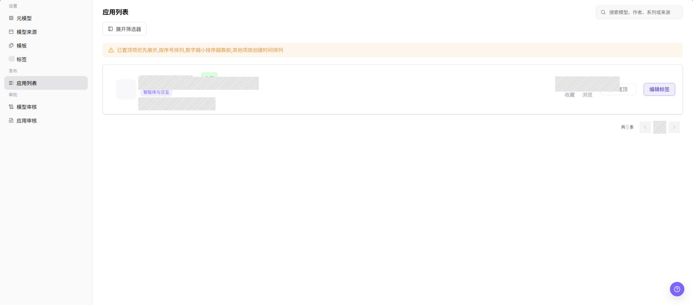

# 应用列表

::: info 文档信息
版本：v1.0
更新日期：2026-08-27
:::

## 功能概述

`应用列表` 用于查看已接入应用、模型权限、调用范围和发布记录，帮助运营管理员治理应用侧模型调用边界。

| 项目 | 内容 |
| --- | --- |
| 适用角色 | 运营管理员 |
| 导航路径 | 模型及AI服务 > 发布 > 应用列表 |
| 页面路由 | `/modelone/publish/application` |
| 管理对象 | 应用、模型权限、调用范围、状态和发布记录 |
| 典型途径 | 维护可调用模型服务的应用 |

#### 新手理解

应用发布像把模型能力包装成一个面向客户的入口。运营管理员关注的是应用信息、可见范围、调用模型和发布状态是否一致。

#### 术语速查

| 术语 | 说明 |
| --- | --- |
| 应用 | 面向客户封装模型能力的使用入口。 |
| 绑定模型 | 应用后端实际调用的模型。 |
| 发布状态 | 草稿、审核中、已发布或已下架等生命周期状态。 |
| 调用入口 | 客户访问应用或 API 的入口，文档中使用占位符。 |

## 前提条件

1. 当前账号具备应用发布管理权限。
2. 应用绑定模型、调用入口、客户可见范围和发布说明已准备。
3. 发布前已确认客户授权和模型状态。

## 页面说明

页面用于管理应用发布记录，包括应用名称、绑定模型、可见范围、发布状态、调用入口和审核信息。运营管理员应确认应用展示信息、模型权限和客户可见范围匹配。

页面截图：

用于查看应用状态、绑定模型和可见范围。

## 主要操作

### 查看应用

1. 进入 `模型及AI服务 > 发布 > 应用列表`。
2. 使用应用名称、类型、状态、发布方或更新时间筛选目标应用。
3. 核对筛选结果中的名称、版本、状态和更新时间；无结果时重置条件并检查当前页签。
4. 成功时目标应用应可唯一定位；列表持续为空时确认账号权限和应用是否已下架。

### 查看应用详情

1. 在目标应用行点击 **"详情"** 或应用名称。
2. 查看应用描述、版本、关联模型、可见范围、发布状态和更新时间。
3. 对照列表核验版本与状态；不一致时刷新页面并以详情页最新状态为准。
4. 只读核验结束后返回列表，不执行发布、下架或删除操作。

### 查看应用列表

1. 进入 `模型及AI服务 > 发布 > 应用列表`。
2. 在 `应用列表` 页面查看应用名称、标签、作者、计费状态、收藏数和浏览数。
3. 在右上角搜索框中输入模型、作者、系列或来源关键字。
4. 如需更多筛选条件，点击 **"展开筛选器"** 后按页面筛选项查询。
5. 在应用卡片中按需查看 `置顶`、`编辑标签` 等操作入口；执行变更类操作前应确认影响范围。

右上角是搜索框，页面标题下方是 **"展开筛选器"**，应用卡片右侧显示当前账号可用的变更操作。
搜索或筛选后，确认保留的卡片符合输入条件。执行 **"置顶"** 或 **"编辑标签"** 前，先确认排序或标签变化会影响哪些用户。

## 参数速查表

| 字段名称 | 是否必填 | 字段类型 | 示例 | 说明 |
| --- | --- | --- | --- | --- |
| 应用名称 | 系统展示 | 文本 | `示例应用` | 应用列表中展示的应用名称。 |
| 标签 | 系统展示 | 标签 | `智能体与交互` | 应用所属分类或展示标签。 |
| 作者 | 系统展示 | 文本 | `示例维护人` | 应用创建者或维护者。 |
| 计费状态 | 系统展示 | 标签 | `免费` | 应用当前计费或价格状态。 |
| 收藏数 | 系统展示 | 数字 | `1` | 应用被收藏的次数。 |
| 浏览数 | 系统展示 | 数字 | `126` | 应用被浏览的次数。 |
| 操作 | 按权限展示 | 按钮 | `置顶` / `编辑标签` | 当前账号可执行的应用列表操作入口。 |

## 踩坑提示

- 发布前确认绑定模型已上架且授权范围覆盖目标客户。
- 下架应用前评估客户侧调用影响。
- 截图时遮挡客户名称、内部应用 ID 和调用入口。

## 结果校验

| 检查项 | 成功表现 | 异常时处理 |
| --- | --- | --- |
| 页面入口 | 页面标题显示 `应用列表`，并显示搜索框和 **"展开筛选器"** | 检查 `模型及AI服务 > 发布 > 应用列表` 路径和当前账号权限 |
| 列表结果 | 页面显示应用卡片或空状态提示 | 清除搜索和筛选条件后重新加载页面 |
| 搜索结果 | 保留的每张卡片都符合输入的关键字 | 核对关键字，清除其他筛选条件后重新搜索 |
| 筛选结果 | 点击 **"展开筛选器"** 后显示筛选控件，选择条件后卡片列表发生变化 | 清除当前筛选条件并检查页面提示 |
| 卡片操作 | 目标卡片显示当前账号允许执行的操作 | 核对目标卡片；缺少预期操作时请运营管理员检查权限 |

## 常见问题

#### 应用发布后客户不可见

**问题现象：**

应用状态为已发布，但客户侧列表没有展示。

**可能原因：**

- 可见范围未包含该客户。
- 绑定模型未授权或已下架。
- 当前客户账号不在已配置的可见范围内。

**处理方式：**

1. 核对应用可见范围。
2. 检查绑定模型状态和授权。
3. 使用目标客户账号打开客户侧列表并清除筛选条件。
4. 应用仍不可见时，请运营管理员对照页面显示的发布状态和客户范围。

#### 应用调用失败

**问题现象：**

客户能看到应用，但调用返回错误。

**可能原因：**

- 绑定模型不可用。
- 调用入口或参数映射错误。
- 客户配额或限流触发。

**处理方式：**

1. 检查模型状态和调用日志。
2. 核对应用参数映射。
3. 打开 `客户调用 > 调用日志`，记录页面显示的错误码或请求 ID。
4. 剩余原因指向绑定模型或上游响应时，联系模型提供方。

#### 应用发布记录状态长期不变

**问题现象：**

应用列表中的发布状态长期停留在处理中或待发布。

**可能原因：**

审核流程未完成，模型权限配置缺失，或发布任务同步延迟。

**处理方式：**

打开应用审核并检查页面显示的审核状态和意见，再对照应用的模型权限和发布状态。页面没有解释该状态时，向平台管理员提供脱敏后的应用标识和时间范围。

#### 搜索或筛选后没有应用

**问题现象：**

页面可以打开，但搜索或筛选后没有保留任何应用卡片。

**可能原因：**

- 关键字与应用名称、作者、模型或来源不匹配。
- 多个筛选条件共同排除了目标卡片。
- 当前账号无权查看目标应用。

**处理方式：**

1. 清除关键字和全部展开的筛选条件。
2. 只使用一个已知值重新搜索。
3. 确认页面显示匹配卡片或空状态提示。
4. 其他授权账号可以看到目标应用时，请运营管理员检查可见范围。

#### 卡片操作缺失或变更后没有更新

**问题现象：**

目标卡片没有显示 **"置顶"** 或 **"编辑标签"**，或者提交变更后仍显示原来的排序或标签。

**可能原因：**

- 当前账号没有对应操作权限。
- 搜索或筛选条件隐藏了变更后的卡片。
- 提交后页面显示了错误提示。

**处理方式：**

1. 确认当前操作的是目标卡片。
2. 记录操作后页面显示的提示。
3. 清除筛选条件并重新打开应用列表。
4. 操作仍缺失或页面值未变化时，请运营管理员检查权限和提交记录。

## 注意事项

- 下架应用前确认客户调用影响。
- 截图时遮挡客户名称、应用 ID 和调用入口。
- 真实调用地址和凭据只在平台安全区域展示。

## 后续操作

1. 查看应用调用日志。
2. 分析客户调用趋势。
3. 按客户反馈调整模型或可见范围。
