# 元模型

## 功能概述

| 项目 | 内容 |
| --- | --- |
| 适用角色 | 运营管理员 |
| 导航路径 | 模型及AI服务 > 设置 > 元模型 |
| 页面路由 | `/modelone/settings/meta` |
| 管理对象 | 模型能力、协议、模态、Token 限制、默认参数和能力标签 |

#### 新手理解

元模型像模型的"产品规格页"——它告诉系统这款模型能处理什么内容（文本、图片还是音频）、用哪种协议通信、最多能处理多长的对话，以及体验和调用时默认使用哪些参数。它不是某个具体的模型实例，而是所有同类模型共享的能力模板。当你需要把一个新模型接入平台时，必须先创建元模型定义它的能力，才能在模型市场发布。

#### 术语表

| 术语 | 英文 | 说明 |
| --- | --- | --- |
| 元模型 | Meta-model | 描述模型能力和调用协议的抽象定义，像模型的能力模板 |
| 模型作者 | Model Author | 模型的提供方或开发组织，如 Qwen、GLM |
| 输入输出模态 | Input/Output Modalities | 模型支持的文本、图像、音频或视频输入输出类型 |
| Token 限制 | Token Limits | 模型上下文、输入和输出长度限制 |
| 官方原生协议 | Official Native Protocol | OpenAI、Anthropic 等兼容协议定义 |
| Endpoint 路径 | Endpoint Path | 协议调用的接口地址，如 `/v1/chat/completions` |

#### 推荐操作顺序

第一次配置元模型时，建议按这个顺序执行：先添加模型作者，再添加元模型，保存后查看详情，确认无误后启用，最后到模板或模型发布流程中验证能否被正确选择。这样可以先把“厂商是谁”和“模型能做什么”分开确认，减少后续模板和发布流程找不到配置的情况。

#### 小白先看

| 场景 | 先做 | 不要直接做 |
| --- | --- | --- |
| 新厂商或新组织第一次接入 | 添加模型作者 | 直接添加元模型 |
| 要定义一种新的模型能力 | 添加元模型，再查看详情并启用 | 跳过协议、模态和 Token 限制核对 |
| 要做一条相似配置 | 复制元模型，再改唯一标识和名称 | 直接覆盖原记录的关键能力字段 |
| 不清楚是否被模板或发布模型引用 | 先查看详情、按作者筛选并确认引用 | 直接禁用或删除 |

## 前提条件

1. 当前账号具备 `元模型` 配置权限。
2. 模型类型、输入输出模态、上下文长度、Token 限制和默认参数已确认。
3. 兼容协议和接口地址（Endpoint 路径）已由技术负责人确认。如不确定找谁确认，请联系平台管理员。
4. 新增或变更元模型前已评估对模型发布模板和已发布模型的影响。

## 页面说明

页面用于维护模型能力抽象，包括输入输出模态、协议、Token 限制、能力标签和默认参数。左侧是模型作者筛选区，右侧是元模型列表，列表中可以看到每个元模型的名称、状态、模态、协议和操作入口。

页面截图：

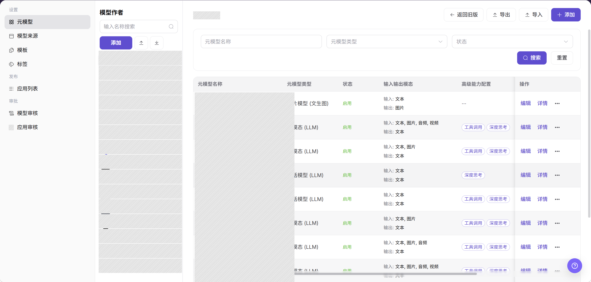

上图中左侧红框标注的是模型作者筛选区，右侧是元模型列表，列表中的"状态"列显示当前元模型是否启用。

## 主要操作

<!-- main-operation-title-exceptions: 编辑,删除 -->

下面的操作按新手阅读顺序排列：先做首次配置，再查看和启用；编辑、复制属于日常维护；删除属于高风险操作；导入导出适合批量维护。

### 添加模型作者

1. 进入 `模型及AI服务 > 设置 > 元模型`。
2. 在左侧 `模型作者` 区域点击 **"添加"**，打开 `添加` 弹窗。
3. 填写 `唯一标识`，用于区分不同模型作者。唯一标识添加后不可修改，建议使用厂商英文名，例如 `qwen`。
4. 在 `显示名称` 中维护多语言展示名称。
5. 上传或选择 `应用图标`。
6. 点击 **"确定"** 保存。

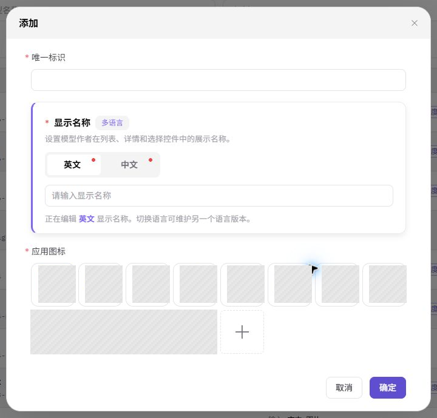

上图展示的是模型作者添加弹窗。重点检查 `唯一标识`、多语言 `显示名称` 和 `应用图标`，这些信息会影响左侧作者列表和后续元模型归属选择。

### 添加元模型

1. 进入 `模型及AI服务 > 设置 > 元模型`。
2. 在元模型列表右上方点击 **"添加"**，打开添加元模型表单。
3. 选择所属的模型作者，填写元模型名称和唯一标识。唯一标识添加后不可修改，建议按 `{厂商}-{能力类型}` 的格式命名，例如 `qwen-text`。
4. 选择模型类型和业务场景，配置输入输出模态，按需填写描述。
5. 配置高级能力、协议、Token 限制和默认参数，确认字段组合与目标模型能力一致；不要把真实内部 Endpoint 或凭证写入描述、协议路径或示例字段。
6. 点击 **"下一步"** 进入 `元模型详情`，维护模型说明、能力详情和参数说明。
7. 提交前检查唯一标识是否重复，以及协议、模态和 Token 限制是否完整。
8. 点击 **"提交"** 保存。保存成功后，在列表中查询新元模型并打开详情，确认名称、状态和能力配置正确。

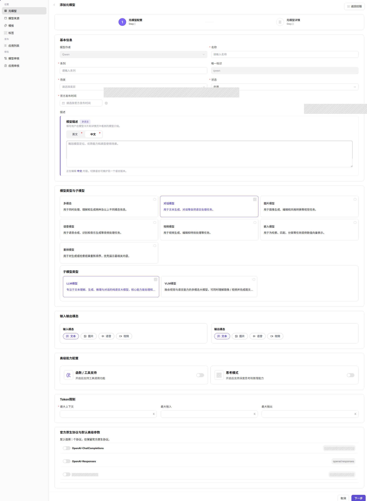

上图中红框标注的是 Token 限制配置区域，请重点确认输入和输出上限是否与真实模型能力一致。

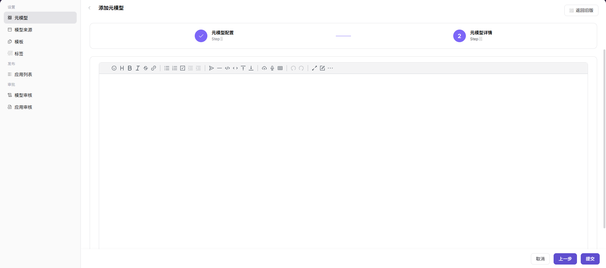

上图展示的是添加向导的 `元模型详情` 步骤，底部有 **"上一步"** 和 **"提交"** 按钮。提交前重点核对详情描述是否适合给后续发布和模型市场展示使用。

### 查询元模型详情

1. 进入 `模型及AI服务 > 设置 > 元模型`。
2. 在元模型列表中使用页面提供的查询条件定位目标记录。
3. 点击目标元模型的 **"详情"** 或元模型名称。
4. 核对唯一标识、模型作者、模型类型、输入输出模态、协议、Token 限制、默认参数和当前状态。
5. 查询成功时详情页应与列表中的名称和状态一致；记录不存在时清除查询条件并确认当前页签。

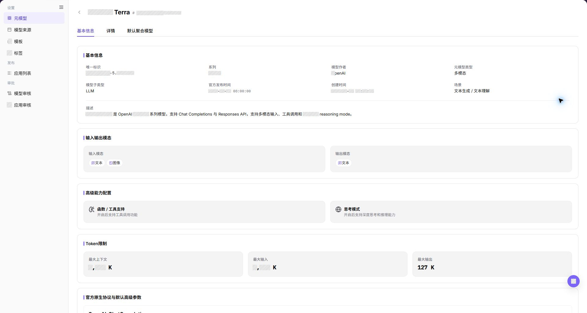

上图展示的是元模型详情页。重点核对 `唯一标识`、`状态`、协议、输入输出模态和 Token 限制，确认它们与列表记录和真实模型能力一致。

### 启用或禁用元模型

1. 查询并打开目标元模型详情，确认当前状态，并记录它是否被模板、模型发布流程或模型市场筛选使用。
2. 点击 **"启用"** 或 **"禁用"** 前，先确认影响对象：后续模板选择、模型发布可选项、模型市场筛选，以及可能依赖该元模型的调用方。
3. 如果无法确认依赖范围、正在处理发布申请，或该元模型是线上模型的唯一配置，不建议执行禁用；先联系模板维护者或技术负责人确认。
4. 阅读页面提示。如果提示内容与预期不一致，点击 **"取消"** 停止操作。
5. 确认可变更时再点击确认按钮。操作成功后刷新列表和详情，核对状态、更新时间以及后续流程中的选择项。
6. 状态未变化时检查权限、引用关系、页面缓存和同步时间，不要重复点击。

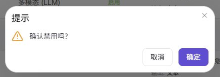

上图展示的是状态变更相关入口。完成后回到列表的 `状态` 列和详情页状态字段，确认是否显示为预期的 `启用` 或 `禁用`。

### 编辑元模型

1. 在元模型列表中定位目标记录，点击行内 **"编辑"**。
2. 核对模型作者、名称、唯一标识、模型类型、输入输出模态、场景、协议、Token 限制和高级能力。
3. 仅修改需要变更的字段，并评估对模板、发布模型和现有调用的影响。
4. 修改 Token、模态、协议或默认参数前，先确认是否已有模板、发布模型或调用方依赖当前配置；如果无法确认依赖范围，先不要提交。
5. 点击 **"确定"** 保存。保存成功后刷新列表并查看详情；保存失败时检查必填项、字段兼容性、引用关系和权限。

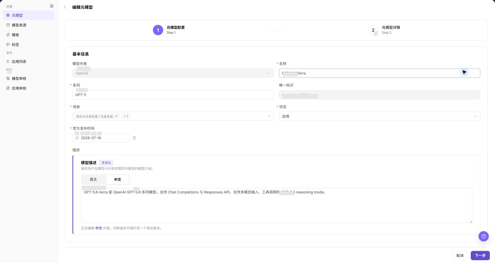

上图展示的是元模型编辑页面，字段布局与添加页面基本一致。红框或当前编辑区域通常位于配置表单中，保存后回到列表查看状态和更新时间是否符合预期。

### 复制元模型

1. 在元模型列表中定位目标元模型，在目标行右侧点击 **"..."** 打开更多操作菜单。
2. 点击 **"复制"**，检查复制表单中的模型作者、名称、系列、模态、协议和默认参数。
3. 为副本填写新的唯一标识和名称，避免与原元模型冲突。
4. 提交前核对复制后的能力边界和 Token 限制。
5. 点击 **"保存"** 后，在列表中查询新标识并打开详情，确认副本状态和配置已生成。

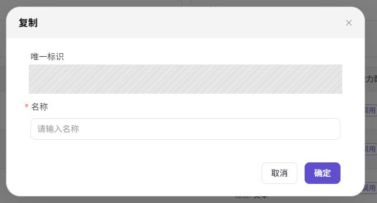

上图展示的是点击行末 **"..."** 后打开的复制弹窗。重点检查 `唯一标识` 和 `名称`，避免副本与原元模型在列表和发布流程中混淆。

### 编辑模型作者

1. 在左侧 `模型作者` 区域定位目标作者，点击 **"编辑"** 按钮。
2. 在编辑弹窗中核对 `唯一标识`、多语言 `显示名称` 和 `应用图标`；唯一标识不可修改时，以页面只读状态为准。
3. 修改需要变更的字段，并确认新名称和图标不会影响列表识别及元模型关联。
4. 点击 **"确定"** 保存。保存成功后，列表应显示更新后的名称或图标；保存失败时按提示检查必填项、名称格式和权限。

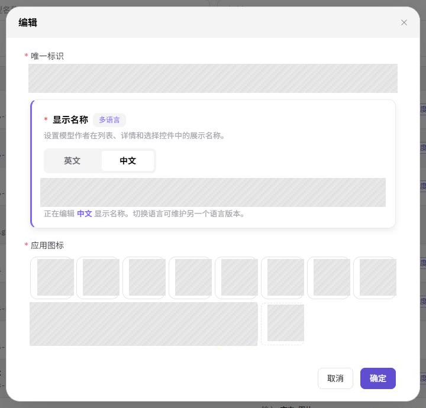

上图展示的是模型作者编辑弹窗。保存后回到左侧 `模型作者` 列表，检查名称和图标是否已经按新配置展示。

### 删除元模型

1. 在元模型列表中定位目标记录，先点击 **"详情"** 查看当前状态和配置。
2. 返回列表后，在目标行右侧点击 **"..."** 打开更多操作菜单。
3. 点击 **"删除"**，阅读删除提示，并核对该元模型是否被模板、发布模型或其他业务对象引用。
4. 如果不能确认该元模型没有被引用，不建议删除；优先禁用或联系依赖方确认。
5. 如果按钮置灰或删除失败，按页面提示检查引用关系、权限和当前状态，再决定是否先解除引用或迁移配置。
6. 删除成功后刷新列表，确认记录已移除。

上图展示的是删除确认弹窗。确认前再次核对弹窗标题和目标行，避免误删同一作者下名称相近的元模型。

### 删除模型作者

1. 在左侧 `模型作者` 区域定位目标作者，先确认其关联元模型数量和使用状态。
2. 点击目标作者的 **"删除"** 按钮，阅读删除确认提示。
3. 如果该作者下仍有元模型，或无法确认关联数量，不建议删除；先按作者筛选元模型列表并迁移或清理关联配置。
4. 如果按钮置灰或删除失败，按页面提示检查关联元模型、当前账号权限和作者状态。
5. 删除成功后，刷新作者列表并确认记录已移除。

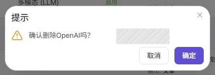

上图展示的是模型作者删除确认弹窗。确认前先核对左侧选中的作者名称，避免删除仍被元模型使用的作者。

### 导入元模型

1. 在元模型列表上方点击 **"导入"**。
2. 导入前确认文件格式和字段结构符合页面要求，并确保文件不包含凭证、客户数据或真实内部 Endpoint。
3. 导入会批量新增或更新配置，不建议在字段来源不清、唯一标识未去重、或生产配置冻结期间执行。
4. 先用小批量测试文件检查字段映射、重复标识和校验结果，确认无误后再执行正式导入。
5. 导入完成后清除筛选条件并核对新增记录；如果提示成功但记录没有出现，优先检查筛选条件、重复标识、关联模型作者和字段格式。

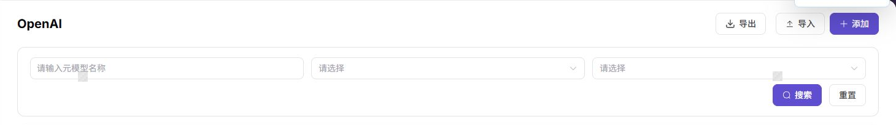

上图展示的是元模型列表上方的 **"导入"** 和 **"导出"** 按钮。执行导入后，回到列表清除筛选条件，再检查新增记录或页面校验提示。

### 导入模型作者

1. 在 `模型作者` 区域点击 **"导入"**。
2. 导入前确认文件格式、字段结构和唯一标识符合页面要求，并确保文件不包含凭证、客户数据或内部说明。
3. 导入会影响左侧模型作者列表，不建议在作者命名规则未确认、图标素材未准备好或唯一标识未去重时执行。
4. 先用小批量测试文件验证格式和字段映射，确认无误后再执行正式导入。
5. 导入完成后清除搜索条件并核对新增记录；如果未看到新增作者，检查重复标识、文件格式、图标字段和账号权限。

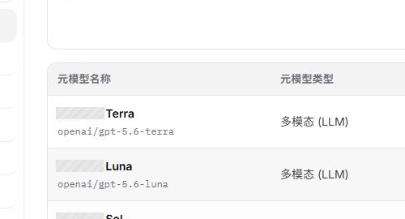

上图展示的是模型作者区域的 **"导入"** 和 **"导出"** 按钮。执行导入后，检查左侧作者列表是否出现新增作者名称和图标。

### 导出元模型

1. 在元模型列表上方点击 **"导出"**。
2. 导出前确认当前模型作者筛选条件、数据范围和数据权限，避免导出超出授权范围的元模型配置。
3. 导出文件可能包含协议、能力和参数配置，不建议发送到未授权群组、外部邮箱或公共知识库。
4. 导出成功后核对文件内容；失败时检查筛选条件、权限、浏览器下载状态和下载拦截提示。

上图展示的是导入和导出按钮的位置，位于元模型列表上方。

### 导出模型作者

1. 在 `模型作者` 区域点击 **"导出"**。
2. 导出前确认当前搜索条件、筛选范围和数据权限；导出文件应存放在受控位置，不得用于未授权传播。
3. 导出文件可能包含作者标识和展示信息，不建议作为外部交付材料直接发送。
4. 导出成功后核对文件内容；失败时检查筛选条件、权限、浏览器下载状态和下载拦截提示。

上图展示的是模型作者区域的导入和导出按钮位置。

## 参数速查表

### 模型作者字段

| 字段名称 | 是否必填 | 字段类型 | 示例 | 说明 |
| --- | --- | --- | --- | --- |
| 唯一标识 | 必填 | 文本 / 只读文本 | `qwen` | 模型作者的唯一识别标识，添加后不可修改 |
| 显示名称 | 必填 | 多语言文本 | `Qwen` | 模型作者在列表、详情和选择控件中的展示名称 |
| 应用图标 | 必填 | 图片上传 | `qwen.png` | 模型作者在列表中的图标 |

### 元模型字段

| 字段名称 | 是否必填 | 字段类型 | 示例 | 说明 |
| --- | --- | --- | --- | --- |
| 模型作者 | 必填 | 下拉选择 | `Qwen` | 新增元模型所属的模型作者 |
| 名称 | 必填 | 文本 | `Qwen Text` | 元模型在页面和发布流程中的展示名称 |
| 唯一标识 | 必填 | 文本 / 只读文本 | `qwen-text` | 元模型的唯一识别标识，添加后不可修改 |
| 系列 | 必填 | 文本 | `Qwen` | 元模型所属系列 |
| 场景 | 必填 | 下拉选择 | `文本生成` | 元模型适用的业务场景 |
| 状态 | 必填 | 下拉选择 | `启用` | 页面展示的元模型状态 |
| 官方发布时间 | 否 | 日期选择 | `2026-07-08` | 元模型对应能力的官方发布时间 |
| 模型描述 | 否 | 多语言文本 | `适用于文本生成。` | 展示在模型卡片和详情中的说明 |
| 模型类型与子模型 | 必填 | 单选卡片 | `对话模型` / `LLM模型` | 定义元模型能力分类和子类型 |
| 输入模态 / 输出模态 | 必填 | 多选 | `文本 -> 文本` | 声明模型支持的数据输入和输出类型 |
| 函数 / 工具支持 | 否 | 开关 | `关闭` | 控制是否开启工具调用能力 |
| 思考模式 | 否 | 开关 | `关闭` | 控制是否开启深度思考或推理能力 |
| 最大上下文 / 最大输入 / 最大输出 | 必填 | 数字 | `128` K | 定义上下文、输入和输出 Token 上限 |
| 官方原生协议与默认高级参数 | 必填 | 开关 / 参数配置 | `OpenAI-ChatCompletions` | 选择兼容协议并维护默认高级参数 |

## 踩坑提示

- Token 限制写大于真实模型能力会导致调用失败，应严格按官方文档填写。
- 协议 Endpoint 路径应是路径或占位示例，不要写真实内部地址。
- 输入输出模态配置错误会影响模板选择、发布流程和模型市场筛选，发布前应核对模态是否与目标场景匹配。
- 唯一标识添加后不可修改，新增、复制或导入前都要先确认命名规范。
- 启停、删除、导入或导出结果不符合预期时，先清除筛选条件，再检查账号权限、文件格式和引用关系，不要重复点击操作按钮。

## 结果校验

| 检查项 | 成功表现 | 异常时处理 |
| --- | --- | --- |
| 新增的模型作者在左侧筛选区可见 | 筛选区出现该作者名称和图标 | 检查唯一标识是否重复，刷新页面后重试 |
| 新增的元模型在列表中可见 | 列表中出现新元模型记录 | 检查账号权限、筛选条件和配置状态 |
| 元模型详情与列表记录一致 | 详情页中的唯一标识、状态、协议、模态和 Token 限制与预期一致 | 返回列表确认是否打开了正确记录，必要时清除筛选条件后重新进入详情 |
| 启用或禁用后状态已变化 | 列表 `状态` 列和详情页状态显示为预期的 `启用` 或 `禁用` | 检查权限、引用关系和页面缓存，等待同步后刷新页面再确认 |
| 复制后生成新元模型记录 | 列表中出现新的唯一标识，详情页配置与副本预期一致 | 检查复制时填写的唯一标识和名称是否与原记录或现有记录冲突 |
| 模板或发布流程能选择到该元模型 | 下拉框中出现目标元模型 | 确认元模型状态为启用，核对模型类型和模态是否匹配 |
| 协议、模态、Token 限制与模型实际能力一致 | 协议、模态、Token 限制与官方文档一致 | 回到元模型详情页核对配置，必要时联系技术负责人确认 |
| 默认参数在体验或调用测试中能按预期生效 | Playground 或 API 调用返回预期结果 | 检查默认参数配置，核对调用方传入的参数是否覆盖默认值 |
| 导入后有可见结果或校验提示 | 新记录出现在列表中，或页面返回明确校验结果 | 清除筛选条件，检查重复唯一标识、文件字段格式、关联模型作者和导入权限 |
| 导出后生成下载文件 | 浏览器下载到导出文件，文件内容与当前筛选范围一致 | 检查筛选条件、数据权限、浏览器下载状态和下载拦截提示 |
| 删除元模型后列表不再显示该记录 | 目标元模型从列表中消失 | 确认是否存在模板、发布模型或其他业务对象引用，必要时先迁移配置 |
| 删除模型作者后列表不再显示该记录 | 该作者从筛选区消失 | 确认是否存在未解除关联的元模型，返回元模型列表按作者筛选排查 |

## 常见问题

#### 发布模型时选不到元模型

**问题现象：**

模型提供方进入发布流程后，元模型下拉框中没有目标项。

**可能原因：**

- 元模型未启用。
- 模型类型或模态与发布方式不匹配。
- 当前角色或租户没有使用该元模型的权限。

**处理方式：**

1. 确认元模型状态为启用。
2. 核对模型类型、输入输出模态和发布方式。
3. 检查角色、租户和可见范围配置。

#### 调用时提示 Token 超限

**问题现象：**

模型体验或 API 调用返回上下文长度、输入长度或输出长度超限。

**可能原因：**

- 元模型 Token 限制小于实际请求。
- 默认 Max Tokens 设置过大。
- 调用方传入了过长上下文。

**处理方式：**

1. 核对元模型上下文、输入和输出限制。
2. 调整默认参数或调用参数。
3. 缩短 Prompt 或对话上下文后重试。

#### 发布模型时元模型参数不匹配

**问题现象：**

提供方发布模型时，元模型默认参数或上下文限制与实际能力不一致。

**可能原因：**

元模型协议、模态、Token 限制或默认参数维护错误，或模板引用了旧版本配置。

**处理方式：**

回到元模型页核对协议、模态和 Token 限制；同步检查模型模板引用；修改后用测试发布流程验证。

#### 唯一标识填错了怎么办？

**问题现象：**

元模型或模型作者的唯一标识填写错误，需要修改。

**可能原因：**

- 唯一标识添加后不可修改。
- 命名规范不清晰。

**处理方式：**

1. 确认唯一标识是否已被其他业务对象引用。
2. 如未被引用，可删除后重新创建。
3. 如已被引用，需先解除引用关系，再删除重建。

#### 元模型禁用后，已发布的模型会怎样？

**问题现象：**

禁用元模型后，用户想确认已发布模型是否还能正常调用。

**可能原因：**

- 元模型禁用会影响后续发布和模板选择。
- 已发布模型的调用行为取决于当前版本的引用关系和运行配置，不能只根据元模型列表状态判断。

**处理方式：**

1. 禁用前确认该元模型被哪些模板和已发布模型引用。
2. 禁用后检查模板选择、模型发布流程、模型市场筛选和代表性调用结果。
3. 如需恢复，重新启用元模型，并重新验证模板、发布和调用链路。

#### 导入文件后提示成功但记录没有出现

**问题现象：**

导入元模型或模型作者后，页面提示导入成功，但列表中看不到新增记录。

**可能原因：**

- 导入文件中的唯一标识与已有记录重复，系统可能跳过重复记录或提示校验失败。
- 当前列表筛选条件过滤掉了新导入的记录。
- 文件中字段格式不符合要求，部分记录未被解析。

**处理方式：**

1. 清除列表筛选条件，查看全部记录。
2. 检查导入文件中的唯一标识是否与现有记录冲突。
3. 核对文件格式和字段结构是否符合页面要求，修正后重新导入。

#### 模型作者删除失败，按钮置灰

**问题现象：**

点击模型作者的 **"删除"** 按钮后，按钮置灰或删除操作被拒绝。

**可能原因：**

- 该作者下仍有关联的元模型。
- 当前账号权限不足。

**处理方式：**

1. 在元模型列表中按该作者筛选，查看关联元模型数量。
2. 将关联元模型迁移到其他作者或先删除关联元模型。
3. 确认关联数量为零后重新尝试删除。
4. 如仍失败，检查当前账号是否具备删除权限。

## 注意事项

- 元模型变更会影响模型发布、模板选择和市场筛选，发布前应确认依赖范围。
- Token 限制、协议路径和默认参数必须与真实模型能力一致。
- 调整输入输出模态前，先核对已发布模型是否仍能被正确筛选和调用。

## 后续操作

1. 在模型模板或模型发布流程中选择该元模型，确认协议、模态和 Token 限制可被正确引用。
2. 使用代表性模型做一次发布验证，检查输入输出格式是否匹配。
3. 当协议、上下文长度或默认参数变化时，同步通知模板维护者和模型提供方。
