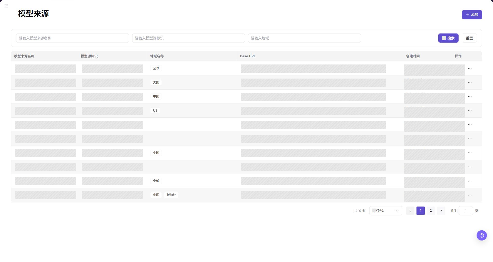
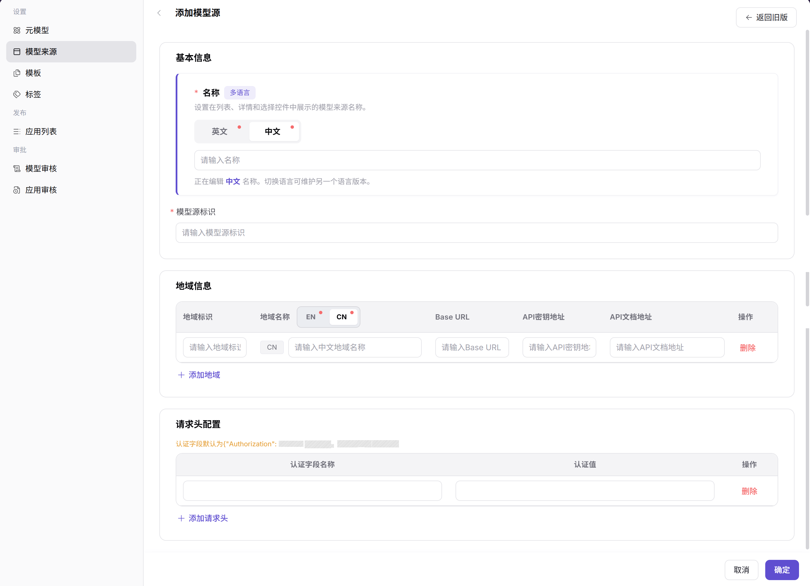
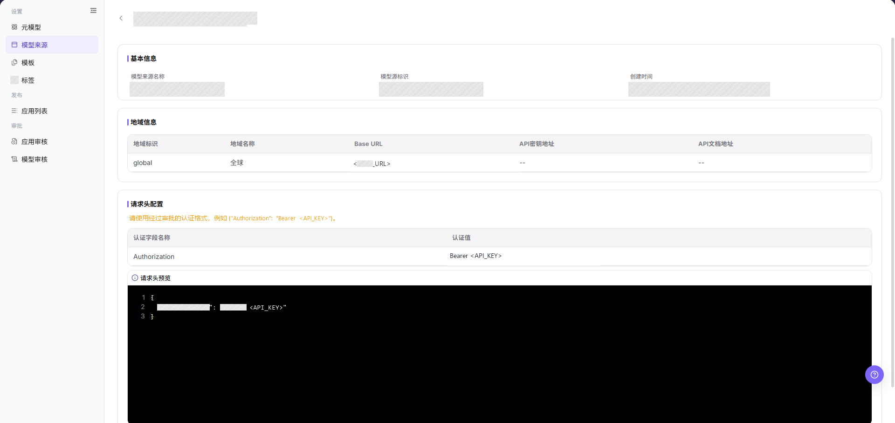
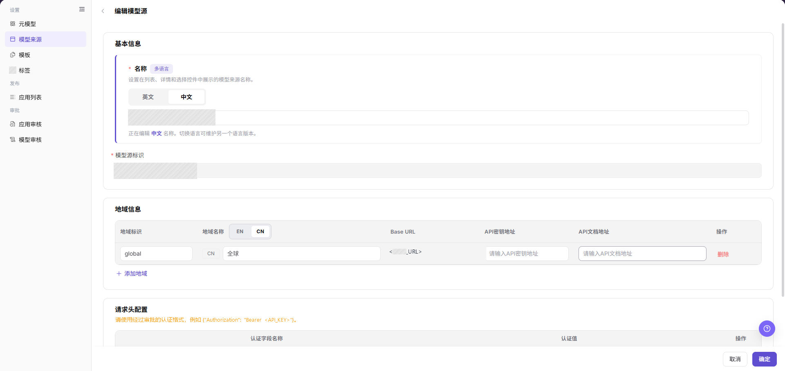
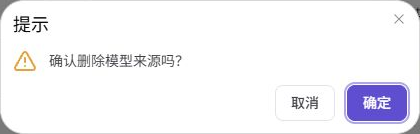

# 模型来源

::: info 文档信息
版本：v1.0
更新日期：2026-09-01
:::

## 功能概述

| 项目 | 内容 |
| --- | --- |
| 适用角色 | 运营管理员 |
| 导航路径 | **模型及AI服务** > **设置** > **模型来源** |
| 页面路由 | `/modelone/settings/vendor` |
| 管理对象 | 模型来源名称、标识、地域、Base URL、请求头和认证配置 |

#### 新手理解

模型来源用于保存上游模型服务的地址和认证配置。元模型说明模型能做什么；模型来源说明平台从哪里调用服务以及如何认证。

#### 术语表

| 术语 | 英文 | 说明 |
| --- | --- | --- |
| 模型来源 | Model Source | 保存上游服务地址和请求头配置的记录。 |
| 地域 | Region | 具有独立 Base URL 的服务位置。 |
| Base URL | Base URL | 拼接 API Endpoint 前使用的根地址。 |
| Endpoint | Endpoint | 某个 API 操作的具体路径，通常拼接在 Base URL 后。 |
| API密钥地址 | API Key endpoint | 获取或管理 API Key 的地址，不是模型调用 Endpoint。 |
| 请求头 | Request header | 平台调用上游服务时发送的认证或自定义 Header。 |

#### 小白先看

| 场景 | 先做 | 不要直接做 |
| --- | --- | --- |
| 第一次接入新上游服务 | 添加模型来源并填写已审批的上游地址 | 直接创建模板 |
| 模板需要地域 | 完整填写地域标识、地域名称和 Base URL | 只填写模型来源名称 |
| 上游服务要求认证 | 核对默认请求头格式并填写已审批的认证值 | 把 API Key 写入文档或工单 |
| 不清楚模板或发布模型的引用关系 | 打开 **"详情"** 并确认已知引用 | 直接删除模型来源 |

## 前提条件

1. 确认当前账号具备模型来源维护权限。
2. 向上游服务负责人获取地域、Base URL、API密钥地址、API文档地址和请求头要求。
3. 向相关负责人确认网络、证书和白名单要求。
4. 准备经过审批的凭据录入或引用方式。
5. 编辑或删除前，确认使用该模型来源的模板和已发布模型。

## 页面说明

页面用于维护上游模型来源。列表每行展示模型来源名称、标识、地域名称、Base URL、创建时间和可用操作。

页面截图：

点击目标行右侧的 **"..."**，可以选择 **"详情"** 或 **"删除"**。
截图中的地址已经遮盖，文档截图中不要包含真实凭据。

## 主要操作

<!-- main-operation-title-exceptions: 编辑,删除 -->

下面的操作按首次配置、详情核对、日常维护和高风险删除的顺序排列。

### 添加模型来源

1. 进入 **模型及AI服务** > **设置** > **模型来源**。
2. 点击 **"添加"**。
3. 在 **"英文"** 中填写必填的 `名称`。
4. 仅在用户需要中文显示名称时，在 **"中文"** 中填写 `名称`。
5. 填写唯一的 `模型源标识`。
6. 模板需要地域时，点击 **"添加地域"**。
7. 将已审批的 `地域标识`、`地域名称` 和 `Base URL` 作为一组完整填写。
8. 仅在对应链接适用时填写 `API密钥地址` 和 `API文档地址`。
9. 上游服务需要额外请求头时，点击 **"添加请求头"**。
10. 填写已审批的 `认证字段名称` 和 `认证值`。
11. 真实凭据只能通过经过审批的安全方式录入或引用。
12. 对照已审批的上游配置核对所有字段。
13. 点击 **"确定"** 提交表单。
14. 返回列表并搜索新建的标识。
15. 如不提交表单，点击 **"取消"**。

截图展示多语言名称、地域和请求头配置区域。
页面要求填写英文 `名称` 和 `模型源标识`，其他字段条件以本文参数表为准。

### 查看模型来源详情

1. 进入 **模型及AI服务** > **设置** > **模型来源**。
2. 定位目标模型来源。
3. 点击目标行右侧的 **"..."**。
4. 点击 **"详情"**。
5. 核对 `名称`、`模型源标识` 和创建时间。
6. 核对 `地域标识`、`地域名称`、`Base URL`、`API密钥地址` 和 `API文档地址`。
7. 核对 `请求头配置` 和 `请求头预览` 中的字段名称和值格式。
8. 不要把真实认证值复制到工单或文档中。
9. 如果页面值与已审批配置不一致，返回列表重新核对目标行。

详情页按 `基本信息`、`地域信息` 和 `请求头配置` 展示记录。截图中的地址和认证值已经遮盖。

### 编辑模型来源

1. 进入 **模型及AI服务** > **设置** > **模型来源**。
2. 定位目标模型来源。
3. 点击目标行中的 **"编辑"**。
4. 确认页面显示的是目标记录。
5. `模型源标识` 在编辑页为只读，请保持原值。
6. 只修改经过审批的名称、地域、地址或请求头字段。
7. 点击 **"确定"** 提交修改。
8. 重新打开 **"详情"**。
9. 确认页面值与已审批配置一致。
10. 如果修改不可见，检查页面提示、必填字段、URL 值和账号权限。

编辑页展示多语言名称、只读标识、地域字段和请求头字段。点击 **"确定"** 前应核对这些值。

### 删除模型来源

1. 打开目标模型来源的 **"详情"**，核对名称、标识、地域和 Base URL。
2. 根据已审批的配置清单检查已知的模板和已发布模型使用情况。
3. 如果使用范围不清楚，停止操作并向相关负责人确认。
4. 返回 **模型及AI服务** > **设置** > **模型来源**，点击已核对目标行右侧的 **"..."**。
5. 选择 **"删除"** 并阅读确认提示。
6. 弹窗不显示目标名称。需要时返回列表再次核对目标行。
7. 确认目标并取得审批后，在弹窗中点击 **"确定"**。
8. 刷新列表并搜索目标标识。
9. 确认目标标识不再出现，并记录可见错误或仍存在的目标行。

> **恢复提示：** 如误删，根据已审批的配置记录或备份重新创建，再重复详情核对和下游验证。

截图展示的是删除确认弹窗，不是 **"..."** 菜单。弹窗包含 **"取消"** 和 **"确定"**，但不显示目标行名称。

## 参数速查表

下表将表单要求和下游要求分开说明。
本表单中的选填字段，在特定模板或上游服务中仍可能需要填写。

| 字段名称 | 表单要求 | 下游要求 | 字段类型 | 示例 | 说明 |
| --- | --- | --- | --- | --- | --- |
| 英文名称 | 必填 | 所有模型来源都需要 | 多语言文本 | `Example Source` | 英文界面的列表和选择控件显示该名称。 |
| 中文名称 | 选填 | 用户需要中文显示名称时填写 | 多语言文本 | `Example Source` | 中文界面的列表和选择控件可显示该名称。 |
| 模型源标识 | 必填 | 所有模型来源都需要 | 文本 | `example-source` | 填写唯一值，编辑页中为只读。 |
| 地域标识 | 选填 | 模板需要选择地域时必填 | 文本 | `example-region` | 与地域名称和 Base URL 配套填写。 |
| 地域名称 | 选填 | 模板需要选择地域时必填 | 多语言文本 | `Example Region` | 该名称显示在地域选择控件中。 |
| Base URL | 选填 | 已配置地域需要调用上游服务时必填 | URL | `https://api.example.com` | 填写根地址，具体操作路径放在下游 Endpoint 配置中。 |
| API密钥地址 | 选填 | 用户需要 API Key 管理入口时填写 | URL | `https://api.example.com/keys` | 用于管理 API Key，不是模型调用 Endpoint。 |
| API文档地址 | 选填 | 用户需要上游文档入口时填写 | URL | `https://api.example.com/docs` | 填写上游 API 文档地址。 |
| 认证字段名称 | 选填 | 上游服务使用请求头认证时必填 | 文本 | `Authorization` | 页面将 `Authorization` 说明为默认字段名称。 |
| 认证值 | 选填 | 上游服务要求认证时必填 | 文本 | `Bearer <API_KEY>` | 页面将 `Bearer <key>` 说明为默认格式，真实值通过安全方式录入。 |
| 请求头预览 | 系统生成 | 根据已配置请求头生成 | JSON 预览 | `{"Authorization":"Bearer <API_KEY>"}` | 将预览内容与上游规范对照。 |

## 踩坑提示

- 除非上游规范明确要求，不要把具体操作 Endpoint 填入 `Base URL`。
- 模板需要地域时，将地域标识、地域名称和 Base URL 作为一组完整填写。
- 请求头的字段名称、前缀和值格式必须与上游规范一致。
- 修改地址或请求头后，重新打开 **"详情"**，将页面值与已审批配置逐项对照。
- 删除前确认已知的模板和发布模型引用关系，确认弹窗不会显示依赖详情。

## 结果校验

| 检查项 | 可观察结果 | 未看到结果时 |
| --- | --- | --- |
| 新增模型来源 | 列表显示预期名称和标识 | 清除搜索条件并刷新，检查点击 **"确定"** 后的页面提示 |
| 详情 | 详情页显示预期的基本信息、地域、地址和请求头字段 | 返回列表核对标识，再重新打开 **"详情"** |
| 请求头预览 | 预览显示预期字段名称和值格式 | 对照上游规范核对 `认证字段名称` 和 `认证值` |
| 编辑 | 列表或详情页显示经过审批的新值 | 检查页面提示，必要时重新提交经过审批的修改 |
| 模板供应方选择 | `选择供应方` 显示目标模型来源 | 重新打开选择控件，核对来源名称、标识和运营管理员权限 |
| 模板地域选择 | `选择地域` 显示已配置地域 | 停止模板流程，返回模型来源页面补全地域字段 |
| 删除弹窗 | 弹窗显示 **"取消"** 和 **"确定"** | 关闭弹窗，确认从正确目标行选择了 **"删除"** |
| 删除模型来源 | 刷新搜索结果不再显示目标标识 | 记录可见错误或仍存在的目标行，不要假定删除已经完成 |

## 常见问题

#### 新增后列表找不到模型来源

**问题现象：**

列表中没有出现新建的名称或标识。

**可能原因：**

- 搜索条件隐藏了记录。
- 表单显示字段校验提示。
- 提交操作未完成。

**处理方式：**

1. 清除搜索条件并刷新列表。
2. 搜索完整的 `模型源标识`。
3. 检查点击 **"确定"** 后的页面提示。

#### 详情与已审批配置不一致

**问题现象：**

详情页显示了不符合预期的地域、地址或请求头结构。

**可能原因：**

- 打开了其他目标行。
- 编辑内容没有提交。
- 已审批值填写到了其他字段。

**处理方式：**

1. 返回列表核对标识。
2. 重新打开 **"详情"**。
3. 将每个可见字段与已审批配置逐项对照。

#### 请求头预览与上游规范不一致

**问题现象：**

`请求头预览` 显示了不符合预期的字段名称、前缀或值格式。

**可能原因：**

- `认证字段名称` 填写错误。
- `认证值` 的前缀或占位符格式错误。
- 多个请求头的组合不正确。

**处理方式：**

1. 对照上游 API 规范核对字段。
2. 只编辑经过审批的请求头值。
3. 重新打开 **"详情"** 并检查 `请求头预览`。

#### 模型模板找不到模型来源

**问题现象：**

`选择供应方` 中没有目标模型来源。

**可能原因：**

- 选择控件中的搜索条件与来源名称不匹配。
- 模板需要地域，但模型来源的地域字段不完整。
- 当前运营管理员账号无法使用目标记录。

**处理方式：**

1. 进入 **模型及AI服务** > **设置** > **模板**。
2. 在左侧 `模型来源` 列表中选择目标来源。
3. 点击 **"添加"**。
4. 在 `供应方信息` 中重新打开 `选择供应方`。
5. 如果 `选择地域` 必填或没有选项，返回模型来源详情并补全地域字段。

#### 下游调用失败

**问题现象：**

模板可以选择模型来源，但下游验证调用失败。

**可能原因：**

- Base URL 或 Endpoint 错误。
- 请求头认证不完整或无效。
- 网络、证书、限流或上游服务策略阻止调用。

**处理方式：**

1. 模型来源页面的配置流程到模板或发布流程中选择来源为止。
2. 根据下游调用流程中显示的错误继续排查。
3. 调用步骤参见[发布并调用模型](../../../end-to-end/publish-and-call-model/)。

#### 删除未完成

**问题现象：**

确认弹窗没有关闭、页面显示错误，或刷新后列表仍显示目标模型来源。

**可能原因：**

- 删除请求没有完成。
- 当前账号缺少所需权限。
- 服务因确认前未显示的原因拒绝了删除。

**处理方式：**

1. 记录页面显示的错误信息。
2. 刷新后搜索目标标识。
3. 向相关负责人确认已知的模板和已发布模型使用情况。
4. 在原因明确前不要重复删除。

## 注意事项

- 列表中可见模型来源，不代表上游服务已经可以调用。
- 真实认证值应保存在经过审批的安全录入系统中。

## 后续操作

下一页操作参见[模型模板](../model-templates/)手册。

**模型来源有地域**

1. 以运营管理员角色进入 **模型及AI服务** > **设置** > **模板**。
2. 在左侧 `模型来源` 列表中选择目标来源。
3. 点击 **"添加"**。
4. 在 `供应方信息` 的 **"选择供应方"** 中选择模型来源。
5. 在 **"选择地域"** 中选择已配置地域。
6. 两个选择控件均显示预期值后，再继续模板流程。

**模型来源没有地域**

1. 打开 `供应方信息` 并检查 **"选择供应方"**。
2. 如果目标来源出现，再检查 **"选择地域"** 的状态。
3. 如果页面要求 **"选择地域"** 或没有选项，停止模板流程。
4. 只有模板负责人确认该流程支持无地域来源时，才可继续。
5. 如果未获确认，返回模型来源页面并添加完整地域配置。

完成模板和发布步骤后，按[发布并调用模型](../../../end-to-end/publish-and-call-model/)执行调用验证。
调用验证不属于模型来源页面操作，应根据该流程显示的响应或错误继续排查。
