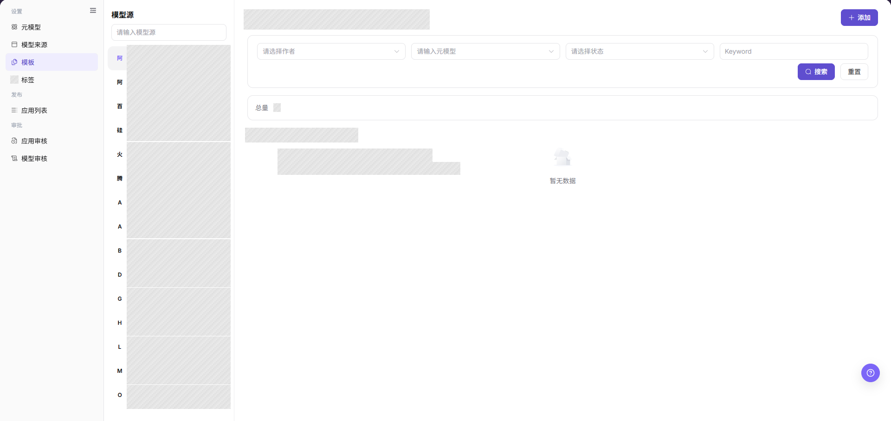
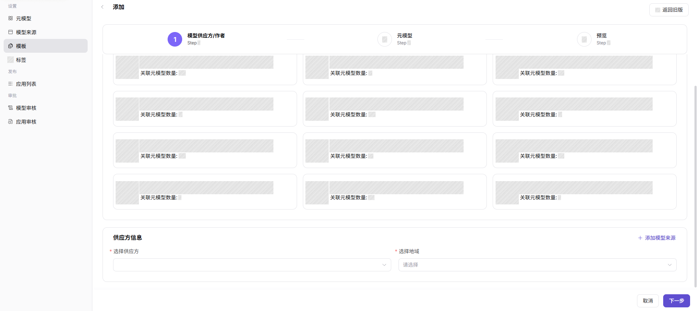
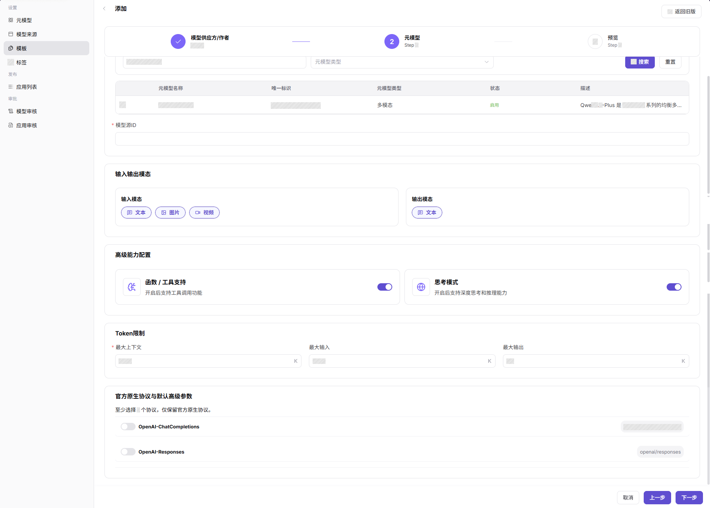
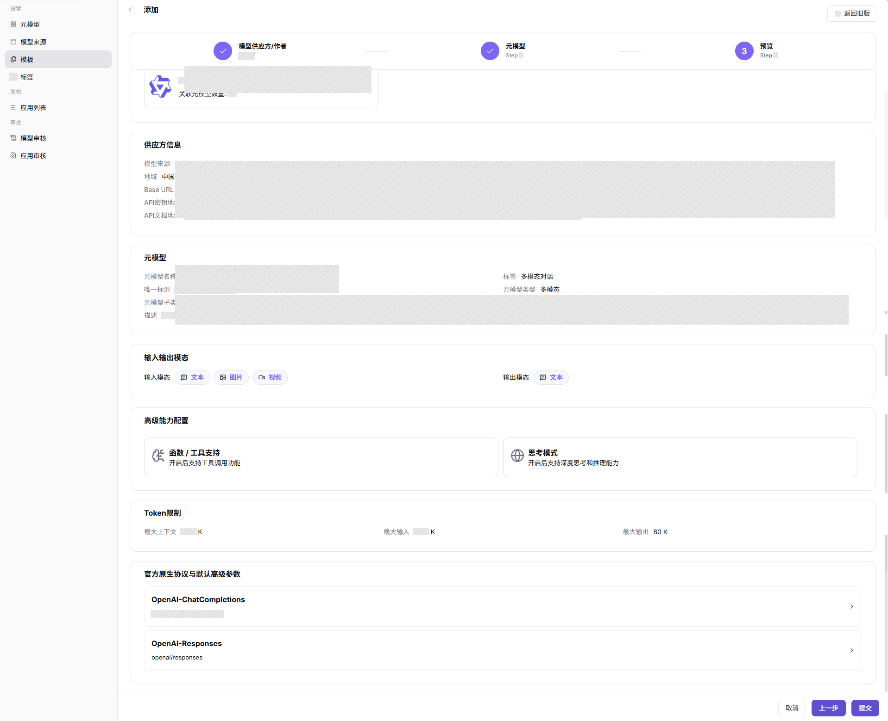
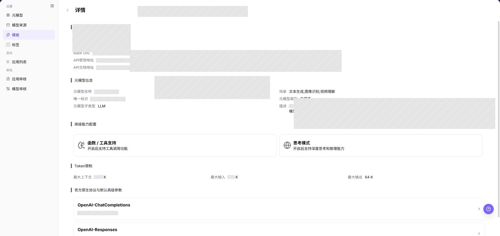
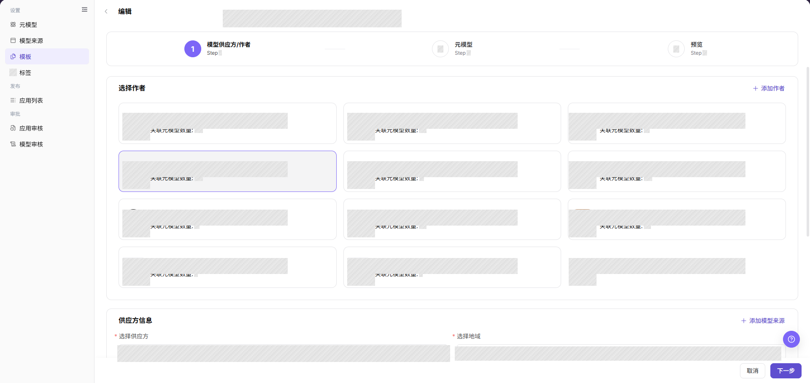
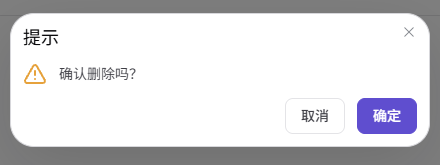

# 模板

## 功能概述

| 项目 | 内容 |
| --- | --- |
| 适用角色 | 运营管理员 |
| 导航路径 | 模型及AI服务 > 设置 > 模板 |
| 页面路由 | `/modelone/settings/provider-template` |
| 管理对象 | 厂商模板、来源预览、协议、默认参数和发布表单 |

#### 新手理解

模型模板像模型发布表单的预设——它把供应方、元模型、默认参数和协议打包成一套可复用配置。模板配好后，模型提供方发布时只需选模板就能自动填充大部分字段，减少重复填写和口径偏差。当你需要让多个模型用相同配置发布时，先建一个模板就行。

#### 术语表

| 术语 | 英文 | 说明 |
| --- | --- | --- |
| 模板 | Template | 可复用的模型发布配置集合，包含供应方、元模型、默认参数和协议 |
| 厂商配置预览 | Vendor Configuration Preview | 展示 Base URL、文档地址和请求头示例 |
| 默认高级参数 | Default Advanced Parameters | 发布模型时预置的温度、最大 Token 等参数 |
| 协议映射 | Protocol Mapping | 模板与模型调用协议的对应关系 |
| 模型源 ID | Model Source ID | 上游模型源中的模型标识 |

#### 推荐操作顺序

第一次配置模板时，建议按这个顺序执行：先确认模型作者和元模型已就绪，再添加模板，保存后查询模板详情确认配置正确，然后在发布流程中验证模板能被选择且参数正确带入。后续日常维护使用编辑模板和删除模板操作。

#### 小白先看

| 场景 | 先做 | 不要直接做 |
| --- | --- | --- |
| 新厂商第一次接入 | 确认模型作者和元模型已创建，再添加模板 | 跳过元模型配置直接建模板 |
| 需要修改模板参数 | 编辑模板，修改后做一次发布验证 | 直接在已发布模型上改参数 |
| 查看模板当前配置 | 查询模板详情，核对所有字段 | 凭记忆判断模板内容 |
| 不再需要某个模板 | 先禁用并确认无引用，再删除模板 | 删除仍在使用的模板 |

## 前提条件

1. 当前账号具备 `模板` 维护权限。
2. 可选供应方、模型作者、元模型和模型来源已维护。
3. 默认参数、请求头预览和发布表单字段已确认。
4. 模板启用前已用样例模型验证发布流程。

## 页面说明

页面用于维护模型发布模板。模板把供应方、元模型、默认参数、协议和来源预览组合起来，帮助模型提供方减少重复填写。

页面截图：

上图展示的是模板列表页面，可以查看每个模板的名称、状态、供应方和关联配置，以及操作入口。

## 主要操作

<!-- main-operation-title-exceptions: 编辑,删除 -->

### 添加模板

1. 进入 `模型及AI服务 > 设置 > 模板`。
2. 点击 **"添加"**，进入添加模板页面。
3. 在 `模型供应方/作者` 步骤选择模型作者卡片。
4. 在 `供应方信息` 中选择供应方和地域；如需维护新的来源配置，可点击 **"添加模型来源"**。
5. 点击 **"下一步"** 前确认供应方和地域信息无误。

上图展示的是添加模板第一步的供应方信息区域。重点确认模型作者、供应方和地域选择正确，这些会影响后续元模型筛选和发布表单带入的内容。

6. 在 `元模型` 步骤筛选并选择目标元模型，填写 `模型源ID`。
7. 核对 `输入输出模态`、`高级能力配置`、`Token限制` 和 `官方原生协议与默认高级参数`。
8. 点击 **"下一步"** 前确认元模型和协议参数无误。

上图展示的是添加模板第二步的元模型选择区域。重点确认元模型名称、模态和 Token 限制与目标模型能力一致。

9. 在 `预览` 步骤核对供应方信息、元模型、输入输出模态、高级能力配置、Token 限制和协议参数。
10. 点击 **"提交"** 保存。保存成功后在列表中查询新模板并打开详情，确认配置正确。

上图展示的是添加模板最后的预览确认步骤。提交前重点核对所有配置字段是否完整、正确。

### 查询模板详情

1. 进入 `模型及AI服务 > 设置 > 模板`。
2. 在模板列表中使用页面提供的查询条件定位目标记录。
3. 点击目标模板的 **"详情"** 或模板名称。
4. 核对供应方、地域、元模型、模型源 ID、输入输出模态、协议映射、Token 限制和默认参数。
5. 查询成功时详情页应与列表中的名称和状态一致；记录不存在时清除查询条件并确认当前页签。

上图展示的是模板详情入口和详情页面。点击模板名称或详情按钮后，重点核对所有配置字段是否与预期一致。

### 编辑模板

1. 在模板列表中定位目标记录，点击行内 **"编辑"**。
2. 核对供应方、地域、元模型、模型源 ID、默认参数和协议映射。
3. 仅修改需要变更的字段，并评估对已使用该模板的已发布模型的影响。
4. 修改元模型、协议或默认参数前，先确认是否已有发布流程依赖当前配置；如果无法确认依赖范围，先不要提交。
5. 点击 **"确定"** 保存。保存成功后刷新列表并查询模板详情；保存失败时检查必填项、字段兼容性、引用关系和权限。

上图展示的是模板编辑页面。编辑保存后返回列表，检查目标模板的更新时间是否已刷新，再查询模板详情核对字段。

### 删除模板

1. 在模板列表中定位目标记录，先点击 **"详情"** 查看当前状态和配置。
2. 返回列表后，在目标行点击 **"删除"**，阅读删除提示，并核对该模板是否被发布流程引用。
3. 如果不能确认该模板没有被引用，不建议删除；优先禁用并在发布流程中验证该模板不再显示，确认无依赖后再执行删除。
4. 如果按钮置灰或删除失败，说明该模板仍被引用，按页面提示检查引用关系、权限和当前状态，先解除引用再操作。
5. 删除成功后刷新列表，确认记录已移除。

上图展示的是模板列表页面。删除前确认目标行名称，避免误删名称相近的其他模板。

## 参数速查表

### 模板配置字段

| 字段名称 | 是否必填 | 字段类型 | 示例 | 说明 |
| --- | --- | --- | --- | --- |
| 模型作者 | 必填 | 卡片选择 | `Qwen` | 模板关联的模型作者 |
| 供应方 | 必填 | 下拉选择 | `Alibaba` | 模板对应的模型来源或供应方 |
| 地域 | 必填 | 下拉选择 | `China` | 模型来源所在地域 |
| 元模型名称 | 必填 | 筛选 / 单选 | `Qwen3.7-Plus` | 模板默认关联的元模型 |
| 模型源 ID | 必填 | 文本 | `qwen/qwen3.7-plus` | 上游模型源中的模型标识 |

### 元模型带出字段

| 字段名称 | 是否必填 | 字段类型 | 示例 | 说明 |
| --- | --- | --- | --- | --- |
| 输入模态 / 输出模态 | 系统带出 | 标签 | `文本` / `图片` / `视频` | 根据所选元模型展示支持的输入输出模态 |
| 函数 / 工具支持 | 系统带出 | 开关 / 只读信息 | `开启` | 所选元模型的工具调用能力 |
| 思考模式 | 系统带出 | 开关 / 只读信息 | `开启` | 所选元模型的深度思考或推理能力 |
| Token 限制 | 系统带出 | 数字 | `1000` K | 所选元模型的上下文、输入和输出 Token 限制 |
| 官方原生协议与默认高级参数 | 系统带出 | 协议配置 | `OpenAI-ChatCompletions` | 所选元模型支持的协议和默认高级参数 |

## 踩坑提示

- 模板默认参数会影响所有引用该模板的已发布模型，修改前必须评估影响范围。
- 供应方和元模型能力不匹配会导致发布后调用失败，添加模板前应确认两者兼容。
- 请求头预览只能放占位符，不要写真实内部地址或凭证。
- 编辑模板后，已发布的模型不会自动同步新参数，需要手动更新或重新发布。
- 删除模板前应先在发布流程中验证该模板不再被引用，直接删除可能导致进行中的发布流程异常。

## 结果校验

| 检查项 | 成功表现 | 异常时处理 |
| --- | --- | --- |
| 新增的模板在列表中可见 | 列表中出现新模板记录 | 检查账号权限、筛选条件和配置状态 |
| 模板在模型发布流程中可被选择 | 发布流程的模板下拉框中出现目标项 | 确认模板状态为启用，检查关联元模型和供应方是否出现在对应选择项中 |
| 模板带出的参数与预期一致 | 发布表单中自动填充的参数、模态和协议与模板配置一致 | 打开模板详情核对默认参数和协议映射，确认元模型未发生变化 |
| 编辑后列表更新时间已刷新 | 列表中该模板的更新时间显示为最近编辑时间 | 刷新页面后重新检查，确认保存是否成功 |
| 删除模板后列表不再显示该记录 | 目标模板从列表中消失 | 确认是否存在发布流程引用，先禁用并验证无引用后再删除 |
| 禁用模板后新发布流程不再显示该模板 | 新发布流程的模板下拉框中不再出现该模板 | 检查模板状态是否已变为禁用，清除发布页面缓存后重试 |

## 常见问题

#### 发布流程没有目标模板

**问题现象：**

模型提供方创建模型时看不到预期模板。

**可能原因：**

- 模板未启用。
- 模板关联的元模型或来源不可用。
- 模板适用供应方与当前选择不一致。

**处理方式：**

1. 确认模板状态为启用。
2. 检查关联元模型、来源和供应方。
3. 重新进入发布流程验证下拉项。

#### 模板带出的参数不正确

**问题现象：**

发布表单自动填充的参数、请求头或模态与预期不一致。

**可能原因：**

- 模板默认参数未更新。
- 元模型限制发生变化但模板未同步。
- 来源预览仍指向旧配置。

**处理方式：**

1. 打开模板详情页，核对默认参数和请求头预览。
2. 检查关联元模型的 Token 限制和协议是否有变化。
3. 保存后用测试模型走一遍发布流程验证。

#### 模板可选但发布表单缺字段

**问题现象：**

发布模型时可以选择模板，但表单没有带出预期字段或默认参数。

**可能原因：**

- 模板未关联正确来源、元模型或协议。
- 默认参数配置不完整。
- 模板版本未刷新。

**处理方式：**

1. 回到模板详情页核对来源预览、协议和默认参数。
2. 确认元模型和供应方关联正确。
3. 保存后重新进入发布流程验证字段是否带出。

#### 编辑模板后已发布的模型参数没变化

**问题现象：**

修改了模板默认参数，但已使用该模板发布的模型参数没有自动更新。

**可能原因：**

- 模板编辑只影响后续新的发布流程，不会自动回写到已发布模型。
- 已发布模型的参数在发布时已经固化。

**处理方式：**

1. 确认修改已保存到模板详情。
2. 到已发布模型的配置页面手动更新参数，或重新走一遍发布流程。
3. 更新后在体验中心或 API 调用中验证参数是否生效。

#### 删除模板按钮置灰

**问题现象：**

点击模板的 **"删除"** 按钮后，按钮置灰或删除操作被拒绝。

**可能原因：**

- 该模板仍在发布流程中被引用。
- 当前账号权限不足。

**处理方式：**

1. 先禁用该模板，验证新发布流程中不再显示该模板。
2. 确认无活跃引用后再执行删除。
3. 如按钮仍置灰，检查当前账号是否具备删除权限。

## 注意事项

- 模板变更会影响模型发布和市场筛选，发布前应确认依赖范围。
- 模板默认参数、协议路径和请求头预览必须与真实调用能力一致，请求头只放占位符。
- 调整模板关联的元模型或协议配置前，先核对已发布模型是否还能正确引用和调用。

## 后续操作

1. 使用模板创建或更新一个测试模型，确认默认参数、价格和可见范围生效。
2. 到模型详情或体验中心验证模板生成的调用示例和参数说明是否符合预期。
3. 模板变更后通知受影响的供应方，避免发布流程使用旧口径。
