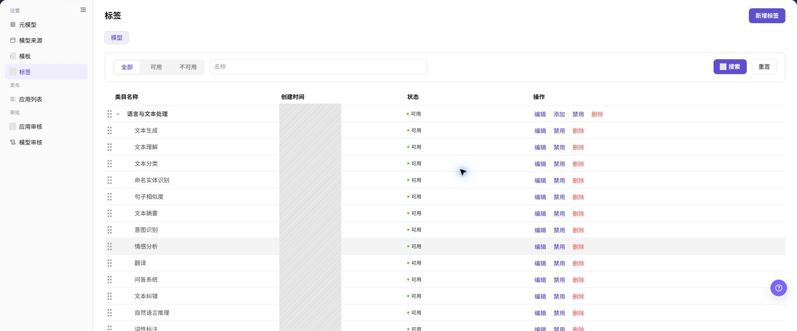
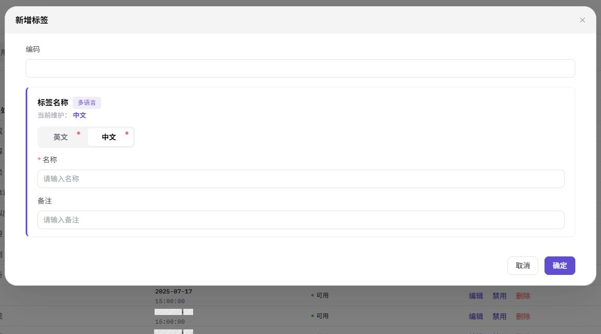
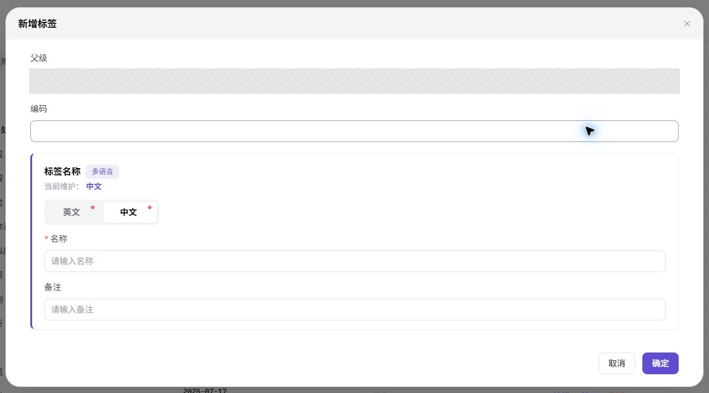
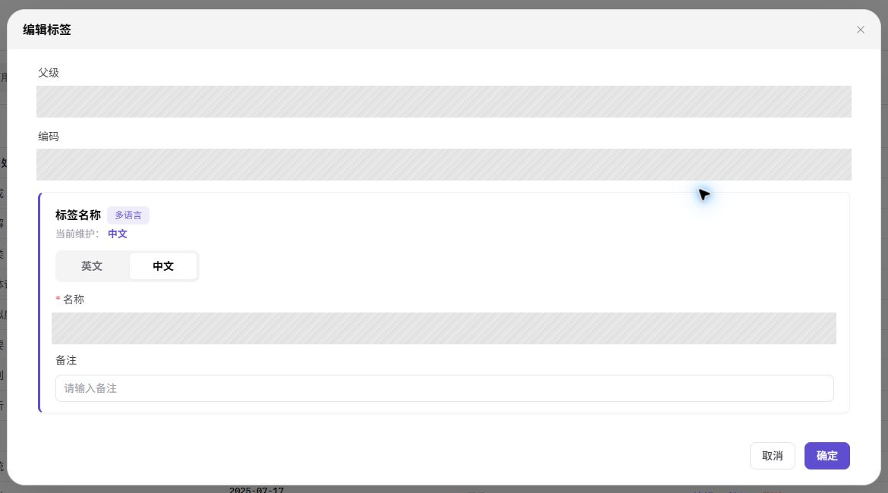

# 标签

## 功能概述

| 项目 | 内容 |
| --- | --- |
| 适用角色 | 运营管理员 |
| 导航路径 | 模型及AI服务 > 设置 > 标签 |
| 页面路由 | `/modelone/settings/tags` |
| 管理对象 | 标签类目、子标签、展示层级和启用状态 |

#### 新手理解

标签像模型市场里的货架贴纸，用来告诉用户一个模型适合什么能力、场景或行业。运营管理员先把标签类目和子标签整理好，模型提供方或运营管理员后续才能把模型归到正确位置。标签命名越清楚，模型调用方在市场里找到目标模型的速度就越快。

#### 术语表

| 术语 | 英文 | 说明 |
| --- | --- | --- |
| 标签 | Tag | 用于标识模型能力、场景或行业的用户可见分类 |
| 标签类目 | Tag Category | 标签树的一级节点，用来组织一组相关子标签 |
| 子标签 | Child Tag | 挂在标签类目下的具体标签项，可用于模型筛选和展示 |
| 标签状态 | Tag Status | 页面在绑定和筛选控件中展示的标签状态 |
| 绑定关系 | Binding Relationship | 标签与模型、应用或展示入口之间的引用关系 |

#### 推荐操作顺序

第一次整理标签时，建议先新增标签类目，再在类目下添加子标签；保存后查询标签，确认名称、层级和状态正确；日常调整时先编辑标签或启用、禁用标签；确认没有绑定关系后再删除标签。这样可以先把“标签属于哪一类”和“标签本身叫什么”分开确认，减少模型市场筛选混乱。

#### 小白先看

| 场景 | 先做 | 不要直接做 |
| --- | --- | --- |
| 第一次建立模型筛选体系 | 添加标签类目 | 直接堆一批平级标签 |
| 要给某个能力补充筛选项 | 添加子标签，再查询标签层级 | 把能力、行业和推荐标签混在同一类目 |
| 标签名称或备注不准确 | 编辑标签并核对中英文名称 | 只改一个语言版本 |
| 标签暂时不希望继续被绑定 | 先禁用标签并检查市场筛选 | 直接删除仍被模型引用的标签 |

## 前提条件

1. 当前账号具备 `标签` 配置权限。
2. 标签类目、子标签命名规则、展示层级和启用策略已确认。
3. 新增标签前已检查是否存在同义、重复或含义过窄的标签。
4. 编辑、禁用或删除标签前已评估对模型绑定、模型市场筛选和已发布模型展示的影响。

## 页面说明

页面用于维护模型服务的标签树，包括标签类目、子标签、创建时间、状态和行内操作。顶部可新增标签，列表中可按状态或名称查询标签，并可对具体标签执行编辑、添加子标签、禁用和删除操作。

页面截图：

上图中顶部是状态和名称查询区域，右侧 `操作` 列展示标签的编辑、添加、禁用和删除入口。左侧缩进表示标签层级，父级类目可展开查看子标签。

## 主要操作

<!-- main-operation-title-exceptions: 编辑,删除 -->

下面的操作按新手阅读顺序排列：先建立标签类目，再添加子标签；查询和编辑用于日常核对；启用、禁用和删除会影响模型市场筛选，应先确认绑定关系。

### 添加标签类目

1. 进入 `模型及AI服务 > 设置 > 标签`。
2. 点击页面右上角 **"新增标签"**，打开 `新增标签` 弹窗。
3. 填写 `编码`，用于唯一识别标签类目。建议使用稳定英文短横线命名，例如 `language-text`。
4. 在 `标签名称` 区域分别维护 `英文` 和 `中文简体` 的 `名称`。
5. 按需填写 `备注`，说明该类目覆盖的能力范围或使用边界。
6. 点击 **"确定"** 保存。保存成功后回到列表，确认新增类目出现在 `类目名称` 列。

上图展示的是 `新增标签` 弹窗。重点检查 `编码`、中英文 `名称` 和 `备注`，这些信息会影响列表展示和后续模型筛选。

### 添加子标签

1. 进入 `模型及AI服务 > 设置 > 标签`。
2. 在 `类目名称` 列定位目标父级类目。
3. 点击目标类目行内的 **"添加"**，打开新增子标签弹窗。
4. 填写子标签 `编码`，并维护 `英文` 和 `中文简体` 的 `名称`。
5. 在 `备注` 中说明该子标签适合绑定的模型能力或场景。
6. 点击 **"确定"** 保存。保存成功后展开父级类目，确认子标签出现在正确层级下。

上图展示的是从父级类目行打开的 `新增标签` 弹窗。`父级` 会自动带入所选类目，保存前重点核对父级、编码和中英文名称。

### 查询标签

1. 进入 `模型及AI服务 > 设置 > 标签`。
2. 在状态切换区选择 `全部`、`可用` 或 `不可用`。
3. 在 `名称` 输入框输入标签名称或关键字。
4. 点击 **"搜索"** 查询结果；需要重新开始时点击 **"重置"** 清除条件。
5. 展开目标类目，核对标签名称、创建时间、状态、层级和可用操作。
6. 如果查询不到目标标签，先切回 `全部` 状态并清空名称条件，再确认中英文名称是否一致。

上图展示的是状态切换、名称查询和标签列表区域。查询标签时先确认状态条件，再核对目标标签所在层级。

### 编辑标签

1. 在标签列表中定位目标标签或标签类目。
2. 点击目标行内 **"编辑"**，打开编辑弹窗。
3. 核对 `编码`、中英文 `名称` 和 `备注`；编码如为只读，以页面展示为准。
4. 只修改需要变更的名称或备注，并确认新名称不会与同级标签混淆。
5. 点击 **"确定"** 保存。保存成功后刷新或重新查询目标标签，确认列表名称和状态仍符合预期。

上图展示的是 `编辑标签` 弹窗。父级和现有字段会自动回显，提交前应确认正在编辑的是目标子标签，并核对编码和多语言名称。

### 启用或禁用标签

1. 在标签列表中定位目标标签。
2. 点击目标行内 **"禁用"** 或 **"启用"** 前，先确认该标签是否已被模型、应用或市场筛选入口使用。
3. 如果该标签仍是线上模型的主要筛选入口，不建议直接禁用；先准备替代标签或调整模型绑定关系。
4. 阅读页面提示，确认目标标签无误后再完成状态变更。
5. 操作成功后切换 `可用` 或 `不可用` 状态条件，确认目标标签出现在正确列表中。
6. 如果状态未变化，检查账号权限、绑定关系、筛选条件和页面刷新状态，不要重复点击按钮。

上图展示的是标签列表中的 **"禁用"** 入口。完成状态变更后，通过状态筛选区复核该标签是否进入预期状态。

### 删除标签

1. 在标签列表中定位目标标签，先核对名称、层级和状态。
2. 点击目标行内 **"删除"**，阅读删除确认提示。
3. 如果该标签已被模型、应用或市场入口引用，先迁移绑定关系或改为禁用，不建议直接删除。
4. 如果要删除父级类目，先确认其下没有仍需保留的子标签。
5. 确认删除后刷新列表，使用 `全部` 状态和名称条件重新查询，确认目标标签已不再显示。
6. 如果删除按钮置灰或删除失败，按页面提示检查子标签、绑定关系、账号权限和当前状态。

上图展示的是子标签的删除确认框。点击 **"确定"** 前再次核对提示中的标签名称；删除后该标签将从所属父级类目下移除。

## 参数速查表

| 字段名称 | 是否必填 | 字段类型 | 示例 | 说明 |
| --- | --- | --- | --- | --- |
| 编码 | 必填 | 文本 / 只读文本 | `text-generation` | 标签或标签类目的唯一识别编码，保存后通常不建议变更 |
| 标签名称 | 必填 | 多语言文本 | `文本生成` | 用户在列表、模型市场和筛选入口看到的标签名称 |
| 名称 | 必填 | 文本 | `Text Generation` | 当前语言标签页下维护的名称内容 |
| 备注 | 否 | 文本 | `适用于文本生成模型` | 说明标签用途、覆盖范围或运营边界 |
| 父级类目 | 视操作而定 | 标签层级 | `语言与文本处理` | 添加子标签时用于确认子标签归属 |
| 状态 | 系统生成 / 操作变更 | 枚举 | `可用` | 控制标签是否可继续被绑定和筛选 |
| 展示层级 | 系统展示 | 树形结构 | `语言与文本处理 > 文本生成` | 决定标签在列表和筛选体系中的组织位置 |

## 踩坑提示

- 标签类目和子标签不要混用；类目用于组织，子标签才是更具体的筛选项。
- 中英文名称要同时维护，否则英文站点或中文站点会出现含义不一致的筛选项。
- 禁用标签前先检查模型绑定和市场筛选入口，避免调用方突然找不到常用模型。
- 删除父级类目前先处理子标签，避免把仍有业务含义的子标签一起影响。
- 不要用内部项目代号、客户简称或临时活动名称作为通用模型标签。

## 结果校验

| 检查项 | 成功表现 | 异常时处理 |
| --- | --- | --- |
| 添加的标签类目在列表中可见 | `类目名称` 列出现新类目，状态显示为可用 | 清空名称条件并切换到 `全部`，检查编码是否重复或保存是否失败 |
| 子标签出现在正确父级下 | 展开父级类目后可看到新增子标签 | 确认是否点击了正确父级行的 **"添加"**，必要时编辑标签或重新添加 |
| 查询条件能定位目标标签 | 输入名称并点击 **"搜索"** 后列表只保留匹配项 | 切换到 `全部` 状态，核对中英文名称、关键字和大小写 |
| 编辑后列表展示已更新 | 目标行名称或备注按新内容保存，层级未发生异常变化 | 重新打开编辑弹窗核对字段，确认是否只修改了当前语言名称 |
| 启用或禁用后状态已变化 | 目标标签出现在 `可用` 或 `不可用` 对应列表中 | 检查账号权限、绑定关系和页面刷新状态，等待同步后重新查询 |
| 删除后列表不再显示该标签 | 使用 `全部` 状态和名称查询时找不到目标标签 | 检查是否删除了同名标签中的另一条，或目标标签仍有子标签、绑定关系 |
| 模型市场筛选项符合预期 | 模型调用方可按新标签筛选到正确模型 | 检查模型是否已绑定标签、模型是否上架、可见范围是否覆盖调用方 |

## 常见问题

#### 标签筛选结果为空

**问题现象：**

模型调用方点击某个标签后没有模型展示。

**可能原因：**

- 没有已上架模型绑定该标签。
- 标签状态为不可用。
- 模型可见范围不包含当前调用方。

**处理方式：**

1. 回到标签页确认标签状态为可用。
2. 在模型编辑或发布配置中核对标签绑定关系。
3. 检查模型上架状态和可见范围。

#### 父级类目下看不到新增子标签

**问题现象：**

添加子标签后，展开目标类目没有看到新增记录。

**可能原因：**

- 保存时选择或点击了错误的父级类目。
- 当前名称查询条件过滤掉了新增子标签。
- 编码重复导致保存失败。

**处理方式：**

1. 点击 **"重置"** 清除查询条件。
2. 展开所有可能的父级类目，确认子标签位置。
3. 如未找到，重新添加前先检查编码是否已存在。

#### 编辑标签后市场展示没有变化

**问题现象：**

标签名称已修改，但模型市场筛选区仍显示旧名称。

**可能原因：**

- 只修改了一个语言版本。
- 市场索引或页面缓存尚未刷新。
- 模型市场使用的是模型绑定数据，标签尚未重新同步。

**处理方式：**

1. 在编辑弹窗中核对 `英文` 和 `中文简体` 名称。
2. 刷新模型市场页面后重新检查筛选项。
3. 核对模型绑定关系，确认目标模型仍绑定该标签。

#### 禁用标签后仍能被筛选

**问题现象：**

标签已禁用，但模型市场或模型编辑页仍能看到该标签。

**可能原因：**

- 页面缓存或索引同步存在延迟。
- 已有模型绑定关系仍在展示。
- 操作对象是同名标签，不是目标标签。

**处理方式：**

1. 在标签页切换到 `不可用`，确认目标标签状态。
2. 检查同名标签是否还有可用记录。
3. 等待同步后复核模型市场和模型编辑页。

#### 删除标签按钮置灰或删除失败

**问题现象：**

点击 **"删除"** 后按钮置灰、提示失败，或删除后标签仍在列表中。

**可能原因：**

- 标签下仍有子标签。
- 标签仍被模型、应用或市场入口引用。
- 当前账号没有删除权限。

**处理方式：**

1. 先展开标签层级，确认是否存在子标签。
2. 迁移或移除模型、应用上的绑定关系。
3. 确认无引用后再删除；仍失败时检查账号权限。

#### 中英文标签名称不一致

**问题现象：**

中文站点和英文站点展示的标签含义不一致。

**可能原因：**

- 新增或编辑时只维护了当前语言名称。
- 翻译与标签类目的业务边界不一致。
- 多个同义标签被分别维护。

**处理方式：**

1. 打开标签编辑弹窗，分别核对 `英文` 和 `中文简体` 名称。
2. 按同一业务含义统一翻译。
3. 对重复标签先迁移绑定关系，再禁用或删除多余项。

## 注意事项

- 标签会影响模型市场筛选、模型展示和模型调用方的发现路径，调整前应确认影响范围。
- 标签命名应面向用户理解，避免内部项目代号、临时活动词或只有运营团队懂的缩写。
- 对涉及客户名称、行业专属含义或受限模型的标签，应先确认展示边界和可见范围。
- 批量整理标签前，先导出现有标签和绑定关系清单，避免误删仍在使用的标签。

## 后续操作

1. 在模型编辑、模型发布或应用配置中绑定目标标签。
2. 到模型市场或体验中心验证标签筛选结果是否符合预期。
3. 定期清理重复、低使用或含义过窄的标签，并同步更新命名规则。
