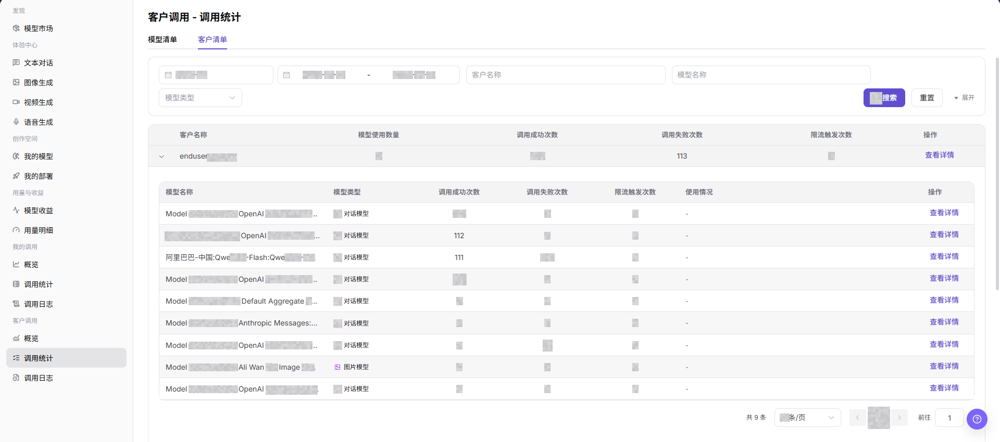
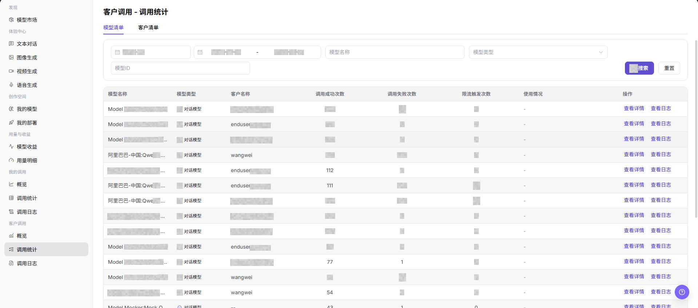
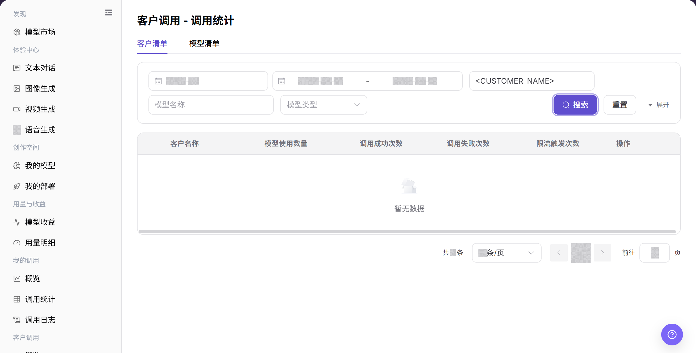
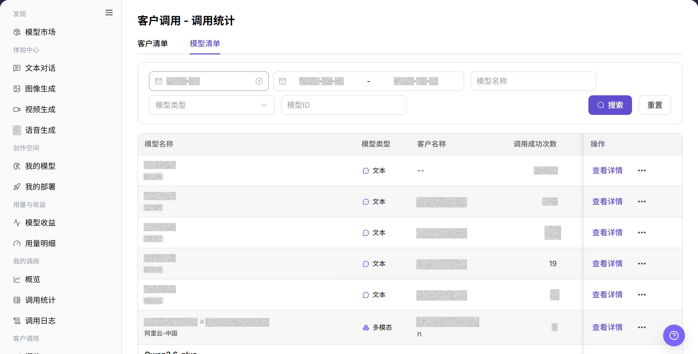

# 调用统计

## 功能概述

| 项目 | 内容 |
| --- | --- |
| 适用角色 | 模型提供方 |
| 导航路径 | 模型及AI服务 > 客户调用 > 调用统计 |
| 页面路由 | `/modelone/monitoring/monitor/list/user` |
| 管理对象 | 客户清单、模型清单、调用成功次数、失败次数和限流次数 |

#### 新手理解

客户调用统计像按客户和模型拆开的运营明细。客户清单先看每个客户用了多少模型，模型清单再看各模型被调用的表现。

#### 术语表

| 术语 | 英文 | 说明 |
| --- | --- | --- |
| 客户清单 | Customers | 按客户汇总模型使用数量和调用指标。 |
| 模型清单 | Models | 按模型展示客户调用统计。 |
| 模型使用数量 | Models Used | 客户在当前范围内调用过的模型数量。 |
| 查看详情 | View Details | 打开目标客户或模型的进一步统计信息。 |

#### 推荐操作顺序

先在客户清单定位目标客户并查看模型使用数量，再切换模型清单比较模型表现，最后打开异常对象详情。

#### 小白先看

| 场景 | 先做 | 不要直接做 |
| --- | --- | --- |
| 客户反馈异常 | 先在客户清单定位客户 | 直接查看全部模型 |
| 模型表现异常 | 切换模型清单比较指标 | 只看客户总量 |
| 查询无结果 | 重置条件并扩大周期 | 叠加更多条件 |
| 准备共享统计 | 脱敏客户名称和业务标识 | 外发原始清单 |

## 前提条件

1. 当前账号具备 `调用统计` 页面访问权限。
2. 已明确需要查看的月份、日期范围、模型、客户或模型类型。
3. 客户名称、模型名称、调用量和使用情况等敏感字段已按权限展示。

## 页面说明

页面通过客户清单和模型清单展示成功、失败、限流和使用情况。查询条件和详情入口随当前页签变化。

页面截图：

客户清单用于按客户查看模型使用数量和调用指标。

模型清单用于按模型比较客户调用表现。

## 主要操作

### 查看客户调用清单

1. 进入 `模型及AI服务 > 客户调用 > 调用统计`。
2. 点击 **"客户清单"**，输入客户名称或模型名称。
3. 点击 **"搜索"**，核对模型使用数量、成功、失败和限流次数。
4. 点击目标客户的 **"查看详情"** 继续查看；条件错误时点击 **"重置"**。

上图展示客户清单查询结果。重点核对客户条件和调用指标。

### 查看模型调用清单

1. 点击 **"模型清单"**。
2. 输入模型名称，并按需选择模型类型。
3. 点击 **"搜索"**，核对目标模型的客户调用统计。
4. 打开详情前确认当前页签、时间范围和模型条件正确。

上图展示模型清单查询结果。重点核对模型条件和客户调用表现。

## 参数速查表

| 字段名称 | 是否必填 | 字段类型 | 示例 | 说明 |
| --- | --- | --- | --- | --- |
| 月份 | 是 | 月份选择 | `2026-07` | 控制调用统计的统计月份。 |
| 日期范围 | 是 | 日期范围 | `2026-07-01 至 2026-07-17` | 控制清单数据的查询时间范围。 |
| 维度页签 | 是 | 页签 | `模型清单` / `客户清单` | 切换模型维度列表或客户维度列表。 |
| 模型名称 | 否 | 输入框 | `Example Model` | 按模型名称筛选模型清单或客户清单。 |
| 模型类型 | 否 | 选择项 | `对话模型` / `图片模型` | 按模型能力类型筛选统计数据。 |
| 模型 ID | 否 | 输入框 | `<MODEL_ID>` | 在模型清单下按模型 ID 精确筛选。 |
| 客户名称 | 否 | 输入框 / 文本 | `Example Customer` | 在客户清单下按客户名称筛选统计数据。 |
| 模型使用数量 | 系统生成 | 数值 | `2` | 在客户清单下展示客户调用过的模型数量。 |
| 调用成功次数 | 系统生成 | 数值 | `40` | 当前筛选范围内调用成功的次数。 |
| 调用失败次数 | 系统生成 | 数值 | `2` | 当前筛选范围内调用失败的次数。 |
| 限流触发次数 | 系统生成 | 数值 | `1` | 当前筛选范围内触发限流的次数。 |
| 使用情况 | 系统生成 | 文本 / 标签 | `1,280 Tokens` | 展示 Token、额度或其他调用使用信息。 |
| 操作 | 否 | 操作入口 | `查看详情` / `查看日志` | 查看统计详情或跳转到调用日志。 |

## 踩坑提示

- 调用统计适合看趋势和分布，不替代调用日志中的单笔错误定位。
- 按客户、模型、时间粒度切换时，图表口径会变化，截图前要保留筛选条件。
- 峰值、失败率和平均耗时需要结合模型版本和 Endpoint 状态一起判断。

## 结果校验

| 检查项 | 成功表现 | 异常时处理 |
| --- | --- | --- |
| 页面可进入 | `客户调用 - 调用统计` 页面正常打开，左侧 `客户调用 > 调用统计` 菜单高亮。 | 确认账号权限、导航路径和页面加载状态。 |
| 模型清单正常展示 | `模型清单` 页签下展示模型名称、模型类型、客户名称、成功次数、失败次数、限流触发次数和操作入口。 | 调整月份、日期范围或模型筛选项后重试。 |
| 客户清单正常展示 | `客户清单` 页签下展示客户名称、模型使用数量、成功次数、失败次数、限流触发次数和操作入口。 | 调整日期范围、客户名称或模型名称后重试。 |
| 筛选项可用 | 切换月份、日期范围、模型、客户或模型类型后，清单数据随之变化。 | 检查筛选条件是否过窄，必要时点击 **"重置"**。 |
| 搜索 / 重置可用 | 点击 **"搜索"** 后展示匹配数据，点击 **"重置"** 后清空筛选条件。 | 检查网络状态、页面接口返回和账号权限。 |
| 清单数据一致 | 清单中的成功次数、失败次数、限流触发次数和使用情况与详情或日志入口中的数据一致。 | 进入 `查看详情` 或 `查看日志` 交叉确认。 |

## 常见问题

#### 客户清单为空

**问题现象:**

客户页签显示空状态，没有客户统计行。

**可能原因:**

- 日期范围内没有客户调用。
- 客户名称或其他筛选条件过窄。

**处理方式:**

1. 点击 **"重置"** 清除筛选条件。
2. 选择包含已知调用的日期范围并搜索。
3. 到客户调用日志查询同一范围；日志存在但清单为空时联系管理员。

#### 模型清单为空

**问题现象:**

模型页签显示空状态，没有模型统计行。

**可能原因:**

- 日期范围内没有目标模型的客户调用。
- 模型名称、类型或 Model ID 筛选过窄。

**处理方式:**

1. 清除模型筛选并扩大日期范围。
2. 按 Model ID 重新搜索。
3. 到客户调用日志确认记录；仍为空时联系管理员并提供脱敏筛选条件。

#### 客户清单与模型清单合计不同

**问题现象:**

两个页签的合计或行数不一致。

**可能原因:**

- 一个客户调用多个模型，或多个客户调用同一模型。
- 两个页签使用了不同筛选条件。

**处理方式:**

1. 统一日期、模型类型和其他筛选条件。
2. 比较调用总数，不直接比较客户行数和模型行数。
3. 调用总数仍不一致时向管理员提交筛选条件和脱敏截图。

#### 查询结果不符合筛选条件

**问题现象:**

列表中出现不属于目标日期、客户或模型的记录。

**可能原因:**

- 筛选条件未提交，或旧条件仍保留。
- 客户页签和模型页签使用了不同条件。

**处理方式:**

1. 点击 **"重置"**。
2. 逐项设置日期和目标筛选项，然后点击 **"搜索"**。
3. 仍出现不匹配记录时记录页签和条件，并联系管理员。

#### 统计详情无法打开

**问题现象:**

点击 **"查看详情"** 后没有打开客户或模型详情。

**可能原因:**

- 当前账号缺少详情权限。
- 目标记录已不在当前筛选范围。

**处理方式:**

1. 清除筛选并重新定位目标行。
2. 刷新页面后再次打开详情。
3. 仍失败时联系管理员核对模型提供方权限，并提供页面路由。

## 注意事项

- 客户名称、模型名称、调用量、费用、Key、请求内容和业务标识属于敏感运营信息。
- 对外沟通或截图前应脱敏客户名称、Key、请求内容、费用明细和内部测试参数。
- 调用统计是聚合数据，排查单次请求时应以调用日志为准。

## 后续操作

1. 点击 **"查看详情"** 查看目标模型或客户的统计详情。
2. 点击 **"查看日志"** 或进入 `客户调用 > 调用日志` 定位单次请求。
3. 返回 `客户调用 > 概览` 查看趋势、消耗统计和 TOP 排名。
