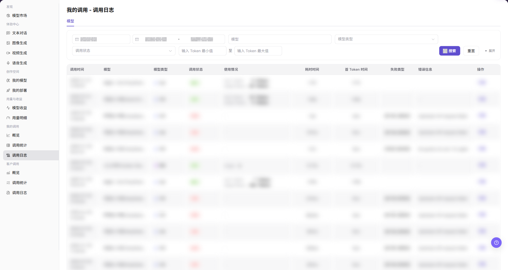
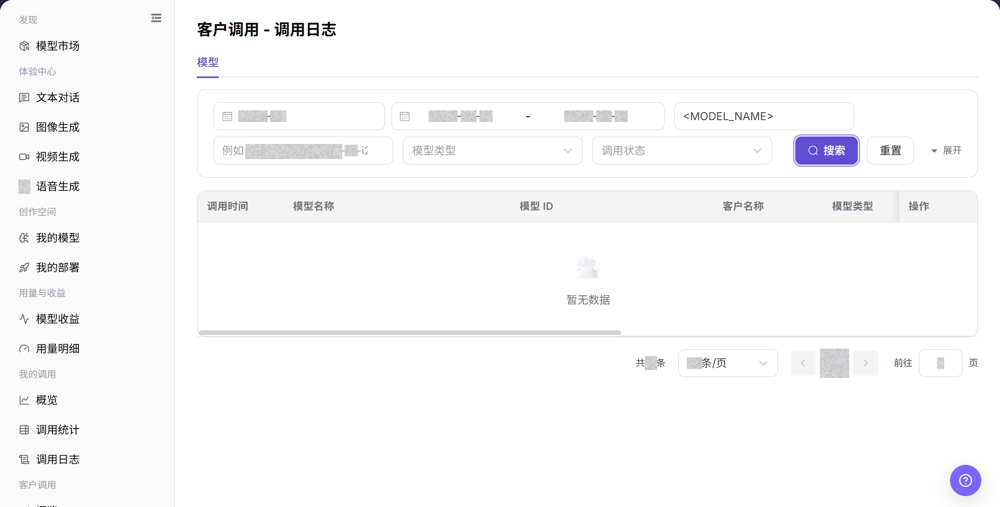
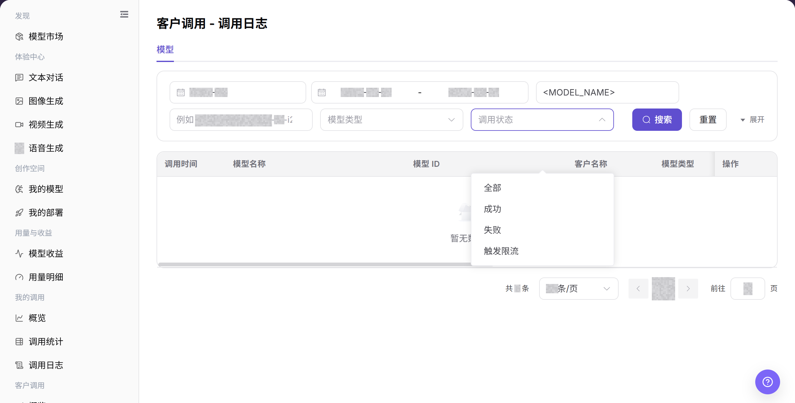

# 调用日志

## 功能概述

| 项目 | 内容 |
| --- | --- |
| 适用角色 | 模型提供方 |
| 导航路径 | 模型及AI服务 > 客户调用 > 调用日志 |
| 页面路由 | `/modelone/monitoring/monitor/log/model` |
| 管理对象 | 客户模型调用记录、调用结果、用量、耗时和失败记录 |

#### 新手理解

客户调用日志像客户请求的排障明细单。先按时间、模型和状态找到记录，再结合客户名称、结果、用量和耗时判断问题范围。

#### 术语表

| 术语 | 英文 | 说明 |
| --- | --- | --- |
| 客户名称 | Customer Name | 发起模型调用的客户标识。 |
| 调用结果 | Call Result | 单次客户调用的成功或失败状态。 |
| 使用情况 | Usage | 单次调用的 Token、次数或其他消耗信息。 |
| 首 Token 时间 | First Token Time | 文本模型返回首个 Token 的耗时。 |

#### 推荐操作顺序

先设置时间范围并查询客户调用日志，再定位失败记录，最后结合客户、模型、错误和耗时判断影响范围。

#### 小白先看

| 场景 | 先做 | 不要直接做 |
| --- | --- | --- |
| 客户反馈失败 | 先核对时间和模型 | 直接按客户名称猜测 |
| 失败记录较多 | 按状态定位并比较时间分布 | 逐条重复调用 |
| 查不到记录 | 重置条件并核对时区 | 持续缩小范围 |
| 准备共享日志 | 脱敏客户、请求和凭证 | 外发完整详情 |

## 前提条件

1. 当前账号具备 `调用日志` 页面访问权限。
2. 已明确需要查看的月份、日期范围、模型、模型类型或调用状态。
3. 排障材料中不得包含客户完整请求、响应正文、Key、账号或费用明细。

## 页面说明

页面展示客户侧模型调用记录，支持按模型名称、模型 ID、模型类型、调用状态和时间范围查询。列表包含客户名称、结果、用量、耗时和详情入口。

页面截图：

关注时间范围、模型条件、客户名称、调用结果和详情入口。

## 主要操作

### 查询客户调用日志

1. 进入 `模型及AI服务 > 客户调用 > 调用日志`。
2. 设置时间范围，输入模型名称或模型 ID，并按需选择模型类型和调用状态。
3. 点击 **"搜索"**，核对调用时间、客户名称、结果、用量和耗时。
4. 条件错误时点击 **"重置"**；共享结果前先脱敏客户与业务标识。

上图展示客户调用日志查询结果。重点核对时间、客户、模型和调用结果。

### 定位失败调用记录

1. 在调用状态中选择失败状态。
2. 点击 **"搜索"**，比较失败记录的客户、模型、时间和耗时分布。
3. 打开目标记录的 **"详情"**，只记录脱敏错误摘要；不要复制完整请求、响应或凭证。

上图展示失败状态查询。重点比较失败记录的客户、模型和时间分布。

## 参数速查表

| 字段名称 | 是否必填 | 字段类型 | 示例 | 说明 |
| --- | --- | --- | --- | --- |
| 月份 | 是 | 月份选择 | `2026-07` | 控制调用日志的统计月份。 |
| 日期范围 | 是 | 日期范围 | `2026-07-01 至 2026-07-17` | 控制调用日志的查询时间范围。 |
| 模型 | 否 | 输入框 | `Example Model` | 按模型名称筛选调用日志。 |
| 模型类型 | 否 | 选择项 | `对话模型` | 按模型能力类型筛选调用日志。 |
| 调用状态 | 否 | 选择项 | `成功` | 按调用处理结果筛选日志。 |
| 最小输入 Token | 否 | 数字输入 | `0` | 设置查询的输入 Token 下限。 |
| 最大输入 Token | 否 | 数字输入 | `1000` | 设置查询的输入 Token 上限。 |
| 调用时间 | 系统生成 | 时间 | `2026-07-17 14:30` | 展示单次客户调用发生时间。 |
| 客户名称 | 系统生成 | 文本 | `Example Customer` | 展示发起调用的客户名称。 |
| 使用情况 | 系统生成 | 文本 / 标签 | `Input 100 / Output 40 Tokens` | 展示输入 Token、输出 Token、缓存输入 Token、上下文规格或免费使用信息。 |
| 耗时时间 | 系统生成 | 时间 | `1.2 s` | 展示单次调用总耗时。 |
| 首 Token 时间 | 系统生成 | 时间 | `0.3 s` | 展示首个 Token 返回耗时。 |
| 失败类型 | 系统生成 | 文本 | `Authentication` | 展示失败请求的问题归类。 |
| 错误信息 | 系统生成 | 文本 | `Redacted error message` | 展示失败请求的错误摘要，截图和对外沟通时需脱敏。 |
| 操作 | 否 | 操作入口 | `详情` | 进入单次客户调用日志详情。 |

## 踩坑提示

- 调用日志中的请求 ID、客户标识和错误信息需要脱敏后再外发。
- 401、429、5xx 属于不同排查方向，不要只按“调用失败”统一处理。
- 日志保留周期可能有限，排查前先确认时间范围并尽快导出脱敏线索。

## 结果校验

| 检查项 | 成功表现 | 异常时处理 |
| --- | --- | --- |
| 页面可进入 | `客户调用 - 调用日志` 页面正常打开，左侧 `客户调用 > 调用日志` 菜单高亮。 | 确认账号权限、导航路径和页面加载状态。 |
| 日志列表可见 | 列表显示调用时间、模型、客户名称、调用状态、使用情况、耗时和错误信息等列。 | 刷新页面，或调整月份、日期范围后重试。 |
| 筛选项可用 | 按月份、日期范围、模型、模型类型或调用状态筛选后，列表刷新。 | 检查筛选条件是否过窄，必要时点击 **"重置"**。 |
| 搜索 / 重置可用 | 点击 **"搜索"** 后展示匹配日志，点击 **"重置"** 后清空筛选条件。 | 检查网络状态、页面接口返回和账号权限。 |
| 日志详情可打开 | 点击 **"详情"** 后可查看单次客户调用的更多信息。 | 确认该记录仍在日志保留周期内。 |
| 字段信息一致 | 调用状态、耗时、使用情况、失败类型和错误信息与详情页一致。 | 重新打开详情或扩大时间范围交叉确认。 |

## 常见问题

#### 查不到客户调用日志

**问题现象:**

按客户、模型或时间搜索后没有目标记录。

**可能原因:**

- 筛选范围不包含目标调用。
- 当前账号无权查看该客户记录。

**处理方式:**

1. 点击 **"重置"** 并选择调用发生的日期。
2. 按客户、Model ID 和状态逐步筛选。
3. 仍找不到时联系管理员核对模型提供方权限，并提供脱敏调用时间。

#### 筛选失败状态后没有记录

**问题现象:**

选择失败状态后列表为空。

**可能原因:**

- 所选范围内没有失败请求。
- 模型、客户或日期筛选排除了失败记录。

**处理方式:**

1. 只保留失败状态，清除其他筛选。
2. 扩大日期范围并重新搜索。
3. 如果概览显示失败但日志仍为空，向管理员提供相同筛选条件和脱敏截图。

#### 同一客户出现大量失败

**问题现象:**

一个客户在短时间内出现多条失败日志。

**可能原因:**

- 客户使用了无效凭据、Model ID 或请求格式。
- 目标模型持续返回上游错误。

**处理方式:**

1. 固定客户和时间范围。
2. 打开多条失败详情，比较错误类型和 Model ID。
3. 将脱敏错误反馈给客户；上游错误持续时同时联系模型提供方。

#### 客户调用耗时明显增加

**问题现象:**

同一模型的总耗时或首 Token 时间明显增加。

**可能原因:**

- 客户请求输入更长或输出上限更高。
- 目标模型或供应方在该时间段响应较慢。

**处理方式:**

1. 比较同一客户、Model ID 和相近输入规模的请求。
2. 分别核对总耗时和首 Token 时间。
3. 持续升高时向模型提供方提交时间范围和脱敏请求 ID。

#### 客户日志包含敏感信息

**问题现象:**

详情中出现客户凭据、完整 Endpoint、输入或响应内容。

**可能原因:**

- 调用内容本身包含敏感数据。
- 截图或工单未脱敏。

**处理方式:**

1. 停止复制或外发该详情。
2. 遮挡客户名称、Personal Key、请求头、正文、响应和完整 Endpoint。
3. 凭据已经泄露时立即联系管理员或安全负责人并轮换凭据。

## 注意事项

- 不要在文档、截图或工单中展示完整客户请求、响应正文、Key、账号或费用明细。
- 客户日志用于排障，不替代收益结算或账务明细。
- 错误信息仅用于定位问题，公开沟通前必须脱敏。

## 后续操作

1. 点击 **"详情"** 查看目标客户调用的脱敏详情。
2. 进入 `客户调用 > 调用统计` 判断是否存在批量异常。
3. 返回 `客户调用 > 概览` 查看客户或模型维度的趋势变化。
