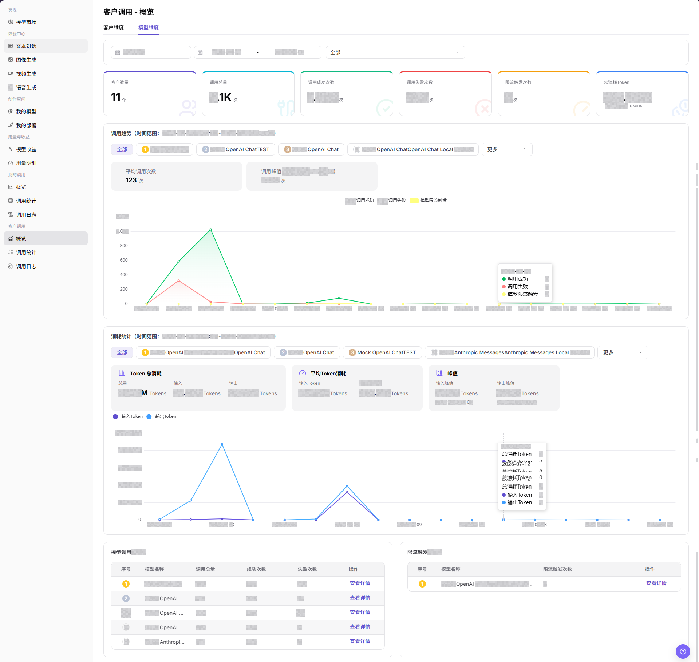
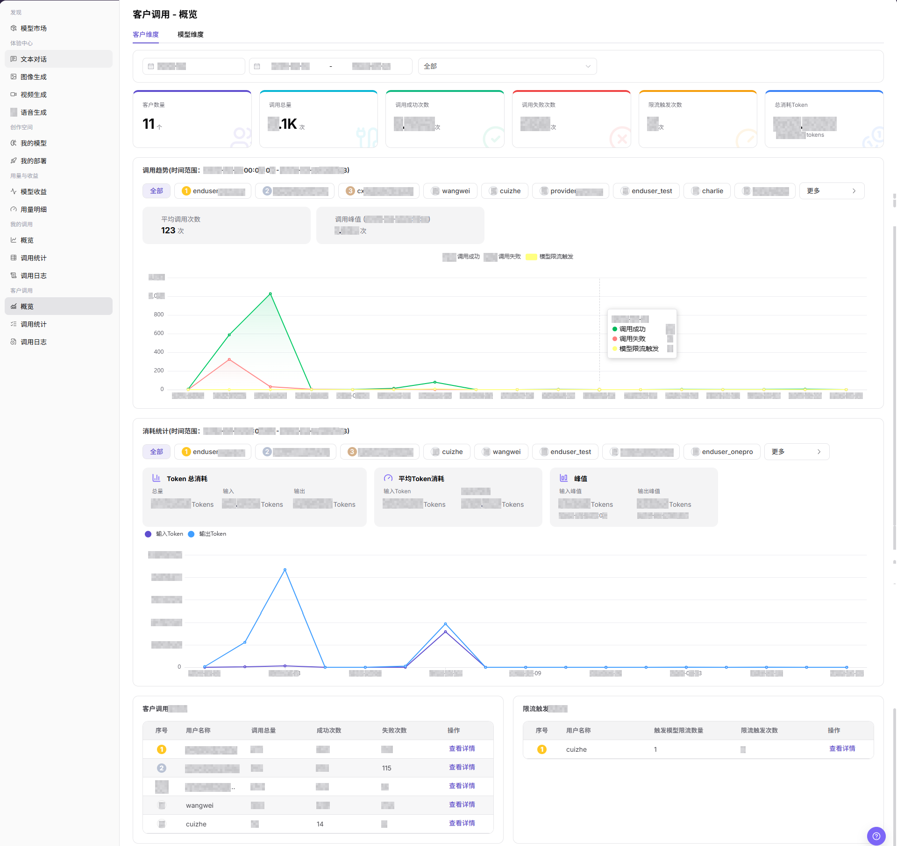
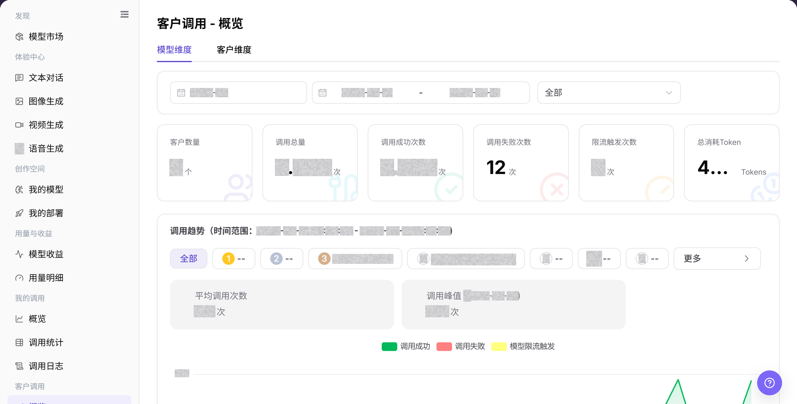
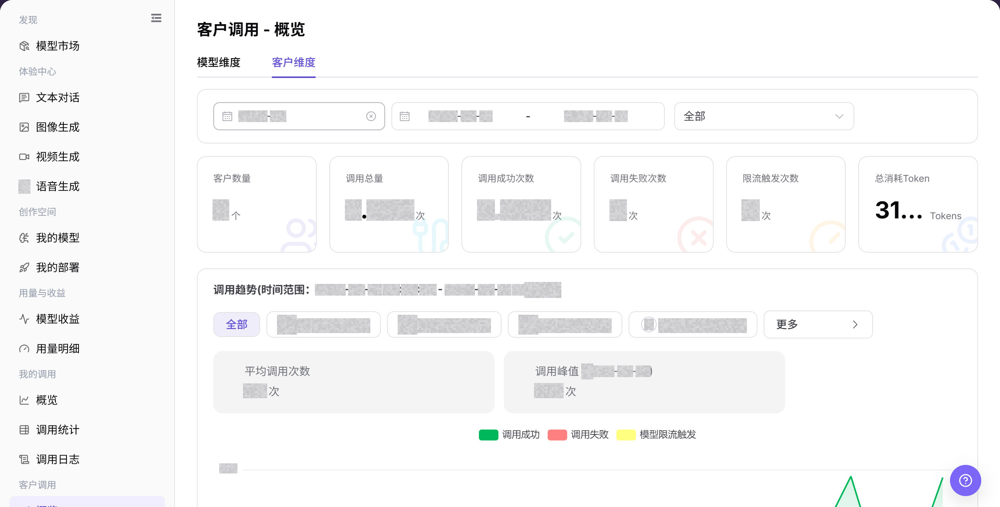

# 概览

## 功能概述

| 项目 | 内容 |
| --- | --- |
| 适用角色 | 模型提供方 |
| 导航路径 | 模型及AI服务 > 客户调用 > 概览 |
| 页面路由 | `/modelone/monitoring/monitor/overview/model` |
| 管理对象 | 模型维度与客户维度的调用指标、趋势、排行和详情入口 |

#### 新手理解

客户调用概览像模型提供方的运营看板。模型维度回答“哪些模型被调用”，客户维度回答“哪些客户在调用”，两个视角结合才能判断异常影响范围。

#### 术语表

| 术语 | 英文 | 说明 |
| --- | --- | --- |
| 模型维度 | Model Analytics | 按模型汇总客户调用量、成功、失败和限流。 |
| 客户维度 | Customer Analytics | 按客户汇总其调用模型和调用指标。 |
| 调用总量 | Total Calls | 当前统计范围内的客户调用总次数。 |
| TOP 排行 | Top Ranking | 按调用量或其他指标排序的模型或客户。 |

#### 推荐操作顺序

先在模型维度查看整体趋势和异常模型，再切换客户维度确认受影响客户，最后通过详情或日志入口继续排查。

#### 小白先看

| 场景 | 先做 | 不要直接做 |
| --- | --- | --- |
| 不知道先看哪个维度 | 先从模型维度看整体 | 只看一个维度下结论 |
| 模型失败升高 | 切换客户维度确认范围 | 立即调整全部模型 |
| 客户数据为空 | 扩大周期并核对客户条件 | 判断客户未调用 |
| 准备共享看板 | 脱敏客户与业务标识 | 外发原始数据 |

## 前提条件

1. 当前账号具备 `概览` 页面访问权限。
2. 已明确需要查看的统计月份、日期范围和维度。
3. 客户名称、模型名称、调用量和费用等敏感字段已按权限展示。

## 页面说明

页面包含模型维度和客户维度两个页签，展示汇总指标、趋势、消耗统计和排行，并提供详情入口。

页面截图：

模型维度用于查看模型调用总量、成功、失败、限流和排行。

客户维度用于查看客户调用趋势和客户排行。

## 主要操作

### 查看模型维度调用概览

1. 进入 `模型及AI服务 > 客户调用 > 概览`。
2. 点击 **"模型维度"**，选择时间范围和模型条件。
3. 核对调用总量、成功、失败、限流、趋势和模型排行。
4. 点击异常模型的详情入口继续排查。

上图展示模型维度概览。重点核对时间范围、汇总指标、趋势和模型列表。

### 查看客户维度调用概览

1. 点击 **"客户维度"**。
2. 选择时间范围和客户条件。
3. 核对客户数量、调用趋势、消耗统计和客户排行。
4. 点击异常客户的详情入口继续排查。

上图展示客户维度概览。重点核对客户范围、趋势和排行。

## 参数速查表

| 字段名称 | 是否必填 | 字段类型 | 示例 | 说明 |
| --- | --- | --- | --- | --- |
| 统计月份 | 是 | 月份选择 | `2026-07` | 控制概览数据所属月份。 |
| 日期范围 | 是 | 日期范围 | `2026-07-01 至 2026-07-17` | 控制趋势图、消耗统计和 TOP 排名的统计时间范围。 |
| 维度页签 | 是 | 页签 | `客户维度` / `模型维度` | 切换客户聚合视角或模型聚合视角。 |
| 客户 | 否 | 选择项 | `全部` 或目标客户 | 在客户维度下按客户筛选统计结果。 |
| 模型 | 否 | 选择项 | `全部` 或目标模型 | 在模型维度下按模型筛选统计结果。 |
| 客户数量 | 系统生成 | 数值 | `3` | 当前统计范围内产生调用的客户数量。 |
| 调用总量 | 系统生成 | 数值 | `42` | 当前统计范围内的调用次数总和。 |
| 调用成功次数 | 系统生成 | 数值 | `40` | 当前统计范围内调用成功的次数。 |
| 调用失败次数 | 系统生成 | 数值 | `2` | 当前统计范围内调用失败的次数。 |
| 限流触发次数 | 系统生成 | 数值 | `1` | 当前统计范围内命中模型限流的次数。 |
| Token 消耗 | 系统生成 | 数值 | `1,280 Tokens` | 展示总消耗 Token、输入 Token、输出 Token、平均 Token 消耗和峰值。 |
| 操作 | 否 | 操作入口 | `查看详情` | 进入客户或模型维度的详情数据。 |

## 踩坑提示

- 客户调用概览用于看客户维度趋势，不适合直接定位单次请求失败；单次失败应进入调用日志。
- 比较客户调用量前先统一时间范围、客户范围、模型版本和统计粒度。
- 收益、调用次数和失败率可能存在同步延迟，不要只用概览数字做最终结算判断。

## 结果校验

| 检查项 | 成功表现 | 异常时处理 |
| --- | --- | --- |
| 页面可进入 | `客户调用 - 概览` 页面正常打开，左侧 `客户调用 > 概览` 菜单高亮。 | 确认账号权限、导航路径和页面加载状态。 |
| 客户维度数据正常展示 | `客户维度` 页签下展示客户数量、调用趋势、消耗统计和客户调用 TOP5。 | 调整日期范围或客户筛选项后重试。 |
| 模型维度数据正常展示 | `模型维度` 页签下展示模型相关趋势、消耗统计和模型调用 TOP5。 | 调整日期范围或模型筛选项后重试。 |
| 筛选项可用 | 切换月份、日期范围、客户或模型后，统计图表和 TOP 表随之变化。 | 检查筛选条件是否过窄，必要时切回 `全部`。 |
| 详情入口可用 | 点击 **"查看详情"** 后可进入对应客户或模型的明细信息。 | 确认数据权限和统计对象是否仍存在。 |
| 统计数据一致 | 调用趋势、消耗统计和 TOP 表与筛选条件一致。 | 刷新页面或扩大时间范围交叉确认。 |

## 常见问题

#### 客户调用概览没有数据

**问题现象:**

客户数、调用量、趋势图和排行均显示空状态。

**可能原因:**

- 所选时间范围内没有客户调用。
- 客户、模型或其他筛选条件排除了目标记录。

**处理方式:**

1. 点击 **"重置"** 清除筛选条件。
2. 选择包含已知客户调用的日期范围并重新搜索。
3. 到 **"客户调用 > 调用日志"** 查询同一范围；日志存在但概览为空时联系管理员。

#### 模型维度与客户维度合计不同

**问题现象:**

模型分析和客户分析显示的合计不一致。

**可能原因:**

- 两个页签使用了不同的筛选条件。
- 同一客户调用了多个模型，或同一模型由多个客户调用。

**处理方式:**

1. 统一日期范围和筛选条件。
2. 分别按客户和模型查看明细，不直接比较行数。
3. 合计仍不一致时，将筛选条件和脱敏截图提交给管理员。

#### 客户失败次数升高

**问题现象:**

失败调用数在目标时间段明显增加。

**可能原因:**

- 一个或多个客户持续发送无效请求。
- 目标模型或上游服务返回错误。

**处理方式:**

1. 切换到客户分析，定位失败增加的客户。
2. 打开 **"调用日志"** 查看失败状态和错误信息。
3. 相同错误持续出现时，联系对应客户和模型提供方处理。

#### 客户限流次数升高

**问题现象:**

限流触发次数大于 0 或持续增加。

**可能原因:**

- 客户请求频率或并发量超过限制。
- 多个请求集中在同一时间段。

**处理方式:**

1. 按客户和模型定位限流来源。
2. 在 **"调用日志"** 核对限流请求时间。
3. 降低流量后再次观察；仍被限流时联系管理员确认策略。

#### 客户或模型详情无法打开

**问题现象:**

点击 **"查看详情"** 后没有进入目标详情。

**可能原因:**

- 当前账号缺少客户调用详情权限。
- 目标记录已不在当前筛选范围。

**处理方式:**

1. 清除筛选并重新定位目标行。
2. 刷新页面后再次点击 **"查看详情"**。
3. 仍无法打开时联系管理员核对模型提供方权限，并提供页面路由。

## 注意事项

- 客户名称、调用量、费用、模型使用情况和业务标识属于敏感运营信息。
- 对外沟通或截图前应脱敏客户名称、Key、请求内容、费用明细和内部测试参数。
- 概览页展示聚合数据，排查单次请求时应以调用日志为准。

## 后续操作

1. 进入 `客户调用 > 调用统计` 查看更细的统计分布。
2. 进入 `客户调用 > 调用日志` 定位单次失败请求。
3. 根据客户或模型的调用趋势调整运营跟进策略。
