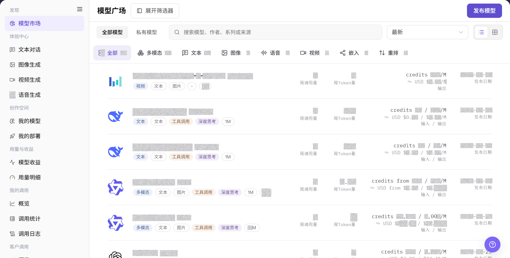
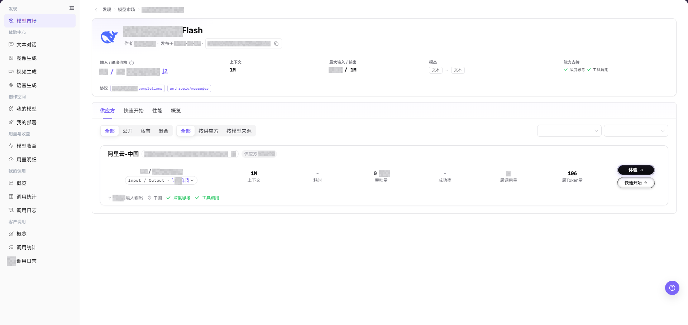
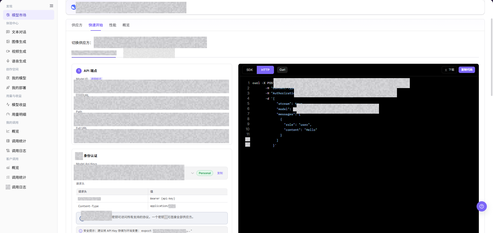
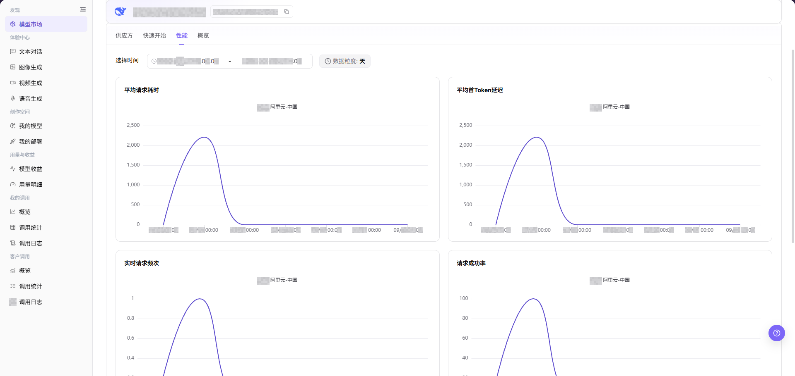
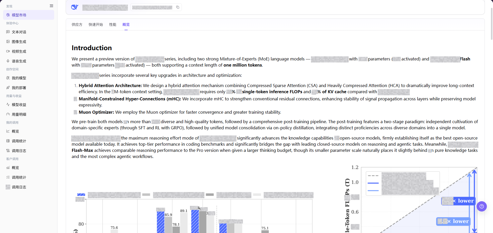

# 模型

::: info 文档信息
版本：v1.0
更新日期：2026-08-31
:::

## 功能概述

| 项目 | 内容 |
| --- | --- |
| 适用角色 | 模型提供方、模型调用方 |
| 导航路径 | 模型及AI服务 > 发现 > 模型 |
| 页面路由 | `/modelone/store/model` |
| 管理对象 | 模型列表、模型详情、供应方实例和快速开始信息 |

#### 新手理解

**"模型"** 页面像可检索的模型目录。先找到符合输入输出能力的模型，再查看供应方、价格、上下文和状态，最后决定进入体验中心还是按快速开始信息接入。

#### 术语表

| 术语 | 英文 | 说明 |
| --- | --- | --- |
| 模型作者 | Model Author | 模型的开发组织或品牌归属。 |
| 模型来源 | Model Source | 提供可调用模型实例的上游服务来源。 |
| 上下文长度 | Context Length | 模型单次请求可处理的输入与输出总量上限。 |
| 快速开始 | Quick Start | 展示调用地址、协议和认证方式的接入区域。 |
| Personal Key | Personal Key | 模型调用方在平台中发起模型调用时使用的个人凭据。 |
| API Key | API Key | API 认证密钥的通用名称。本页调用示例应使用 Personal Key；模型提供方发布模型时可能另需上游 API Key。 |
| 请求头 | Request header | 随请求发送的字段结构，常用于承载认证信息。 |
| Endpoint | Endpoint | 接收请求的实际目标地址，由 Base URL 和接口路径组成。 |
| Model ID | Model ID | 调用时用于定位目标模型实例的标识。 |

#### 小白先看

| 角色 | 第一次使用路径 | 完成信号 |
| --- | --- | --- |
| 模型调用方 | 准备 Personal Key → 在 **"模型"** 选择模型和供应方 → 在 **"体验中心"** 发起一次受控调用 → 到 **"我的调用"** 查看记录 → 到 **"用量明细"** 查看消耗 | 返回区域显示响应或错误；再检查调用日志和用量页是否出现对应记录。 |
| 模型提供方 | 在 **"我的模型"** 创建模型 → 在 **"我的部署"** 发布模型 → 到 **"客户调用"** 查看调用 → 到 **"模型收益"** 查看收益 | 模型列表和部署列表出现目标记录，客户调用与收益页面显示相应统计。 |

同一模型有多个供应方时，应先比较价格、状态和上下文。列表中能看到模型不代表调用已经成功；只有体验返回、调用日志和用量记录形成闭环后，才能确认本次调用结果。

## 前提条件

1. 当前账号可以打开 **"模型"**。
2. 目标模型已上架并对当前账号或客户可见。
3. 需要调用前已确认配额、价格、上下文限制和使用条款。

::: warning 调用与计费风险
体验模型、提交 Prompt 或调用 API 会产生调用记录、额度消耗或计费记录。调用前应确认目标模型、供应方、价格、额度和使用范围。
:::

## 页面说明

页面提供模型搜索、能力筛选、排序和列表展示。打开模型详情后，可以通过`供应方`、`快速开始`、`性能`和`概览`页签查看信息；供应方卡片还提供体验和快速开始入口。

页面截图：

关注搜索框、能力筛选项和模型列表；筛选条件会共同决定当前结果集。

## 主要操作

### 查询模型

1. 进入 `模型及AI服务 > 发现 > 模型`。
2. 在搜索框输入模型名称、作者、系列或来源。
3. 按输入能力、输出能力、上下文、计费、模型作者、模型来源或场景缩小范围。
4. 核对结果中的模型名称、能力标签和状态；无结果时清除组合筛选后重新查询。

`供应方` 页签用于查看供应方实例、计费、上下文、延迟、吞吐量、成功率、周调用数据和 `快速开始` 入口。当前详情页的供应方可见范围使用 `全部`、`公开`、`私有`、`聚合` 分段控件，性能分组使用 `全部`、`按供应方`、`按模型来源`。请复制当前选中实例显示的供应商调用标识符，不要复用其他供应方的标识符。

### 查看模型详情

1. 在模型列表中打开目标模型。
2. 核对模型名称、作者、模型类型、输入输出能力、上下文长度和计费方式。
3. 确认详情页显示模型摘要、能力标签、模态和协议信息。
4. 根据后续目标进入供应方、快速开始、性能或概览页签，不要把不同页签的信息混写。

上图展示模型详情页。先核对模型摘要和能力，再从供应方卡片或页签进入后续操作。

### 查看供应方实例

1. 在模型详情页点击 **"供应方"** 页签。
2. 比较各供应方实例的状态、价格、上下文、延迟、吞吐量和成功率。
3. 需要体验或接入时，先在目标供应方卡片中确认模型 ID、协议和状态，再进入对应操作。

供应方区域用于比较可用实例。重点确认目标卡片，而不是只按模型名称选择供应方。

### 体验模型

1. 在目标供应方卡片中点击 **"立即体验"**。
2. 系统跳转到与模型类型对应的体验中心页面，例如文本对话、图像生成、视频生成或语音生成。
3. 进入体验中心后，核对页面顶部显示的模型和供应方与详情页选择一致。
4. 继续体验前确认 Personal Key、价格和额度；提交 Prompt 或生成内容会产生调用记录和用量。

上图中供应方卡片右侧为体验入口。点击后应进入对应的体验中心页面，后续配置和提交动作按该页面说明执行。

### 查看快速开始

1. 在模型详情页点击 **"快速开始"** 页签，或在目标供应方卡片中点击 **"快速开始"**。
2. 确认当前选择的供应方，并在代码区域切换 `SDK`、`HTTP` 或 `Curl` 示例。
3. 查看 `Model ID`、`Base URL`、`Path`、`Full URL`、请求头和认证方式。
4. 记录接入信息时使用 `<BASE_URL>`、`<ENDPOINT_PATH>`、`<API_KEY>` 或 `<PERSONAL_KEY>` 等占位符，不保存真实凭证。

上图中可从页签或供应方卡片进入快速开始。代码示例中的地址、密钥和请求参数应以当前环境为准，并在文档中保持脱敏。

### 查看性能

1. 在模型详情页点击 **"性能"** 页签。
2. 设置需要查看的时间范围和数据粒度。
3. 查看平均请求耗时、平均首 Token 延迟、实时请求频次和请求成功率。
4. 对比不同时间范围或供应方实例时，保持筛选条件一致，避免把不同口径的数据直接比较。

性能区域用于查看请求耗时、首 Token 延迟、请求频次和成功率。没有数据时，先核对时间范围、供应方和模型是否一致。

### 查看模型概览

1. 在模型详情页点击 **"概览"** 页签。
2. 查看模型说明、能力标签、输入输出模态、上下文和使用边界。
3. 将概览信息与供应方实例和快速开始中的 Model ID、协议保持一致。

概览区域用于确认模型说明、能力和使用边界，是决定是否体验或接入前的最后核对入口。

## 参数速查表

| 字段名称 | 是否必填 | 字段类型 | 示例 | 说明 |
| --- | --- | --- | --- | --- |
| 模型名称 | 必填 | 文本 | `Example Model` | 模型展示名称，用于在列表和详情页识别模型。 |
| 供应方 | 必填 | 文本 / 筛选项 | `Example Provider` | 提供模型实例的租户或渠道。 |
| 模型类型 | 否 | 筛选项 / 标签 | `对话模型` | 用于区分多模态、对话、图片、语音、视频、嵌入、重排等模型类型。 |
| 视图 | 否 | 切换项 | `表格` / `卡片` | 只改变展示方式，不改变模型可见范围。 |
| 能力标签 | 否 | 标签 | `工具调用` | 展示模型支持的能力，例如工具调用、深度思考等。 |
| 输入输出模态 | 否 | 标签 | `文本 / 图片` | 展示模型支持的输入和输出类型。 |
| 计费方式 | 否 | 文本 | `Credit / 1M Tokens` | 展示模型输入、输出或按次计费口径。 |
| 状态 | 否 | 标签 | `已上架` | 展示模型或供应方实例的可用状态。 |
| 操作 | 否 | 按钮 | `查看`、`立即体验`、`快速开始` | 用于进入模型详情、体验中心或接入信息。 |

## 踩坑提示

- 同一模型可能有多个供应方，调用前确认选中的供应方实例。
- Model ID 要复制供应方实例中的精确值。
- 将快速开始示例中的 API Key 占位符替换为已授权的 Personal Key。
- 体验模型和提交 Prompt 会产生调用记录，并可能消耗额度或生成计费记录。提交前请核对模型、Personal Key、输入内容和预计用量。

## 结果校验

| 检查项 | 成功表现 | 异常时处理 |
| --- | --- | --- |
| 模型列表可进入 | 页面显示模型卡片或列表，以及筛选区域。 | 确认账号权限、导航路径和页面加载状态。 |
| 筛选条件可用 | 调整模型类型、能力、供应方或场景后，列表结果同步变化。 | 清空筛选条件后重新查询，必要时刷新页面。 |
| 模型详情可打开 | 点击 **"查看"** 后进入详情页，并展示模型介绍、供应方、价格、上下文和模态信息。 | 返回列表重新进入，或核对模型是否仍对当前账号可见。 |
| 详情信息一致 | 详情页中的模型名称、作者、状态和计费信息与列表信息一致。 | 以详情页为准，并反馈模型资料同步问题。 |
| 体验入口可用 | 点击 **"立即体验"** 后进入对应模态的体验中心页面，页面顶部模型和供应方与详情页一致。 | 返回模型详情重新选择可用供应方，核对模型类型和体验权限。 |
| 快速开始可打开 | 快速开始页签或供应方卡片入口展示协议、Model ID、地址和认证方式。 | 先确认供应方实例状态，再检查当前账号的调用权限和可见范围。 |
| 性能数据可查看 | 性能页签展示指定时间范围和数据粒度下的指标。 | 调整时间范围和数据粒度，并确认目标供应方实例有调用数据。 |
| 概览信息可核对 | 概览页签展示模型说明、能力、模态和使用边界。 | 返回模型详情刷新页面，并与模型提供方确认缺失字段。 |

## 常见问题

#### 搜索不到目标模型

**问题现象：**

输入名称或能力后没有目标结果。

**可能原因：**

- 组合筛选过窄。
- 模型未对当前账号开放。

**处理方式：**

1. 清除筛选后重新查询。
2. 核对模型可见范围和供应方状态。

#### 模型详情信息不完整

**问题现象：**

详情中缺少能力、上下文或计费信息。

**可能原因：**

- 模型资料尚未维护完整。
- 页面数据同步存在延迟。

**处理方式：**

1. 刷新详情并核对供应方页签。
2. 暂缓接入缺少关键边界的模型。

#### 没有列出供应方

**问题现象：**

模型详情中没有可选择的供应方实例。

**可能原因：**

- 供应方实例未上架或已停用。
- 当前账号不在授权范围。

**处理方式：**

1. 核对实例状态和授权范围。
2. 联系模型提供方确认可用时间。

#### 计费或上下文不明确

**问题现象：**

不同区域显示的价格或上下文口径不清楚。

**可能原因：**

- 查看的是不同供应方实例。
- 计费单位或模型版本不同。

**处理方式：**

1. 固定同一供应方和版本后比较。
2. 以详情页当前展示为准记录口径。

#### 快速开始无法使用

**问题现象：**

快速开始区域无法打开或缺少接入信息。

**可能原因：**

- 模型实例不可用。
- 当前账号缺少调用权限。

**处理方式：**

1. 先确认模型和供应方状态。
2. 核对调用授权和 Personal Key。

## 注意事项

- 不要把详情页中的调用凭据或客户标识截图外发。
- 模型能力、价格和上下文限制以详情页为准。
- 快速开始示例中的 Endpoint 和 API Key 需要按实际环境替换。

## 后续操作

1. 在模型详情页比较供应方实例，并查看 Model ID、上下文长度、价格、限流和输入输出模态。
2. 点击 **"立即体验"** 进入对应的体验中心页面，或点击 **"快速开始"** 获取脱敏接入示例。
3. 查看性能和概览，确认延迟、成功率、能力和使用边界。
4. 正式接入前，确认额度、调用限制和模型来源状态。
