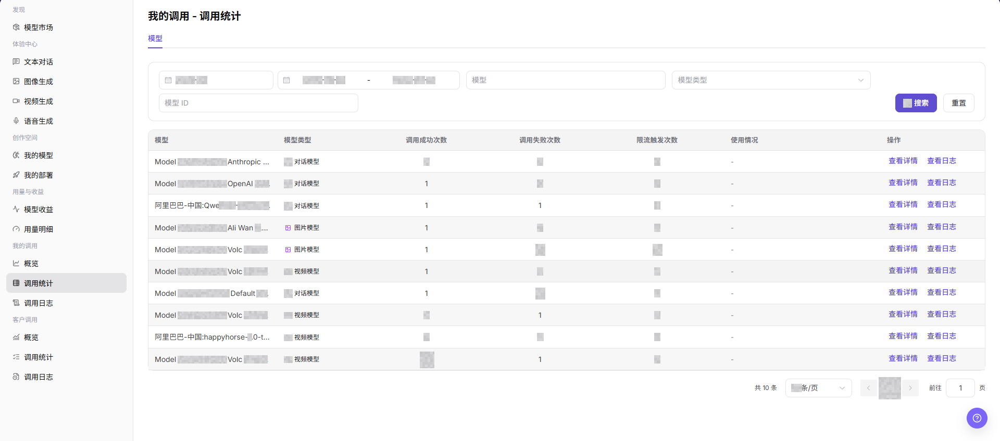
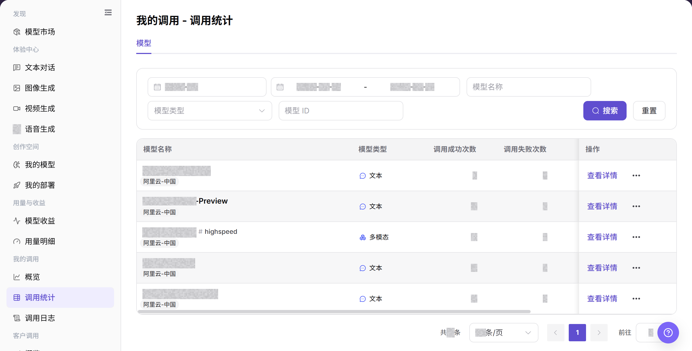
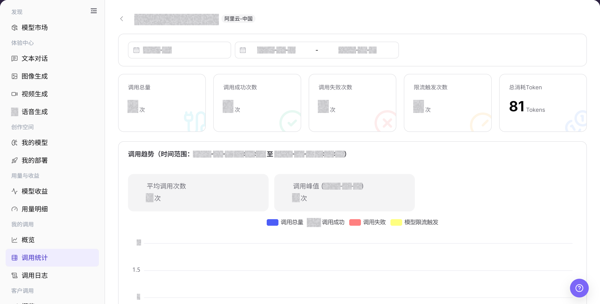

# 调用统计

## 功能概述

| 项目 | 内容 |
| --- | --- |
| 适用角色 | 模型提供方、模型调用方 |
| 导航路径 | 模型及AI服务 > 我的调用 > 调用统计 |
| 页面路由 | `/modelone/monitoring/calls/list/model` |
| 管理对象 | 模型调用成功次数、失败次数、限流次数、用量和统计详情 |

#### 新手理解

调用统计像按模型汇总的成绩单。列表先告诉你每个模型成功、失败、限流和用量情况，详情再帮助判断异常发生在哪个时间段。

#### 术语表

| 术语 | 英文 | 说明 |
| --- | --- | --- |
| 调用成功次数 | Successful Calls | 当前范围内成功完成的调用次数。 |
| 调用失败次数 | Failed Calls | 当前范围内未成功完成的调用次数。 |
| 限流触发次数 | Rate Limit Triggers | 调用命中限流策略的次数。 |
| 使用情况 | Usage | 页面汇总的 Token、次数或其他消耗信息。 |

#### 推荐操作顺序

先按模型名称、模型 ID 或类型查询，再比较成功、失败、限流和用量，最后打开异常模型的统计详情。

#### 小白先看

| 场景 | 先做 | 不要直接做 |
| --- | --- | --- |
| 不知道查哪个模型 | 先按名称或 ID 查询 | 同时填写冲突条件 |
| 失败次数升高 | 打开统计详情 | 只看列表总数 |
| 限流次数升高 | 核对时间范围和限流策略 | 直接扩大调用量 |
| 列表无数据 | 重置条件并扩大周期 | 连续重复搜索 |

## 前提条件

1. 当前账号具备 `调用统计` 页面访问权限。
2. 当前账号在统计周期内存在调用记录，或已确认需要查看的账期和日期范围。
3. 查看或截图前确认模型名、Key 名称、费用、业务应用和调用量是否需要脱敏。

::: warning 敏感信息边界
调用统计可能包含费用、调用量、Key 名称、业务应用、模型名称和异常调用。查看或共享数据时，应按权限脱敏账号、Key、请求内容、费用和业务标识。
:::

## 页面说明

页面以模型列表展示成功次数、失败次数、限流触发次数和使用情况。通过详情入口可以继续查看目标模型的统计信息。

页面截图：

关注查询条件、模型统计列和详情入口。

## 主要操作

### 查看模型调用统计

1. 进入 `模型及AI服务 > 我的调用 > 调用统计`。
2. 输入模型名称或模型 ID，按需选择模型类型。
3. 点击 **"搜索"**，核对成功、失败、限流和使用情况；条件错误时点击 **"重置"**。

上图展示模型调用统计列表。重点比较成功、失败、限流和用量。

### 查看模型统计详情

1. 在目标模型的操作列点击详情入口。
2. 核对模型名称、时间范围和汇总指标。
3. 比较趋势与列表结果；需要单次请求信息时进入调用日志。

上图展示统计详情。重点核对模型、时间范围和指标口径。

## 参数速查表

| 字段名称 | 是否必填 | 字段类型 | 示例 | 说明 |
| --- | --- | --- | --- | --- |
| 账期 | 是 | 月份选择 | `2026-07` | 控制调用统计使用的账期。 |
| 日期范围 | 是 | 日期范围 | `2026-07-01 至 2026-07-31` | 控制统计列表的时间范围。 |
| 模型名称 | 否 | 输入框 | `Example Model` | 按模型名称筛选统计结果。 |
| 模型类型 | 否 | 选择项 | `文本` | 按模型类型缩小统计范围。 |
| Model ID | 否 | 输入框 | `example-model` | 按调用标识定位模型。 |
| 调用成功次数 | 系统生成 | 数值 | `0` | 当前筛选范围内成功调用的数量。 |
| 调用失败次数 | 系统生成 | 数值 | `0` | 当前筛选范围内失败调用的数量。 |
| 限流触发次数 | 系统生成 | 数值 | `0` | 当前筛选范围内触发限流的数量。 |
| 操作 | 系统生成 | 链接 | `查看详情` | 打开目标模型的统计详情。 |

## 踩坑提示

- 调用统计按时间聚合，短时间内和实时日志可能不完全一致。
- 对比不同模型时，需要统一时间范围、调用方式和模型版本。
- 延迟升高不一定是模型异常，也可能来自网络、队列、输入长度或限流策略。

## 结果校验

| 检查项 | 成功表现 | 异常时处理 |
| --- | --- | --- |
| 页面可进入 | `我的调用 - 调用统计` 页面正常打开，左侧 `我的调用 > 调用统计` 菜单高亮。 | 确认账号权限、导航路径和页面加载状态。 |
| 统计指标可见 | 统计表显示模型、模型类型、调用成功次数、调用失败次数、限流触发次数和操作入口。 | 扩大时间范围或确认当前账号是否有调用记录。 |
| 模型统计可见 | 调用统计表按模型显示所选时间范围内的数据。 | 刷新页面，或切换账期、日期范围后重试。 |
| 筛选项可填写 | 账期、日期范围、模型名称、模型类型和 Model ID 可输入或选择。 | 点击 **"重置"** 后重新设置筛选条件。 |
| 搜索和重置生效 | 点击 **"搜索"** 后列表显示匹配记录，点击 **"重置"** 后条件清空。 | 逐项检查日期和 Model ID 格式。 |
| 统计数据与筛选一致 | 表格中的模型名称、模型类型和调用次数符合当前筛选条件。 | 使用相同条件到调用日志逐条核对。 |

## 常见问题

#### 统计列表为空

**问题现象:**

点击搜索后，模型统计列表显示空状态。

**可能原因:**

- 时间范围内没有调用记录。
- 模型名称、类型或 Model ID 筛选过窄。

**处理方式:**

1. 点击 **"重置"** 清除筛选条件。
2. 选择包含已知调用的日期范围并再次搜索。
3. 到 **"调用日志"** 查询同一 Model ID；日志存在但统计仍为空时联系管理员。

#### 失败次数高于预期

**问题现象:**

目标模型的失败次数或失败占比明显增加。

**可能原因:**

- 认证、Model ID 或请求参数错误。
- 目标模型或上游服务返回错误。

**处理方式:**

1. 记录受影响模型和时间范围。
2. 在 **"调用日志"** 筛选失败状态并查看错误信息。
3. 修正请求后重新观察；相同上游错误持续出现时联系模型提供方。

#### 限流次数高于预期

**问题现象:**

目标模型的限流触发次数增加。

**可能原因:**

- 请求频率或并发量超过限制。
- 多个应用共用同一调用额度。

**处理方式:**

1. 按 Model ID 和时间范围缩小统计结果。
2. 到 **"调用日志"** 核对限流请求的时间分布。
3. 降低频率后再次查询；仍有大量限流时联系模型提供方确认限制。

#### 使用情况与日志不一致

**问题现象:**

统计页中的 Token 或使用量与日志汇总不同。

**可能原因:**

- 两个页面的日期或模型筛选不同。
- 对比时使用了不同的输入、输出或总 Token 口径。

**处理方式:**

1. 统一日期范围、模型类型和 Model ID。
2. 按日志详情中的输入 Token 和输出 Token 重新汇总。
3. 差异仍存在时向管理员提供筛选条件和脱敏请求 ID。

#### 统计详情无法打开

**问题现象:**

点击 **"查看详情"** 后没有打开目标详情。

**可能原因:**

- 当前账号缺少详情权限。
- 目标记录已不在当前筛选范围。

**处理方式:**

1. 清除筛选后重新定位目标行。
2. 刷新页面并再次点击 **"查看详情"**。
3. 仍无法打开时联系管理员核对权限，并提供 Model ID 和页面路由。

## 注意事项

- 不在文档中写入真实账号、Key、请求内容、费用明细或内部测试参数。
- 调用统计是聚合数据，排查单次请求时以调用日志为准。
- 对外沟通时只使用脱敏后的统计信息。

## 后续操作

1. 点击 **"查看详情"** 查看模型维度统计信息。
2. 点击 **"查看日志"** 或进入 `调用日志` 排查单次请求。
3. 根据失败次数、限流触发次数和模型类型调整调用策略。
