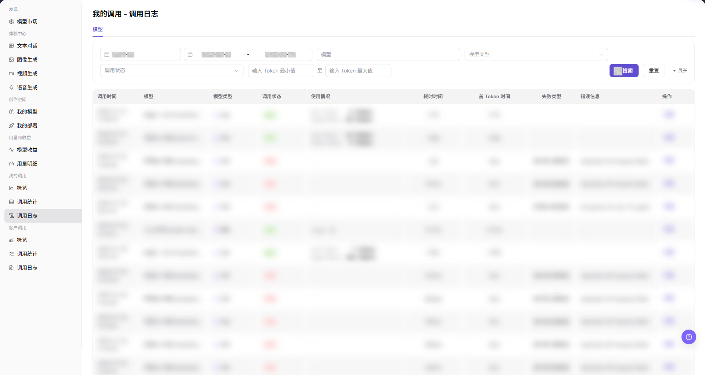
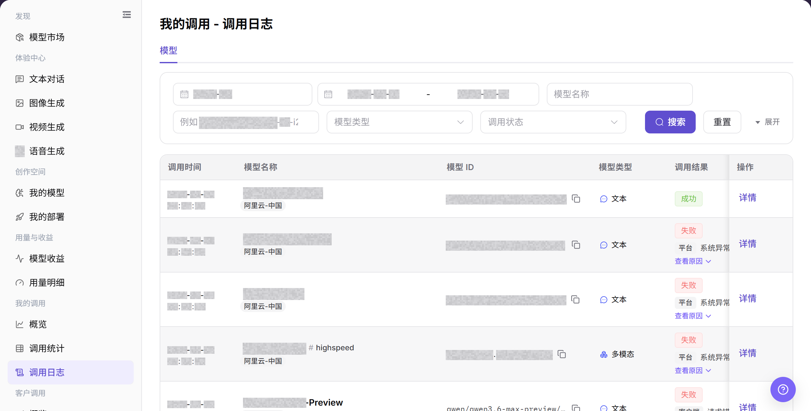
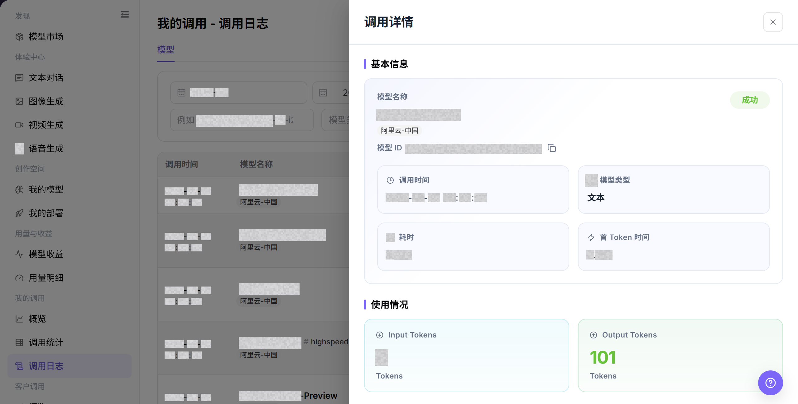

# 调用日志

## 功能概述

| 项目 | 内容 |
| --- | --- |
| 适用角色 | 模型提供方、模型调用方 |
| 导航路径 | 模型及AI服务 > 我的调用 > 调用日志 |
| 页面路由 | `/modelone/monitoring/calls/log/model` |
| 管理对象 | 个人模型调用记录、调用结果、用量、耗时和详情 |

#### 新手理解

调用日志像每次模型请求的明细单。先按模型、状态和时间找到记录，再打开详情查看结果、用量和耗时，用于定位单次失败。

#### 术语表

| 术语 | 英文 | 说明 |
| --- | --- | --- |
| 调用时间 | Call Time | 请求发起并被记录的时间。 |
| 调用结果 | Call Result | 单次调用的成功或失败状态。 |
| 首 Token 时间 | First Token Time | 文本模型返回首个 Token 的耗时。 |
| 调用详情 | Call Details | 单次调用的模型、状态、用量、耗时和错误摘要。 |

#### 推荐操作顺序

先设置时间和模型条件查询日志，再核对调用结果、用量和耗时，最后打开目标记录详情。

#### 小白先看

| 场景 | 先做 | 不要直接做 |
| --- | --- | --- |
| 查不到记录 | 先核对时间范围和时区 | 只按模型名称反复查询 |
| 调用失败 | 打开详情查看错误摘要 | 立即重复调用 |
| 耗时异常 | 比较同模型相邻记录 | 只看单条耗时 |
| 准备共享详情 | 移除请求、响应和凭证 | 复制完整详情 |

## 前提条件

1. 当前账号具备 `调用日志` 页面访问权限。
2. 已明确需要查看的时间范围、模型、模型类型或调用状态。
3. 排查问题时只使用脱敏后的日志信息。

## 页面说明

页面按模型展示当前账号的调用记录，支持按模型名称、模型 ID、模型类型、调用状态和时间范围查询，并从详情入口查看单次调用信息。

页面截图：

关注查询条件、调用结果、用量、耗时和详情入口。

## 主要操作

### 查询调用日志

1. 进入 `模型及AI服务 > 我的调用 > 调用日志`。
2. 设置时间范围，并输入模型名称或模型 ID；按需选择模型类型和调用状态。
3. 点击 **"搜索"**，核对调用时间、结果、用量和耗时；条件错误时点击 **"重置"**。

上图展示调用日志列表。重点核对时间范围、调用结果和目标记录。

### 查看调用详情

1. 在目标记录的操作列点击 **"详情"**。
2. 核对模型、调用时间、结果、用量、耗时和错误摘要。
3. 排障记录只保留脱敏请求标识和错误摘要，不复制完整请求、响应或凭证。

上图展示单次调用详情。共享前必须移除请求、响应和凭证信息。

## 参数速查表

| 字段名称 | 是否必填 | 字段类型 | 示例 | 说明 |
| --- | --- | --- | --- | --- |
| 月份 | 是 | 月份选择 | `2026-07` | 控制调用日志的统计月份。 |
| 日期范围 | 是 | 日期范围 | `2026-07-01 至 2026-07-17` | 控制调用日志的查询时间范围。 |
| 模型 | 否 | 输入框 | `Example Model` | 按模型名称筛选调用日志。 |
| 模型类型 | 否 | 选择项 | `对话模型` / `视频模型` | 按模型能力类型筛选调用日志。 |
| 调用状态 | 否 | 选择项 | `成功` / `失败` | 按调用处理结果筛选日志。 |
| 最小输入 Token | 否 | 数字输入 | `0` | 设置查询的输入 Token 下限。 |
| 最大输入 Token | 否 | 数字输入 | `1000` | 设置查询的输入 Token 上限。 |
| 调用时间 | 系统生成 | 时间 | `2026-07-17 14:30` | 展示单次调用发生时间。 |
| 使用情况 | 系统生成 | 文本 / 标签 | `Input 100 / Output 40 Tokens` | 展示 Token、免费额度或多模态输入输出使用情况。 |
| 耗时时间 | 系统生成 | 时间 | `1.2 s` | 展示单次调用总耗时。 |
| 首 Token 时间 | 系统生成 | 时间 | `0.3 s` | 展示首个 Token 返回耗时。 |
| 失败类型 | 系统生成 | 文本 | `Authentication` | 展示失败请求的问题归类。 |
| 错误信息 | 系统生成 | 文本 | `Redacted error message` | 展示失败请求的错误摘要，截图和对外沟通时需脱敏。 |
| 操作 | 否 | 操作入口 | `详情` | 进入单次调用日志详情。 |

## 踩坑提示

- API Key、Token、Prompt、响应内容和完整 Endpoint 都可能包含敏感信息，排查时只记录脱敏片段。
- 429 通常先看限流和套餐，401 先看凭据和权限，5xx 再看模型服务和上游状态。
- 重试前先确认请求参数、模型版本和输入大小，避免重复产生无效调用。

## 结果校验

| 检查项 | 成功表现 | 异常时处理 |
| --- | --- | --- |
| 页面可进入 | `我的调用 - 调用日志` 页面正常打开，左侧 `我的调用 > 调用日志` 菜单高亮。 | 确认账号权限、导航路径和页面加载状态。 |
| 调用日志列表可见 | 列表显示调用时间、模型、调用状态、使用情况、耗时和错误信息等列。 | 刷新页面，或调整月份、日期范围后重试。 |
| 筛选项可用 | 按月份、日期范围、模型、模型类型或调用状态筛选后，列表刷新。 | 检查筛选条件是否过窄，必要时点击 **"重置"**。 |
| 搜索 / 重置可用 | 点击 **"搜索"** 后展示匹配日志，点击 **"重置"** 后清空筛选条件。 | 检查网络状态、页面接口返回和账号权限。 |
| 日志详情可打开 | 点击 **"详情"** 后可查看单次调用的更多信息。 | 确认该记录仍在日志保留周期内。 |
| 字段信息一致 | 调用状态、耗时、使用情况、失败类型和错误信息与详情页一致。 | 重新打开详情或扩大时间范围交叉确认。 |

## 常见问题

#### 查不到目标日志

**问题现象:**

按时间或模型搜索后，列表中没有目标请求。

**可能原因:**

- 时间范围、模型或状态筛选不包含目标请求。
- 请求由其他账号或 Personal Key 发起。

**处理方式:**

1. 点击 **"重置"** 并选择请求发生的日期。
2. 按 Model ID 和调用状态逐步缩小范围。
3. 确认发起请求的账号；仍找不到时向管理员提供脱敏请求时间和 Model ID。

#### 调用状态显示失败

**问题现象:**

目标日志的调用结果显示失败或错误。

**可能原因:**

- Personal Key 无效或没有调用权限。
- Model ID、请求体或模型参数不正确。
- 额度不足或目标模型返回错误。

**处理方式:**

1. 打开 **"详情"** 并记录脱敏后的错误信息。
2. 核对 Personal Key、Model ID、请求格式和额度。
3. 修正后重新调用；同一错误持续出现时联系模型提供方或管理员。

#### 调用耗时明显增加

**问题现象:**

总耗时或首 Token 时间明显高于同类请求。

**可能原因:**

- 输入内容更长或输出上限更高。
- 目标模型或供应方在该时间段响应较慢。

**处理方式:**

1. 比较同一 Model ID 和相近输入规模的请求。
2. 分别核对总耗时和首 Token 时间。
3. 持续升高时向模型提供方提交时间范围和脱敏请求 ID。

#### Token 用量高于预期

**问题现象:**

日志中的输入或输出 Token 明显高于预估。

**可能原因:**

- 请求包含较长的历史消息或附件。
- 输出上限或生成参数设置过大。

**处理方式:**

1. 在详情中分别查看输入 Token 和输出 Token。
2. 缩短输入或降低输出上限后重新调用。
3. 同类请求仍有明显差异时，将脱敏请求 ID 交给管理员核对计量。

#### 日志详情包含敏感信息

**问题现象:**

详情中出现凭据、完整 Endpoint、客户输入或响应内容。

**可能原因:**

- 调用内容本身包含敏感数据。
- 截图或工单未执行脱敏。

**处理方式:**

1. 停止复制或外发该内容。
2. 遮挡 Personal Key、认证头、请求正文、响应正文和完整 Endpoint。
3. 如果凭据已经泄露，立即联系管理员或安全负责人并轮换凭据。

## 注意事项

- 不要在文档、截图或工单中展示完整请求、响应正文、Key、账号或费用明细。
- 调用日志数据可能按保留周期清理，排查问题时应优先确认时间范围。
- 错误信息仅用于定位问题，公开沟通前必须脱敏。

## 后续操作

1. 根据失败类型和错误信息调整请求参数或调用方式。
2. 需要排查单次请求时，进入 `详情` 查看脱敏后的日志信息。
3. 如果需要判断是否为批量异常，返回 `我的调用 > 调用统计` 查看聚合数据。
