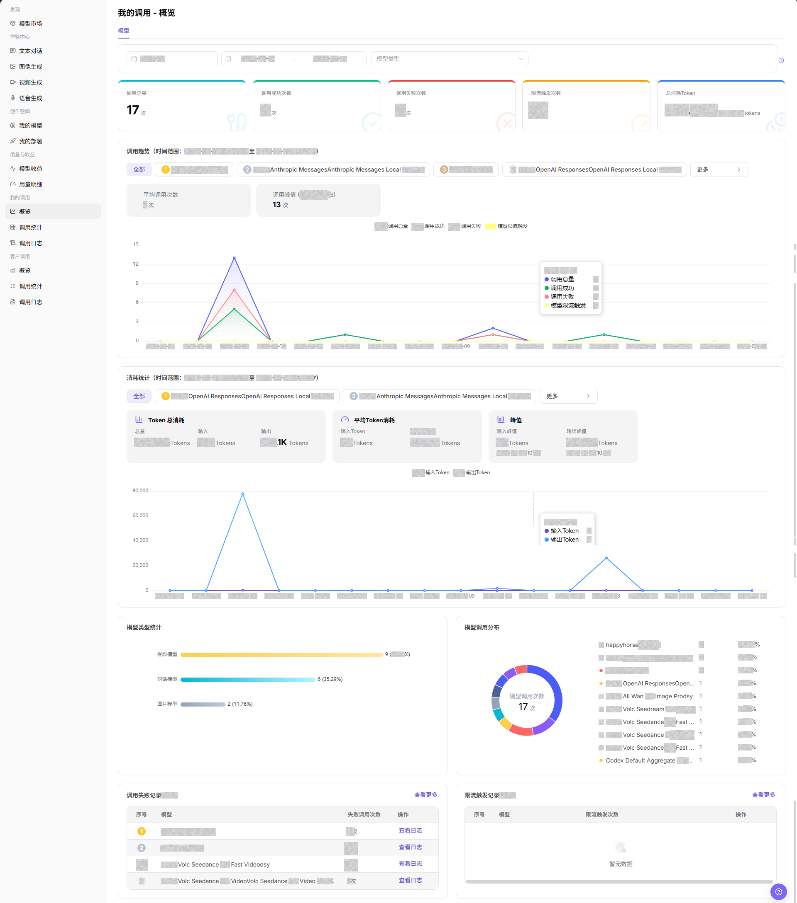
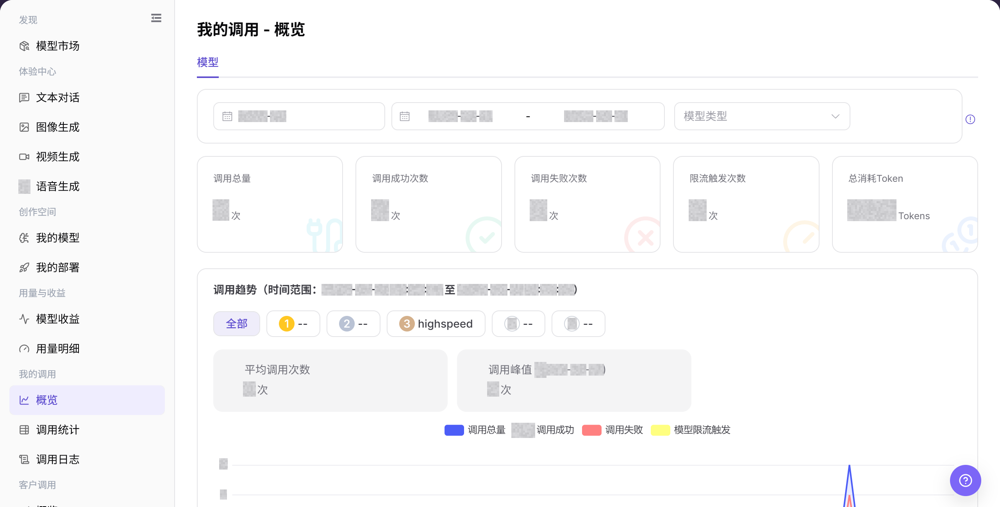

# 概览

## 功能概述

| 项目 | 内容 |
| --- | --- |
| 适用角色 | 模型提供方、模型调用方 |
| 导航路径 | 模型及AI服务 > 我的调用 > 概览 |
| 页面路由 | `/modelone/monitoring/calls/overview/model` |
| 管理对象 | 个人调用指标、调用趋势、模型排行和日志入口 |

#### 新手理解

概览像个人调用仪表盘。先看调用总量、成功与失败次数和用量趋势，再从异常模型进入日志定位单次请求。

#### 术语表

| 术语 | 英文 | 说明 |
| --- | --- | --- |
| 调用总量 | Total Calls | 当前时间范围内发起的调用总次数。 |
| 失败调用 | Failed Calls | 未正常完成并返回成功结果的调用。 |
| 限流触发 | Rate Limit Trigger | 调用超过限流策略后被限制的次数。 |
| 调用趋势 | Call Trend | 按时间展示调用量、成功、失败或用量的变化。 |

#### 推荐操作顺序

先选择时间范围并查看汇总指标，再比较趋势和模型排行，发现异常后通过日志入口继续排查。

#### 小白先看

| 场景 | 先做 | 不要直接做 |
| --- | --- | --- |
| 概览无数据 | 扩大时间范围 | 立即判断调用未记录 |
| 成功率下降 | 先比较失败与限流趋势 | 只看总调用量 |
| 某模型异常 | 进入日志核对单次请求 | 仅凭图表判断原因 |
| 准备共享截图 | 遮挡业务标识和敏感信息 | 直接外发原图 |

## 前提条件

1. 当前账号具备 `概览` 页面访问权限。
2. 当前账号在统计周期内存在调用记录，或已确认需要查看的时间范围。
3. 查看或截图前确认模型名、Key 名称、费用和业务标识是否需要脱敏。

::: warning 敏感信息边界
调用概览可能展示费用、调用量、模型名称、Key 名称、Token 消耗和异常趋势。查看或共享数据时，应按权限脱敏账号、Key、请求内容、费用和业务标识。
:::

## 页面说明

页面展示当前账号的调用汇总、趋势和模型排行，并提供进入调用日志的入口。筛选时间范围会同步改变统计指标和图表。

页面截图：

关注时间范围、汇总指标、趋势图和模型列表。

## 主要操作

### 查看调用趋势并进入日志

1. 进入 `模型及AI服务 > 我的调用 > 概览`。
2. 选择时间范围和模型类型，核对调用总量、成功次数、失败次数、限流次数和用量。
3. 比较趋势与模型列表，定位异常模型。
4. 点击目标模型的 **"查看日志"**，进入对应调用日志继续排查。

上图展示调用汇总、趋势和模型列表。异常时从目标模型进入日志。

## 参数速查表

| 字段名称 | 是否必填 | 字段类型 | 示例 | 说明 |
| --- | --- | --- | --- | --- |
| 账期 | 是 | 月份选择 | `2026-07` | 控制概览使用的账期。 |
| 日期范围 | 是 | 日期范围 | `2026-07-01 至 2026-07-31` | 控制指标卡和趋势图的时间范围。 |
| 模型类型 | 否 | 选择项 | `文本` | 按模型类型缩小统计范围。 |
| 调用总量 | 系统生成 | 数值 | `0` | 当前筛选范围内的调用总数。 |
| 调用成功次数 | 系统生成 | 数值 | `0` | 当前筛选范围内成功调用的数量。 |
| 调用失败次数 | 系统生成 | 数值 | `0` | 当前筛选范围内失败调用的数量。 |
| 限流触发次数 | 系统生成 | 数值 | `0` | 当前筛选范围内触发限流的数量。 |
| 总消耗 Token | 系统生成 | 数值 | `0 Tokens` | 当前筛选范围内汇总的 Token 消耗。 |

## 踩坑提示

- 我的调用概览只展示当前账号可见范围，不代表租户或客户全量调用。
- 余额、Credits 或调用次数异常时，应同时查看调用日志、用量明细和账务页面。
- 切换模型或时间范围后再比较数据，避免把不同模型版本的数据混在一起。

## 结果校验

| 检查项 | 成功表现 | 异常时处理 |
| --- | --- | --- |
| 页面可进入 | `我的调用 - 概览` 页面正常打开，左侧 `我的调用 > 概览` 菜单高亮。 | 确认账号权限、导航路径和页面加载状态。 |
| 概览指标可见 | 页面显示调用总量、调用成功次数、调用失败次数、限流触发次数和总消耗 Token。 | 扩大时间范围或确认当前账号是否有调用记录。 |
| 趋势图可见 | 页面显示调用趋势、消耗统计、模型类型统计和模型调用分布。 | 刷新页面，或切换账期、日期范围后重试。 |
| 筛选项可选择 | 账期、日期范围和模型类型控件可选择。 | 重新加载页面；控件仍不可选时联系管理员核对页面权限。 |
| 数据与筛选一致 | 指标卡和趋势图显示所选账期、日期范围及模型类型对应的数据。 | 使用相同条件到调用统计和调用日志交叉核对。 |

## 常见问题

#### 概览没有数据

**问题现象:**

指标卡、趋势图和模型列表均显示空状态。

**可能原因:**

- 所选时间范围内没有调用记录。
- 模型类型或其他筛选条件排除了目标记录。

**处理方式:**

1. 点击 **"重置"** 清除筛选条件。
2. 选择包含已知调用的日期范围，然后点击 **"搜索"**。
3. 到 **"调用日志"** 查询同一时间和模型；如果日志存在但概览仍为空，向管理员提供脱敏后的时间范围和 Model ID。

#### 成功率突然下降

**问题现象:**

成功调用数下降，或失败调用数在同一时间范围内明显增加。

**可能原因:**

- 某个模型或供应方的请求连续失败。
- Personal Key、Model ID 或请求参数不符合调用要求。

**处理方式:**

1. 在概览中固定时间范围和模型类型。
2. 打开 **"调用统计"** 找到失败次数增加的模型。
3. 在 **"调用日志"** 查看错误信息；同一错误持续出现时，携带脱敏请求 ID 联系模型提供方或管理员。

#### 限流次数升高

**问题现象:**

限流触发次数大于 0，或趋势图中的限流次数持续增加。

**可能原因:**

- 请求频率或并发量超过当前模型限制。
- 调用集中在短时间内，形成突发流量。

**处理方式:**

1. 在 **"调用统计"** 定位受影响的模型和时间段。
2. 在 **"调用日志"** 核对限流状态和请求时间。
3. 降低请求频率或并发量后再次观察；仍被限流时联系模型提供方确认当前限制。

#### 趋势图与列表合计不一致

**问题现象:**

趋势图合计与列表或指标卡的数量不同。

**可能原因:**

- 两个区域使用的日期、账期或模型类型不同。
- 对比时包含了不同的时间边界。

**处理方式:**

1. 统一账期、日期范围和模型类型。
2. 点击 **"搜索"** 重新加载所有区域。
3. 按相同条件到 **"调用日志"** 汇总记录；差异仍存在时，将筛选条件和脱敏截图提交给管理员。

#### 无法打开调用日志

**问题现象:**

点击日志入口后页面没有跳转，或页面提示无权访问。

**可能原因:**

- 当前角色没有调用日志权限。
- 浏览器中的旧页面状态导致入口失效。

**处理方式:**

1. 从左侧导航直接进入 **"调用日志"**。
2. 刷新页面并重新选择时间范围。
3. 仍无法进入时联系管理员核对当前账号的模型调用方权限，并提供页面路由。

## 注意事项

- 不在文档中写入真实账号、Key、请求内容、费用明细或内部测试参数。
- 概览统计可能存在延迟，排查单次请求时以调用日志为准。
- 对外沟通时只使用脱敏后的聚合信息。

## 后续操作

1. 进入 `调用统计` 查看更细的趋势和维度分析。
2. 进入 `调用日志` 查看单次请求、错误码和请求状态。
3. 根据失败记录、限流触发和 Token 峰值调整调用策略。
