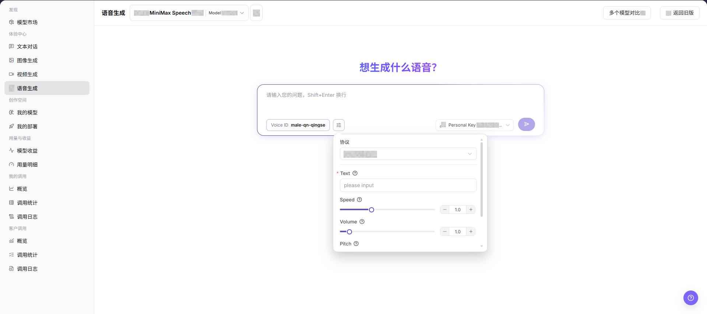
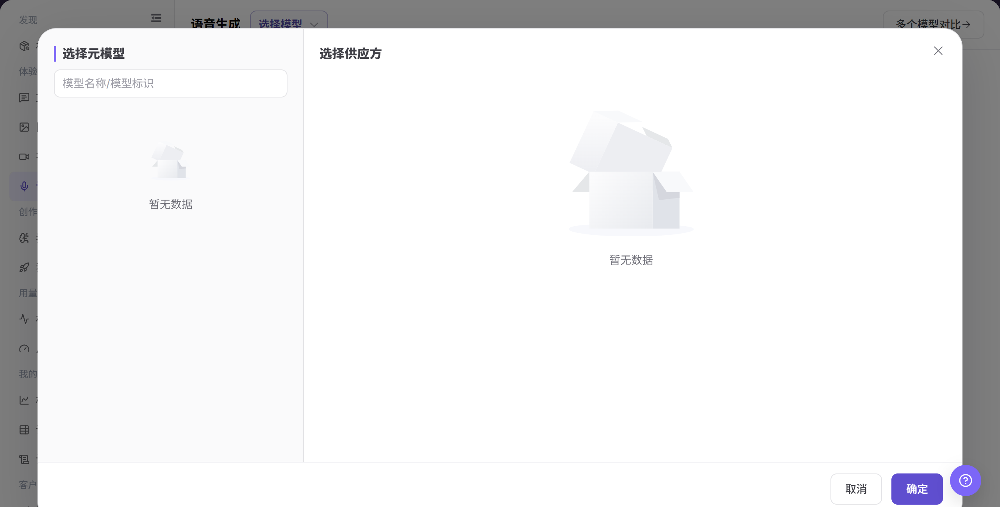
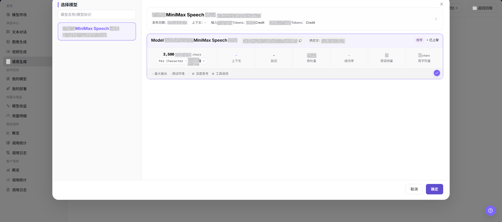
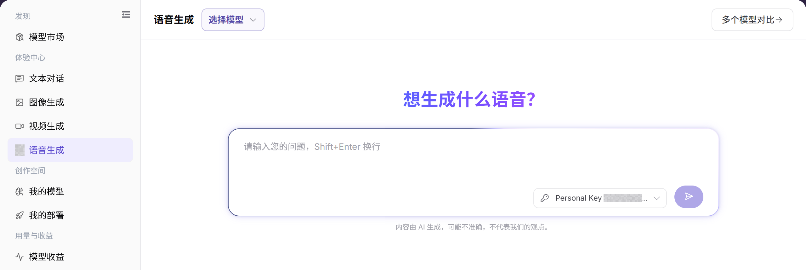

# 语音生成

## 功能概述

| 项目 | 内容 |
| --- | --- |
| 适用角色 | 模型提供方、模型调用方 |
| 导航路径 | 模型及AI服务 > 体验中心 > 语音生成 |
| 页面路由 | `/modelone/exploration/audio` |
| 管理对象 | 音频模型、文本或音频输入、生成参数和音频结果 |

#### 新手理解

语音生成像模型试用台。先选择可用的语音模型和供应方，再填写输入并调整参数，提交后根据结果或错误提示决定是否继续接入。

#### 术语表

| 术语 | 英文 | 说明 |
| --- | --- | --- |
| 模型实例 | Model Instance | 当前体验页面实际调用的模型与供应方组合。 |
| 提示词 | Prompt | 描述任务、输入内容和输出要求的指令。 |
| 生成参数 | Generation Parameters | 控制生成结果长度、随机性、尺寸或其他行为的参数。 |
| Personal Key | Personal Key | 用于发起调用的个人授权密钥，文档示例统一写为 `<PERSONAL_KEY>`。 |

#### 推荐操作顺序

第一次体验时，建议先选择语音模型，再核对供应方和 Personal Key，随后配置输入与参数，最后提交并查看结果。每次只调整少量参数，便于比较差异。

#### 小白先看

| 场景 | 先做 | 不要直接做 |
| --- | --- | --- |
| 不知道选哪个语音模型 | 先打开模型选择器比较状态和能力 | 直接提交默认模型 |
| 准备填写输入 | 先移除密钥、客户数据和生产数据 | 粘贴原始敏感内容 |
| 准备调整参数 | 一次只调整少量参数 | 同时改变全部参数 |
| 生成失败 | 先看页面错误和调用日志 | 连续重复提交 |

## 前提条件

1. 当前账号具备`语音生成` 页面访问权限。
2. 目标音频模型已上架并可体验。
3. 已确认文本内容不包含敏感信息、隐私数据或未授权内容。
4. 已了解点击发送或生成类按钮可能产生真实模型调用和费用记录。

::: warning 调用与内容风险
点击发送按钮会产生真实模型调用，可能消耗额度并产生账务记录或调用日志。提交前应移除个人隐私、客户资料、密钥、受版权限制文本和未授权内容。
:::

## 页面说明

页面包含语音模型选择、输入区、参数区、Personal Key 选择和结果区。提交操作会产生真实调用，并可能形成用量或计费记录。

页面截图：

关注模型、输入区、参数入口和提交按钮；提交前应再次核对输入内容。

## 主要操作

### 选择语音模型

1. 进入 `模型及AI服务 > 体验中心 > 语音生成`。
2. 点击当前模型名称或 **"选择模型"**，打开模型选择器。
3. 按模型名称定位目标记录，并比较供应方、上下文、价格、延迟、吞吐量、成功率和状态。
4. 选择可用实例后返回体验页面，确认页面顶部显示的模型与供应方正确。

上图展示模型选择器。重点比较供应方实例的能力、价格、性能和可用状态。

该图补充展示模型选择区域及实例信息。

### 配置并生成语音内容

1. 确认当前模型、供应方和 Personal Key 正确。
2. 输入要生成的内容，按页面能力设置音色、语速、格式或其他参数；确认输入不含敏感信息后，点击 **"发送"**。
3. 提交后查看结果、耗时、用量和错误提示；失败时先核对模型状态、额度、参数和限流情况。
4. 记录问题时只保留脱敏后的请求标识、模型名称和发生时间，不复制真实密钥或完整敏感输入。

上图展示输入和参数区域。提交前重点核对模型、输入、Personal Key 和生成参数。

## 参数速查表

| 字段名称 | 是否必填 | 字段类型 | 示例 | 说明 |
| --- | --- | --- | --- | --- |
| 模型 | 是 | 下拉选择 | `Example Audio Model` | 当前体验的音频模型。 |
| Voice ID | 是 | 输入或选择 | `male-qn-qingse` | 指定生成语音的音色或发音人。 |
| Text | 是 | 文本输入 | `please input` | 需要转换为语音的文本内容。 |
| Protocol | 是 | 下拉选择 | `openai/audio` | 当前音频模型调用协议。 |
| Speed | 否 | 滑块 / 数字输入 | `1.0` | 控制生成语音的速度。 |
| Volume | 否 | 滑块 / 数字输入 | `1.0` | 控制生成语音的音量。 |
| Pitch | 否 | 滑块 / 数字输入 | `1.0` | 控制生成语音的音调。 |
| Key | 是 | 下拉选择 | `Personal Key` | 用于发起体验调用的 Key。 |
| 生成结果 | 否 | 结果区 | 音频结果或状态提示 | 展示生成音频、任务状态或错误提示。 |

## 踩坑提示

- 不要输入真实客户资料、身份证号、手机号、密钥或其他敏感文本。
- 语音生成可能涉及声音合成、版权和合规风险，正式使用前需确认文本来源和使用授权。
- Speed、Volume、Pitch 参数过大或过小可能导致听感异常。
- 点击发送按钮会产生真实调用，可能消耗额度并写入调用日志。

## 结果校验

| 检查项 | 成功表现 | 异常时处理 |
| --- | --- | --- |
| 页面可进入 | `语音生成` 页面正常打开，左侧体验中心菜单和顶部模型选择区可见。 | 确认账号权限、导航路径和页面加载状态。 |
| 模型可选择 | 模型选择弹窗正常打开，能看到模型名称、供应方、价格和状态。 | 确认可用模型是否已上架，或切换其他模型。 |
| 输入区可见 | 页面显示文本输入框、Voice ID、Key 和发送入口。 | 刷新页面或检查模型能力配置。 |
| 参数区可见 | 页面显示 `Protocol`、`Text`、`Speed`、`Volume`、`Pitch` 等字段。 | 检查参数面板是否展开，或重新选择模型。 |
| 结果区可见 | 如执行真实调用，页面能展示音频结果、任务状态或错误提示。 | 记录请求 ID 或错误信息，并核对文本、Key 和参数配置。 |

## 常见问题

#### 模型选择器没有目标模型

**问题现象：**

模型选择器中找不到要体验的模型。

**可能原因：**

- 模型未授权给当前账号。
- 模型状态或模态与当前页面不匹配。

**处理方式：**

1. 核对模型可见范围和状态。
2. 到模型市场确认模型的输入输出能力。

#### 提交按钮不可用

**问题现象：**

输入内容后仍无法提交。

**可能原因：**

- 未选择模型或 Personal Key。
- 必填输入或参数不完整。

**处理方式：**

1. 重新选择模型和 Personal Key。
2. 补齐页面标记的必填输入项和参数。

#### 生成失败或超时

**问题现象：**

提交后返回失败或长时间无结果。

**可能原因：**

- 模型服务繁忙或被限流。
- 输入或参数超出模型限制。

**处理方式：**

1. 查看页面错误和调用日志。
2. 缩短输入或恢复默认参数后重试。

#### 生成结果不符合预期

**问题现象：**

结果与输入目标、格式或质量要求不一致。

**可能原因：**

- 提示词约束不明确。
- 同时调整了过多参数。

**处理方式：**

1. 补充目标、格式和禁止事项。
2. 恢复基线参数并逐项比较。

#### 用量或费用异常

**问题现象：**

一次体验产生的用量高于预期。

**可能原因：**

- 输出规模或生成数量过大。
- 重复提交了相同任务。

**处理方式：**

1. 核对生成参数和调用日志。
2. 停止重复提交并确认计费口径。

## 注意事项

- 不要在输入、文档或工单中记录真实账号、密码、访问参数或内部业务数据。
- 不在文档中展示真实密钥、Token、AK/SK 或私钥。
- 截图或导出前确认页面不包含敏感文本、个人声音信息或真实业务数据。

## 后续操作

1. 记录适合业务场景的模型、Voice ID 和参数组合。
2. 如调用失败，进入调用日志查看错误信息。
3. 正式集成前，确认文本来源、音频生成合规要求和费用预算。
