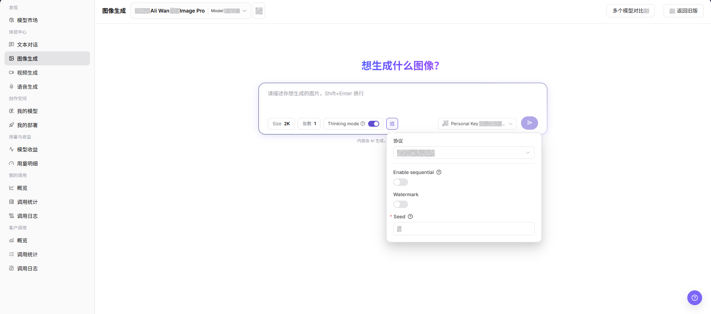
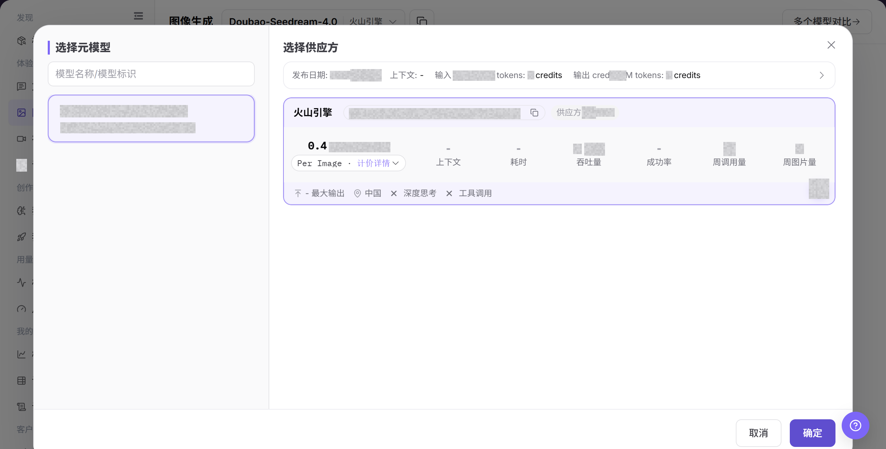
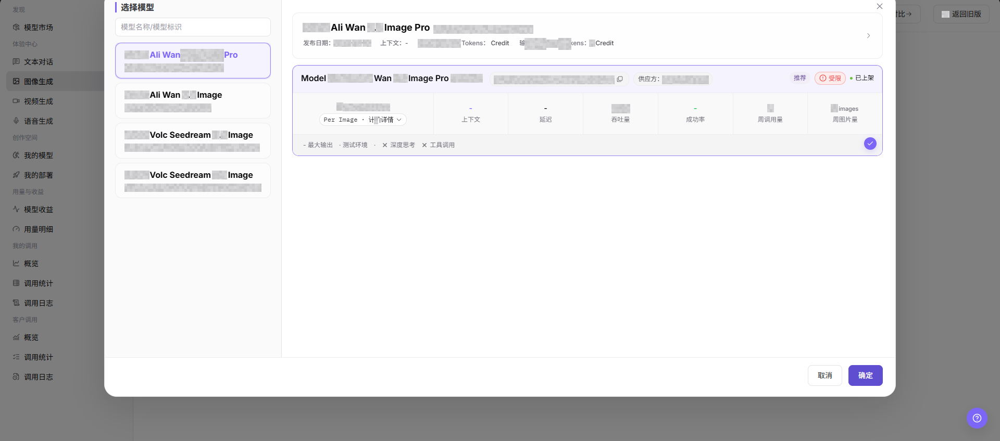
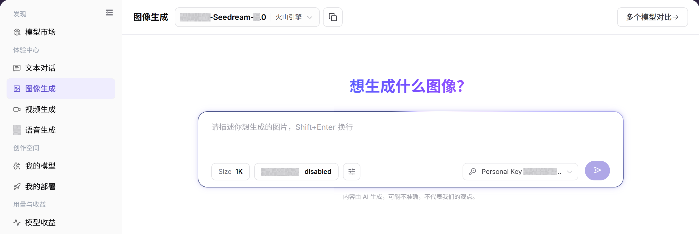

# 图像生成

## 功能概述

| 项目 | 内容 |
| --- | --- |
| 适用角色 | 模型提供方、模型调用方 |
| 导航路径 | 模型及AI服务 > 体验中心 > 图像生成 |
| 页面路由 | `/modelone/exploration/image` |
| 管理对象 | 图像模型、提示词、尺寸、生成参数和图像结果 |

#### 新手理解

图像生成像模型试用台。先选择可用的图像模型和供应方，再填写输入并调整参数，提交后根据结果或错误提示决定是否继续接入。

#### 术语表

| 术语 | 英文 | 说明 |
| --- | --- | --- |
| 模型实例 | Model Instance | 当前体验页面实际调用的模型与供应方组合。 |
| 提示词 | Prompt | 描述任务、输入内容和输出要求的指令。 |
| 生成参数 | Generation Parameters | 控制生成结果长度、随机性、尺寸或其他行为的参数。 |
| Personal Key | Personal Key | 用于发起调用的个人授权密钥，文档示例统一写为 `<PERSONAL_KEY>`。 |

#### 推荐操作顺序

第一次体验时，建议先选择图像模型，再核对供应方和 Personal Key，随后配置输入与参数，最后提交并查看结果。每次只调整少量参数，便于比较差异。

#### 小白先看

| 场景 | 先做 | 不要直接做 |
| --- | --- | --- |
| 不知道选哪个图像模型 | 先打开模型选择器比较状态和能力 | 直接提交默认模型 |
| 准备填写输入 | 先移除密钥、客户数据和生产数据 | 粘贴原始敏感内容 |
| 准备调整参数 | 一次只调整少量参数 | 同时改变全部参数 |
| 生成失败 | 先看页面错误和调用日志 | 连续重复提交 |

## 前提条件

1. 当前账号具备`图像生成`页面访问权限。
2. 目标图像模型已授权给当前账号体验。
3. 提示词和参考素材不包含真实密钥、客户隐私、未授权素材或敏感内容。

::: warning 调用、计费与内容风险
点击生成按钮会产生真实模型调用，可能消耗额度、生成调用日志或账务记录。提交前应确认模型、参数、预计用量，以及提示词和素材的版权与合规边界。
:::

## 页面说明

页面包含图像模型选择、输入区、参数区、Personal Key 选择和结果区。提交操作会产生真实调用，并可能形成用量或计费记录。

页面截图：

关注模型、输入区、参数入口和提交按钮；提交前应再次核对输入内容。

## 主要操作

### 选择图像模型

1. 进入 `模型及AI服务 > 体验中心 > 图像生成`。
2. 点击当前模型名称或 **"选择模型"**，打开模型选择器。
3. 按模型名称定位目标记录，并比较供应方、上下文、价格、延迟、吞吐量、成功率和状态。
4. 选择可用实例后返回体验页面，确认页面顶部显示的模型与供应方正确。

上图展示模型选择器。重点比较供应方实例的能力、价格、性能和可用状态。

该图补充展示模型选择区域及实例信息。

### 配置并生成图像内容

1. 确认当前模型、供应方和 Personal Key 正确。
2. 输入图像描述，按需设置 Size、生成数量、连续生成、水印和 Seed；确认内容与素材符合使用要求后，点击 **"生成"**。
3. 提交后查看结果、耗时、用量和错误提示；失败时先核对模型状态、额度、参数和限流情况。
4. 记录问题时只保留脱敏后的请求标识、模型名称和发生时间，不复制真实密钥或完整敏感输入。

上图展示输入和参数区域。提交前重点核对模型、输入、Personal Key 和生成参数。

## 参数速查表

| 字段名称 | 是否必填 | 字段类型 | 示例 | 说明 |
| --- | --- | --- | --- | --- |
| 模型 | 必填 | 下拉选择 | `Mock Ali Wan 2.7 Image Pro` | 当前体验的图像模型。 |
| 供应方 | 必填 | 下拉选择 | `Example Provider` | 当前模型的供应方实例。 |
| 提示词 | 必填 | 多行文本 | `生成一张产品海报` | 描述希望生成的图像内容和风格。 |
| Size | 否 | 选择项 | `2K` | 控制生成图片尺寸或清晰度档位。 |
| 张数 | 否 | 数字 | `1` | 控制单次生成的图片数量。 |
| Thinking Mode | 否 | 开关 | `开启` | 控制是否启用思考模式。 |
| Protocol | 否 | 下拉选择 | `openai/images` | 当前图像生成使用的调用协议。 |
| Enable Sequential | 否 | 开关 | `关闭` | 控制是否启用顺序生成相关能力。 |
| Watermark | 否 | 开关 | `关闭` | 控制是否添加水印。 |
| Seed | 否 | 数字 | `0` | 随机种子，用于影响或复现生成结果。 |
| 生成结果 | 否 | 图片区域 | 生成图片 | 展示生成图片、错误提示或空状态。 |

## 踩坑提示

- 不要在提示词中输入真实密钥、客户隐私或未授权素材描述。
- 图片尺寸和生成数量越大，耗时和费用通常越高。
- 生成图片可能涉及版权、肖像权、商标或合规边界，正式使用前需确认授权。
- 点击生成会产生真实调用，提交前应确认模型、参数、素材授权和预计费用。

## 结果校验

| 检查项 | 成功表现 | 异常时处理 |
| --- | --- | --- |
| 页面可进入 | `图像生成` 页面正常打开，左侧体验中心菜单和顶部模型选择区可见。 | 确认账号权限、导航路径和页面加载状态。 |
| 模型选择器可加载 | 模型选择区可展开，能看到模型列表、供应方实例和状态信息。 | 刷新页面后重试，或确认目标模型是否对当前账号可见。 |
| 输入区和参数区可见 | 提示词输入框、Size、张数、Thinking Mode、Protocol、Watermark、Seed 等字段可见。 | 检查页面是否加载完成，必要时切换模型后重新查看。 |
| 结果区可查看 | 页面显示生成结果、错误提示或空状态。 | 如无生成记录，确认输入区和参数区仍然可见。 |
| 真实生成有结果 | 明确允许执行生成时，页面返回生成图片或明确错误提示。 | 调整提示词、降低尺寸或张数后重试，并查看错误提示或调用日志。 |

## 常见问题

#### 模型选择器没有目标模型

**问题现象：**

模型选择器中找不到要体验的模型。

**可能原因：**

- 模型未授权给当前账号。
- 模型状态或模态与当前页面不匹配。

**处理方式：**

1. 核对模型可见范围和状态。
2. 到模型市场确认模型的输入输出能力。

#### 提交按钮不可用

**问题现象：**

输入内容后仍无法提交。

**可能原因：**

- 未选择模型或 Personal Key。
- 必填输入或参数不完整。

**处理方式：**

1. 重新选择模型和 Personal Key。
2. 补齐页面标记的必填输入项和参数。

#### 生成失败或超时

**问题现象：**

提交后返回失败或长时间无结果。

**可能原因：**

- 模型服务繁忙或被限流。
- 输入或参数超出模型限制。

**处理方式：**

1. 查看页面错误和调用日志。
2. 缩短输入或恢复默认参数后重试。

#### 生成结果不符合预期

**问题现象：**

结果与输入目标、格式或质量要求不一致。

**可能原因：**

- 提示词约束不明确。
- 同时调整了过多参数。

**处理方式：**

1. 补充目标、格式和禁止事项。
2. 恢复基线参数并逐项比较。

#### 用量或费用异常

**问题现象：**

一次体验产生的用量高于预期。

**可能原因：**

- 输出规模或生成数量过大。
- 重复提交了相同任务。

**处理方式：**

1. 核对生成参数和调用日志。
2. 停止重复提交并确认计费口径。

## 注意事项

- 不要上传或描述证件、合同、病历、人脸等敏感内容。
- 生成图片可能涉及版权、肖像权、商标和合规边界。
- 截图前确认提示词、图片和输出内容可以公开。

## 后续操作

1. 保存可复用的提示词和参数组合。
2. 需要排障时带模型名称、时间和错误提示查看调用日志。
3. 正式使用生成图片前确认版权、合规和公开传播范围。
