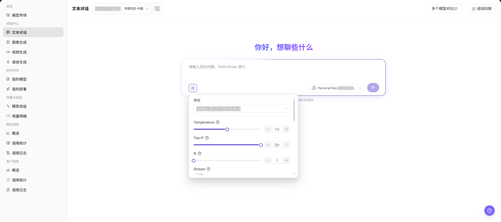
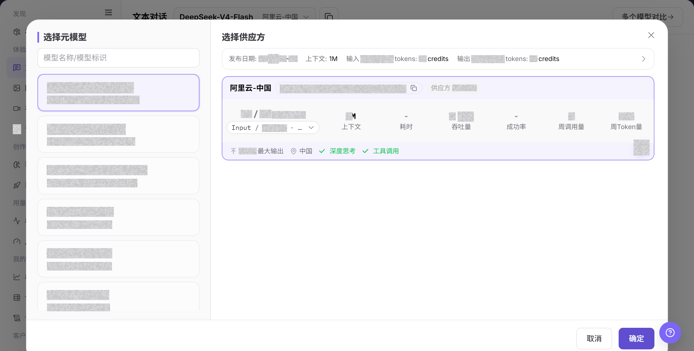
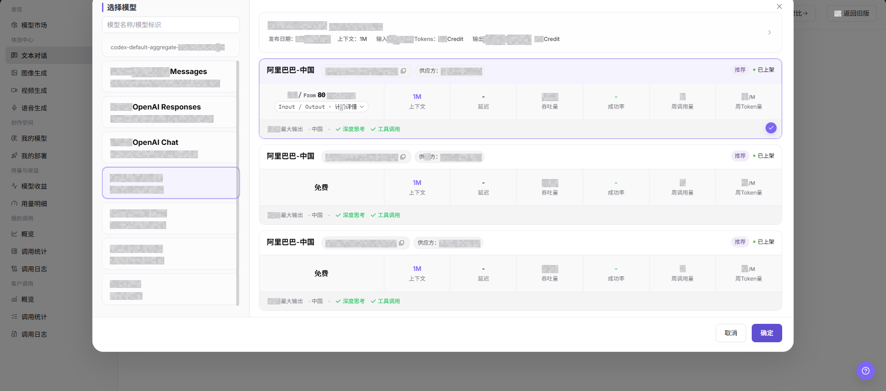
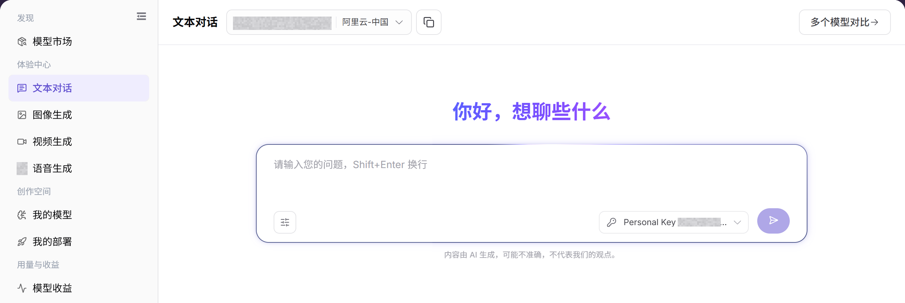

# 文本对话

::: info 文档信息
版本：v1.0
更新日期：2026-08-31
:::

## 功能概述

| 项目 | 内容 |
| --- | --- |
| 适用角色 | 模型提供方、模型调用方 |
| 导航路径 | 模型及AI服务 > 体验中心 > 文本对话 |
| 页面路由 | `/modelone/exploration/chat` |
| 管理对象 | 文本模型、提示词、生成参数和响应结果 |

#### 新手理解

文本对话像模型试用台。先选择可用的文本模型和供应方，再填写输入并调整参数，提交后根据结果或错误提示决定是否继续接入。

#### 术语表

| 术语 | 英文 | 说明 |
| --- | --- | --- |
| 模型实例 | Model Instance | 当前体验页面实际调用的模型与供应方组合。 |
| 提示词 | Prompt | 描述任务、输入内容和输出要求的指令。 |
| 生成参数 | Generation Parameters | 控制生成结果长度、随机性、尺寸或其他行为的参数。 |
| Personal Key | Personal Key | 用于发起调用的个人授权密钥，文档示例统一写为 `<PERSONAL_KEY>`。 |

#### 推荐操作顺序

第一次体验时，建议先选择文本模型，再核对供应方和 Personal Key，随后配置输入与参数，最后提交并查看结果。每次只调整少量参数，便于比较差异。

#### 小白先看

| 场景 | 先做 | 不要直接做 |
| --- | --- | --- |
| 不知道选哪个文本模型 | 先打开模型选择器比较状态和能力 | 直接提交默认模型 |
| 准备填写输入 | 先移除密钥、客户数据和生产数据 | 粘贴原始敏感内容 |
| 准备调整参数 | 一次只调整少量参数 | 同时改变全部参数 |
| 生成失败 | 先看页面错误和调用日志 | 连续重复提交 |

## 前提条件

1. 当前账号具备`文本对话` 体验页面访问权限。
2. 目标模型已授权给当前账号体验。
3. Prompt 不包含真实密钥、客户隐私或生产业务数据。

::: warning 调用与计费风险
点击发送按钮会产生真实模型调用，可能消耗额度、生成调用日志或账务记录。提交前应确认模型、Personal Key、提示词、参数和预计用量。
:::

## 页面说明

页面用于体验文本模型。当前页面可见模型选择器、`Copy Model ID`、`Model Compare`、`More settings`、个人密钥选择器和 Prompt 输入框；重点是选择模型与供应方，填写 Prompt，并调整 Protocol、Temperature、Top-P、N、Stream 等参数，观察输入区、返回区、历史记录和错误提示。

页面截图：

关注模型、输入区、参数入口和提交按钮；提交前应再次核对输入内容。

## 主要操作

### 选择文本模型

1. 进入 `模型及AI服务 > 体验中心 > 文本对话`。
2. 在页面顶部的模型选择区选择要体验的文本模型和供应方。
3. 在 Prompt 输入框中填写问题、上下文或其他输入内容。
4. 点击 **"More settings"**，按需查看或调整 `Protocol`、`Temperature`、`Top-P`、`N`、`Stream` 等参数。
5. 点击发送按钮前确认输入内容、模型、供应方、密钥和参数无误。
6. 点击 **"发送"** 前核对模型、Personal Key、输入内容、参数和预计用量。请求会生成调用记录，并可能消耗额度。

上图展示模型选择器。重点比较供应方实例的能力、价格、性能和可用状态。

该图补充展示模型选择区域及实例信息。

### 配置并生成文本内容

1. 确认当前模型、供应方和 Personal Key 正确。
2. 填写提示词，按需调整 Protocol、Temperature、Top-P、N 和 Stream；确认输入不包含密钥、客户隐私或生产数据后，点击 **"发送"**。
3. 提交后查看结果、耗时、用量和错误提示；失败时先核对模型状态、额度、参数和限流情况。
4. 记录问题时只保留脱敏后的请求标识、模型名称和发生时间，不复制真实密钥或完整敏感输入。

上图展示输入和参数区域。提交前重点核对模型、输入、Personal Key 和生成参数。

## 参数速查表

| 字段名称 | 是否必填 | 字段类型 | 示例 | 说明 |
| --- | --- | --- | --- | --- |
| 模型 | 必填 | 下拉选择 | `Example Text Model` | 当前体验的文本模型，初始选择会随账号变化。 |
| 供应方 | 必填 | 下拉选择 | `Example Provider` | 当前模型的供应方实例。 |
| Prompt | 必填 | 多行文本 | `请总结这段文本` | 输入给模型的提示词、问题或上下文。 |
| Protocol | 否 | 下拉选择 | `openai/chat_completions` | 当前调用使用的协议。 |
| Temperature | 否 | 数字 / 滑块 | `0.7` | 控制输出随机性，越高越发散。 |
| Top-P | 否 | 数字 / 滑块 | `0.8` | 控制候选词采样范围。 |
| N | 否 | 数字 / 步进器 | `1` | 控制单次请求返回的候选结果数量。 |
| Stream | 否 | 开关 | `开启` | 控制是否流式返回输出。 |
| 返回结果 | 否 | 文本区域 | 模型回答内容 | 展示模型生成结果、错误提示或状态信息。 |

## 踩坑提示

- Temperature 和 Top-P 不建议同时调得过高。
- Max Tokens 过小会截断回答，过大可能增加费用。
- 不要在 Prompt 中输入真实密钥或客户隐私。
- 发送 Prompt 会产生调用记录、额度消耗或计费记录，提交前应确认预计用量和计费口径。

## 结果校验

| 检查项 | 成功表现 | 异常时处理 |
| --- | --- | --- |
| 页面可进入 | `文本对话` 页面正常打开，左侧体验中心菜单、顶部模型选择区、`Model Compare` 和 `More settings` 控件可见。 | 确认账号权限、导航路径和页面加载状态。 |
| 模型选择器可加载 | 模型选择区可展开，能看到模型列表、供应方实例和状态信息。 | 刷新页面后重试，或确认目标模型是否对当前账号可见。 |
| 输入区和参数区可见 | Prompt 输入框、`More settings`、Protocol、Temperature、Top-P、N、Stream 等字段可见。 | 检查页面是否加载完成，必要时切换模型后重新查看。 |
| 历史或返回区域可查看 | 页面显示历史对话、返回内容、错误提示或空状态。 | 如无历史记录，确认输入区仍然可见。 |
| 真实调用有响应 | 明确允许执行调用时，页面返回与 Prompt 相关的文本回答。 | 缩短 Prompt、降低参数后重试，并查看错误提示或调用日志。 |

## 常见问题

#### 模型选择器没有目标模型

**问题现象：**

模型选择器中找不到要体验的模型。

**可能原因：**

- 模型未授权给当前账号。
- 模型状态或模态与当前页面不匹配。

**处理方式：**

1. 核对模型可见范围和状态。
2. 到模型市场确认模型的输入输出能力。

#### 提交按钮不可用

**问题现象：**

输入内容后仍无法提交。

**可能原因：**

- 未选择模型或 Personal Key。
- 必填输入或参数不完整。

**处理方式：**

1. 重新选择模型和 Personal Key。
2. 补齐页面标记的必填输入项和参数。

#### 生成失败或超时

**问题现象：**

提交后返回失败或长时间无结果。

**可能原因：**

- 模型服务繁忙或被限流。
- 输入或参数超出模型限制。

**处理方式：**

1. 查看页面错误和调用日志。
2. 缩短输入或恢复默认参数后重试。

#### 生成结果不符合预期

**问题现象：**

结果与输入目标、格式或质量要求不一致。

**可能原因：**

- 提示词约束不明确。
- 同时调整了过多参数。

**处理方式：**

1. 补充目标、格式和禁止事项。
2. 恢复基线参数并逐项比较。

#### 用量或费用异常

**问题现象：**

一次体验产生的用量高于预期。

**可能原因：**

- 输出规模或生成数量过大。
- 重复提交了相同任务。

**处理方式：**

1. 核对生成参数和调用日志。
2. 停止重复提交并确认计费口径。

## 注意事项

- 不要在 Prompt 中输入密钥、访问令牌或客户隐私。
- 截图前遮挡请求 ID 和输出中的敏感内容。
- 参数对比时一次只调整少量变量。

## 后续操作

1. 保存有效 Prompt 和参数组合。
2. 需要排障时带请求 ID 查看调用日志。
3. 正式接入前整理 API 参数和输出格式要求。
