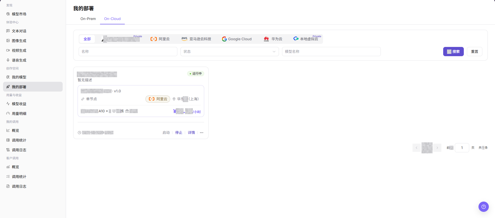
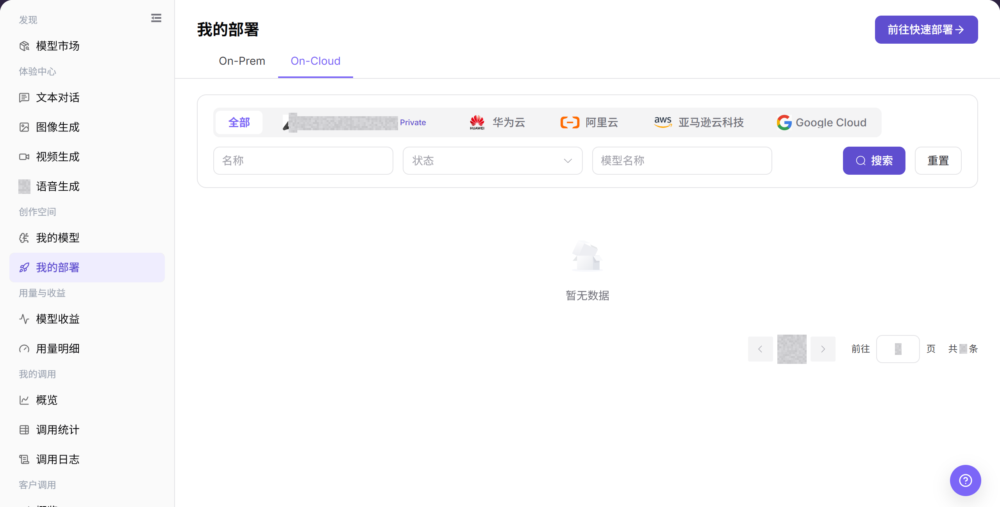
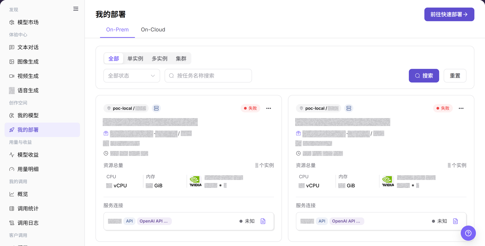
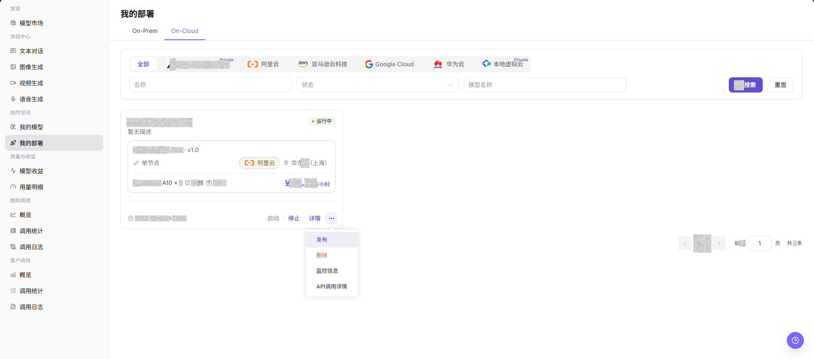
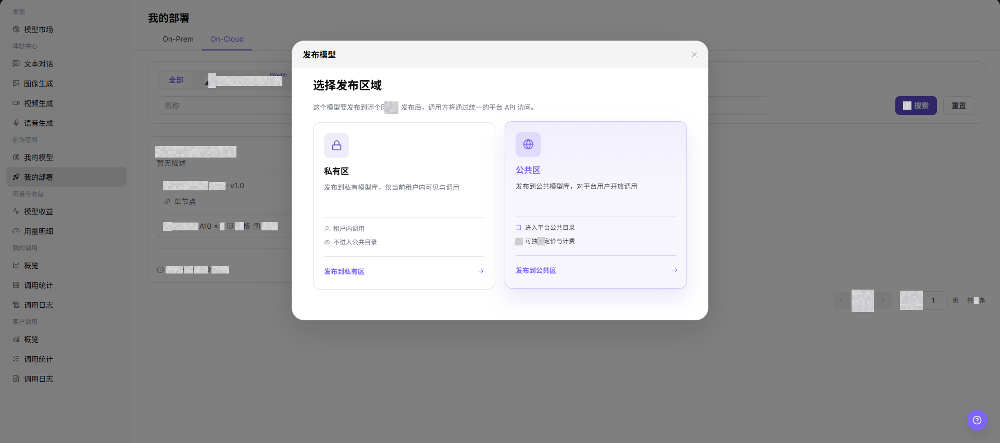
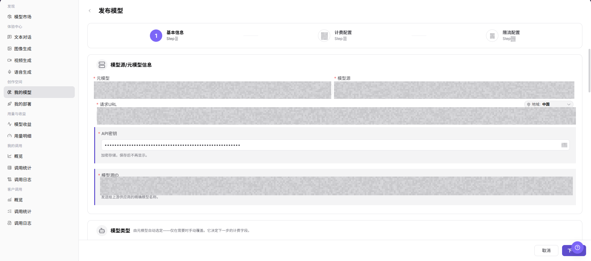

# 我的部署

## 功能概述

| 项目 | 内容 |
| --- | --- |
| 适用角色 | 模型提供方 |
| 导航路径 | 模型及AI服务 > 创作空间 > 我的部署 |
| 页面路由 | `/modelone/my-deployments/models` |
| 管理对象 | On-Cloud 部署、On-Prem 部署、部署状态和发布入口 |

#### 新手理解

我的部署像模型部署台账。On-Cloud 展示云端部署，On-Prem 展示自有环境部署；先确认部署类型，再查看状态、资源和调用信息。

#### 术语表

| 术语 | 英文 | 说明 |
| --- | --- | --- |
| On-Cloud | On-Cloud | 部署在云平台并按云端资源运行的方式。 |
| On-Prem | On-Prem | 部署在自有物理机或虚拟化环境中的方式。 |
| 部署状态 | Deployment Status | 部署任务当前所处的创建、运行、失败或停止状态。 |
| 调用信息 | Call Information | 部署成功后用于接入模型的地址、协议和认证要求。 |

#### 推荐操作顺序

先按 On-Cloud 或 On-Prem 进入对应页签，再定位部署并查看详情。需要发布新模型时，从发布入口确认区域后进入发布流程。

#### 小白先看

| 场景 | 先做 | 不要直接做 |
| --- | --- | --- |
| 不知道部署在哪 | 先查看两个部署页签 | 只在一个页签重复查询 |
| 部署状态异常 | 查看详情和状态信息 | 立即重复部署 |
| 准备复制调用信息 | 使用地址与密钥占位符 | 把真实凭证写入文档 |
| 准备发布新模型 | 先确认发布区域和资源 | 直接提交发布 |

## 前提条件

1. 当前账号具备 `创作空间 > 我的部署` 查看权限。
2. 页面中存在可查看的部署记录。
3. 目标部署满足发布入口展示条件，且更多操作中可见 `发布`。
4. 发布前已确认发布区域、可见范围、计费配置和调用配置的风险。
5. 发布前已确认部署区域、资源、模型来源、可见范围、计费和限流配置。

::: warning 高风险操作边界
发布模型会影响模型可见范围、调用方式、计费配置和用户访问。提交前应再次核对发布区域、业务范围、资源、模型来源、计费和限流配置。
:::

## 页面说明

页面以 On-Cloud 和 On-Prem 区分部署位置，列表展示模型、区域、状态和操作入口。发布入口用于进入新的模型发布流程。

页面截图：

关注部署类型、模型名称、区域、状态和操作入口。

## 主要操作

### 查看 On-Cloud 部署

1. 进入 `模型及AI服务 > 创作空间 > 我的部署`。
2. 点击 **"On-Cloud"**。
3. 按名称或状态定位部署，核对模型、云平台、区域和运行状态。

上图展示 On-Cloud 部署列表。重点核对云平台、区域和状态。

### 查看 On-Prem 部署

1. 进入 `模型及AI服务 > 创作空间 > 我的部署`。
2. 点击 **"On-Prem"**。
3. 按名称或状态定位部署，核对模型、资源、实例和运行状态。

上图展示 On-Prem 部署列表。重点核对资源、实例和部署状态。

### 发布模型

1. 在 `我的部署` 页面点击 **"发布模型"**。
2. 选择发布区域，并确认目标部署方式和可见范围。
3. 完成发布表单，提交前核对资源、模型来源、计费和限流配置。
4. 提交后返回对应部署页签查看状态；状态异常时先查看详情，不重复提交。

从发布入口开始新的部署发布流程。

确认发布区域与目标部署范围。

提交前核对资源、来源、计费和限流配置。

## 参数速查表

| 字段名称 | 是否必填 | 字段类型 | 示例 | 说明 |
| --- | --- | --- | --- | --- |
| 部署名称 | 是 | 文本 | `Example Deployment` | 用于识别目标部署记录。 |
| 模型名称 | 是 | 文本 | `Example Model` | 目标部署关联的模型。 |
| 部署状态 | 是 | 状态标签 | `运行中` | 判断部署是否满足发布入口展示或后续发布条件。 |
| 地域 | 是 | 文本 | `华东2（上海）` | 目标部署所在地域，发布前需要与发布区域和业务范围核对。 |
| 资源规格 | 是 | 文本 | `NVIDIA A10 x 1` | 展示部署使用的加速卡、CPU、内存等资源规格。 |
| 发布入口 | 是 | 更多操作 | `发布` | 从目标部署进入发布区域选择流程。 |
| 发布区域 | 是 | 卡片选择 | `私有区` / `公共区` | 决定跳转后的发布目标和可见范围。 |
| 跳转目标 | 是 | 页面跳转 | `我的模型 > 发布模型` | 选择发布区域后的目标页面。 |
| 发布范围 | 条件必填 | 页面配置 | `私有区` / `公共区` | 在发布模型页面继续确认模型对外可见范围。 |
| 计费配置 | 条件必填 | 分步配置 | `Token` / `免费` | 在发布模型页面继续确认价格、免费额度或计费方式。 |
| 调用配置 | 条件必填 | 分步配置 | `<BASE_URL><ENDPOINT_PATH>` | 在发布模型页面继续确认请求地址、密钥、模型源 ID、限流等调用相关配置。 |
| 操作 | 否 | 行内按钮 / 更多菜单 | `启动` / `停止` / `详情` / `发布` | 查看、控制或进入发布流程的页面入口。 |

## 踩坑提示

- 我的部署记录展示部署状态，不等同于模型已经完成市场发布。
- 部署异常时先看资源池、Runtime Image、模型资产和启动日志，不要直接重复提交。
- 删除、下线或重启部署可能影响调用方，操作前确认流量和回滚路径。

## 结果校验

| 检查项 | 成功表现 | 异常时处理 |
| --- | --- | --- |
| 页面可进入 | `我的部署` 页面正常打开，`On-Prem` 和 `On-Cloud` 页签可见。 | 检查账号权限、导航路径和页面加载状态。 |
| 部署列表可见 | 目标部署卡片显示部署名称、模型名称、状态、地域和资源规格。 | 点击 **"搜索"** 或 `重置` 后重试，必要时检查筛选条件和部署权限。 |
| 目标部署状态可见 | 目标部署状态展示为页面真实状态，例如 `运行中`。 | 确认部署任务是否完成，或进入 `详情` 查看部署状态。 |
| 发布入口可见 | 符合条件的部署在更多操作中展示 `发布`。 | 检查部署状态、账号权限和页面操作范围。 |
| 发布区域可选择 | `发布模型` 弹窗打开，并展示 `私有区`、`公共区` 及对应发布按钮。 | 关闭弹窗后重试，或检查是否具备对应区域发布权限。 |
| 跳转目标正确 | 选择发布区域后，进入 `模型及AI服务 > 创作空间 > 我的模型` 的 `发布模型` 页面。 | 检查发布区域权限、页面路由和浏览器跳转状态。 |
| 发布字段可见 | 页面显示 `基础信息`、`计费配置`、`限流配置` 步骤和关键字段。 | 返回上一步重新选择发布区域，或刷新发布模型页面。 |

## 常见问题

#### 部署列表为空

**问题现象：**

On-Cloud 或 On-Prem 列表没有目标部署。

**可能原因：**

- 查看了错误页签。
- 筛选条件或可见范围不匹配。

**处理方式：**

1. 切换两个部署页签。
2. 重置筛选并核对权限。

#### 部署详情无法打开

**问题现象：**

点击部署后没有详情或页面报错。

**可能原因：**

- 部署记录仍在创建。
- 记录已失效或权限不足。

**处理方式：**

1. 刷新列表并核对状态。
2. 确认记录存在且账号有查看权限。

#### 部署状态长时间不变

**问题现象：**

状态持续停留在创建或处理中。

**可能原因：**

- 资源准备尚未完成。
- 部署任务发生异常。

**处理方式：**

1. 查看详情中的阶段和错误。
2. 联系有权限的运维人员核对任务。

#### 调用信息不可用

**问题现象：**

部署完成后没有可用调用信息。

**可能原因：**

- 服务尚未就绪。
- 调用权限或网络范围未配置。

**处理方式：**

1. 核对部署健康状态。
2. 检查授权和网络访问范围。

#### 发布模型失败

**问题现象：**

发布流程提交后未生成部署记录。

**可能原因：**

- 资源、来源或计费配置不完整。
- 重复名称或发布区域不正确。

**处理方式：**

1. 补齐页面标记的必填项，并修正格式错误的字段。
2. 核对名称和发布区域后重新提交。

## 注意事项

- 发布模型会影响模型对外可见范围、调用方式、计费配置和用户访问。
- 选择错误发布区域可能导致模型进入错误站点、区域或业务范围。
- `发布 / Publish`、`提交 / Submit`、`保存 / Save` 是高风险最终动作。
- 不写真实账号、密钥、Token、AK/SK、Endpoint、API Key、客户名称、价格策略、云资源 ID 或内部测试参数。

## 后续操作

1. 返回 `我的模型` 查看发布模型配置进度。
2. 根据发布区域核对模型可见范围、计费配置和调用配置。
3. 如已执行真实发布，进入模型详情或调用页面确认状态和访问控制。
