# 我的模型

## 功能概述

| 项目 | 内容 |
| --- | --- |
| 适用角色 | 模型提供方 |
| 导航路径 | 模型及AI服务 > 创作空间 > 我的模型 |
| 页面路由 | `/modelone/model/my/overview` |
| 管理对象 | 已发布模型、聚合模型、发布入口和聚合模型创建入口 |

#### 新手理解

我的模型像模型提供方的工作台。`我的发布` 管理直接发布的模型，`我的聚合` 管理组合多个模型形成的聚合模型，概览入口用于开始新的发布或聚合流程。

#### 术语表

| 术语 | 英文 | 说明 |
| --- | --- | --- |
| 我的发布 | My Published | 当前模型提供方直接发布的模型清单。 |
| 我的聚合 | My Aggregate | 由多个可用模型按策略组合形成的模型清单。 |
| 私有区 | Private Region | 仅发布方所在租户成员可见和调用的范围。 |
| 公共区 | Public Region | 可面向平台租户或指定租户提供模型的范围。 |

#### 推荐操作顺序

首次发布时，先打开发布入口并确认发布区域，再完成基础信息、计费和限流配置；发布后到 `我的发布` 核对状态。创建聚合模型时，先确认候选模型均可用。

#### 小白先看

| 场景 | 先做 | 不要直接做 |
| --- | --- | --- |
| 准备发布模型 | 先确认私有区或公共区 | 跳过可见范围确认 |
| 准备创建聚合模型 | 先核对候选模型状态 | 选择不可用模型 |
| 发布后列表无记录 | 检查页签、状态和筛选条件 | 重复提交发布 |
| 准备调整在售模型 | 先评估客户与调用影响 | 直接下架或覆盖关键配置 |

## 前提条件

1. 当前账号具备 `我的模型` 页面访问权限。模型提供方看到 `开始`，模型调用方在受保护入口看到 `联系我们`。
2. 发布模型前已准备元模型、模型来源、请求 URL、认证信息、协议和计费方案。
3. 创建聚合模型前，至少已有可用于聚合的同类已发布模型。
4. 发布、保存、创建、下架或删除前，已确认影响范围、客户可见性、计费变化和恢复方案。

::: warning 高风险操作边界
`发布`、`提交`、`保存`、`创建`、`下架`、`删除`，以及修改计费、免费额度、可见范围、调用配置或路由策略，都会影响模型服务、客户调用和账务结果。执行前应核对影响对象、审批要求和恢复方案。
:::

## 页面说明

页面包含 `概览`、`我的发布` 和 `我的聚合`。列表用于查看现有模型，概览中的业务入口用于开始模型发布或聚合模型创建。

页面截图：

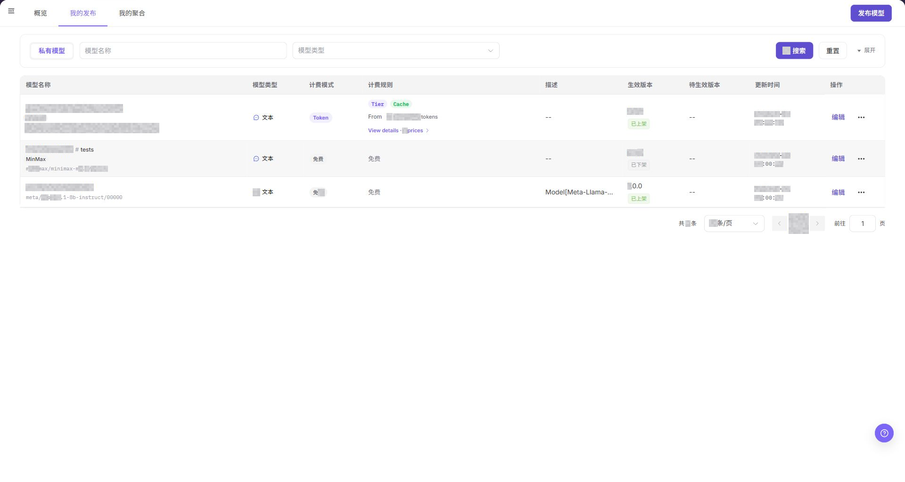

`我的发布` 展示直接发布模型的名称、区域、状态和操作入口。

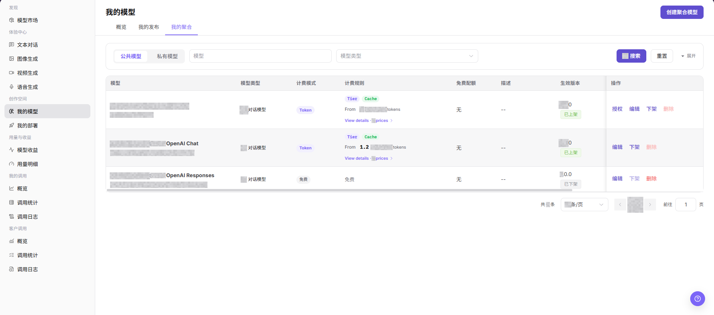

`我的聚合` 展示聚合模型及其当前状态。

## 主要操作

### 查看已发布模型

1. 进入 `模型及AI服务 > 创作空间 > 我的模型`。
2. 点击 **"我的发布"**。
3. 按名称、区域或状态定位模型，核对模型状态和可用操作。

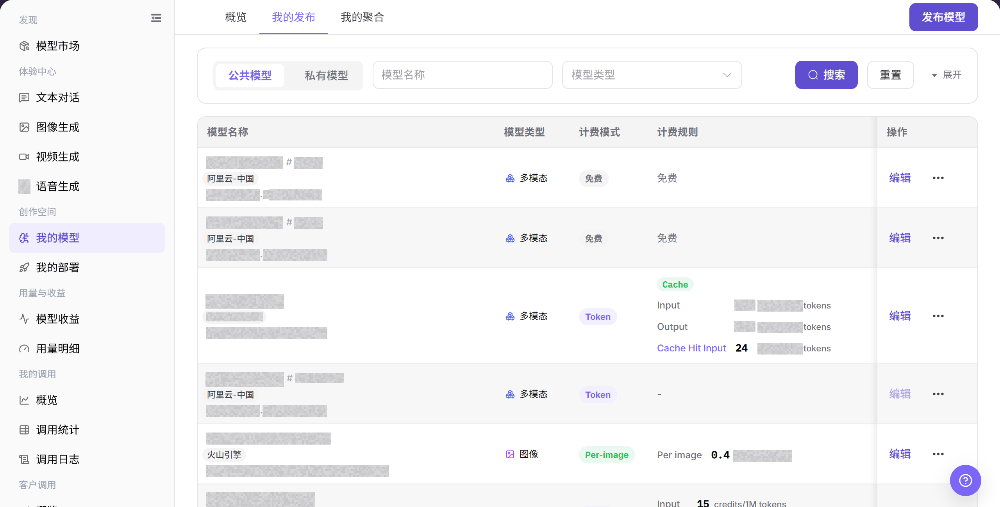

上图展示 `我的发布` 列表。重点核对发布区域、状态和操作入口。

### 查看聚合模型

1. 进入 `模型及AI服务 > 创作空间 > 我的模型`。
2. 点击 **"我的聚合"**。
3. 核对聚合模型名称、区域、状态和候选模型信息。

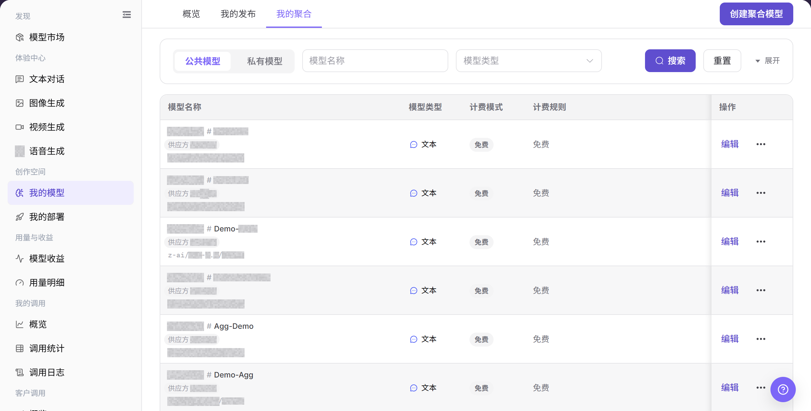

上图展示 `我的聚合` 列表。重点核对聚合模型状态和可用操作。

### 发布模型

1. 在 `我的模型` 概览点击发布模型入口。
2. 选择私有区或公共区，并确认目标可见范围。
3. 依次填写基础信息、模型来源、计费配置和限流配置；示例地址与凭证使用 `<BASE_URL>`、`<ENDPOINT_PATH>` 和 `<PERSONAL_KEY>`。
4. 提交前核对价格、限流、授权范围和模型状态；提交后到 **"我的发布"** 查看结果。

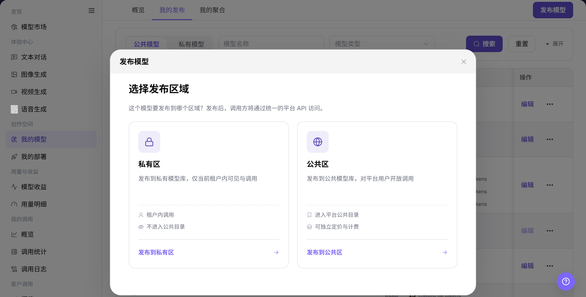

上图展示发布区域选择入口。先确认私有区或公共区，再进入发布向导。

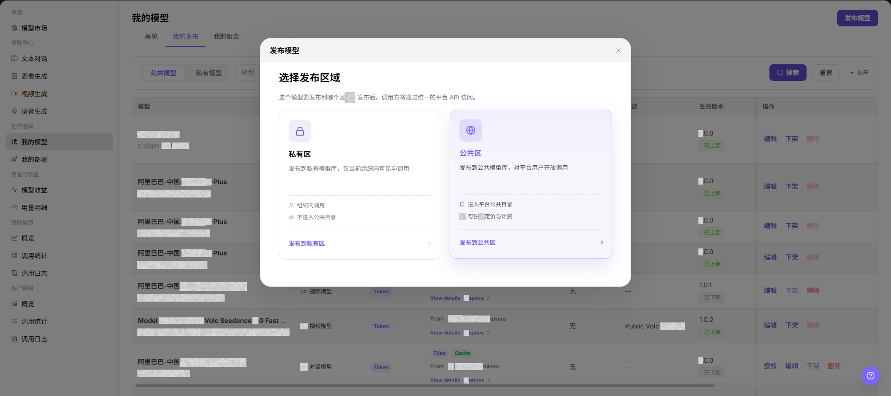

确认发布区域与目标可见范围一致。

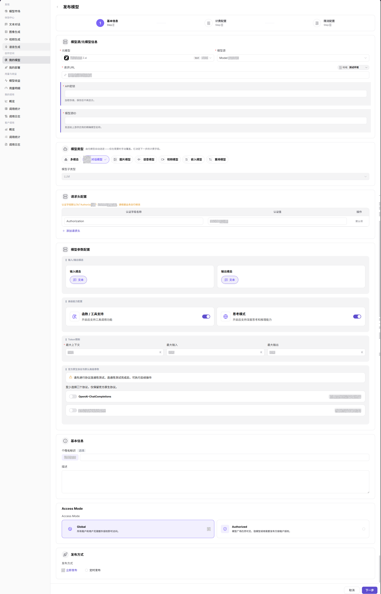

核对模型名称、来源和展示信息。

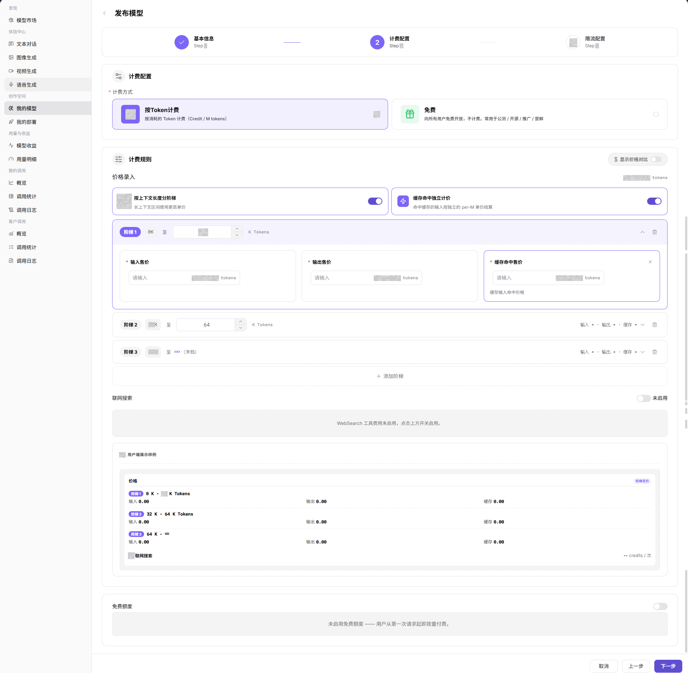

核对计费单位、价格和免费额度。

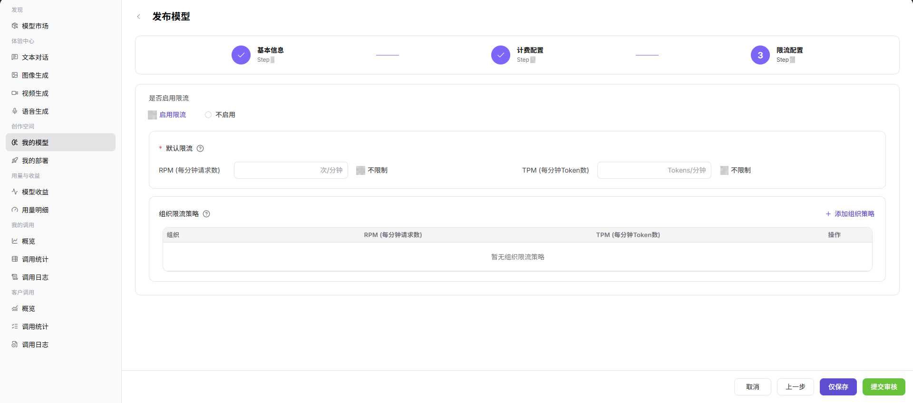

核对限流周期、阈值和适用范围。

### 创建聚合模型

1. 在 `我的模型` 概览点击聚合模型入口。
2. 选择私有区或公共区，并确认目标客户范围。
3. 填写基础信息，选择可用候选模型并配置路由、计费和限流策略。
4. 提交前核对候选模型状态与策略；提交后到 **"我的聚合"** 查看结果。

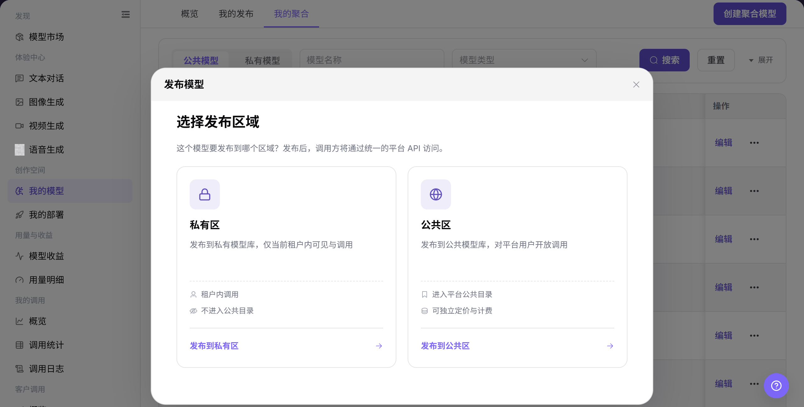

上图展示聚合模型区域选择入口。先确认可见范围，再进入创建向导。

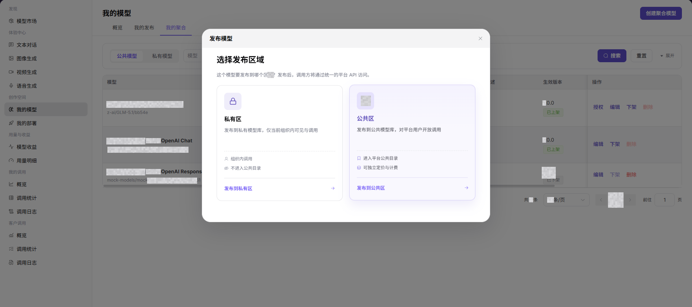

确认聚合模型区域和客户范围。

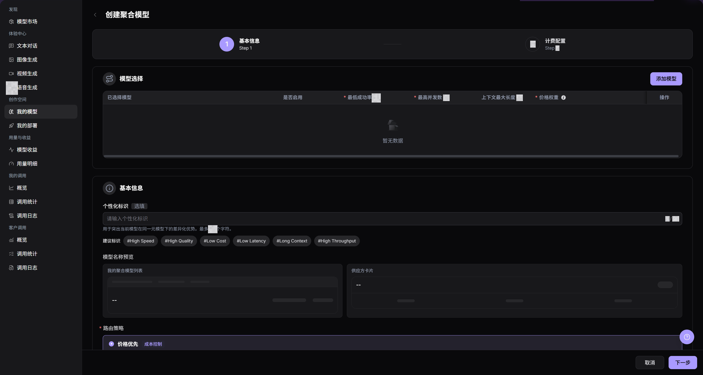

核对名称、候选模型和路由策略。

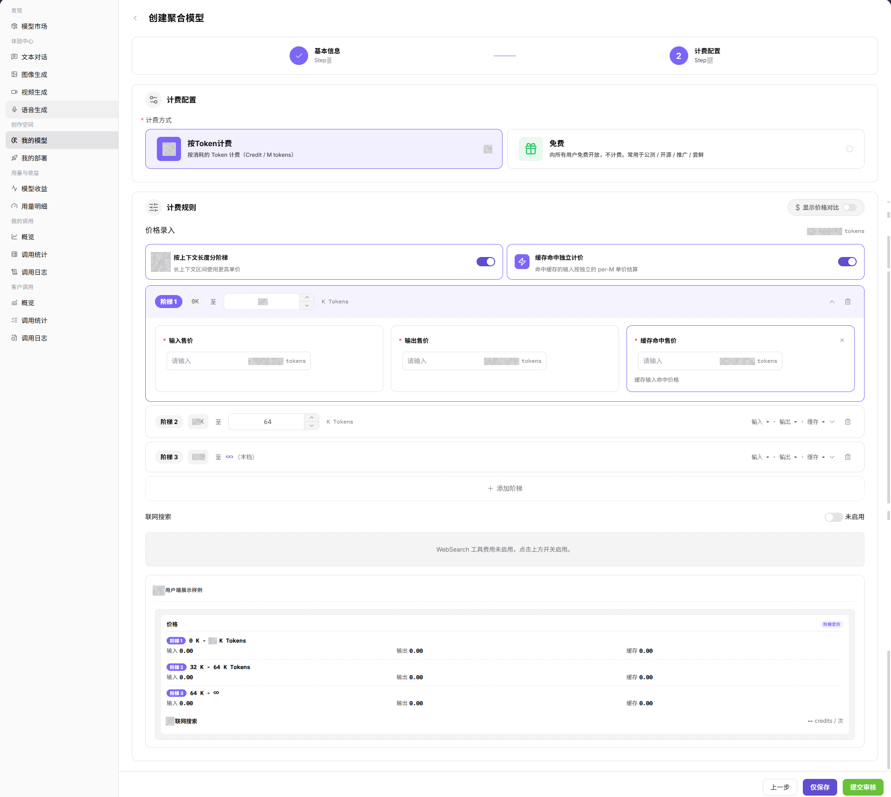

核对聚合模型的计费单位和价格。

## 参数速查表

| 字段名称 | 是否必填 | 字段类型 | 示例 | 说明 |
| --- | --- | --- | --- | --- |
| 发布区域 | 是 | 卡片选择 | `私有区` / `公共区` | 决定模型发布后的可见目录和调用范围。 |
| 元模型 | 发布模型必填 | 下拉选择 | `Example Meta Model` | 定义模型能力、协议和基础类型。 |
| 模型源 | 发布模型必填 | 下拉选择 | `Example Source` | 模型请求来源或供应方接入来源。 |
| 请求 URL | 发布模型必填 | 输入框 | `<BASE_URL><ENDPOINT_PATH>` | 模型服务访问地址，文档中不得写入真实内部地址。 |
| API 密钥 | 条件必填 | 密文输入 | `Bearer <API_KEY>` | 用于认证模型源请求，保存后不再显示。 |
| 模型源 ID | 条件必填 | 输入框 | `example-model-id` | 发送给上游供应方的模型标识。 |
| 模型类型 | 是 | 单选 / 标签 | `对话模型` | 模型能力类型，例如对话、图片、语音、视频、嵌入、重排等。 |
| 协议 | 是 | 开关 / 标签 | `OpenAI-ChatCompletions` | 当前模型兼容的调用协议。 |
| Access Mode | 是 | 单选卡片 | `Global` / `Authorized` | 控制模型调用是否需要授权。 |
| 发布方式 | 是 | 单选 | `立即发布` / `定时发布` | 控制发布生效时机。 |
| 计费类型 | 是 | 选择项 | `Token` | 设置模型调用的计费方式，对应英文 UI 字段 `Billing type`。 |
| 价格入口 | 否 | 选择项 / 开关 | `Input / Output` | 设置价格配置入口或价格生效方式，对应英文 UI 字段 `Price Entry`。 |
| 输入价格 | 条件必填 | 数字 | `0.1 Credits` | 设置输入 Token、字符或请求的计费价格，对应英文 UI 字段 `Input Price`。 |
| 输出价格 | 条件必填 | 数字 | `0.2 Credits` | 设置输出 Token、字符或结果的计费价格，对应英文 UI 字段 `Output Price`。 |
| 缓存价格 | 否 | 数字 | `0.05 Credits` | 设置缓存命中或缓存相关调用价格，对应英文 UI 字段 `Cache Price`。 |
| 联网搜索 | 否 | 开关 / 选择项 | `开启` / `关闭` | 设置模型是否支持联网搜索及相关计费能力，对应英文 UI 字段 `Web Search`。 |
| 免费额度 | 否 | 数字 | `100 Credits` | 设置用户可免费使用的额度，对应英文 UI 字段 `Free Quota`。 |
| 聚合模型 | 创建聚合模型必填 | 模型选择 | `Example Source:Example Model` | 参与聚合的已发布模型。 |
| 启用 | 否 | 开关 | `开启` | 决定该模型是否参与路由。 |
| 最低成功率 | 是 | 数字输入 | `95` | 设置当前模型行的最低成功率要求。 |
| 最高并发 | 是 | 数字输入 | `10` | 设置当前模型行允许的最高并发调用数。 |
| 上下文长度 | 否 | 数字输入 | `8,192 Tokens` | 展示或设置当前模型行的上下文长度边界。 |
| 价格权重 | 是 | 数字输入 | `1-100` | 设置无量纲路由权重，不代表计费金额。 |
| 自定义或建议标签 | 否 | 文本 / 标签 | `#低延迟` | 描述模型优势，并更新模型名称预览。 |
| 模型名称预览 | 系统生成 | 预览 | `Example Aggregate Model` | 预览聚合模型在列表和供应方卡片中的名称。 |
| 路由策略 | 创建聚合模型必填 | 单选 | `价格优先` | 从页面展示的五种路由策略中选择一种。 |
| 状态 | 否 | 标签 | `已上架` / `已下架` | 模型当前发布状态。 |
| 操作 | 否 | 行内按钮 | `授权` / `编辑` / `下架` / `删除` | 对模型记录执行查看或管理操作。 |

## 踩坑提示

- 我的模型是发布工作台，不是最终上架结果；模型是否可被调用还要看审核和部署状态。
- 修改模型来源、模板、Endpoint 或计费配置前，要确认是否影响已有调用方。
- 提交审核材料时不要暴露真实密钥、内部地址、客户数据或完整测试请求。

## 结果校验

| 检查项 | 成功表现 | 异常时处理 |
| --- | --- | --- |
| 页面可进入 | `我的模型` 页面正常打开，`概览`、`我的发布`、`我的聚合` 页签可见。 | 确认账号权限、导航路径和页面加载状态。 |
| 模型列表可加载 | `我的发布` 或 `我的聚合` 列表展示模型、状态、版本和操作入口。 | 点击 **"搜索"** 或 `重置` 后重试，必要时检查权限和筛选条件。 |
| 发布模型入口可见 | `发布模型` 按钮或发布入口可见，并可打开发布区域弹窗。 | 检查账号是否具备模型发布权限。 |
| 创建聚合模型入口可见 | `创建聚合模型` 按钮或入口可见，并可打开发布区域弹窗。 | 确认是否已有满足条件的已发布模型。 |
| 发布字段可见 | 页面显示基础信息、计费配置和限流配置步骤。 | 返回上一步重新选择发布区域或刷新页面。 |
| 聚合字段可见 | 页面显示模型选择、行内控制、标签、名称预览、路由策略、Access Mode 和计费配置。 | 检查参与聚合模型是否满足同类元模型要求。 |

## 常见问题

#### 列表没有目标模型

**问题现象：**

发布或聚合后列表中没有目标记录。

**可能原因：**

- 当前页签或筛选条件不正确。
- 流程尚未提交成功或状态仍在更新。

**处理方式：**

1. 切换到对应页签并重置筛选。
2. 核对提交结果和模型状态。

#### 发布入口无法继续

**问题现象：**

点击发布入口后无法进入下一步。

**可能原因：**

- 当前账号缺少发布权限。
- 发布区域或前置配置不可用。

**处理方式：**

1. 核对模型提供方权限。
2. 确认发布区域、模型来源和必要配置。

#### 公共区发布受阻

**问题现象：**

选择公共区后无法继续发布。

**可能原因：**

- 公共区身份或授权条件未满足。
- 模型资料或审核条件不完整。

**处理方式：**

1. 核对身份与授权范围。
2. 补齐模型资料后重新提交。

#### 聚合模型没有候选模型

**问题现象：**

创建聚合模型时无法选择候选模型。

**可能原因：**

- 候选模型未上架或不可见。
- 模型类型或区域不匹配。

**处理方式：**

1. 核对候选模型状态和可见范围。
2. 统一模型类型与发布区域。

#### 发布后模型市场不可见

**问题现象：**

我的发布有记录，但模型市场查不到。

**可能原因：**

- 模型仍在审核或未上架。
- 可见范围与当前账号不匹配。

**处理方式：**

1. 核对发布状态和区域。
2. 使用目标范围内账号验证可见性。

## 注意事项

- 不在文档中写入真实账号、密码、访问参数、API Key、Token、AK/SK 或私钥。
- 截图或导出前确认页面不包含真实密钥、未脱敏请求头、内部 Endpoint 或敏感业务数据。
- 发布模型和创建聚合模型会影响模型可见性、客户调用和计费，提交前应完成影响评估。
- 价格、计费类型、联网搜索和免费额度会影响真实调用成本、账务统计和用户可用额度，文档只描述配置流程，不记录真实价格策略。

## 后续操作

1. 发布后查看模型状态、审核记录和生效版本。
2. 到 **"模型"** 或 **"体验中心"** 验证模型名称、能力、价格和可见范围。
3. 通过调用日志、用量明细和模型收益跟踪调用质量与账务结果。
4. 聚合模型上线后持续观察成功率、延迟、成本和路由命中情况。
