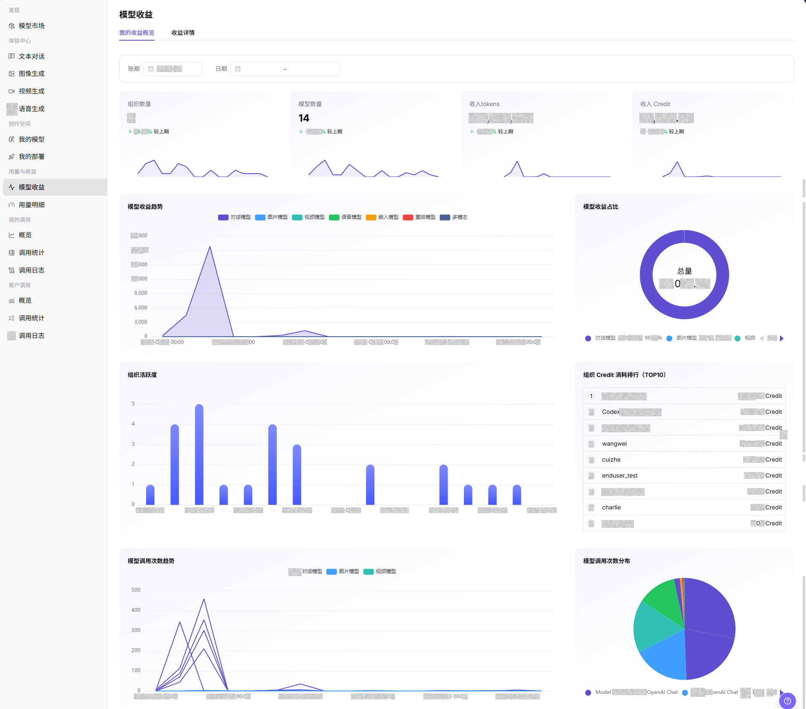
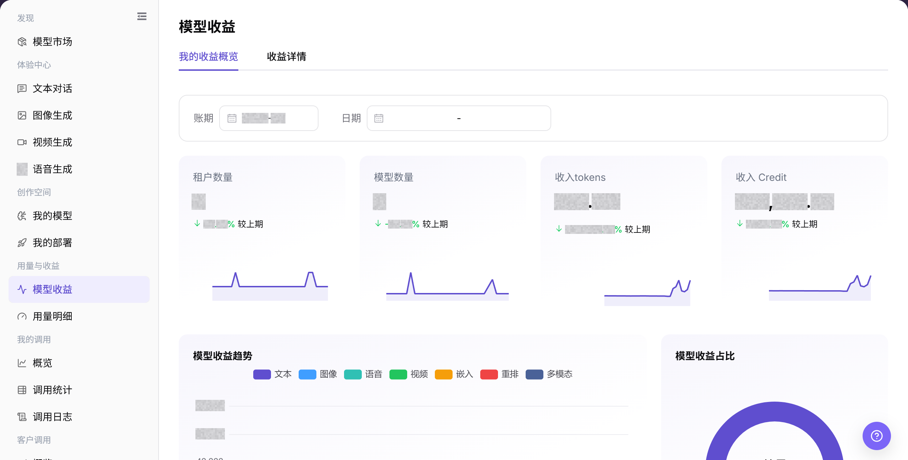
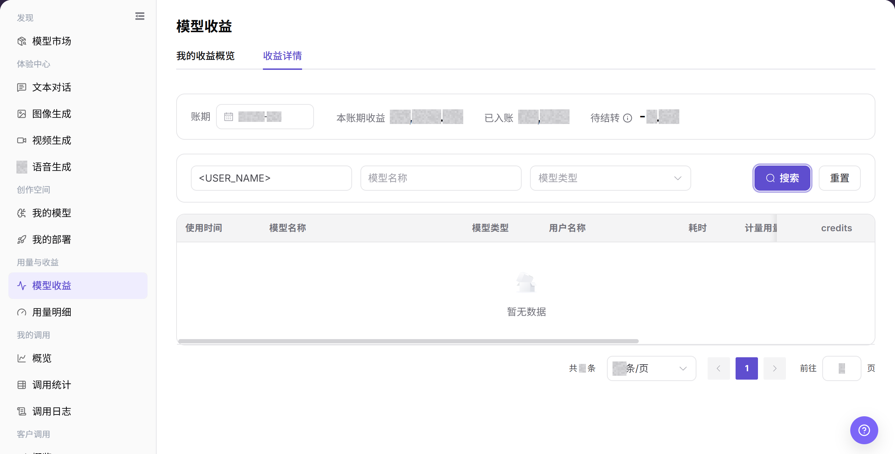
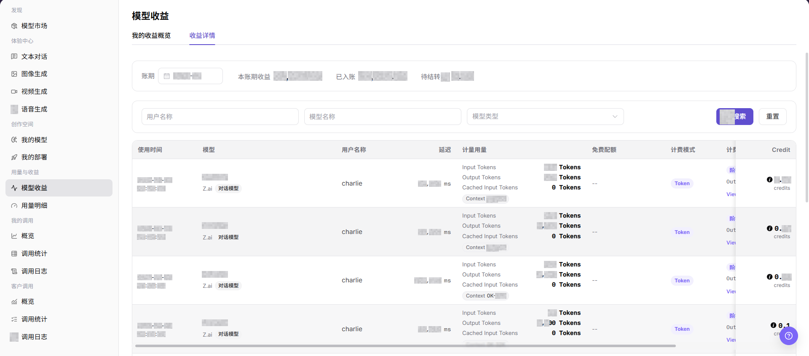

# 模型收益

## 功能概述

| 项目 | 内容 |
| --- | --- |
| 适用角色 | 模型提供方 |
| 导航路径 | 模型及AI服务 > 用量与收益 > 模型收益 |
| 页面路由 | `/modelone/accounting/useage/overview/model` |
| 管理对象 | 收益概览、收益趋势、模型分布和收益详情 |

#### 新手理解

模型收益像模型业务的收益账本。概览用于先看总量和趋势，详情用于按时间、用户或模型核对具体记录。

#### 术语表

| 术语 | 英文 | 说明 |
| --- | --- | --- |
| 我的收益概览 | Overview | 汇总当前时间范围内的收益指标和趋势。 |
| 收益详情 | Earning Details | 按时间和业务对象展示单条收益记录。 |
| 统计周期 | Statistics Period | 决定概览与详情的时间范围和汇总口径。 |
| 模型分布 | Model Distribution | 展示不同模型在总收益中的占比。 |

#### 推荐操作顺序

先在 我的收益概览 核对总量、趋势和模型分布，再进入 收益详情 按时间与对象查询。对账时两个页签必须使用相同统计周期。

#### 小白先看

| 场景 | 先做 | 不要直接做 |
| --- | --- | --- |
| 数据为空 | 先扩大统计周期 | 直接判断没有收益 |
| 概览与详情不一致 | 统一时间范围和筛选条件 | 混用不同口径 |
| 准备对账 | 记录统计周期和筛选条件 | 只保存截图数字 |
| 需要共享数据 | 先脱敏用户和业务标识 | 外发原始明细 |

## 前提条件

1. 当前账号具备 `模型收益` 页面访问权限。
2. 目标模型已产生可统计的调用或收益记录。
3. 已确认要查看的账期、日期范围、用户、模型或模型类型。
4. 收益金额、用户名称、租户排行和结算状态属于敏感信息，截图或导出前需要脱敏。

::: warning 高风险操作边界
收益页面用于查看和核对收益概览与详情。结算、调账和敏感数据导出不在本页完成；共享数据前应脱敏用户、租户、金额和业务标识。
:::

## 页面说明

页面包含 我的收益概览 和 收益详情。概览展示汇总指标与趋势，详情提供按条件查询的记录列表。

页面截图：

该图用于识别汇总指标和图表区域。

## 主要操作

### 查看收益概览

1. 进入 `模型及AI服务 > 用量与收益 > 模型收益`。
2. 点击 **"我的收益概览"**。
3. 选择统计周期，核对总量、趋势、模型分布和更新时间。
4. 数据为空时扩大时间范围，并确认当前账号在该周期内存在相关业务记录。

上图展示概览页。重点核对统计周期、汇总指标、趋势和模型分布。

### 查询收益详情

1. 点击 **"收益详情"**。
2. 设置时间范围，再按用户名称或模型名称筛选目标记录。
3. 核对记录时间、模型、业务对象和收益数值。
4. 用于共享或对账时，先移除用户名称、业务标识和其他敏感信息。

上图展示详情查询区和结果列表。重点核对时间范围、筛选条件和结果口径。

该图补充展示详情字段和列表结构。

## 参数速查表

| 字段名称 | 是否必填 | 字段类型 | 示例 | 说明 |
| --- | --- | --- | --- | --- |
| 账期 | 是 | 月份选择 | `2026-07` | 收益统计和结算所属月份。 |
| 日期 | 否 | 日期范围 | `2026-07-01 至 2026-07-17` | 用于限定概览图表的统计时间范围。 |
| 用户名称 | 否 | 输入框 | `Example User` | 在收益详情中按调用用户筛选明细。 |
| 模型名称 | 否 | 输入框 | `Example Model` | 在收益详情中按模型筛选明细。 |
| 模型类型 | 否 | 下拉选择 | `对话模型` | 在收益详情中按模型能力类型筛选。 |
| 收益金额 | 系统生成 | 数字 | `Credit` | 页面展示的收益金额或 Credit 数值。 |
| 调用量 | 系统生成 | 数字 | `Tokens` | 输入 Token、输出 Token 或缓存输入 Token 等计量用量。 |
| 计费类型 | 系统生成 | 标签 | `Token` | 当前收益记录使用的计费方式。 |
| 计费规则 | 系统生成 | 文本 / 详情入口 | `脱敏计费规则` | 展示当前记录命中的计费规则，可通过行内详情入口查看规则明细。 |
| 计费规则详情 | 系统生成 | 弹层 / 详情 | `脱敏规则详情` | 展示总计扣费、价格明细、匹配条件、消耗用量、费用汇总、免费配额和总费用。 |
| 结算状态 | 系统生成 | 状态 | `已入账` / `待结转` | 收益是否已入账或仍待结转。 |
| 时间范围 | 否 | 日期 / 月份 | `2026-07-01 至 2026-07-17` | 用于控制概览或详情统计周期。 |
| 调用方 | 系统生成 | 文本 | 用户或租户名称 | 产生收益的用户或租户。 |
| 操作 | 否 | 行内入口 | `View details · 3 details` | 查看收益记录命中的计费规则详情。 |

## 踩坑提示

- 模型收益不是实时到账金额，可能受账期、结算状态和收益规则影响。
- 客户维度、模型维度和时间维度切换后口径不同，不要直接相加比较。
- 收益异常时先核对用量明细和调用日志，再联系运营确认结算规则。

## 结果校验

| 检查项 | 成功表现 | 异常时处理 |
| --- | --- | --- |
| 页面可进入 | `模型收益` 页面正常打开，`我的收益概览` 和 `收益详情` 页签可见。 | 确认账号权限、导航路径和页面加载状态。 |
| 收益概览可见 | 页面显示租户数量、模型数量、收入 Tokens、收入 Credit 和统计图表。 | 切换账期或日期后重试，确认当前周期是否有收益数据。 |
| 筛选项可用 | 账期、日期、用户名称、模型名称、模型类型等筛选项可输入或选择。 | 检查筛选条件格式，必要时点击 **"重置"** 后重新查询。 |
| 收益明细可见 | 收益详情列表显示使用时间、模型、用户名称、计量用量、免费配额、计费模式、计费规则和 Credits。 | 确认账期内是否有收益记录，或放宽筛选条件。 |
| 计费规则详情可查看 | 点击 **"View details · 3 details"** 后可查看总计扣费、价格明细、匹配条件、消耗用量和费用汇总。 | 对比模型用量和调用日志，确认统计延迟或计费规则差异。 |

## 常见问题

#### 收益数据为空

**问题现象：**

选择时间范围后没有收益数据。

**可能原因：**

- 统计周期内没有相关记录。
- 当前筛选条件过窄。

**处理方式：**

1. 点击 **"重置"** 清除筛选条件。
2. 选择包含已知客户调用的账期和日期范围。
3. 到 **"客户调用 > 调用日志"** 核对同一范围；日志存在但收益为空时联系账务管理员。

#### 概览与详情不一致

**问题现象：**

概览总量与详情汇总结果不同。

**可能原因：**

- 两个页签使用了不同时间范围。
- 详情筛选条件未清除。

**处理方式：**

1. 统一统计周期。
2. 重置详情筛选后重新汇总。
3. 仍不一致时，将账期、日期范围和 Model ID 提交给账务管理员核对。

#### 目标模型没有记录

**问题现象：**

详情中找不到目标模型的收益记录。

**可能原因：**

- 模型名称或时间条件不匹配。
- 当前账号查看的发布模型范围不包含该记录。

**处理方式：**

1. 按模型名称重新查询并扩大时间。
2. 到 **"客户调用"** 核对同一 Model ID 的调用记录。
3. 客户调用存在但收益仍无记录时，向账务管理员提供脱敏明细。

#### 数据更新时间异常

**问题现象：**

客户调用已出现在调用日志，但收益页没有对应记录。

**可能原因：**

- 收益页和客户调用页使用了不同账期或日期范围。
- 目标调用对应的模型或计费范围不同。

**处理方式：**

1. 统一账期、日期范围和 Model ID。
2. 在客户调用日志中记录脱敏请求 ID。
3. 收益页仍无对应记录时，将筛选条件和请求 ID 提交给账务管理员。

#### 对账结果有差异

**问题现象：**

页面收益与外部记录不一致。

**可能原因：**

- 计费单位或时间边界不同。
- 使用了不同模型或客户范围。

**处理方式：**

1. 固定时间、模型和计费单位。
2. 按详情记录逐项核对。
3. 差异仍存在时，向账务管理员提供脱敏明细和对账口径。

## 注意事项

- 不在文档中写入真实账号、金额策略、内部测试参数或敏感数据。
- 截图或导出前确认用户名称、租户名称、收益金额和 Credit 明细已脱敏。
- 结算、调账和导出敏感数据不属于本文操作范围。

## 后续操作

1. 与模型用量、调用统计和调用日志交叉核对。
2. 对账时使用脱敏后的收益明细。
3. 根据收益趋势、模型类型占比和租户消耗排行优化模型运营策略。
