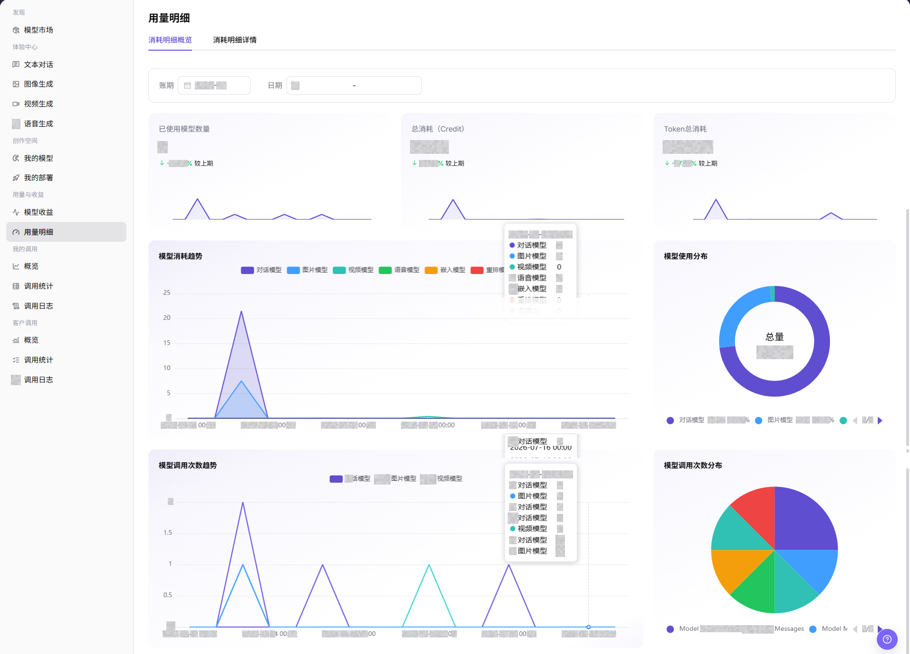
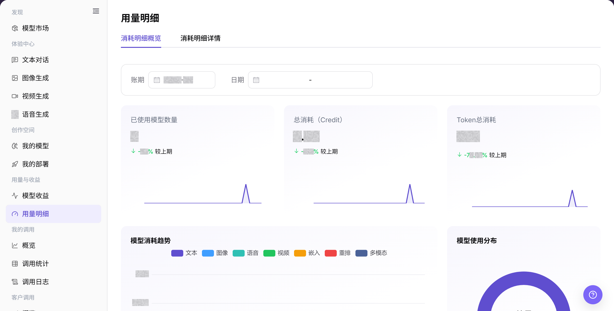
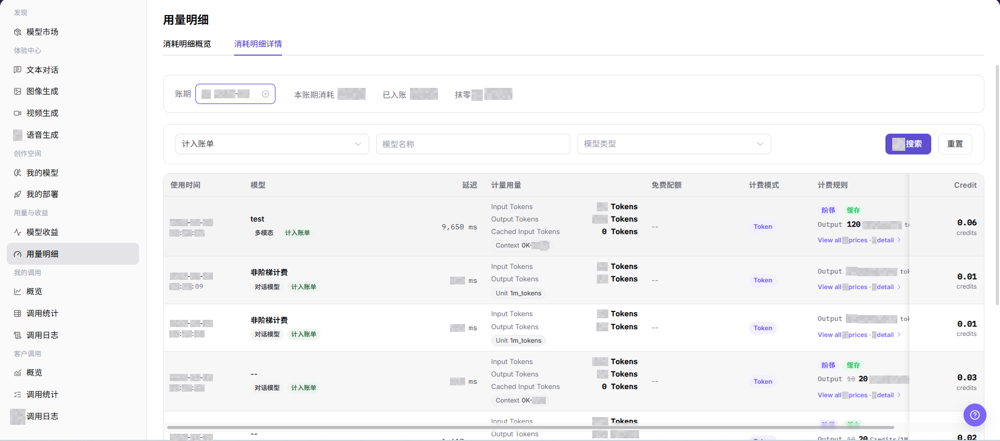

# 用量明细

## 功能概述

| 项目 | 内容 |
| --- | --- |
| 适用角色 | 模型提供方 |
| 导航路径 | 模型及AI服务 > 用量与收益 > 用量明细 |
| 页面路由 | `/modelone/accounting/deduction/overview/model` |
| 管理对象 | 用量概览、消耗趋势、模型分布和用量详情 |

#### 新手理解

用量明细像模型业务的用量账本。概览用于先看总量和趋势，详情用于按时间、用户或模型核对具体记录。

#### 术语表

| 术语 | 英文 | 说明 |
| --- | --- | --- |
| 消耗明细概览 | Overview | 汇总当前时间范围内的用量指标和趋势。 |
| 消耗明细详情 | Usage Details | 按时间和业务对象展示单条用量记录。 |
| 统计周期 | Statistics Period | 决定概览与详情的时间范围和汇总口径。 |
| 模型分布 | Model Distribution | 展示不同模型在总用量中的占比。 |

#### 推荐操作顺序

先在 消耗明细概览 核对总量、趋势和模型分布，再进入 消耗明细详情 按时间与对象查询。对账时两个页签必须使用相同统计周期。

#### 小白先看

| 场景 | 先做 | 不要直接做 |
| --- | --- | --- |
| 数据为空 | 先扩大统计周期 | 直接判断没有用量 |
| 概览与详情不一致 | 统一时间范围和筛选条件 | 混用不同口径 |
| 准备对账 | 记录统计周期和筛选条件 | 只保存截图数字 |
| 需要共享数据 | 先脱敏用户和业务标识 | 外发原始明细 |

## 前提条件

1. 当前账号具备 `用量明细` 页面访问权限。
2. 目标模型在统计周期内存在调用记录。
3. 已确认要查看的账期、日期范围、账单状态、模型名称或模型类型。
4. 消耗金额、模型调用记录、请求内容和请求 ID 属于敏感信息，截图或导出前需要脱敏。

::: warning 高风险操作边界
用量页面用于查看和核对消耗概览与详情。扣费、调账、结算和敏感数据导出不在本页完成；共享数据前应脱敏账号、请求、金额、密钥和业务标识。
:::

## 页面说明

页面包含 消耗明细概览 和 消耗明细详情。概览展示汇总指标与趋势，详情提供按条件查询的记录列表。

页面截图：

该图用于识别汇总指标和图表区域。

## 主要操作

### 查看用量概览

1. 进入 `模型及AI服务 > 用量与收益 > 用量明细`。
2. 点击 **"消耗明细概览"**。
3. 选择统计周期，核对总量、趋势、模型分布和更新时间。
4. 数据为空时扩大时间范围，并确认当前账号在该周期内存在相关业务记录。

上图展示概览页。重点核对统计周期、汇总指标、趋势和模型分布。

### 查询用量详情

1. 点击 **"消耗明细详情"**。
2. 设置时间范围，再按账单状态、模型名称或模型类型筛选目标记录。
3. 核对记录时间、模型、业务对象和用量数值。
4. 用于共享或对账时，先移除用户名称、业务标识和其他敏感信息。

上图展示详情查询区和结果列表。重点核对时间范围、筛选条件和结果口径。

该图补充展示详情字段和列表结构。

## 参数速查表

| 字段名称 | 是否必填 | 字段类型 | 示例 | 说明 |
| --- | --- | --- | --- | --- |
| 账期 | 是 | 月份选择 | `2026-07` | 消耗统计和入账所属月份。 |
| 日期 | 否 | 日期范围 | `2026-07-01 至 2026-07-17` | 用于限定概览图表的统计时间范围。 |
| 计入账单 | 否 | 下拉选择 | `计入账单` | 在消耗明细详情中按是否计入账单筛选。 |
| 模型名称 | 否 | 输入框 | `Example Model` | 在消耗明细详情中按模型筛选记录。 |
| 模型类型 | 否 | 下拉选择 | `对话模型` | 在消耗明细详情中按模型能力类型筛选。 |
| 输入消耗 | 系统生成 | 数字 | `Input Tokens` | 请求输入 Token 或输入侧用量。 |
| 输出消耗 | 系统生成 | 数字 | `Output Tokens` | 模型输出 Token 或输出侧用量。 |
| 缓存消耗 | 系统生成 | 数字 | `Cached Input Tokens` | 缓存输入命中或缓存相关用量。 |
| 联网搜索消耗 | 系统生成 | 数字 | `12` | 联网搜索工具或相关能力产生的消耗。 |
| 费用 | 系统生成 | 数字 | `Credit` | 本次调用产生的 Credit 消耗。 |
| 状态 | 系统生成 | 标签 | `计入账单` | 当前消耗记录的账单状态或入账状态。 |
| 操作 | 否 | 行内入口 | `查看` | 查看消耗记录、价格规则或相关计费信息。 |

## 踩坑提示

- 用量明细用于核对消耗，不直接代表最终收益，收益还要结合计费规则和结算口径。
- 比较用量前先统一模型、客户、时间范围和调用类型。
- 统计延迟可能导致近期调用暂未入表，排查时同时查看调用日志。

## 结果校验

| 检查项 | 成功表现 | 异常时处理 |
| --- | --- | --- |
| 页面可进入 | `用量明细` 页面正常打开，`消耗明细概览` 和 `消耗明细详情` 页签可见。 | 确认账号权限、导航路径和页面加载状态。 |
| 消耗概览可见 | 页面显示已使用模型数量、总消耗、Token 总消耗和统计图表。 | 切换账期或日期后重试，确认当前周期是否有用量数据。 |
| 筛选项可用 | 账期、日期、计入账单、模型名称、模型类型等筛选项可输入或选择。 | 检查筛选条件格式，必要时点击 **"重置"** 后重新查询。 |
| 消耗明细可见 | 消耗明细列表显示使用时间、模型、计量用量、计费模式、计费规则和 Credit。 | 确认账期内是否有消耗记录，或放宽筛选条件。 |
| 详情入口可打开 | 价格规则、详情或查看入口可正常展示相关信息。 | 检查记录是否完整，或刷新页面后重试。 |
| 字段与筛选一致 | 消耗、费用、状态、时间等字段与筛选条件一致。 | 对比调用日志和模型收益，确认统计延迟或计费规则差异。 |

## 常见问题

#### 用量数据为空

**问题现象：**

选择时间范围后没有用量数据。

**可能原因：**

- 统计周期内没有相关记录。
- 当前筛选条件过窄。

**处理方式：**

1. 点击 **"重置"** 清除筛选条件。
2. 选择包含已知调用的账期和日期范围。
3. 到 **"我的调用 > 调用日志"** 核对同一范围；日志存在但用量为空时联系管理员。

#### 概览与详情不一致

**问题现象：**

概览总量与详情汇总结果不同。

**可能原因：**

- 两个页签使用了不同时间范围。
- 详情筛选条件未清除。

**处理方式：**

1. 统一统计周期。
2. 重置详情筛选后重新汇总。
3. 仍不一致时，将账期、日期范围和 Model ID 提交给管理员核对。

#### 目标模型没有记录

**问题现象：**

详情中找不到目标模型的用量记录。

**可能原因：**

- 模型名称或时间条件不匹配。
- 当前账号查看的模型范围不包含该记录。

**处理方式：**

1. 按模型名称重新查询并扩大时间。
2. 到 **"我的调用 > 调用日志"** 核对同一 Model ID。
3. 日志存在但用量仍无记录时，向管理员提供脱敏请求 ID。

#### 数据更新时间异常

**问题现象：**

最新调用已出现在调用日志，但用量页没有对应记录。

**可能原因：**

- 用量页和调用日志使用了不同账期或日期范围。
- 目标调用使用了不同模型或账号。

**处理方式：**

1. 统一账期、日期范围和 Model ID。
2. 在调用日志中记录脱敏请求 ID。
3. 用量页仍无对应记录时，将筛选条件和请求 ID 提交给管理员。

#### 对账结果有差异

**问题现象：**

页面用量与外部记录不一致。

**可能原因：**

- 计费单位或时间边界不同。
- 使用了不同模型或客户范围。

**处理方式：**

1. 固定时间、模型和计费单位。
2. 按详情记录逐项核对。
3. 差异仍存在时，向账务管理员提供脱敏明细和对账口径。

## 注意事项

- 不在文档中写入真实账号、请求内容、金额、密钥、请求 ID 或内部测试参数。
- 截图或导出前确认模型名称、业务标识、Credit 和计费明细已脱敏。
- 导出敏感数据、扣费、调账和结算不属于本文操作范围。

## 后续操作

1. 与模型收益、调用统计和调用日志交叉核对。
2. 对账时使用脱敏后的消耗明细。
3. 根据消耗趋势、模型使用分布和调用次数分布调整限流、价格或模型运营策略。
