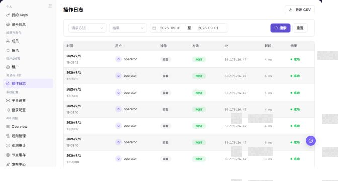

# 操作日志

## 功能概述

| 项目 | 内容 |
| --- | --- |
| 适用角色 | 运营管理员 |
| 导航路径 | 设置 > 消息与日志 > 操作日志 |
| 页面路由 | `/user/user-space/operation-logs` |
| 管理对象 | 平台操作记录、用户、操作、方法、IP、耗时和结果 |

#### 新手理解

运营操作日志像平台后台的审计流水，用来追踪管理员对账号、租户、权限、频控和系统配置做过什么。它用于排障和追责，不是业务调用日志。

#### 术语速查

| 术语 | 英文 | 说明 |
| --- | --- | --- |
| 操作人 | Term | 执行平台管理动作的账号。；排查时先确认身份。 |
| 操作对象 | Term | 被修改或查看的配置、成员或租户。；与页面记录对照。 |
| 操作结果 | Term | 成功、失败或部分成功状态。；失败时查看错误信息。 |
| 审计范围 | Term | 当前账号可查看的日志边界。；缺记录时先查权限。 |

## 前提条件

1. 当前账号具备查看操作日志的权限。
2. 已进入 `消息与日志 > 操作日志`。
3. 导出日志前已确认导出范围和接收对象。

## 页面说明

下图展示操作日志页面，用户、IP 和日志明细已做脱敏处理。

| 区域 | 说明 |
| --- | --- |
| 开始时间 / 结束时间 | 设置查询时间范围。 |
| 搜索 / 重置 | 查询或清空筛选条件。 |
| 导出 CSV | 导出当前范围内日志。 |
| 日志表格 | 展示时间、用户、操作、方法、IP、耗时和结果。 |

截图保留左侧导航和完整功能区，顶部菜单已隐藏；请重点查看操作日志页面的字段、按钮和操作位置。

## 主要操作

### 查看操作日志

1. 进入操作日志页面，选择时间范围，并按操作人、模块、动作类型、结果或关键字筛选。
2. 核对目标记录的时间、操作人、对象、结果和来源；无结果时检查时区并逐项清除条件。
3. 成功时应能唯一定位目标事件；同名记录较多时使用对象 ID 的脱敏片段和时间继续缩小范围。
4. 日志可能包含账号、IP 和业务对象信息，导出、截图或转发前必须脱敏。

截图保留左侧导航和完整功能区，顶部菜单已隐藏；请重点查看操作日志页面的字段、按钮和操作位置。

**结果校验：** 列表、详情和状态字段能够显示目标对象，且信息相互一致。

**注意事项：** 只使用当前页面实际展示的字段和入口，不根据其他角色页面推断能力。

**常见问题：** 如果入口不可见、按钮置灰或结果未更新，先检查当前账号权限、筛选条件、对象状态和页面刷新时间。

### 查看操作日志详情

1. 点击目标记录的 **"详情"**，查看请求动作、对象、结果、耗时和错误摘要。
2. 对照前后事件判断操作是否完成，以及是否产生后续失败。
3. 信息不足时记录脱敏时间、模块和错误类别后升级处理，不复制 Token、Key、Cookie 或完整请求体。
4. 日志详情只用于审计和排查，不在页面中重放高风险操作。

截图保留左侧导航和完整功能区，顶部菜单已隐藏；请重点查看操作日志页面的字段、按钮和操作位置。

**结果校验：** 列表、详情和状态字段能够显示目标对象，且信息相互一致。

**注意事项：** 只使用当前页面实际展示的字段和入口，不根据其他角色页面推断能力。

**常见问题：** 如果入口不可见、按钮置灰或结果未更新，先检查当前账号权限、筛选条件、对象状态和页面刷新时间。

### 导出操作日志

1. 进入 `设置 > 消息与日志 > 操作日志`。
2. 定位目标操作日志，点击 **"导出 CSV"**。
3. 按页面显示的必填字段完成查看或填写，并核对目标对象、影响范围和当前状态。
4. 对会改变数据、权限、状态或外部配置的操作，确认影响范围和回退方式后再点击最终确认按钮。
5. 操作完成后返回列表或详情页，核对状态、更新时间或结果提示。

截图保留左侧导航和完整功能区，顶部菜单已隐藏；请重点查看操作日志页面的字段、按钮和操作位置。

**结果校验：** 按页面成功提示，并回到列表或详情核对对象状态、更新时间和影响范围。

**注意事项：** 提交前再次核对目标对象和影响范围；涉及权限、状态、数据或外部配置时，先确认审批和回退方式。

**常见问题：** 如果入口不可见、按钮置灰或结果未更新，先检查当前账号权限、筛选条件、对象状态和页面刷新时间。

## 参数速查表

| 字段名称 | 是否必填 | 字段类型 | 示例 | 说明 |
| --- | --- | --- | --- | --- |
| 请求方法 | 否 | 枚举 | GET | 按 HTTP 请求方法筛选日志。 |
| 结果 | 否 | 枚举 | 成功 | 按操作结果筛选日志。 |
| 开始时间 | 否 | 日期时间 | 2026-07-13 09:00 | 查询时间范围的开始时间。 |
| 结束时间 | 否 | 日期时间 | 2026-07-13 10:00 | 查询时间范围的结束时间。 |
| 时间 | 系统生成 | 日期时间 | 2026-07-13 09:30 | 操作发生时间。 |
| 用户 | 系统生成 | 文本 | 示例用户 | 执行操作的账号或用户。 |
| 操作 | 系统生成 | 文本 | 更新配置 | 操作行为或接口含义。 |
| 方法 | 系统生成 | 文本 | POST | 本次请求使用的方法。 |
| IP | 系统生成 | 文本 | 192.0.2.1 | 操作来源 IP，文档中必须脱敏。 |
| 耗时 | 系统生成 | 数字 | 120 ms | 请求或操作处理耗时。 |
| 结果 | 系统生成 | 枚举 | 成功 | 操作执行结果。 |

## 踩坑提示

- 运营日志只记录平台管理动作，不用于排查模型调用耗时或业务请求内容。
- 搜索不到日志时先扩大时间范围，再确认操作入口是运营侧还是用户侧。
- 导出日志前要脱敏管理员账号、租户名称、IP、内部地址和错误详情。
- 操作日志可能包含账号、IP、接口路径、操作结果等敏感审计信息。
- `导出 CSV` 会导出真实日志数据，属于高风险动作。
- 导出前必须缩小时间范围并确认接收对象。
- 不在文档中写真实账号、IP、接口路径、客户名、租户 ID 或内部错误详情。

## 结果校验

| 检查项 | 成功表现 | 异常时处理 |
| --- | --- | --- |
| 时间筛选 | 日志按时间范围刷新。 | 检查时间范围是否过窄。 |
| 结果字段 | 操作结果正常显示。 | 结合用户和操作字段继续排查。 |
| 导出入口 | 导出按钮按权限展示。 | 导出前确认是否允许传递日志数据。 |
| 重置筛选 | 点击 **"重置"** 后筛选条件恢复默认。 | 刷新页面后重新设置查询条件。 |

## 常见问题

#### 查不到预期日志

**问题现象：**

按时间筛选后没有看到目标操作。

**可能原因：**

时间范围不覆盖操作发生时间，或当前账号没有查看对应日志的权限。

**处理方式：**

扩大时间范围后重新搜索；仍无结果时核对日志权限。

#### 日志是否可以直接导出

**问题现象：**

页面存在 `导出 CSV` 入口。

**可能原因：**

日志可能包含用户、IP、接口路径和操作结果。

**处理方式：**

导出前确认用途、范围和接收人，必要时先脱敏。

#### 运营日志为什么查不到目标记录？

**问题现象：**

运营操作日志中没有目标管理员、租户或配置变更记录。

**可能原因：**

日志时间范围不正确，操作发生在用户侧租户，或当前账号无权查看该类审计记录。

**处理方式：**

扩大时间范围并确认操作入口；按租户、操作人和对象重新筛选；仍为空时检查审计采集和保留策略。

#### 如何安全导出或截图操作日志页面？

**问题现象：**

需要把页面信息用于排障、审计或交付。

**可能原因：**

页面可能包含账号、邮箱、IP、内部路径、租户标识、Key 或金额等敏感信息。

**处理方式：**

只保留必要字段和操作上下文，使用浅灰小颗粒马赛克覆盖敏感文字，不外发完整凭证或内部地址。

#### 操作日志页面出现异常数据怎么办？

**问题现象：**

字段、状态、统计或关联对象与预期不一致。

**可能原因：**

页面范围、时间条件、角色权限或上游配置不一致。

**处理方式：**

记录脱敏后的对象、时间和结果，先核对页面入口及筛选条件，再查看关联页面和操作日志。

## 注意事项

- 操作日志可能包含用户身份、IP 和接口路径，不要随意外发。
- 导出日志前应缩小时间范围，避免导出过多无关数据。
- `导出 CSV` 会导出真实日志数据，属于高风险动作。
- 导出前必须确认时间范围、脱敏要求和接收对象。
- 不在文档中写真实账号、IP、接口路径、客户名、租户 ID 或内部错误详情。

## 后续操作

1. 需要核对成员变更，进入 [成员](../../members-roles/members/)。
2. 需要核对角色变更，进入 [角色](../../members-roles/roles/)。

### 保留的既有截图

