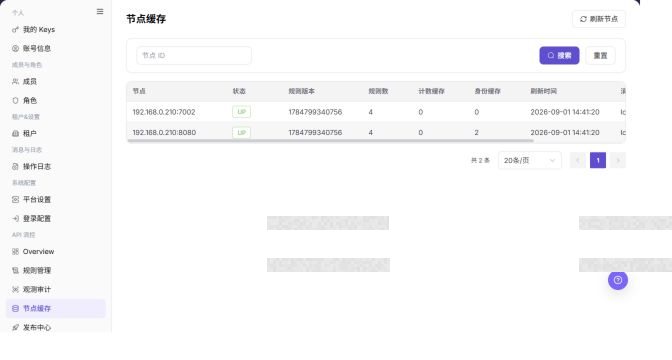

# 节点缓存

## 功能概述

| 项目 | 内容 |
| --- | --- |
| 适用角色 | 运营管理员 |
| 导航路径 | 设置 > API 流控 > 节点缓存 |
| 页面路由 | `/user/system/rate-control/node-cache` |
| 管理对象 | API 流控节点、规则版本、规则数和缓存状态 |

#### 新手理解

节点缓存页像流控规则在各节点上的同步状态表，用来确认规则是否已经下发到节点，以及节点版本是否一致。

#### 术语速查

| 术语 | 英文 | 说明 |
| --- | --- | --- |
| 节点缓存 | Term | 节点本地保存的流控规则状态。；发布后核对版本。 |
| 规则版本 | Term | 节点当前加载的规则版本。；不一致时排查发布。 |
| 同步状态 | Term | 节点是否完成规则同步。；异常时查看发布中心。 |
| 刷新 | Term | 重新加载节点缓存状态。；发布后用于确认。 |

## 前提条件

1. 当前账号具备 API 流控节点查看权限。
2. 已进入 `API 流控 > 节点缓存`。
3. 排查规则生效问题时，已记录目标规则版本和发布时间。

## 页面说明

下图展示节点缓存页面，节点地址和缓存明细已做脱敏处理。

| 区域 | 说明 |
| --- | --- |
| 刷新节点 | 重新获取节点缓存状态。 |
| 节点 ID | 按节点筛选。 |
| 节点表格 | 展示节点、状态、规则版本、规则数、计数缓存、身份缓存、刷新时间和消息。 |

截图保留左侧导航和完整功能区，顶部菜单已隐藏；请重点查看节点缓存页面的字段、按钮和操作位置。

## 主要操作

### 查看节点缓存

1. 进入 `设置 > API 流控 > 节点缓存`，按节点、状态、版本或更新时间筛选。
2. 核对节点在线状态、缓存规则版本、同步时间和异常提示。
3. 无结果时重置筛选并检查节点是否在线；版本不一致时记录节点和目标版本。
4. 查看缓存不会改变流控状态，不要在核验过程中触发清理或强制同步。

截图保留左侧导航和完整功能区，顶部菜单已隐藏；请重点查看节点缓存页面的字段、按钮和操作位置。

**结果校验：** 列表、详情和状态字段能够显示目标对象，且信息相互一致。

**注意事项：** 只使用当前页面实际展示的字段和入口，不根据其他角色页面推断能力。

**常见问题：** 如果入口不可见、按钮置灰或结果未更新，先检查当前账号权限、筛选条件、对象状态和页面刷新时间。

### 对比节点缓存版本

1. 选择异常节点并打开详情，比较当前缓存版本与发布中心的目标版本。
2. 检查最近同步时间、规则数量和错误摘要。
3. 一致时应显示相同版本或已同步状态；不一致时先确认发布是否完成，再交由有权限人员处理。
4. 不通过反复发布或清缓存来验证问题，以免影响在线请求。

截图保留左侧导航和完整功能区，顶部菜单已隐藏；请重点查看节点缓存页面的字段、按钮和操作位置。

**结果校验：** 列表、详情和状态字段能够显示目标对象，且信息相互一致。

**注意事项：** 只使用当前页面实际展示的字段和入口，不根据其他角色页面推断能力。

**常见问题：** 如果入口不可见、按钮置灰或结果未更新，先检查当前账号权限、筛选条件、对象状态和页面刷新时间。

### 刷新节点缓存

1. 进入 `设置 > API 流控 > 节点缓存`。
2. 查看节点列表中的节点状态、规则版本、规则数、计数缓存、身份缓存、刷新时间和消息。
3. 对比规则版本和规则管理页面的发布版本，确认规则是否已同步到节点。
4. 点击 **"刷新节点"** 重新获取节点缓存状态。
5. 如果页面提供清理或重建缓存入口，先确认节点范围、业务影响和审批要求。
6. 学习或截图时只查看列表和刷新状态，不执行清理、重建或其他高风险操作。

**结果校验：** 按页面成功提示，并回到列表或详情核对对象状态、更新时间和影响范围。

**注意事项：** 提交前再次核对目标对象和影响范围；涉及权限、状态、数据或外部配置时，先确认审批和回退方式。

**常见问题：** 如果入口不可见、按钮置灰或结果未更新，先检查当前账号权限、筛选条件、对象状态和页面刷新时间。

## 参数速查表

| 字段名称 | 是否必填 | 字段类型 | 示例 | 说明 |
| --- | --- | --- | --- | --- |
| 节点 | 否 | 文本 | `<node_name>` | 用于识别 API 流控节点。 |
| 节点状态 | 系统生成 | 枚举 | `正常` | 展示节点在线、异常或同步状态。 |
| 规则版本 | 系统生成 | 版本 | `<rule_version>` | 节点当前加载的规则版本。 |
| 规则数 | 系统生成 | 数值 | `10` | 节点当前缓存的规则数量。 |
| 计数缓存 | 系统生成 | 数值 / 状态 | `已加载` | 展示限流计数缓存状态。 |
| 身份缓存 | 系统生成 | 数值 / 状态 | `已加载` | 展示身份或访问主体缓存状态。 |
| 刷新时间 | 系统生成 | 时间 | `刷新时间` | 节点缓存状态最近刷新时间。 |
| 消息 | 系统生成 | 文本 | `同步成功` | 展示节点缓存同步或异常信息。 |
| 刷新节点 | 否 | 按钮 | `刷新节点` | 重新获取节点缓存状态。 |
| 操作 | 否 | 按钮 / 菜单 | `清理` | 提供节点缓存相关操作入口。 |

## 踩坑提示

- 节点缓存反映流控规则在各节点上的同步状态，异常可能导致规则未生效或节点行为不一致。
- `刷新节点` 会触发节点状态重新获取，应避免高频操作。
- `清理`、`重建`、`刷新缓存` 属于高风险动作，可能影响规则同步、计数缓存和身份缓存。
- 不在文档中写真实节点地址、内部 IP、Token、租户 ID、客户名、节点名、内部错误详情或压测参数。

## 结果校验

| 检查项 | 成功表现 | 异常时处理 |
| --- | --- | --- |
| 节点可见 | 节点列表正常展示。 | 检查节点 ID 筛选条件。 |
| 版本一致 | 节点规则版本与规则管理页面的发布版本一致。 | 进入发布中心核对发布记录。 |
| 状态正常 | 节点状态、计数缓存、身份缓存和消息无异常。 | 结合观测审计排查节点问题。 |
| 刷新受控 | `刷新节点` 后刷新时间或消息按预期更新。 | 避免高频刷新，确认节点状态和权限。 |

## 常见问题

#### 规则发布后节点版本未更新

**问题现象：**

规则管理已发布，但节点缓存中的规则版本仍旧。

**可能原因：**

节点尚未刷新，或发布记录未成功同步到节点。

**处理方式：**

点击 **"刷新节点"**，再进入发布中心查看对应发布状态。

#### 节点缓存列表为什么没有目标节点？

**问题现象：**

节点缓存页面没有展示目标节点或缓存状态。

**可能原因：**

目标节点未接入 API 频控组件，节点缓存尚未上报，或地域、节点状态筛选限制了范围。

**处理方式：**

清空筛选并确认节点接入状态；检查缓存上报时间和节点健康状态；仍为空时查看频控服务日志。

#### 为什么节点缓存刷新或清理按钮不可用？

**问题现象：**

节点缓存记录可见，但刷新、清理或重建缓存按钮不可点击。

**可能原因：**

当前账号只有查看权限，目标节点离线，或缓存清理属于高风险操作需要审批。

**处理方式：**

确认频控运维权限和节点在线状态；清理缓存前记录影响范围，并由具备权限的管理员执行。

#### 如何安全导出或截图节点缓存页面？

**问题现象：**

需要把页面信息用于排障、审计或交付。

**可能原因：**

页面可能包含账号、邮箱、IP、内部路径、租户标识、Key 或金额等敏感信息。

**处理方式：**

只保留必要字段和操作上下文，使用浅灰小颗粒马赛克覆盖敏感文字，不外发完整凭证或内部地址。

#### 节点缓存页面出现异常数据怎么办？

**问题现象：**

字段、状态、统计或关联对象与预期不一致。

**可能原因：**

页面范围、时间条件、角色权限或上游配置不一致。

**处理方式：**

记录脱敏后的对象、时间和结果，先核对页面入口及筛选条件，再查看关联页面和操作日志。

## 注意事项

- 节点缓存页面用于排查规则同步，不直接替代规则发布操作。
- `刷新节点 / Refresh Nodes` 会触发节点状态重新获取，应避免高频操作。
- `清理 / Clear`、`重建 / Rebuild`、`刷新缓存 / Refresh Cache` 属于高风险动作，可能影响规则同步、计数缓存和身份缓存。
- 不在文档中写真实节点地址、内部 IP、Token、租户 ID、客户名、节点名、内部错误详情或压测参数。

## 后续操作

1. 查看发布记录，进入 [发布中心](../publish-center/)。
2. 查看规则命中情况，进入 [观测审计](../observability-audit/)。
