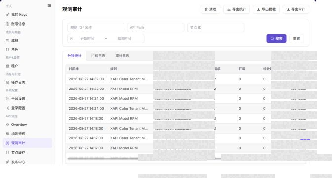

# 观测审计

## 功能概述

| 项目 | 内容 |
| --- | --- |
| 适用角色 | 运营管理员 |
| 导航路径 | 设置 > API 流控 > 观测审计 |
| 页面路由 | `/user/system/rate-control/observation` |
| 管理对象 | 分钟统计、拦截日志和审计日志 |

#### 新手理解

观测审计页像 API 流控的明细放大镜，用来查看哪些请求被统计或拦截，便于从规则、节点、API 和时间范围定位问题。

#### 术语速查

| 术语 | 英文 | 说明 |
| --- | --- | --- |
| 审计记录 | Term | 流控统计或拦截产生的明细。；排障时按时间过滤。 |
| 节点 | Node | 执行流控规则的服务节点。；节点差异时查缓存。 |
| 规则命中 | Term | 请求匹配并触发规则。；结合规则管理核对。 |
| 清理数据 | Term | 删除或归档审计数据的动作。；执行前确认范围。 |

## 前提条件

1. 当前账号具备 API 流控观测审计权限。
2. 已进入 `API 流控 > 观测审计`。
3. 清理或导出数据前已确认范围和用途。

## 页面说明

下图展示观测审计页面，API、节点和日志明细已做脱敏处理。

| 区域 | 说明 |
| --- | --- |
| 分钟统计 | 查看按分钟聚合的请求、拦截和统计超限数据。 |
| 拦截日志 | 查看被规则拦截的请求记录。 |
| 审计日志 | 查看规则审计记录。 |
| API Path | 按 API 路径筛选。 |
| 节点 ID | 按节点筛选。 |
| 开始时间 / 结束时间 | 按时间范围筛选。 |
| 清理 | 清理观测或审计数据入口。 |
| 导出统计 / 导出拦截 / 导出审计 | 导出对应数据。 |

截图保留左侧导航和完整功能区，顶部菜单已隐藏；请重点查看观测审计页面的字段、按钮和操作位置。

## 主要操作

### 查看观测统计

1. 进入 `设置 > API 流控 > 观测审计`，选择时间范围。
2. 按规则、节点、请求结果、拦截原因或请求 ID 筛选。
3. 核对请求量、拦截量、命中规则和状态分布；无数据时检查时区、节点和筛选范围。
4. 观测数据可能包含调用标识和业务路径，导出或截图前必须脱敏。

截图保留左侧导航和完整功能区，顶部菜单已隐藏；请重点查看观测审计页面的字段、按钮和操作位置。

**结果校验：** 列表、详情和状态字段能够显示目标对象，且信息相互一致。

**注意事项：** 只使用当前页面实际展示的字段和入口，不根据其他角色页面推断能力。

**常见问题：** 如果入口不可见、按钮置灰或结果未更新，先检查当前账号权限、筛选条件、对象状态和页面刷新时间。

### 查看拦截事件详情

1. 点击异常指标或目标事件的 **"详情"**。
2. 查看命中规则、节点、动作、状态码、时间和错误摘要。
3. 对照规则管理中的版本与条件，判断拦截是否符合预期。
4. 无法解释时记录脱敏请求 ID、规则 ID 和时间范围，不修改规则或重新发布。

截图保留左侧导航和完整功能区，顶部菜单已隐藏；请重点查看观测审计页面的字段、按钮和操作位置。

**结果校验：** 列表、详情和状态字段能够显示目标对象，且信息相互一致。

**注意事项：** 只使用当前页面实际展示的字段和入口，不根据其他角色页面推断能力。

**常见问题：** 如果入口不可见、按钮置灰或结果未更新，先检查当前账号权限、筛选条件、对象状态和页面刷新时间。

### 导出观测数据

1. 进入 `设置 > API 流控 > 观测审计`。
2. 定位目标观测审计，点击 **"导出"**。
3. 按页面显示的必填字段完成查看或填写，并核对目标对象、影响范围和当前状态。
4. 对会改变数据、权限、状态或外部配置的操作，确认影响范围和回退方式后再点击最终确认按钮。
5. 操作完成后返回列表或详情页，核对状态、更新时间或结果提示。

截图保留左侧导航和完整功能区，顶部菜单已隐藏；请重点查看观测审计页面的字段、按钮和操作位置。

**结果校验：** 按页面成功提示，并回到列表或详情核对对象状态、更新时间和影响范围。

**注意事项：** 提交前再次核对目标对象和影响范围；涉及权限、状态、数据或外部配置时，先确认审批和回退方式。

**常见问题：** 如果入口不可见、按钮置灰或结果未更新，先检查当前账号权限、筛选条件、对象状态和页面刷新时间。

### 清理观测数据

1. 进入 `设置 > API 流控 > 观测审计`。
2. 定位目标观测审计，点击 **"清理"**。
3. 按页面显示的必填字段完成查看或填写，并核对目标对象、影响范围和当前状态。
4. 对会改变数据、权限、状态或外部配置的操作，确认影响范围和回退方式后再点击最终确认按钮。
5. 操作完成后返回列表或详情页，核对状态、更新时间或结果提示。

截图保留左侧导航和完整功能区，顶部菜单已隐藏；请重点查看观测审计页面的字段、按钮和操作位置。

**结果校验：** 按页面成功提示，并回到列表或详情核对对象状态、更新时间和影响范围。

**注意事项：** 提交前再次核对目标对象和影响范围；涉及权限、状态、数据或外部配置时，先确认审批和回退方式。

**常见问题：** 如果入口不可见、按钮置灰或结果未更新，先检查当前账号权限、筛选条件、对象状态和页面刷新时间。

## 参数速查表

| 字段名称 | 是否必填 | 字段类型 | 示例 | 说明 |
| --- | --- | --- | --- | --- |
| 页签 | 是 | 页签 | `分钟统计` | 切换统计、拦截或审计数据视图。 |
| 时间范围 | 否 | 时间范围 | `开始时间` / `结束时间` | 按时间筛选观测或审计记录。 |
| API | 否 | 文本 | `<api_path>` | 按接口路径过滤。 |
| 节点 | 否 | 文本 | `<node_name>` | 按执行节点过滤。 |
| 规则 | 否 | 文本 | `<rule_name>` | 按命中规则过滤。 |
| 命中次数 | 系统生成 | 数值 | `10` | 展示规则或接口命中次数。 |
| 拦截结果 | 系统生成 | 枚举 | `拦截` | 展示请求是否被规则拦截。 |
| 耗时 | 系统生成 | 数值 | `120 ms` | 展示请求或处理耗时。 |
| 审计明细 | 系统生成 | 文本 / 链接 | `查看详情` | 查看审计记录的上下文信息。 |
| 导出 | 否 | 按钮 | `导出审计` | 导出统计、拦截或审计数据。 |
| 清理 | 否 | 按钮 | `清理` | 清理观测或审计数据。 |

## 踩坑提示

- 观测审计数据可能包含 API 路径、节点、规则、账号线索、IP、异常请求和内部容量信息。
- `导出统计`、`导出拦截`、`导出审计` 会导出真实审计数据，属于高风险动作。
- `清理` 会影响后续问题追踪和合规留存，属于高风险动作。
- 不在文档中写真实 API 路径、Token、IP、账号、租户 ID、客户名、节点名、内部错误详情或压测参数。

## 结果校验

| 检查项 | 成功表现 | 异常时处理 |
| --- | --- | --- |
| 页签切换 | 三类数据页签可正常切换。 | 刷新页面后重新进入。 |
| 筛选生效 | 列表按 API、节点、规则或时间范围刷新。 | 检查筛选条件并点击 **"重置"** 后重试。 |
| 导出入口 | 导出按钮按权限展示。 | 导出前确认时间范围、脱敏要求和接收对象。 |
| 清理入口 | 清理入口按权限展示，且执行前有明确范围确认。 | 不确定留存要求时停止清理。 |

## 常见问题

#### Overview 有拦截但审计查不到

**问题现象：**

Overview 显示拦截升高，观测审计列表没有对应记录。

**可能原因：**

时间范围不一致，或当前页签不是拦截日志。

**处理方式：**

切换到拦截日志，扩大时间范围后重新查询。

#### 清理数据前要注意什么

**问题现象：**

页面提供 `清理` 入口。

**可能原因：**

清理会影响后续审计追溯。

**处理方式：**

先确认数据保留要求和排障需求，再由具备权限的人员处理。

#### 审计观测记录为什么为空？

**问题现象：**

观测审计页没有 API 命中、限流、拦截或异常记录。

**可能原因：**

时间范围内没有触发频控规则，请求未经过频控网关，或审计采集链路延迟。

**处理方式：**

扩大时间范围并确认请求路径；检查规则发布和网关接入；仍为空时到节点缓存页核对上报状态。

#### 如何安全导出或截图观测审计页面？

**问题现象：**

需要把页面信息用于排障、审计或交付。

**可能原因：**

页面可能包含账号、邮箱、IP、内部路径、租户标识、Key 或金额等敏感信息。

**处理方式：**

只保留必要字段和操作上下文，使用浅灰小颗粒马赛克覆盖敏感文字，不外发完整凭证或内部地址。

#### 观测审计页面出现异常数据怎么办？

**问题现象：**

字段、状态、统计或关联对象与预期不一致。

**可能原因：**

页面范围、时间条件、角色权限或上游配置不一致。

**处理方式：**

记录脱敏后的对象、时间和结果，先核对页面入口及筛选条件，再查看关联页面和操作日志。

## 注意事项

- 观测审计数据可能暴露 API 路径、节点、规则、账号线索、IP、异常请求和内部容量信息。
- `导出统计 / Export Statistics`、`导出拦截 / Export Blocked Logs`、`导出审计 / Export Audit Logs` 会导出真实审计数据，属于高风险动作。
- `清理 / Clean` 会影响后续问题追踪和合规留存，属于高风险动作。
- 不在文档中写真实 API 路径、Token、IP、账号、租户 ID、客户名、节点名、内部错误详情或压测参数。

## 后续操作

1. 需要调整规则，进入 [规则管理](../rule-management/)。
2. 需要查看节点状态，进入 [节点缓存](../node-cache/)。

### 保留的既有截图

