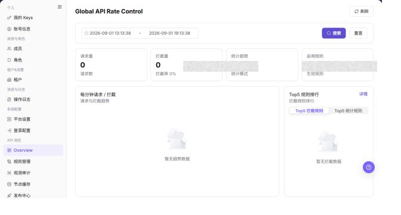

# 概览

## 功能概述

| 项目 | 内容 |
| --- | --- |
| 适用角色 | 运营管理员 |
| 导航路径 | 设置 > API 流控 > API 流控概览 |
| 页面路由 | `/user/system/rate-control/overview` |
| 管理对象 | 全局请求量、拦截请求、统计超限、启用规则和节点状态 |

#### 新手理解

Overview像流量仪表盘，用来先看请求是否突然变多、拦截是否异常升高、哪些规则被频繁命中，再决定要去规则管理、节点缓存还是观测审计继续排查。

#### 术语速查

| 术语 | 英文 | 说明 |
| --- | --- | --- |
| 请求量 | Term | 统计时间范围内进入网关或频控链路的 API 请求数。；异常升高时先确认业务峰值和时间范围。 |
| 拦截请求 | Term | 被流控规则拦截的请求数。；升高时进入 Top 规则排行定位命中规则。 |
| 统计超限 | Term | 请求超过规则阈值后的统计结果。；对照规则阈值、租户和模型范围排查。 |
| 启用规则 | Term | 当前生效的流控规则数量。；数量异常时进入规则管理核对发布状态。 |
| Top5 规则排行 | Term | 命中次数靠前的规则列表。；先处理命中高且影响范围大的规则。 |

## 前提条件

1. 当前账号具备 API 流控查看权限。
2. 已进入 `API 流控 > Overview`。
3. 查询前已选择合适的时间范围。

## 页面说明

下图展示 API 流控概览 页面，统计明细已做脱敏处理。

| 区域 | 说明 |
| --- | --- |
| 刷新 | 刷新当前统计数据。 |
| 开始时间 / 结束时间 | 设置统计时间范围。 |
| 搜索 / 重置 | 查询或清空筛选条件。 |
| 请求 / 拦截指标 | 展示请求量、拦截请求和统计超限。 |
| 启用规则 | 展示当前启用规则数量。 |
| 每分钟请求 / 拦截 | 展示请求与拦截趋势。 |
| Top5 规则排行 | 展示命中较高的规则。 |
| 详情 | 查看规则排行详情。 |

截图保留左侧导航和完整功能区，顶部菜单已隐藏；请重点查看概览页面的字段、按钮和操作位置。

## 主要操作

### 查看流控概览

1. 进入 `设置 > API 流控 > Overview`，选择目标时间范围。
2. 查看请求量、拦截量、启用规则、节点状态和趋势。
3. 对比当前周期与上一周期，识别突增、持续拦截或节点异常。
4. 指标为空时检查时间范围和数据刷新时间；不要把未完成聚合的实时数据作为最终结论。

截图保留左侧导航和完整功能区，顶部菜单已隐藏；请重点查看概览页面的字段、按钮和操作位置。

**结果校验：** 列表、详情和状态字段能够显示目标对象，且信息相互一致。

**注意事项：** 只使用当前页面实际展示的字段和入口，不根据其他角色页面推断能力。

**常见问题：** 如果入口不可见、按钮置灰或结果未更新，先检查当前账号权限、筛选条件、对象状态和页面刷新时间。

### 查看流控详情

1. 点击异常指标或相关入口，进入规则管理或观测审计。
2. 保持相同时间范围，核对命中规则、节点和拦截原因。
3. 成功时应能从概览追溯到具体规则或事件；无法对应时检查版本和发布时间。
4. 只读核验不修改规则、不发布版本。

截图保留左侧导航和完整功能区，顶部菜单已隐藏；请重点查看概览页面的字段、按钮和操作位置。

**结果校验：** 列表、详情和状态字段能够显示目标对象，且信息相互一致。

**注意事项：** 只使用当前页面实际展示的字段和入口，不根据其他角色页面推断能力。

**常见问题：** 如果入口不可见、按钮置灰或结果未更新，先检查当前账号权限、筛选条件、对象状态和页面刷新时间。

## 参数速查表

| 字段名称 | 是否必填 | 字段类型 | 示例 | 说明 |
| --- | --- | --- | --- | --- |
| 时间范围 | 否 | 日期时间 | 2026-07-13 09:00 至 10:00 | 统计 API 请求、拦截和命中数据的时间窗口。 |
| 接口 | 否 | 文本 | <ENDPOINT_PATH> | 按接口或 API 路径筛选概览数据，文档中必须脱敏。 |
| 规则 | 否 | 文本 | 示例规则 | 按流控规则筛选命中或拦截数据。 |
| 请求量 | 系统生成 | 数字 | 12,000 | 当前时间范围内的请求总量。 |
| 拦截量 | 系统生成 | 数字 | 320 | 被流控规则拦截的请求数量。 |
| 命中次数 | 系统生成 | 数字 | 800 | 规则被命中的次数。 |
| 结果状态 | 否 | 枚举 | 拦截 | 按请求结果或处理状态筛选数据。 |
| 趋势图 | 系统生成 | 图表 | 每分钟请求趋势 | 展示请求、拦截或命中随时间变化的趋势。 |
| 搜索 | 操作按钮 | 按钮 | 搜索 | 按当前筛选条件刷新概览数据。 |
| 重置 | 操作按钮 | 按钮 | 重置 | 恢复默认筛选条件。 |

## 踩坑提示

- 不要只看总请求量，拦截请求、统计超限和 Top 规则排行要一起看，否则容易误判为正常流量增长。
- 时间范围太短可能看不到趋势，时间范围太长可能掩盖峰值；排查突增时先围绕异常发生时间缩小窗口。
- 拦截升高不一定是规则错误，也可能是业务流量突增、调用方重试或某个租户触发阈值。
- 截图和工单中不要暴露租户名称、账号、Key、token、AK/SK、内部地址或真实请求明细。
- API 流控概览可能暴露接口路径、调用趋势、异常请求、规则命中和内部容量信息。
- 概览页用于观察和排查，不应替代规则配置页做发布、禁用或删除决策。
- 不在文档中写真实接口路径、Token、租户 ID、账号、客户名、内部错误详情或压测参数。
- 如果页面提供导出或跳转到规则配置的入口，导出、发布、禁用、删除属于高风险动作。

## 结果校验

| 检查项 | 成功表现 | 异常时处理 |
| --- | --- | --- |
| 指标展示 | 请求、拦截和规则指标正常显示。 | 调整时间范围后重新查询。 |
| 趋势可见 | 每分钟请求和拦截趋势正常展示。 | 刷新页面或检查数据源状态。 |
| 排行可见 | Top 规则排行正常展示。 | 进入观测审计查看明细。 |
| 筛选重置 | 点击 **"重置"** 后筛选条件恢复默认。 | 刷新页面后重新选择查询条件。 |

## 常见问题

#### 拦截请求突然升高

**问题现象：**

Overview 中拦截请求或统计超限明显上升。

**可能原因：**

某些 API 访问量突增，或流控规则阈值过低。

**处理方式：**

查看 Top 规则排行，再进入观测审计核对 API、规则和节点信息。

#### 为什么看不到频控概览数据？

**问题现象：**

API 频率控制概览页没有展示规则数量、命中统计或节点状态。

**可能原因：**

频控组件未启用，规则尚未发布，统计窗口没有命中数据，或节点缓存未上报。

**处理方式：**

确认频控组件和规则发布状态；切换统计时间范围；再到节点缓存和观测审计页面核对上报与命中记录。
#### 为什么频控概览操作入口不可用？

**问题现象：**

概览数据可见，但跳转规则、刷新统计或处理异常的入口不可点击。

**可能原因：**

当前账号缺少 API 频控管理权限，频控组件未启用，或统计任务正在刷新。

**处理方式：**

确认频控模块权限和组件状态；等待统计刷新完成后再操作，规则变更到规则管理页处理。

#### 如何安全导出或截图概览页面？

**问题现象：**

需要把页面信息用于排障、审计或交付。

**可能原因：**

页面可能包含账号、邮箱、IP、内部路径、租户标识、Key 或金额等敏感信息。

**处理方式：**

只保留必要字段和操作上下文，使用浅灰小颗粒马赛克覆盖敏感文字，不外发完整凭证或内部地址。

#### 概览页面出现异常数据怎么办？

**问题现象：**

字段、状态、统计或关联对象与预期不一致。

**可能原因：**

页面范围、时间条件、角色权限或上游配置不一致。

**处理方式：**

记录脱敏后的对象、时间和结果，先核对页面入口及筛选条件，再查看关联页面和操作日志。

## 注意事项

- Overview 用于观察趋势，不替代规则配置和审计明细。
- 异常拦截升高时，不要直接关闭规则，应先确认业务影响。
- 不在文档中写真实接口路径、Token、租户 ID、账号、客户名、内部错误详情或压测参数。
- 如果页面提供导出或跳转到规则配置的入口，导出、发布、禁用、删除属于高风险动作。

## 后续操作

1. 需要调整规则，进入 [规则管理](../rule-management/)。
2. 需要查看拦截或审计明细，进入 [观测审计](../observability-audit/)。

### 保留的既有截图

