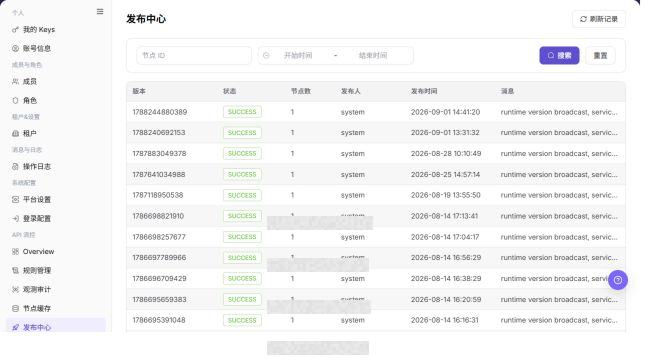

# 发布中心

## 功能概述

| 项目 | 内容 |
| --- | --- |
| 适用角色 | 运营管理员 |
| 导航路径 | 设置 > API 流控 > 发布中心 |
| 页面路由 | `/user/system/rate-control/publish` |
| 管理对象 | API 流控规则版本、发布记录、节点数、发布人和发布时间 |

#### 新手理解

发布中心页像 API 流控的发布结果看板，用来确认规则是否成功发布到节点，以及失败节点和失败原因。

#### 术语速查

| 术语 | 英文 | 说明 |
| --- | --- | --- |
| 发布记录 | Term | 规则发布任务的执行记录。；排查生效问题时查看。 |
| 发布状态 | Term | 发布成功、失败或进行中的状态。；失败时看原因。 |
| 目标节点 | Term | 本次发布影响的节点范围。；确认是否全量覆盖。 |
| 失败原因 | Term | 发布未成功的错误说明。；结合节点缓存排查。 |

## 前提条件

1. 当前账号具备查看 API 流控发布记录的权限。
2. 已进入 `API 流控 > 发布中心`。
3. 排查发布问题时，已记录规则发布的大致时间和目标节点。

## 页面说明

下图展示发布中心页面，版本、节点和消息明细已做脱敏处理。

| 区域 | 说明 |
| --- | --- |
| 刷新记录 | 刷新发布记录。 |
| 节点 ID | 按节点筛选发布记录。 |
| 开始时间 / 结束时间 | 按时间范围筛选发布记录。 |
| 发布记录表格 | 展示版本、状态、节点数、发布人、发布时间和消息。 |

截图保留左侧导航和完整功能区，顶部菜单已隐藏；请重点查看发布中心页面的字段、按钮和操作位置。

## 主要操作

### 查看发布记录

1. 进入 `设置 > API 流控 > 发布中心`，按版本、状态、发布人或时间筛选。
2. 核对版本号、规则数量、目标节点、发布时间和发布状态。
3. 无结果时重置筛选；状态长时间处理中时刷新一次并检查节点缓存。
4. 发布记录涉及在线流量治理，截图和转发前隐藏内部节点与规则信息。

截图保留左侧导航和完整功能区，顶部菜单已隐藏；请重点查看发布中心页面的字段、按钮和操作位置。

**结果校验：** 按页面成功提示，并回到列表或详情核对对象状态、更新时间和影响范围。

**注意事项：** 提交前再次核对目标对象和影响范围；涉及权限、状态、数据或外部配置时，先确认审批和回退方式。

**常见问题：** 如果入口不可见、按钮置灰或结果未更新，先检查当前账号权限、筛选条件、对象状态和页面刷新时间。

### 查看发布版本详情

1. 点击目标版本的 **"详情"** 或差异入口。
2. 对比新增、修改、删除的规则以及目标节点。
3. 核对发布中心状态与节点缓存版本；不一致时先记录差异，不重新发布。
4. 只读核验不点击发布、回滚或强制同步。

截图保留左侧导航和完整功能区，顶部菜单已隐藏；请重点查看发布中心页面的字段、按钮和操作位置。

**结果校验：** 按页面成功提示，并回到列表或详情核对对象状态、更新时间和影响范围。

**注意事项：** 提交前再次核对目标对象和影响范围；涉及权限、状态、数据或外部配置时，先确认审批和回退方式。

**常见问题：** 如果入口不可见、按钮置灰或结果未更新，先检查当前账号权限、筛选条件、对象状态和页面刷新时间。

### 刷新发布记录

1. 进入 `设置 > API 流控 > 发布中心`。
2. 定位目标发布中心，点击 **"刷新记录"**。
3. 按页面显示的必填字段完成查看或填写，并核对目标对象、影响范围和当前状态。
4. 对会改变数据、权限、状态或外部配置的操作，确认影响范围和回退方式后再点击最终确认按钮。
5. 操作完成后返回列表或详情页，核对状态、更新时间或结果提示。

截图保留左侧导航和完整功能区，顶部菜单已隐藏；请重点查看发布中心页面的字段、按钮和操作位置。

**结果校验：** 按页面成功提示，并回到列表或详情核对对象状态、更新时间和影响范围。

**注意事项：** 提交前再次核对目标对象和影响范围；涉及权限、状态、数据或外部配置时，先确认审批和回退方式。

**常见问题：** 如果入口不可见、按钮置灰或结果未更新，先检查当前账号权限、筛选条件、对象状态和页面刷新时间。

## 参数速查表

| 字段名称 | 是否必填 | 字段类型 | 示例 | 说明 |
| --- | --- | --- | --- | --- |
| 节点 ID | 否 | 文本 | `<node_id>` | 按节点筛选发布记录。 |
| 开始时间 | 否 | 时间 | `开始时间` | 设置发布记录查询开始时间。 |
| 结束时间 | 否 | 时间 | `结束时间` | 设置发布记录查询结束时间。 |
| 发布批次 | 否 | 文本 | `<publish_batch>` | 用于定位一次发布。 |
| 规则版本 | 否 | 版本 | `<rule_version>` | 本次发布的规则版本。 |
| 发布状态 | 否 | 枚举 | `成功` | 展示发布结果。 |
| 节点数 | 系统生成 | 数值 | `10` | 展示本次发布涉及的节点数量。 |
| 发布人 | 系统生成 | 文本 | `<publisher>` | 展示发起发布的账号或角色。 |
| 发布时间 | 系统生成 | 时间 | `发布时间` | 展示发布任务创建或完成时间。 |
| 消息 | 系统生成 | 文本 | `发布成功` | 展示发布结果、失败原因或内部提示。 |
| 刷新记录 | 否 | 按钮 | `刷新记录` | 重新获取最新发布记录。 |

## 踩坑提示

- 发布中心记录可能包含规则版本、节点、发布人、发布时间、失败原因和内部运行信息。
- `发布`、`发布全部`、`回滚`、`取消`、`删除` 属于高风险动作。
- 发布失败时不要反复发布，应先核对失败节点、消息字段、节点缓存和规则版本。
- 不在文档中写真实节点 ID、内部 IP、接口路径、Token、租户 ID、客户名、发布批次、内部错误详情或压测参数。

## 结果校验

| 检查项 | 成功表现 | 异常时处理 |
| --- | --- | --- |
| 发布记录 | 可看到目标时间范围内的发布记录。 | 扩大时间范围后重新查询。 |
| 状态正常 | 发布状态显示成功或符合预期。 | 查看消息字段并进入节点缓存核对。 |
| 节点数正确 | 节点数与预期节点范围一致。 | 检查发布目标节点。 |
| 版本一致 | 发布记录中的规则版本与规则管理页面一致。 | 返回规则管理核对版本。 |

## 常见问题

#### 发布记录状态异常

**问题现象：**

发布中心中目标版本状态不符合预期。

**可能原因：**

规则发布未同步到全部节点，或节点响应异常。

**处理方式：**

查看消息字段，再进入节点缓存核对节点状态和规则版本。

#### 发布中心为什么没有目标策略？

**问题现象：**

发布中心没有看到待发布、已发布或回滚中的频控策略。

**可能原因：**

规则尚未提交发布，策略归属其他环境，或当前筛选只显示某一种发布状态。

**处理方式：**

清空状态和环境筛选；回到规则管理确认规则是否已提交发布；仍缺失时检查发布任务和审批状态。

#### 为什么发布、回滚或取消按钮不可用？

**问题现象：**

发布任务可见，但发布、回滚、取消或查看差异按钮不可点击。

**可能原因：**

当前账号没有发布权限，任务状态不允许操作，或发布动作需要审批完成后才能执行。

**处理方式：**

确认任务状态和审批状态；发布、回滚前核对影响范围，由具备发布权限的管理员处理。

#### 如何安全导出或截图发布中心页面？

**问题现象：**

需要把页面信息用于排障、审计或交付。

**可能原因：**

页面可能包含账号、邮箱、IP、内部路径、租户标识、Key 或金额等敏感信息。

**处理方式：**

只保留必要字段和操作上下文，使用浅灰小颗粒马赛克覆盖敏感文字，不外发完整凭证或内部地址。

#### 发布中心页面出现异常数据怎么办？

**问题现象：**

字段、状态、统计或关联对象与预期不一致。

**可能原因：**

页面范围、时间条件、角色权限或上游配置不一致。

**处理方式：**

记录脱敏后的对象、时间和结果，先核对页面入口及筛选条件，再查看关联页面和操作日志。

## 注意事项

- 发布记录像规则生效问题的追踪单。
- 发布中心记录可能包含规则版本、节点、发布人、发布时间、失败原因和内部运行信息。
- `发布 / Publish`、`发布全部 / Publish All`、`回滚 / Rollback`、`取消 / Cancel`、`删除 / Delete` 属于高风险动作。
- 发布失败时不要反复发布，应先核对失败节点、消息字段、节点缓存和规则版本。
- 不在文档中写真实节点 ID、内部 IP、接口路径、Token、租户 ID、客户名、发布批次、内部错误详情或压测参数。

## 后续操作

1. 查看节点同步情况，进入 [节点缓存](../node-cache/)。
2. 查看规则配置，进入 [规则管理](../rule-management/)。

### 保留的既有截图

