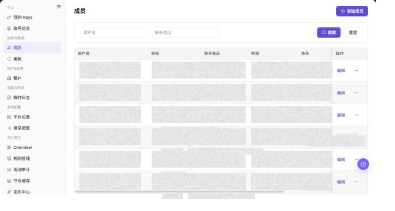

# 成员

## 功能概述

| 项目 | 内容 |
| --- | --- |
| 适用角色 | 运营管理员 |
| 导航路径 | 设置 > 成员与角色 > 成员 |
| 页面路由 | `/user/user-space/team-members` |
| 管理对象 | 成员、角色、状态和联系方式 |

#### 新手理解

运营侧成员像平台后台的值班名单，用来管理谁可以进入运营控制台、处理配置、审批、审计和平台级任务。它不等同于用户租户里的成员。

#### 术语速查

| 术语 | 英文 | 说明 |
| --- | --- | --- |
| 运营成员 | Operator member | 具备平台管理入口的成员。；按职责授予角色。 |
| 平台角色 | Platform role | 控制成员可管理的运营模块。；避免授予过大权限。 |
| 成员状态 | Member status | 成员是否启用、停用或待激活。；登录失败先看状态。 |
| 管理范围 | Management scope | 成员可查看的租户或系统配置范围。；排障时确认范围。 |

## 前提条件

1. 当前账号具备成员管理权限。
2. 已进入 `成员与角色 > 成员`。
3. 操作成员前已确认人员身份、角色范围和变更原因。

## 页面说明

下图展示成员页面，成员联系方式和邮箱已做脱敏处理。

| 区域 | 说明 |
| --- | --- |
| 用户名 | 按用户名筛选成员。 |
| 联系电话 | 按联系电话筛选成员。 |
| 添加成员 | 新增成员入口。 |
| 成员表格 | 展示用户名、姓名、联系电话、邮箱、角色、状态、创建时间和操作。 |

截图保留左侧导航和完整功能区，顶部菜单已隐藏；请重点查看成员页面的字段、按钮和操作位置。

## 主要操作

### 查看成员

1. 进入 `设置 > 成员与角色 > 成员`。
2. 按姓名、用户名、邮箱、角色或状态筛选成员。
3. 打开成员详情，核对所属租户、角色、状态和最近更新时间。
4. 无结果时重置筛选并确认租户上下文；展示个人信息时避免截图或外发。

截图保留左侧导航和完整功能区，顶部菜单已隐藏；请重点查看成员页面的字段、按钮和操作位置。

**结果校验：** 列表、详情和状态字段能够显示目标对象，且信息相互一致。

**注意事项：** 只使用当前页面实际展示的字段和入口，不根据其他角色页面推断能力。

**常见问题：** 如果入口不可见、按钮置灰或结果未更新，先检查当前账号权限、筛选条件、对象状态和页面刷新时间。

### 添加成员

1. 进入 `设置 > 成员与角色 > 成员`。
2. 点击页面右上角的 `添加成员`。
3. 在弹出的 `添加成员` 窗口中查看新增成员字段。

4. 填写 `用户名`、`姓名`、`邮箱`、`密码` 和 `确认密码`。
5. 根据实际需要填写 `联系电话`，选择国家或地区代码并输入手机号。
6. 在 `角色` 下拉框中选择成员角色。
7. 在 `状态` 中选择 `启用` 或 `禁用`。
8. 点击最终 `确定` 前，确认成员身份、角色权限和启用状态符合授权范围。
9. 如仅学习或截图，查看字段后点击 **"取消"** 关闭窗口，不提交真实成员配置。

**结果校验：** 按页面成功提示，并回到列表或详情核对对象状态、更新时间和影响范围。

**注意事项：** 提交前再次核对目标对象和影响范围；涉及权限、状态、数据或外部配置时，先确认审批和回退方式。

**常见问题：** 如果入口不可见、按钮置灰或结果未更新，先检查当前账号权限、筛选条件、对象状态和页面刷新时间。

### 编辑成员

1. 进入 `设置 > 成员与角色 > 成员`。
2. 定位目标成员，点击 **"编辑"**。
3. 按页面显示的必填字段完成查看或填写，并核对目标对象、影响范围和当前状态。
4. 对会改变数据、权限、状态或外部配置的操作，确认影响范围和回退方式后再点击最终确认按钮。
5. 操作完成后返回列表或详情页，核对状态、更新时间或结果提示。

截图保留左侧导航和完整功能区，顶部菜单已隐藏；请重点查看成员页面的字段、按钮和操作位置。

**结果校验：** 按页面成功提示，并回到列表或详情核对对象状态、更新时间和影响范围。

**注意事项：** 提交前再次核对目标对象和影响范围；涉及权限、状态、数据或外部配置时，先确认审批和回退方式。

**常见问题：** 如果入口不可见、按钮置灰或结果未更新，先检查当前账号权限、筛选条件、对象状态和页面刷新时间。

## 参数速查表

| 字段名称 | 是否必填 | 字段类型 | 示例 | 说明 |
| --- | --- | --- | --- | --- |
| 用户名 | 是 | 文本 | ops-user | 运营成员登录用户名。 |
| 姓名 | 是 | 文本 | 示例成员 | 成员在页面中的显示姓名。 |
| 联系电话 | 否 | 文本 | 188****8888 | 成员联系方式，可包含国家或地区代码。 |
| 邮箱 | 是 | 文本 | user@example.com | 成员邮箱地址。 |
| 密码 | 是 | 密码 | ****** | 成员初始登录密码。 |
| 确认密码 | 是 | 密码 | ****** | 再次输入密码，用于确认两次密码一致。 |
| 角色 | 是 | 下拉框 | 审计管理员 | 控制成员的运营侧权限范围。 |
| 状态 | 是 | 枚举 | 启用 | 判断成员是否可登录和操作。 |
| 操作 | 系统生成 | 按钮 | 编辑 / 重置密码 / 删除 | 提供成员后续管理入口。 |

## 踩坑提示

- 运营成员权限影响平台级配置，不要按用户侧租户角色来判断。
- 停用成员前确认是否有待处理审批、巡检任务或自动化交接。
- 新增成员后应到角色和操作日志中核对权限是否按预期生效。
- 添加成员会创建真实运营侧账号，可能影响平台管理权限。
- `确定` 属于最终提交动作，学习或截图时只查看弹窗字段并使用 `取消` 退出。
- 角色选择错误可能导致权限过大或无法完成运营任务。
- 不在文档中写真实手机号、邮箱、用户名、用户 ID、密码、客户名或内部测试数据。

## 结果校验

| 检查项 | 成功表现 | 异常时处理 |
| --- | --- | --- |
| 筛选生效 | 列表按用户名或联系电话刷新。 | 清空条件后重新搜索。 |
| 状态可见 | 成员状态开关正常展示。 | 检查当前账号权限。 |
| 操作入口 | 编辑、重置密码、删除入口按权限展示。 | 联系管理员核对角色授权。 |
| 添加窗口 | 点击 **"添加成员"** 后可打开同名窗口。 | 检查当前账号是否具备成员创建权限。 |
| 取消退出 | 点击 **"取消"** 后窗口关闭且未提交成员配置。 | 刷新页面并确认成员列表未新增测试数据。 |

## 常见问题

#### 成员无法登录

**问题现象：**

成员反馈无法进入平台。

**可能原因：**

成员状态被停用、密码已被重置但未同步，或角色授权不足。

**处理方式：**

核对成员状态、角色和密码重置记录，再按组织流程恢复访问。

#### 删除成员前需要检查什么

**问题现象：**

列表中存在 `删除` 操作入口。

**可能原因：**

该成员可能仍关联业务操作、Key 或审批记录。

**处理方式：**

先确认成员是否仍承担业务职责，再按页面提示继续处理。

#### 运营侧成员为什么为空？

**问题现象：**

运营侧成员页没有显示管理员或运营成员。

**可能原因：**

当前账号不在平台管理租户，成员属于用户侧租户，或角色范围限制了成员列表。

**处理方式：**

确认当前为运营侧入口；检查平台租户和管理员角色；必要时由超级管理员补充运营成员授权。

#### 如何安全导出或截图成员页面？

**问题现象：**

需要把页面信息用于排障、审计或交付。

**可能原因：**

页面可能包含账号、邮箱、IP、内部路径、租户标识、Key 或金额等敏感信息。

**处理方式：**

只保留必要字段和操作上下文，使用浅灰小颗粒马赛克覆盖敏感文字，不外发完整凭证或内部地址。

#### 成员页面出现异常数据怎么办？

**问题现象：**

字段、状态、统计或关联对象与预期不一致。

**可能原因：**

页面范围、时间条件、角色权限或上游配置不一致。

**处理方式：**

记录脱敏后的对象、时间和结果，先核对页面入口及筛选条件，再查看关联页面和操作日志。

## 注意事项

- 不要在文档和截图中暴露成员手机号、邮箱或账号标识。
- 重置密码、删除成员和状态切换会影响成员访问，应先完成复核。
- `确定` 属于最终提交动作，添加成员前必须确认成员身份、角色权限和启用状态。
- 学习或截图时只打开弹窗查看字段，使用 `取消` 退出。
- 不在文档中写真实手机号、邮箱、用户名、用户 ID、密码、客户名或内部测试数据。

## 后续操作

1. 需要调整角色权限，进入 [角色](../roles/)。
2. 需要查看成员操作记录，进入 [操作日志](../../activity-notifications/operation-logs/)。
