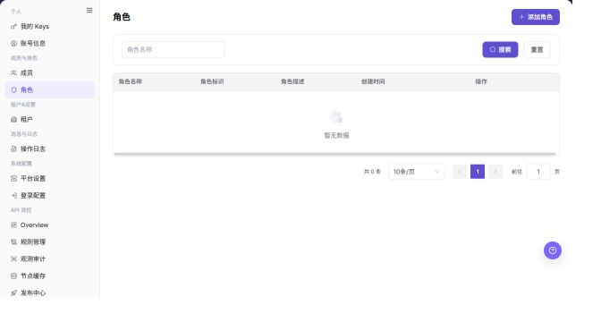

# 角色

## 功能概述

| 项目 | 内容 |
| --- | --- |
| 适用角色 | 运营管理员 |
| 导航路径 | 设置 > 成员与角色 > 角色 |
| 页面路由 | `/user/user-space/roles` |
| 管理对象 | 角色名称、角色标识、权限范围和创建时间 |

#### 新手理解

运营侧角色像平台后台的权限模板，用来定义管理员能看哪些系统模块、能改哪些配置、能处理哪些审批。它关注平台治理边界，不是项目内协作角色。

#### 术语速查

| 术语 | 英文 | 说明 |
| --- | --- | --- |
| 平台角色 | Platform role | 运营管理员权限集合。；按职责拆分。 |
| 权限点 | Term | 菜单、按钮或接口级控制项。；修改前确认影响范围。 |
| 内置角色 | Term | 系统预置且通常不可删除的角色。；只做查看或复制参考。 |
| 成员绑定 | Term | 角色已分配给哪些运营成员。；删除前先解绑。 |

## 前提条件

1. 当前账号具备角色管理权限。
2. 已进入 `成员与角色 > 角色`。
3. 授权或删除角色前已确认影响成员范围。

## 页面说明

下图展示角色页面，角色明细已做脱敏处理。

| 区域 | 说明 |
| --- | --- |
| 角色名称 | 按角色名称筛选角色。 |
| 添加角色 | 新增角色入口。 |
| 角色表格 | 展示角色名称、角色标识、角色描述、创建时间和操作。 |

截图保留左侧导航和完整功能区，顶部菜单已隐藏；请重点查看角色页面的字段、按钮和操作位置。

## 主要操作

### 查看角色

1. 进入 `设置 > 成员与角色 > 角色`。
2. 按角色名称、状态或更新时间筛选。
3. 打开详情，核对菜单、按钮和 API 权限以及已关联成员。
4. 无结果时重置筛选；权限异常时确认成员是否关联了多个角色。

截图保留左侧导航和完整功能区，顶部菜单已隐藏；请重点查看角色页面的字段、按钮和操作位置。

**结果校验：** 列表、详情和状态字段能够显示目标对象，且信息相互一致。

**注意事项：** 只使用当前页面实际展示的字段和入口，不根据其他角色页面推断能力。

**常见问题：** 如果入口不可见、按钮置灰或结果未更新，先检查当前账号权限、筛选条件、对象状态和页面刷新时间。

### 添加角色

1. 进入 `设置 > 成员与角色 > 角色`。
2. 点击页面右上角的 `添加角色`。
3. 在弹出的 `添加角色` 窗口中查看新增角色字段。

4. 填写 `角色名称`。
5. 填写必填的 `角色标识`，建议使用稳定、可读、便于审计的英文小写标识。
6. 根据实际用途填写 `角色描述`。
7. 点击最终 `确定` 前，确认角色命名、角色标识和后续授权范围符合最小权限原则。
8. 如仅学习或截图，查看字段后点击 **"取消"** 关闭窗口，不提交真实角色配置。

**结果校验：** 按页面成功提示，并回到列表或详情核对对象状态、更新时间和影响范围。

**注意事项：** 提交前再次核对目标对象和影响范围；涉及权限、状态、数据或外部配置时，先确认审批和回退方式。

**常见问题：** 如果入口不可见、按钮置灰或结果未更新，先检查当前账号权限、筛选条件、对象状态和页面刷新时间。

### 编辑角色

1. 进入 `设置 > 成员与角色 > 角色`。
2. 定位目标角色，点击 **"编辑"**。
3. 按页面显示的必填字段完成查看或填写，并核对目标对象、影响范围和当前状态。
4. 对会改变数据、权限、状态或外部配置的操作，确认影响范围和回退方式后再点击最终确认按钮。
5. 操作完成后返回列表或详情页，核对状态、更新时间或结果提示。

截图保留左侧导航和完整功能区，顶部菜单已隐藏；请重点查看角色页面的字段、按钮和操作位置。

**结果校验：** 按页面成功提示，并回到列表或详情核对对象状态、更新时间和影响范围。

**注意事项：** 提交前再次核对目标对象和影响范围；涉及权限、状态、数据或外部配置时，先确认审批和回退方式。

**常见问题：** 如果入口不可见、按钮置灰或结果未更新，先检查当前账号权限、筛选条件、对象状态和页面刷新时间。

### 授权角色

1. 进入 `设置 > 成员与角色 > 角色`。
2. 定位目标角色，点击 **"授权"**。
3. 按页面显示的必填字段完成查看或填写，并核对目标对象、影响范围和当前状态。
4. 对会改变数据、权限、状态或外部配置的操作，确认影响范围和回退方式后再点击最终确认按钮。
5. 操作完成后返回列表或详情页，核对状态、更新时间或结果提示。

截图保留左侧导航和完整功能区，顶部菜单已隐藏；请重点查看角色页面的字段、按钮和操作位置。

**结果校验：** 按页面成功提示，并回到列表或详情核对对象状态、更新时间和影响范围。

**注意事项：** 提交前再次核对目标对象和影响范围；涉及权限、状态、数据或外部配置时，先确认审批和回退方式。

**常见问题：** 如果入口不可见、按钮置灰或结果未更新，先检查当前账号权限、筛选条件、对象状态和页面刷新时间。

### 删除角色

1. 进入 `设置 > 成员与角色 > 角色`。
2. 定位目标角色，点击 **"删除"**。
3. 按页面显示的必填字段完成查看或填写，并核对目标对象、影响范围和当前状态。
4. 对会改变数据、权限、状态或外部配置的操作，确认影响范围和回退方式后再点击最终确认按钮。
5. 操作完成后返回列表或详情页，核对状态、更新时间或结果提示。

截图保留左侧导航和完整功能区，顶部菜单已隐藏；请重点查看角色页面的字段、按钮和操作位置。

**结果校验：** 按页面成功提示，并回到列表或详情核对对象状态、更新时间和影响范围。

**注意事项：** 提交前再次核对目标对象和影响范围；涉及权限、状态、数据或外部配置时，先确认审批和回退方式。

**常见问题：** 如果入口不可见、按钮置灰或结果未更新，先检查当前账号权限、筛选条件、对象状态和页面刷新时间。

## 参数速查表

| 字段名称 | 是否必填 | 字段类型 | 示例 | 说明 |
| --- | --- | --- | --- | --- |
| 角色名称 | 是 | 文本 | 审计管理员 | 运营角色展示名称。 |
| 角色标识 | 是 | 文本 | audit_admin | 角色唯一标识，建议稳定、可读、便于审计。 |
| 角色描述 | 否 | 文本 | 查看审计日志和基础运营信息 | 说明角色用途和授权边界。 |
| 权限点 | 是 | 多选 | 操作日志查看 | 控制角色可访问的菜单和操作。 |
| 成员数量 | 否 | 数字 | 3 | 展示当前绑定该角色的成员数。 |
| 角色状态 | 否 | 枚举 | 启用 | 控制角色是否可继续分配。 |
| 操作 | 系统生成 | 按钮 | 编辑 / 授权 / 删除 | 提供角色后续维护入口。 |

## 踩坑提示

- 不要直接修改高权限角色，先复制或新增低风险角色验证权限范围。
- 删除角色前必须确认没有运营成员仍绑定该角色。
- 权限点变更会影响平台级操作入口，建议记录变更原因和审批依据。
- 添加角色会创建新的平台权限模板，后续授权和成员绑定会影响平台管理权限。
- `确定` 属于最终提交动作，学习或截图时只查看弹窗字段并使用 `取消` 退出。
- `角色标识` 一旦被引用，后续修改可能影响权限识别、审计和自动化配置。
- 不写真实内部角色编码、账号、成员 ID、客户名或内部测试数据。

## 结果校验

| 检查项 | 成功表现 | 异常时处理 |
| --- | --- | --- |
| 角色筛选 | 列表按角色名称刷新。 | 检查名称是否准确。 |
| 授权入口 | 目标角色可进入授权入口。 | 检查当前账号角色管理权限。 |
| 删除入口 | 删除入口按权限展示。 | 删除前确认角色未被关键成员依赖。 |
| 添加窗口 | 点击 **"添加角色"** 后可打开同名窗口。 | 检查当前账号是否具备角色创建权限。 |
| 取消退出 | 点击 **"取消"** 后窗口关闭且未提交角色配置。 | 刷新页面并确认角色列表未新增测试数据。 |

## 常见问题

#### 成员看不到菜单

**问题现象：**

成员登录后看不到某个菜单或按钮。

**可能原因：**

成员绑定的角色未授予对应菜单或操作权限。

**处理方式：**

进入角色授权入口核对权限范围，再确认成员是否绑定正确角色。

#### 角色是否可以直接删除

**问题现象：**

角色列表中存在删除入口。

**可能原因：**

角色可能仍被成员使用，直接删除会影响访问能力。

**处理方式：**

先确认角色绑定成员，再按租户权限变更流程处理。

#### 运营侧角色列表为什么为空？

**问题现象：**

运营侧角色页没有平台管理员、审计员或配置管理员角色。

**可能原因：**

当前账号没有运营角色管理权限，角色归属其他管理租户，或系统角色不允许在列表中编辑。

**处理方式：**

确认当前入口为运营侧设置；检查角色管理权限；系统内置角色异常时联系超级管理员核查。

#### 如何安全导出或截图角色页面？

**问题现象：**

需要把页面信息用于排障、审计或交付。

**可能原因：**

页面可能包含账号、邮箱、IP、内部路径、租户标识、Key 或金额等敏感信息。

**处理方式：**

只保留必要字段和操作上下文，使用浅灰小颗粒马赛克覆盖敏感文字，不外发完整凭证或内部地址。

#### 角色页面出现异常数据怎么办？

**问题现象：**

字段、状态、统计或关联对象与预期不一致。

**可能原因：**

页面范围、时间条件、角色权限或上游配置不一致。

**处理方式：**

记录脱敏后的对象、时间和结果，先核对页面入口及筛选条件，再查看关联页面和操作日志。

## 注意事项

- 授权变更会影响菜单可见性和按钮可用性。
- 删除角色前应确认没有关键成员依赖该角色。
- `确定` 属于最终提交动作，添加角色前必须确认角色命名、角色标识和后续授权范围。
- `角色标识` 一旦被引用，后续修改可能影响权限识别、审计和自动化配置。
- 学习或截图时只打开弹窗查看字段，使用 `取消` 退出。
- 不写真实内部角色编码、账号、成员 ID、客户名或内部测试数据。

## 后续操作

1. 需要查看角色绑定成员，进入 [成员](../members/)。
2. 需要追踪权限变更，进入 [操作日志](../../activity-notifications/operation-logs/)。
