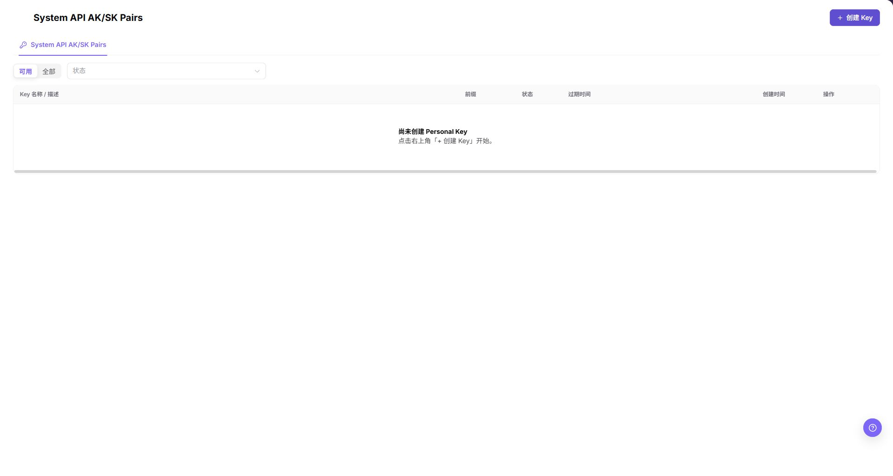
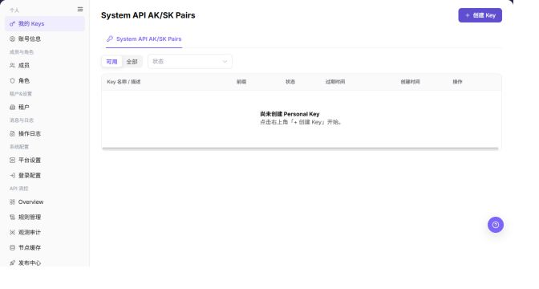

# 我的 Keys

## 功能概述

| 项目 | 内容 |
| --- | --- |
| 适用角色 | 运营管理员（Operator） |
| 导航路径 | 设置 > 个人 > 我的 Keys |
| 页面路由 | `/user/user-space/my-keys/system` |
| 管理对象 | System API AK/SK Pairs、状态、过期时间和创建记录 |

#### 新手理解

AK/SK 对是系统 API 调用凭据。它属于高敏感信息：创建前要明确调用方、用途和过期计划；生成后只能通过批准的安全渠道保存和交接，不能把完整 AK/SK 写入文档、截图或工单。

#### 术语速查

| 术语 | 英文 | 说明 |
| --- | --- | --- |
| System API AK/SK Pair | Term | 一组用于系统 API 的访问标识和密钥。；只用于已确认的系统集成场景。 |
| 前缀 | Term | 列表中显示的非敏感识别信息。；可用于识别凭据，不等同于完整密钥。 |
| 过期时间 | Term | AK/SK 对失效的时间点。；在自动化任务到期前安排轮换。 |
| 状态 | Status | 当前凭据是否可用的状态。；排查调用失败时先核对状态。 |

## 前提条件

1. 当前账号具备查看和创建系统凭据的权限。
2. 已从运营方菜单进入 `设置 > 个人 > 我的 Keys`。
3. 创建前已确认调用方、用途、过期计划和安全交接方式。

## 页面说明

当前运营方页面只展示 `System API AK/SK Pairs` 页签；本角色页面没有 `Model API Keys` 页签。

| 区域 | 说明 |
| --- | --- |
| 顶部按钮 | `创建 Key`，用于打开 System API AK/SK Pair 创建窗口。 |
| 页签 | `System API AK/SK Pairs` 是当前运营方可见的页签。 |
| 可用范围 | `Available` 和 `All` 用于切换列表范围。 |
| 状态筛选 | 按凭据状态筛选列表。 |
| 凭据列表 | 显示 Key 名称 / 描述、前缀、状态、过期时间、创建时间和操作。 |
| 空列表 | 没有凭据时显示 `尚未创建 Personal Key`，并提示点击右上角 `+ 创建 Key`。 |

截图保留左侧导航和完整功能区，顶部菜单已隐藏；请重点查看我的 Keys页面的字段、按钮和操作位置。

## 主要操作

### 查看 System API 密钥

1. 进入 `设置 > 个人 > 我的 Keys`。
2. 确认 `System API AK/SK Pairs` 页签处于选中状态。
3. 使用 `Available` 或 `All`，并按需选择 `Status` 筛选条件。
4. 查看 Key 名称 / 描述、前缀、状态、过期时间、创建时间和当前可用的行内操作。

截图保留左侧导航和完整功能区，顶部菜单已隐藏；请重点查看我的 Keys页面的字段、按钮和操作位置。

**结果校验：** 列表、详情和状态字段能够显示目标对象，且信息相互一致。

**注意事项：** 只使用当前页面实际展示的字段和入口，不根据其他角色页面推断能力。

**常见问题：** 如果入口不可见、按钮置灰或结果未更新，先检查当前账号权限、筛选条件、对象状态和页面刷新时间。

### 打开 System API 密钥创建窗口

1. 单击右上角 `创建 Key`。
2. 在创建窗口中查看必填的 `过期时间`、必填的 `Key 名称` 和可选的 `描述` 字段；`描述` 最长 200 个字符。
3. 单击最终 `创建` 前，确认用途、过期时间、调用方和安全交接方式。
4. 学习或截图时只查看字段，单击 **"取消"** 关闭窗口，不创建真实凭据。

**结果校验：** 按页面成功提示，并回到列表或详情核对对象状态、更新时间和影响范围。

**注意事项：** 提交前再次核对目标对象和影响范围；涉及权限、状态、数据或外部配置时，先确认审批和回退方式。

**常见问题：** 如果入口不可见、按钮置灰或结果未更新，先检查当前账号权限、筛选条件、对象状态和页面刷新时间。

## 参数速查表

| 字段名称 | 是否必填 | 字段类型 | 示例 | 说明 |
| --- | --- | --- | --- | --- |
| 过期时间 | 是 | 日期时间 | `2026-12-31 23:59` | 设置 System API AK/SK Pair 的失效时间。 |
| Key 名称 | 是 | 文本 | `Backend job credential` | 用于识别该凭据的用途。 |
| 描述 | 否 | 文本 | `Model service administration` | 可选的用途说明，最多 200 个字符。 |
| 前缀 | 系统生成 | 文本 | `<ACCESS_KEY_ID>` | 列表中的脱敏识别信息，不是完整凭据。 |
| 状态 | 系统生成 | 枚举 | `Enabled` | 表示凭据当前是否可用。 |
| 创建时间 | 系统生成 | 日期时间 | `2026-08-26` | 记录凭据创建时间。 |
| 操作 | 系统生成 | 按钮 / 菜单 | `View` | 打开该行可用的查看或后续操作入口。 |

## 踩坑提示

- 当前运营方页面没有 `Model API Keys` 页签，不要用该页面证明 Provider 或 End User 的 Model API Key 行为。
- 当前 Demo 的 System API 创建窗口只确认了过期时间、Key 名称和可选描述；不要补写权限范围、额度、重置周期或预警阈值等未在页面出现的字段。
- `创建` 是最终凭据生成动作。学习、截图或核查页面时停在 `取消`，不要提交真实凭据。
- 完整 AK/SK 只允许通过受控安全流程保存一次，不能写入文档、截图、工单或聊天。

## 结果校验

| 检查项 | 成功表现 | 异常时处理 |
| --- | --- | --- |
| 页面入口 | 可从 `设置 > 个人 > 我的 Keys` 打开页面。 | 检查当前账号角色和菜单权限。 |
| 页签 | 可看到 `System API AK/SK Pairs`。 | 不要把未显示的 Model API Keys 写入运营方手册。 |
| 列表字段 | 可看到名称 / 描述、前缀、状态、过期时间、创建时间和操作。 | 检查筛选条件或账号权限。 |
| 创建窗口 | 单击 **"创建 Key"** 后可看到过期时间、Key 名称和描述字段。 | 检查当前账号是否具备创建系统凭据的权限。 |

## 常见问题

#### 为什么看不到 Model API Keys？

**问题现象：**

运营方的我的 Keys 页面只显示 `System API AK/SK Pairs`。

**处理方式：**

这是当前运营方角色的实际页面边界。Provider 和 End User 的个人 Key 行为应在各自角色的页面中核对，不要从运营方页面推断。

#### 创建窗口没有权限范围或额度字段怎么办？

**问题现象：**

打开创建窗口后只看到过期时间、Key 名称和描述。

**处理方式：**

按当前 Demo 页面填写和核对；不要在手册中加入未显示的字段。若后续 Demo 增加字段，再同步更新本页和截图。

#### 我的 Keys变更后为什么没有更新？

**问题现象：**

操作完成后，列表或详情仍显示旧值。

**可能原因：**

缓存或同步存在延迟，操作未真正提交，或查看的不是同一个对象。

**处理方式：**

核对成功提示、对象标识和更新时间，刷新列表并重新打开详情；必要时到操作日志确认记录。

#### 如何安全导出或截图我的 Keys页面？

**问题现象：**

需要把页面信息用于排障、审计或交付。

**可能原因：**

页面可能包含账号、邮箱、IP、内部路径、租户标识、Key 或金额等敏感信息。

**处理方式：**

只保留必要字段和操作上下文，使用浅灰小颗粒马赛克覆盖敏感文字，不外发完整凭证或内部地址。

#### 我的 Keys页面出现异常数据怎么办？

**问题现象：**

字段、状态、统计或关联对象与预期不一致。

**可能原因：**

页面范围、时间条件、角色权限或上游配置不一致。

**处理方式：**

记录脱敏后的对象、时间和结果，先核对页面入口及筛选条件，再查看关联页面和操作日志。

## 注意事项

- 不要在文档、截图、工单或聊天中暴露完整 AK、SK、Key、Token、账号或内部标识。
- 截图只保留页面功能区域；不要保留真实凭据、账号或业务数据。
- `创建` 会生成真实系统凭据，属于最终高风险动作；本手册流程只验证表单，不执行提交。

## 后续操作

1. 通过批准的安全渠道保存和交接生成的 AK/SK。
2. 在调用方切换完成后，再按平台流程轮换或停用旧凭据。
3. 需要验证 Provider 或 End User 的个人 Key 时，切换到对应角色并从其可见菜单进入。
