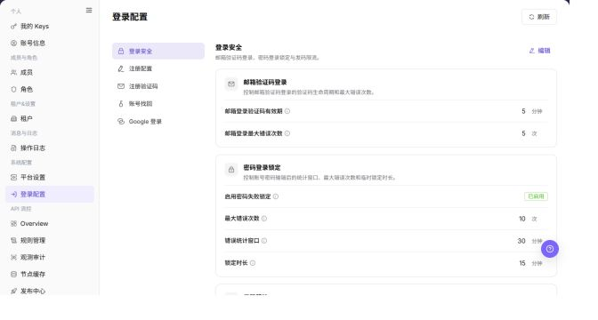
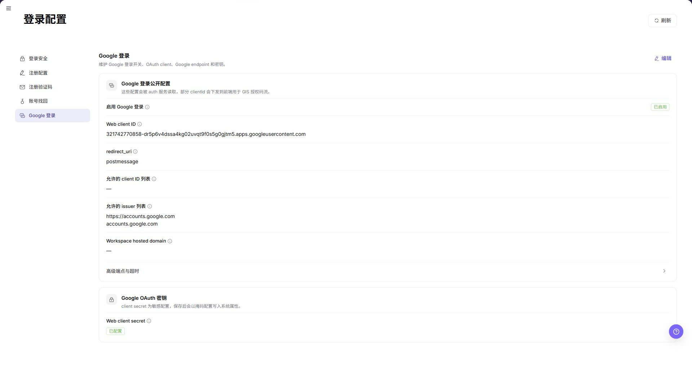

# 登录配置

## 功能概述

| 项目 | 内容 |
| --- | --- |
| 适用角色 | 运营管理员 |
| 导航路径 | 设置 > 系统配置 > 登录配置 |
| 页面路由 | `/user/system/login-properties` |
| 管理对象 | 登录安全、注册配置、注册验证码、账号找回、Google 登录和外部系统集成 |

#### 新手理解

登录配置页像平台入口门禁，用来维护验证码、账号找回、注册策略和第三方登录规则。改动前要确认会影响哪些登录方式和用户范围。

#### 术语速查

| 术语 | 英文 | 说明 |
| --- | --- | --- |
| 登录策略 | Term | 控制用户如何登录和验证身份的规则。；变更前确认影响范围。 |
| 验证码 | Term | 登录、注册或找回账号时使用的校验码。；收不到时查邮件/短信配置。 |
| 账号找回 | Term | 帮助用户恢复账号访问的流程。；开启前确认安全策略。 |
| 第三方登录 | Term | 如 Google 登录等外部身份入口。；变更后做登录验证。 |

## 前提条件

1. 当前账号具备登录配置管理权限。
2. 已进入 `系统设置 > 登录配置`。
3. 修改登录安全策略前已确认影响范围和通知计划。

## 页面说明

下图展示登录配置页面。

| 区域 | 说明 |
| --- | --- |
| 刷新 | 重新加载登录配置。 |
| 登录安全 | 配置邮箱验证码登录、密码登录锁定和发码限流。 |
| 注册配置 | 配置注册入口、默认角色、平台来源目录和外部系统集成。 |
| 注册验证码 | 配置注册相关验证码能力。 |
| 账号找回 | 配置账号找回能力。 |
| Google 登录 | 配置第三方登录能力。 |
| 编辑 | 修改当前配置分类。 |

截图保留左侧导航和完整功能区，顶部菜单已隐藏；请重点查看登录配置页面的字段、按钮和操作位置。

## 主要操作

### 查看登录安全配置

1. 进入 `设置 > 系统配置 > 登录配置`。
2. 点击或定位到 `登录安全`。
3. 查看密码策略、登录限制、会话有效期、MFA 或安全校验相关配置。

**结果校验：** 按页面成功提示，并回到列表或详情核对对象状态、更新时间和影响范围。

**注意事项：** 提交前再次核对目标对象和影响范围；涉及权限、状态、数据或外部配置时，先确认审批和回退方式。

**常见问题：** 如果入口不可见、按钮置灰或结果未更新，先检查当前账号权限、筛选条件、对象状态和页面刷新时间。

### 编辑注册配置

1. 进入 `设置 > 系统配置 > 登录配置`。
2. 选择 `注册配置`。
3. 查看各注册入口及其默认角色。
4. 编辑前确认每个默认角色属于 `DEFAULT` 应用。
5. 在 `平台来源目录` 中核对已启用的外部业务来源及其受控充值渠道。
6. 在 `外部系统集成` 中查看外部注册来源和备注。
7. 关闭总开关会同时停用依赖的注册路径。
8. 配置未正常加载时，先刷新页面，再打开编辑入口。
9. 未确认负责人和回滚方案前，不保存端点或凭据。

**结果校验：** 按页面成功提示，并回到列表或详情核对对象状态、更新时间和影响范围。

**注意事项：** 提交前再次核对目标对象和影响范围；涉及权限、状态、数据或外部配置时，先确认审批和回退方式。

**常见问题：** 如果入口不可见、按钮置灰或结果未更新，先检查当前账号权限、筛选条件、对象状态和页面刷新时间。

### 编辑注册验证码配置

1. 进入 `设置 > 系统配置 > 登录配置`。
2. 定位到 `注册验证码`。
3. 查看验证码类型、发送方式、有效期、频率限制和开关状态。

**结果校验：** 按页面成功提示，并回到列表或详情核对对象状态、更新时间和影响范围。

**注意事项：** 提交前再次核对目标对象和影响范围；涉及权限、状态、数据或外部配置时，先确认审批和回退方式。

**常见问题：** 如果入口不可见、按钮置灰或结果未更新，先检查当前账号权限、筛选条件、对象状态和页面刷新时间。

### 编辑账号找回配置

1. 进入 `设置 > 系统配置 > 登录配置`。
2. 定位到 `账号找回`。
3. 查看邮箱、手机号、验证码、身份校验和找回流程配置。

**结果校验：** 按页面成功提示，并回到列表或详情核对对象状态、更新时间和影响范围。

**注意事项：** 提交前再次核对目标对象和影响范围；涉及权限、状态、数据或外部配置时，先确认审批和回退方式。

**常见问题：** 如果入口不可见、按钮置灰或结果未更新，先检查当前账号权限、筛选条件、对象状态和页面刷新时间。

### 编辑 Google 登录配置

1. 进入 `设置 > 系统配置 > 登录配置`。
2. 定位到 `Google 登录`。
3. 查看 Client ID、回调地址、启用状态和登录入口配置。

**结果校验：** 按页面成功提示，并回到列表或详情核对对象状态、更新时间和影响范围。

**注意事项：** 提交前再次核对目标对象和影响范围；涉及权限、状态、数据或外部配置时，先确认审批和回退方式。

**常见问题：** 如果入口不可见、按钮置灰或结果未更新，先检查当前账号权限、筛选条件、对象状态和页面刷新时间。

## 参数速查表

| 字段名称 | 是否必填 | 字段类型 | 示例 | 说明 |
| --- | --- | --- | --- | --- |
| 配置分类 | 系统展示 | 文本 | 登录安全 | 登录配置中的配置分组。 |
| 配置项 | 系统展示 | 文本 | 验证码有效期 | 需要查看或维护的登录策略参数。 |
| 默认值 | 系统展示 | 文本 | 5 分钟 | 配置项的默认值或系统预置值。 |
| 当前值 | 系统展示 / 可编辑 | 文本 | 5 分钟 | 当前生效的配置值。 |
| 启用状态 | 系统展示 / 可编辑 | 枚举 | 启用 | 判断配置项或登录能力是否启用。 |
| 注册入口 | 系统展示 / 可编辑 | 文本 | 邮箱注册 | 标识注册路径及其入口编码。 |
| 默认角色 | 系统展示 / 可编辑 | 角色列表 | 按页面展示 | 展示注册入口为新用户分配的角色，角色必须属于 `DEFAULT`。 |
| 平台来源目录 | 系统展示 / 可编辑 | 来源列表 | 按页面展示 | 展示外部业务来源、来源状态和受控充值渠道。 |
| 外部系统集成 | 系统展示 / 可编辑 | 集成配置 | 按页面展示 | 展示外部注册来源、总开关和备注。 |
| 保存 | 操作按钮 | 按钮 | 保存 | 保存当前登录配置变更。 |
| 重置 | 操作按钮 | 按钮 | 重置 | 将配置恢复为默认值或上次保存状态。 |
| 操作 | 系统生成 | 按钮 | 编辑 / 启用 / 禁用 | 提供登录配置查看或维护入口。 |

## 踩坑提示

- 登录配置变更可能影响所有用户登录，建议在低峰期操作。
- 用户收不到验证码时，不要只改登录配置，也要检查邮件或短信服务状态。
- 启用第三方登录后，应使用测试账号验证完整登录链路。
- 登录配置会影响用户登录、注册、账号找回、验证码发送和第三方登录入口。
- `保存`、`重置`、`启用`、`禁用` 属于高风险动作。
- Google 登录配置中的 Client Secret、回调地址、内部域名、测试账号、Token 不能写入文档或截图。
- 学习或截图时只查看配置项，不提交真实配置变更。

## 结果校验

| 检查项 | 成功表现 | 异常时处理 |
| --- | --- | --- |
| 策略展示 | 登录安全、注册验证码等分类正常显示。 | 刷新页面后重新进入。 |
| 编辑入口 | 编辑入口按权限展示。 | 检查当前账号系统配置权限。 |
| 发码限流 | 每分钟、每小时、每天限制正常展示。 | 结合登录日志和操作日志排查。 |
| 截图引用 | 登录安全、注册配置、注册验证码、账号找回和 Google 登录截图正常展示。 | 检查图片路径是否存在。 |

## 常见问题

#### 用户无法收到验证码

**问题现象：**

用户登录或找回账号时收不到验证码。

**可能原因：**

发码限流过严、邮箱或短信通道配置异常，或账号联系方式不正确。

**处理方式：**

检查发码限流、邮件配置和账号联系方式，再结合操作日志排查。

#### 修改登录策略前要做什么

**问题现象：**

页面提供 `编辑` 登录配置入口。

**可能原因：**

登录策略变更可能影响所有用户登录。

**处理方式：**

先确认变更窗口、影响范围和回退方式，再按流程修改。

#### 登录配置为什么没有加载？

**问题现象：**

登录属性页面没有显示密码策略、登录方式或身份源配置。

**可能原因：**

当前账号缺少系统设置权限，登录配置由上级身份源托管，或配置中心同步延迟。

**处理方式：**

确认系统设置权限和当前环境；核对登录配置是否由统一身份源维护；仍为空时联系平台管理员检查配置同步。

#### 如何安全导出或截图登录配置页面？

**问题现象：**

需要把页面信息用于排障、审计或交付。

**可能原因：**

页面可能包含账号、邮箱、IP、内部路径、租户标识、Key 或金额等敏感信息。

**处理方式：**

只保留必要字段和操作上下文，使用浅灰小颗粒马赛克覆盖敏感文字，不外发完整凭证或内部地址。

#### 登录配置页面出现异常数据怎么办？

**问题现象：**

字段、状态、统计或关联对象与预期不一致。

**可能原因：**

页面范围、时间条件、角色权限或上游配置不一致。

**处理方式：**

记录脱敏后的对象、时间和结果，先核对页面入口及筛选条件，再查看关联页面和操作日志。

## 注意事项

- 登录配置变更可能影响全平台登录体验。
- 验证码和锁定策略应兼顾安全性与可用性。
- `保存`、`重置`、`启用`、`禁用` 属于高风险动作。
- Google 登录配置中的 Client Secret、回调地址、内部域名、测试账号、Token 不能写入文档或截图。
- 学习或截图时只查看配置项，不提交真实配置变更。

## 后续操作

1. 需要查看平台配置，进入 [平台设置](../platform-settings/)。
2. 需要查看登录相关操作记录，进入 [操作日志](../../activity-notifications/operation-logs/)。
