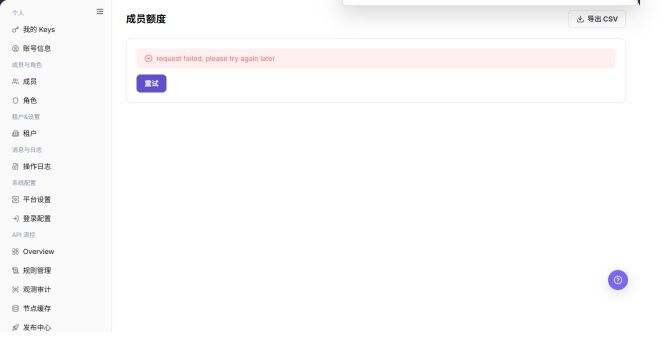

# 成员额度

## 功能概述

| 项目 | 内容 |
| --- | --- |
| 适用角色 | 模型调用方 |
| 导航路径 | 设置 > 成员与角色 > 成员额度 |
| 页面路由 | `/user/user-space/member-quotas` |
| 管理对象 | 成员 Personal Key 用量、授权额度和额度详情 |

#### 新手理解

成员额度页像团队额度分配表，用来查看每个成员可用额度、已用额度和限制策略，帮助判断调用失败是否与个人额度有关。

#### 术语速查

| 术语 | 英文 | 说明 |
| --- | --- | --- |
| 成员额度 | Term | 分配给成员的可用额度。；调用失败时核对。 |
| 已用额度 | Term | 成员已经消耗的额度。；接近上限时调整。 |
| 额度上限 | Term | 成员可消耗的最大额度。；变更前确认影响范围。 |
| 额度申请 | Term | 成员请求增加额度的流程。；不足时引导申请。 |

## 前提条件

1. 当前账号具备成员额度查看权限。
2. 调整额度前已确认成员身份、调整数量和原因。
3. 设置限额前已确认重置周期、触限策略和模型白名单范围。

## 页面说明

| 区域 | 说明 |
| --- | --- |
| 顶部按钮 | 导出 CSV、额度申请 |
| 筛选项 | 按姓名 / 邮箱 / 成员 ID 搜索、全部状态、Usage 排序 |
| 表格列 | 成员、授权额度、已用 / 限额、剩余、模型、状态、操作 |
| 行内按钮 | 调整额度、限额、查看详情 |
| 详情页 | 成员额度、Personal Key 权限、加入的项目、审计日志 |
| 高风险操作 | 调整额度、保存成员限额、导出 CSV |

截图保留左侧导航和完整功能区，顶部菜单已隐藏；请重点查看成员额度页面的字段、按钮和操作位置。

## 主要操作

### 查看成员额度

1. 进入 `设置 > 成员与角色 > 成员额度`。
2. 按成员、项目、资源类型或额度状态筛选。
3. 核对分配额度、已用额度、可用额度和更新时间。
4. 无结果时重置筛选并确认租户或项目上下文；额度数据外发前必须脱敏。

截图保留左侧导航和完整功能区，顶部菜单已隐藏；请重点查看成员额度页面的字段、按钮和操作位置。

**结果校验：** 列表、详情和状态字段能够显示目标对象，且信息相互一致。

**注意事项：** 只使用当前页面实际展示的字段和入口，不根据其他角色页面推断能力。

**常见问题：** 如果入口不可见、按钮置灰或结果未更新，先检查当前账号权限、筛选条件、对象状态和页面刷新时间。

### 查看成员额度详情

1. 点击目标成员的 **"查看"** 或详情入口。
2. 对比总额度、已使用、剩余和限制项，识别接近上限或超限状态。
3. 指标不一致时检查统计周期、项目和数据刷新时间。
4. 只读核验不调整额度；需要调整时按审批流程执行并核对操作日志。

截图保留左侧导航和完整功能区，顶部菜单已隐藏；请重点查看成员额度页面的字段、按钮和操作位置。

**结果校验：** 列表、详情和状态字段能够显示目标对象，且信息相互一致。

**注意事项：** 只使用当前页面实际展示的字段和入口，不根据其他角色页面推断能力。

**常见问题：** 如果入口不可见、按钮置灰或结果未更新，先检查当前账号权限、筛选条件、对象状态和页面刷新时间。

### 调整成员额度

1. 进入 `设置 > 成员与角色 > 成员额度`。
2. 使用搜索框定位成员。
3. 查看授权额度、已用 / 限额、剩余、模型和状态。

下图展示成员额度列表，成员标识已隐藏。

4. 单击 **"查看详情"** 进入成员额度详情。
5. 查看总额度、已用额度、剩余额度、Personal Key 权限、加入项目和审计日志。

下图展示成员额度详情。

6. 单击 **"调整额度"** 打开调整额度弹窗。
7. 选择增加或扣减，填写数量和原因。
8. 确认影响后再单击 **"确认"**。

下图展示调整额度弹窗。

9. 单击 **"限额"** 打开设置成员限额弹窗。
10. 设置重置周期、是否启用限额和模型白名单。
11. 确认后再保存。

下图展示成员限额弹窗。

**结果校验：** 按页面成功提示，并回到列表或详情核对对象状态、更新时间和影响范围。

**注意事项：** 提交前再次核对目标对象和影响范围；涉及权限、状态、数据或外部配置时，先确认审批和回退方式。

**常见问题：** 如果入口不可见、按钮置灰或结果未更新，先检查当前账号权限、筛选条件、对象状态和页面刷新时间。

### 设置成员额度限额

1. 进入 `设置 > 成员与角色 > 成员额度`。
2. 定位目标成员额度，点击 **"限额"**。
3. 按页面显示的必填字段完成查看或填写，并核对目标对象、影响范围和当前状态。
4. 对会改变数据、权限、状态或外部配置的操作，确认影响范围和回退方式后再点击最终确认按钮。
5. 操作完成后返回列表或详情页，核对状态、更新时间或结果提示。

截图保留左侧导航和完整功能区，顶部菜单已隐藏；请重点查看成员额度页面的字段、按钮和操作位置。

**结果校验：** 按页面成功提示，并回到列表或详情核对对象状态、更新时间和影响范围。

**注意事项：** 提交前再次核对目标对象和影响范围；涉及权限、状态、数据或外部配置时，先确认审批和回退方式。

**常见问题：** 如果入口不可见、按钮置灰或结果未更新，先检查当前账号权限、筛选条件、对象状态和页面刷新时间。

## 参数速查表

| 字段名称 | 是否必填 | 字段类型 | 示例 | 说明 |
| --- | --- | --- | --- | --- |
| 成员 | 否 | 文本 | 示例成员 A | 用于定位额度对象。 |
| 总额度 | 否 | 额度 | 10,000 Credits | 成员可用额度上限。 |
| 已用额度 | 否 | 额度 | 3,000 Credits | 成员已消耗额度。 |
| 剩余额度 | 否 | 额度 | 7,000 Credits | 成员剩余可用额度。 |
| 状态 | 否 | 枚举 | 正常 | 判断额度是否可继续使用。 |

## 踩坑提示

- 成员额度充足但调用失败时，还要检查 Key、项目预算和模型权限。
- 不要把租户额度和成员额度混用，二者可能分别限制调用。
- 调整成员额度前，先确认申请原因和业务归属。

## 结果校验

| 检查项 | 成功表现 | 异常时处理 |
| --- | --- | --- |
| 额度已更新 | 调整后成员授权额度或剩余额度发生变化 | 核对成员身份、额度类型和审批状态 |
| 审计可查 | 成员详情的审计日志记录额度调整 | 到操作日志按成员和时间筛选 |
| 限额正确 | 设置限额后，成员列表中已用 / 限额显示符合预期 | 重新打开成员额度详情核对配置 |

## 常见问题

#### 成员额度充足但调用仍失败

**问题现象：**

成员剩余额度正常，但调用被拒绝。

**可能原因：**

- Key 自身限额已触达。
- 项目预算已触达。
- 模型白名单未包含目标模型。

**处理方式：**

1. 检查我的 Keys 或项目 Key 限额。
2. 查看项目预算和模型白名单。
3. 在成员限额中确认模型范围。

#### 成员额度列表为什么没有目标成员？

**问题现象：**

成员额度页没有显示某个成员，或成员额度信息为空。

**可能原因：**

成员未加入当前租户，成员账号未启用，或当前账号无权查看该成员的额度信息。

**处理方式：**

先到成员页确认成员状态；再检查成员额度授权；仍为空时由租户管理员补充分配或恢复成员。
#### 为什么成员额度调整按钮不可用？

**问题现象：**

成员额度可见，但调整授权额度、设置限额或查看调整入口不可点击。

**可能原因：**

当前账号没有额度管理员权限，成员状态不可调整，或该额度类型需要审批后才能修改。

**处理方式：**

确认成员状态和额度管理权限；需要审批的额度先提交申请，审批通过后再回到成员额度页核对。

#### 如何安全导出或截图成员额度页面？

**问题现象：**

需要把页面信息用于排障、审计或交付。

**可能原因：**

页面可能包含账号、邮箱、IP、内部路径、租户标识、Key 或金额等敏感信息。

**处理方式：**

只保留必要字段和操作上下文，使用浅灰小颗粒马赛克覆盖敏感文字，不外发完整凭证或内部地址。

#### 成员额度页面出现异常数据怎么办？

**问题现象：**

字段、状态、统计或关联对象与预期不一致。

**可能原因：**

页面范围、时间条件、角色权限或上游配置不一致。

**处理方式：**

记录脱敏后的对象、时间和结果，先核对页面入口及筛选条件，再查看关联页面和操作日志。

## 注意事项

- 调整额度会影响成员调用能力，执行前需确认成员和数量。
- 导出 CSV 可能包含成员用量数据，应按租户数据管理要求处理。

## 后续操作

1. 在额度申请页查看成员申请记录。
2. 在租户设置中调整新成员默认额度规则。
3. 在操作日志中核对额度调整操作。
