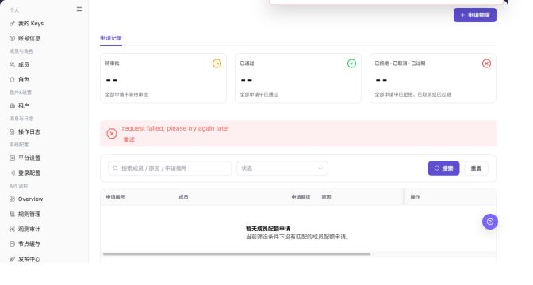

# 额度申请

## 功能概述

| 项目 | 内容 |
| --- | --- |
| 适用角色 | 模型调用方 |
| 导航路径 | 设置 > 成员与角色 > 额度申请 |
| 页面路由 | `/user/user-space/quota-requests` |
| 管理对象 | 额度申请、申请记录、调整记录、状态和申请原因 |

#### 新手理解

额度申请页像成员额度的工单入口，用来提交、查看和跟踪额度增加请求。提交前要写清用途、目标成员和需要的额度。

#### 术语速查

| 术语 | 英文 | 说明 |
| --- | --- | --- |
| 额度申请 | Term | 请求增加成员或项目额度的记录。；提交前说明用途。 |
| 申请状态 | Term | 申请当前处理阶段。；长期未变化时联系审批人。 |
| 申请额度 | Term | 本次请求增加的额度数量。；避免超过业务需要。 |
| 审批意见 | Term | 审批人给出的处理说明。；被驳回时按意见调整。 |

## 前提条件

1. 当前账号具备额度申请页面访问权限。
2. 发起申请前已确认需要追加的 credits 数量和业务原因。
3. 同一成员同一时间通常只保留一条待审批申请。

## 页面说明

| 区域 | 说明 |
| --- | --- |
| 顶部按钮 | `申请额度` |
| 页签 | 申请记录、调整记录 |
| 筛选项 | 状态、搜索成员 / 原因 / 申请编号、事件类型 |
| 申请记录列 | 申请编号、成员、申请额度、原因、提交时间、状态、审批人、操作 |
| 调整记录列 | 时间、成员、事件类型、变更、操作人、备注 |
| 高风险操作 | 提交额度申请 |

截图保留左侧导航和完整功能区，顶部菜单已隐藏；请重点查看额度申请页面的字段、按钮和操作位置。

## 主要操作

### 查看额度申请

1. 进入 `设置 > 成员与角色 > 额度申请`。
2. 按申请人、项目、资源类型、状态或申请时间筛选。
3. 核对申请额度、当前额度、理由、状态和处理时间。
4. 无结果时重置筛选并检查时间范围；申请内容和额度属于内部信息，外发前需脱敏。

截图保留左侧导航和完整功能区，顶部菜单已隐藏；请重点查看额度申请页面的字段、按钮和操作位置。

**结果校验：** 列表、详情和状态字段能够显示目标对象，且信息相互一致。

**注意事项：** 只使用当前页面实际展示的字段和入口，不根据其他角色页面推断能力。

**常见问题：** 如果入口不可见、按钮置灰或结果未更新，先检查当前账号权限、筛选条件、对象状态和页面刷新时间。

### 查看额度申请详情

1. 点击目标申请的 **"详情"**。
2. 查看申请原因、额度变化、附件或备注以及历史处理记录。
3. 核对当前状态是否与列表一致；不一致时刷新后确认是否已被其他处理人操作。
4. 只读核验不提交、撤回、批准或拒绝申请。

截图保留左侧导航和完整功能区，顶部菜单已隐藏；请重点查看额度申请页面的字段、按钮和操作位置。

**结果校验：** 列表、详情和状态字段能够显示目标对象，且信息相互一致。

**注意事项：** 只使用当前页面实际展示的字段和入口，不根据其他角色页面推断能力。

**常见问题：** 如果入口不可见、按钮置灰或结果未更新，先检查当前账号权限、筛选条件、对象状态和页面刷新时间。

### 提交额度申请

1. 进入 `设置 > 成员与角色 > 额度申请`。
2. 在 `申请记录` 页签查看待审批、已通过、已拒绝、已取消、已过期记录。
3. 使用状态和搜索框筛选申请。

下图展示额度申请列表。

4. 单击 **"申请额度"** 打开申请弹窗。
5. 填写申请额度和原因。
6. 确认没有重复待审批申请后再提交。

下图展示申请额度弹窗。

**结果校验：** 按页面成功提示，并回到列表或详情核对对象状态、更新时间和影响范围。

**注意事项：** 提交前再次核对目标对象和影响范围；涉及权限、状态、数据或外部配置时，先确认审批和回退方式。

**常见问题：** 如果入口不可见、按钮置灰或结果未更新，先检查当前账号权限、筛选条件、对象状态和页面刷新时间。

## 参数速查表

| 字段名称 | 是否必填 | 字段类型 | 示例 | 说明 |
| --- | --- | --- | --- | --- |
| 申请人 | 必填 | 成员 | 示例成员 A | 提交额度申请的账号。 |
| 申请额度 | 必填 | 额度 | 1,000 Credits | 本次希望增加的额度。 |
| 用途说明 | 必填 | 文本 | 模型测试 | 说明额度使用场景。 |
| 状态 | 否 | 枚举 | 审批中 | 展示申请处理状态。 |
| 审批意见 | 否 | 文本 | 请补充用途 | 展示审批处理说明。 |

## 踩坑提示

- 无法提交额度申请时，先确认是否已有未完成申请。
- 用途说明过于笼统可能导致审批退回。
- 申请通过不代表调用立即恢复，还要确认额度同步和 Key 状态。

## 结果校验

| 检查项 | 成功表现 | 异常时处理 |
| --- | --- | --- |
| 申请已记录 | 提交申请后，申请记录页签中出现新记录 | 检查申请类型、时间范围和提交结果 |
| 统计一致 | 待审批、已通过、已拒绝等统计值与列表一致 | 清空筛选后重新统计 |
| 调整可追踪 | 额度调整后，调整记录页签可查看变更记录 | 核对成员、额度类型和调整时间 |

## 常见问题

#### 无法提交新的额度申请

**问题现象：**

提交按钮不可用或提示已有待审批申请。

**可能原因：**

- 当前成员已有待审批申请。
- 申请额度或原因未填写。
- 租户关闭或限制额度申请。

**处理方式：**

1. 在申请记录中查看待审批申请。
2. 补充申请额度和原因。
3. 如需加急，联系审批人处理已有申请。

#### 额度申请记录为什么为空？

**问题现象：**

额度申请页没有申请记录、审批记录或调整记录。

**可能原因：**

当前成员尚未提交申请，筛选状态限制了记录，或申请属于其他租户、项目或成员。

**处理方式：**

清空状态和时间筛选；确认申请所属租户、项目和成员；仍为空时从概览页重新发起申请并记录提交结果。
#### 为什么额度申请或审批按钮不可用？

**问题现象：**

额度申请记录可见，但新增申请、撤回、审批或调整按钮不可点击。

**可能原因：**

当前账号没有申请或审批权限，已有待审批申请未结束，或申请状态不允许再次操作。

**处理方式：**

先检查是否存在待审批记录；确认当前账号角色和申请状态；审批类操作由具备权限的审批人处理。

#### 如何安全导出或截图额度申请页面？

**问题现象：**

需要把页面信息用于排障、审计或交付。

**可能原因：**

页面可能包含账号、邮箱、IP、内部路径、租户标识、Key 或金额等敏感信息。

**处理方式：**

只保留必要字段和操作上下文，使用浅灰小颗粒马赛克覆盖敏感文字，不外发完整凭证或内部地址。

#### 额度申请页面出现异常数据怎么办？

**问题现象：**

字段、状态、统计或关联对象与预期不一致。

**可能原因：**

页面范围、时间条件、角色权限或上游配置不一致。

**处理方式：**

记录脱敏后的对象、时间和结果，先核对页面入口及筛选条件，再查看关联页面和操作日志。

## 注意事项

- 申请原因不要包含客户敏感数据、Key、token 或密码。
- 不要重复提交相同用途的额度申请。

## 后续操作

1. 审批完成后回到概览或成员额度页核对额度。
2. 在操作日志中查看申请相关操作。
