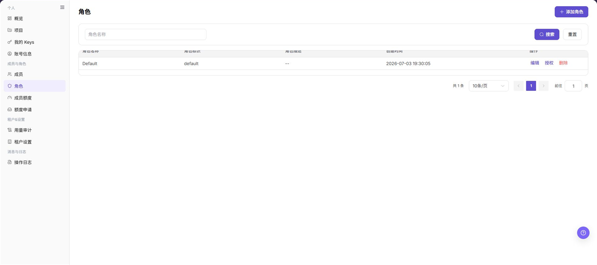
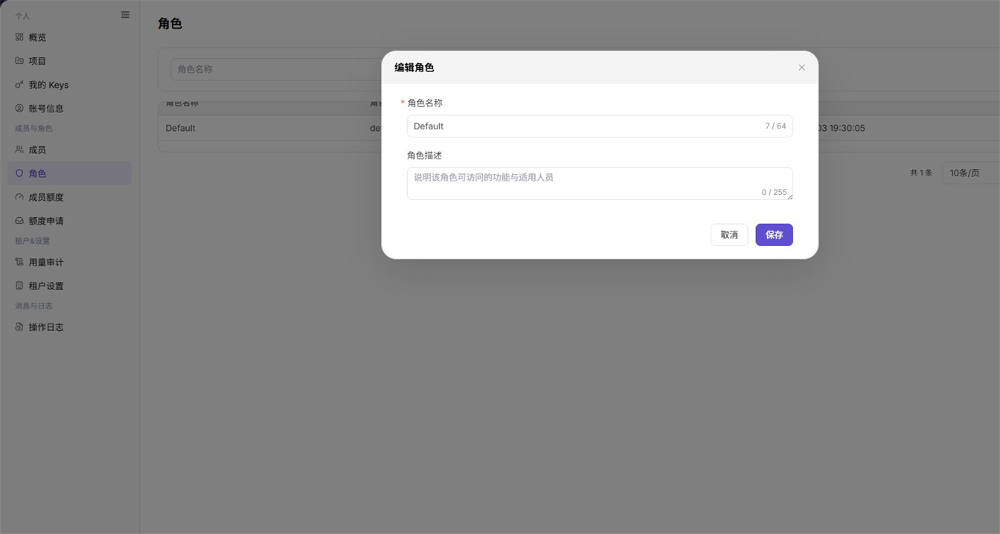

# 角色

## 功能概述

| 项目 | 内容 |
| --- | --- |
| 适用角色 | 模型调用方 |
| 导航路径 | 设置 > 成员与角色 > 角色 |
| 页面路由 | `/user/user-space/roles` |
| 管理对象 | 角色名称、角色标识、角色描述和权限范围 |

#### 新手理解

角色是可重复使用的权限组合。先在角色中选择页面和操作权限，再把角色分配给成员，成员即可按统一规则访问功能。

#### 术语速查

| 术语 | 英文 | 说明 |
| --- | --- | --- |
| 角色 | Role | 一组页面和操作权限的集合。 |
| 角色标识 | Role code | 角色在列表中的识别字段，当前新增和编辑表单不提供此字段。 |
| 初始授权 | Initial permissions | 创建角色时选择的首批页面、操作或数据权限。 |
| 授权范围 | Permission scope | 角色可以访问的页面以及可以执行的操作范围。 |

## 前提条件

1. 当前账号具备角色的查看或管理权限；是否能看到新增、编辑、授权和删除入口以当前权限为准。
2. 创建角色前已明确角色名称、可选描述以及至少一项初始权限。
3. 修改或授权角色前已确认该角色的成员范围、目标服务和权限影响。

## 页面说明

角色页提供角色列表和对象级操作入口。列表显示角色名称、角色标识、角色描述、创建时间和操作；页面顶部提供角色名称筛选、**"搜索"**、**"重置"** 和 **"添加角色"**。

创建角色时，表单包含角色名称、角色描述和初始授权区域。初始授权区域按服务展示权限，可切换 **"快捷"** 或 **"磁贴"** 视图；授权角色时还可以按菜单查看页面访问、可执行操作和数据查看权限。

上图仅隐藏顶部菜单，保留左侧导航和完整功能区；请重点查看列表字段、角色名称筛选框以及每行的编辑、授权和删除入口。

## 主要操作

<!-- main-operation-title-exceptions: 编辑,删除 -->

### 查看角色

1. 进入 `设置 > 成员与角色 > 角色`。
2. 如需缩小范围，在 `角色名称` 输入框填写名称并点击 **"搜索"**；点击 **"重置"** 可恢复列表。
3. 在表格中查看角色名称、角色标识、角色描述和创建时间，并确认操作列是否显示 **"编辑"**、**"授权"** 和 **"删除"**。
4. 当前页面提供列表级信息和操作入口，没有单独的角色详情入口；需要查看权限明细时进入 **"授权"** 页面。

截图保留列表和操作列，顶部菜单已隐藏；表格中的 `Default` 仅作为页面中的中性示例记录。

**结果校验：** 列表显示目标角色，角色名称、角色标识、描述和创建时间均可读取，筛选结果与输入条件一致。

**注意事项：** 不要把分页、筛选或排序当作角色对象操作；页面未显示的详情字段不能根据其他页面推断。

**常见问题：** 如果列表为空，先点击 **"重置"** 并等待数据加载；仍无结果时核对租户范围和角色查看权限。

### 创建角色

1. 进入 `设置 > 成员与角色 > 角色`，点击 **"添加角色"**。
2. 在 **"角色名称"** 中填写角色名称；角色名称为必填项，长度上限以输入框计数为准。
3. 在 **"角色描述"** 中填写用途和适用人员，描述为可选项。
4. 在 **"初始授权"** 区域选择至少一项权限。先选择所属服务，再按页面显示的菜单和权限项选择页面访问、可执行操作或数据查看权限。
5. 点击 **"预览并保存"**，核对角色名称、描述和初始授权范围后，按页面提示完成创建。

上图展示创建角色表单、初始授权区域和服务切换入口；空白权限区表示当前尚未选择权限，不代表可以跳过初始授权。

**结果校验：** 创建成功后返回角色列表，新角色可按名称检索，列表中的角色标识、创建时间和操作入口正常显示。

**注意事项：** 创建角色至少选择一项初始权限；提交前确认服务、页面和操作范围，避免把不必要的高权限授予新角色。

**常见问题：** 如果 **"预览并保存"** 后无法创建，先检查角色名称是否为空、初始授权是否至少选择一项，以及当前账号是否具备角色管理权限。

### 编辑角色

1. 进入 `设置 > 成员与角色 > 角色`，定位目标角色并点击 **"编辑"**。
2. 在编辑表单中核对 **"角色名称"** 和 **"角色描述"**；当前编辑表单不提供角色标识字段。
3. 修改需要调整的名称或描述，确认不会误导成员或暴露敏感信息。
4. 点击 **"保存"**，确认页面提示后返回角色列表。

上图展示编辑角色表单；请重点核对角色名称、描述和 **"保存"** 入口，顶部菜单已隐藏。

**结果校验：** 列表中的角色名称或描述更新，角色标识和创建时间保持可见，重新打开编辑表单可以看到最新内容。

**注意事项：** 编辑名称或描述会影响成员识别和权限运维记录；不要借编辑操作推断可以修改角色标识或授权范围。

**常见问题：** 如果编辑按钮不可见或保存失败，检查目标角色是否为当前租户对象、当前账号是否具备管理权限，以及名称长度和内容限制。

### 授权角色

1. 进入 `设置 > 成员与角色 > 角色`，在目标角色的操作列点击 **"授权"**。
2. 在授权页面先确认标题中的角色名称，再查看已选择权限总数和所属服务计数。
3. 选择 `模型及AI服务`、`On-Prem`、`On-Cloud`、`账务` 或 `设置` 服务，按菜单导航定位目标页面。
4. 在权限区域按需调整页面访问、可执行操作和数据查看权限；使用 **"快捷"** 或 **"磁贴"** 切换展示方式。
5. 点击 **"预览并保存"**，核对权限变化和影响范围后，按页面提示完成授权更新。

上图展示授权工作区、服务计数、菜单导航和权限列；已选数量及各服务数量会随角色配置变化。

**结果校验：** 返回角色列表后，成员使用该角色可以看到预期页面；再次进入 **"授权"** 页面时，已选权限和服务计数与预期一致。

**注意事项：** 授权调整会改变成员可见菜单和可执行操作；清除页面访问权限前，先确认不会切断必要的管理入口。

**常见问题：** 如果授权页的某个服务显示 `0`，先确认该服务在当前租户是否提供可分配权限，再检查菜单导航和当前角色的授权范围。

### 删除角色

1. 进入 `设置 > 成员与角色 > 角色`，定位目标角色并点击 **"删除"**。
2. 在确认提示中核对角色名称和影响范围，先确认该角色不再承担成员访问控制职责。
3. 如页面提示存在成员关联或其他依赖，先处理依赖，再返回角色列表重新发起删除。
4. 确认无误后在确认提示中点击最终删除按钮，并等待页面返回结果。

上图展示删除角色的实际入口。删除前必须以页面确认提示为准，本次截图不代替确认提示，也不展示删除后的虚构结果。

**结果校验：** 删除成功后，角色不再出现在列表中，按原角色名称搜索也没有结果；关联成员的有效角色应已按预期调整。

**注意事项：** 删除是不可逆的对象级操作；不要删除仍被成员使用或仍承担管理职责的角色。

**常见问题：** 如果删除后角色仍在列表中，刷新页面并检查是否存在成员关联、系统保护或权限不足提示。

## 参数速查表

| 字段名称 | 是否必填 | 字段类型 | 示例 | 说明 |
| --- | --- | --- | --- | --- |
| 角色名称 | 必填 | 文本，最多 64 个字符 | `资源审核员` | 用于识别角色，创建和编辑表单均可填写。 |
| 角色描述 | 否 | 文本，最多 255 个字符 | `负责资源访问审核` | 说明角色用途和适用人员。 |
| 角色标识 | 系统字段 | 文本 | `example-role-code` | 在列表中展示；当前新增和编辑表单不提供该字段。 |
| 初始授权 | 创建时必填 | 权限集合 | `角色：页面访问` | 创建角色至少选择一项权限。 |
| 所属服务 | 否 | 单选 | `设置` | 在授权工作区中切换权限所属服务。 |
| 权限展示方式 | 否 | 单选 | `快捷` | 在快捷视图和磁贴视图之间切换。 |
| 角色名称筛选 | 否 | 文本 | `审核` | 按角色名称缩小列表范围。 |

## 踩坑提示

- 创建角色时不选择初始权限，角色即使创建成功也无法形成可用的权限范围。
- 角色标识只在列表中可见，新增和编辑表单没有该字段，不要在不存在的输入框中填写。
- 授权页的服务计数和已选数量会随角色变化，计数为 `0` 时先确认当前服务是否存在可分配权限。
- 页面筛选只影响角色列表，不会替代授权工作区中的权限选择。
- 角色名称和描述不要写入账号、密码、密钥、内部地址或客户敏感信息。

## 结果校验

| 检查项 | 成功表现 | 异常时处理 |
| --- | --- | --- |
| 列表检索 | 输入角色名称后只显示匹配记录 | 点击 **"重置"** 清除条件，再确认角色名称是否完整。 |
| 创建结果 | 新角色出现在列表中，角色标识和创建时间可见 | 检查初始授权数量、名称唯一性提示和角色管理权限。 |
| 编辑结果 | 角色名称或描述显示最新内容 | 重新打开编辑表单，检查输入长度限制和对象所属租户。 |
| 授权结果 | 授权页的已选数量和服务计数与预期一致 | 按服务检查菜单导航、页面访问、可执行操作和数据查看列。 |
| 删除结果 | 角色从列表消失，原筛选条件下无匹配记录 | 查看页面提示，确认成员关联、保护规则和删除权限。 |

## 常见问题

#### 为什么列表中没有目标角色？

**问题现象：**

角色页没有显示预期角色。

**可能原因：**

- 角色名称筛选条件仍然生效。
- 当前账号查看的是其他租户或没有角色查看权限。

**处理方式：**

1. 点击 **"重置"** 清除筛选。
2. 核对当前租户范围和角色查看权限。
3. 重新加载角色列表。

#### 创建角色时为什么不能继续？

**问题现象：**

创建表单无法完成预览或保存。

**可能原因：**

- 角色名称为空或超出长度限制。
- 初始授权没有选择任何权限。

**处理方式：**

填写合法的角色名称，并在初始授权区域选择至少一项页面、操作或数据权限，再点击 **"预览并保存"**。

#### 为什么授权页显示的权限数量为 0？

**问题现象：**

某个服务或权限列显示 `0`，看不到可选择项。

**可能原因：**

当前服务没有可分配权限，或当前角色没有该服务范围的授权管理权限。

**处理方式：**

切换其他服务确认页面是否正常；如果目标服务仍为 `0`，由租户管理员核对该服务的权限配置。

#### 编辑角色时为什么看不到角色标识？

**问题现象：**

编辑表单只有角色名称和角色描述。

**可能原因：**

角色标识是列表识别字段，当前编辑表单没有提供修改入口。

**处理方式：**

在列表中核对角色标识；需要调整角色识别方式时，按租户的角色治理流程新建角色并重新授权，不要把其他字段当作角色标识。

#### 删除角色后成员权限会怎样？

**问题现象：**

删除角色前需要确认成员是否仍依赖该角色。

**可能原因：**

角色可能仍绑定成员，删除后成员的可见页面和可执行操作会发生变化。

**处理方式：**

先在成员页确认角色分配，再根据页面提示处理成员关联；完成调整后重新核对成员的有效权限。

## 注意事项

- 角色权限直接影响成员的页面可见性和操作范围，授权前按最小权限原则配置。
- 修改或删除角色前，先确认成员关联、服务范围和回退方式。
- 角色名称和描述仅用于管理识别，不应包含账号、密码、密钥、内部地址或客户敏感信息。

## 后续操作

1. 在成员页将已确认的角色分配给目标成员，并检查成员的有效权限。
2. 使用成员额度限制资源使用范围，必要时通过操作日志核对角色变更记录。
